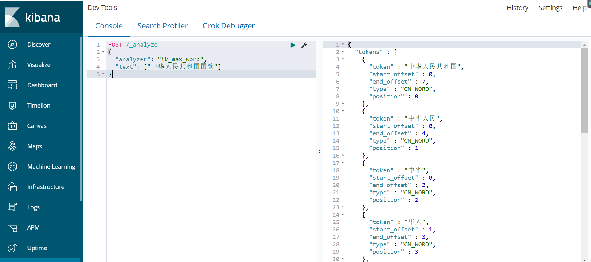
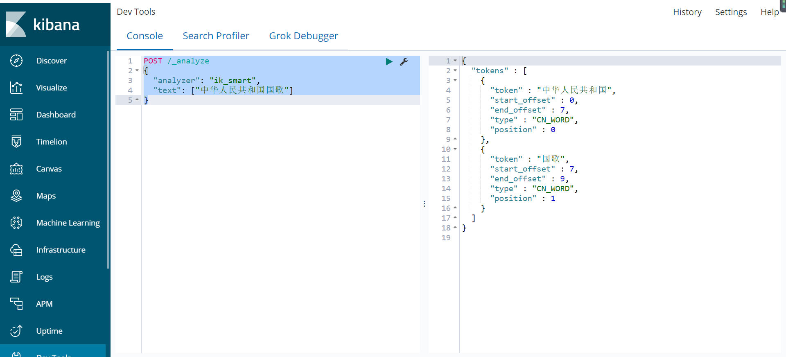

### IK简介

> ElasticSearch（以下简称ES）默认的分词器是标准分词器Standard，如果直接使用在处理中文内容的搜索时，中文词语被分成了一个一个的汉字，因此引入中文分词器IK就能解决这个问题，同时用户可以配置自己的扩展字典、远程扩展字典等。
>


### IK安装

github 下载与es相同版本的zip安装包[https://github.com/medcl/elasticsearch-analysis-ik/releases](https://github.com/medcl/elasticsearch-analysis-ik/releases)

```shell
cd /opt/elk/es/plugins
# 创建目录 analysis-ik
mkdir analysis-ik
cd analysis-ik
# 解压到/opt/elk/es/plugins 目录
unzip elasticsearch-analysis-ik-6.7.1.zip
```


**scp到其他服务器**

```shell
scp -r /opt/elk/es/plugins/analysis-ik root@192.168.111.129:/opt/elk/es/plugins
scp -r /opt/elk/es/plugins/analysis-ik root@192.168.111.130:/opt/elk/es/plugins
```


**重启es集群**

```shell
su es
cd /opt/elk/es/bin
./elasticsearch -d
```


### 验证IK分词

ik插件提供了两种分词模式：**ik_max_word**和**ik_smart**：

**ik_max_word**：会将文本做最细粒度的拆分，比如会将“中华人民共和国国歌”拆分为“中华人民共和国，中华人民，中华，华人，人民共和国，人民，人民，共和国，共和，和，国国，国歌”，会穷尽各种可能的组合;

**ik_smart**：会做最粗粒度的拆分，比如会将“中华人民共和国国歌”拆分为“中华人民共和国，国歌”。 


使用**kibana**测试**ik_max_word**




使用**kibana**测试**ik_smart**




### 自定义IK分词

**关闭es**

```shell
$ jps
3444 Jps
3242 Elasticsearch
$ kill 3242
```

**创建自定义IK分词目录**

```shell
cd /opt/elk/es/plugins/analysis-ik
```

**创建自定义IK分词文件**

```shell
vim ywf.dic
```

**填写自定义分词**

```
王者荣耀
```

**修改IK配置**

**vim /opt/elk/es/plugins/analysis-ik/config/IKAnalyzer.cfg.xml** 

```xml
<?xml version="1.0" encoding="UTF-8"?>
<!DOCTYPE properties SYSTEM "http://java.sun.com/dtd/properties.dtd">
<properties>
        <comment>IK Analyzer 扩展配置</comment>
        <!--用户可以在这里配置自己的扩展字典 -->
        <entry key="ext_dict">ywf.dic</entry>
         <!--用户可以在这里配置自己的扩展停止词字典-->
        <entry key="ext_stopwords"></entry>
        <!--用户可以在这里配置远程扩展字典 -->
        <!-- <entry key="remote_ext_dict">words_location</entry> -->
        <!--用户可以在这里配置远程扩展停止词字典-->
        <!-- <entry key="remote_ext_stopwords">words_location</entry> -->
</properties>
```

**拷贝到其他服务器**

```shell
scp -r /opt/elk/es/plugins/analysis-ik root@192.168.111.129:/opt/elk/es/plugins
scp -r /opt/elk/es/plugins/analysis-ik root@192.168.111.129:/opt/elk/es/plugins
```


### 测试自定义IK分词

**创建索引和设置mappings**

```bash
PUT /game_index
{
  "mappings": {
    "game_type": {
      "properties": {
        "text": {
          "type": "text",
          "analyzer": "ik_max_word"
        }
      }
    }
  }
}
```


**测试IK分词全文检索功能**

```bash
GET /game_index/_analyze
{
  "text": " 王者荣耀好不好玩",
  "analyzer": "ik_max_word"
}
```


**返回值**

```bash
{
  "tokens" : [
    {
      "token" : "王者荣耀",
      "start_offset" : 1,
      "end_offset" : 5,
      "type" : "CN_WORD",
      "position" : 0
    },
    {
      "token" : "王者",
      "start_offset" : 1,
      "end_offset" : 3,
      "type" : "CN_WORD",
      "position" : 1
    },
    {
      "token" : "荣耀",
      "start_offset" : 3,
      "end_offset" : 5,
      "type" : "CN_WORD",
      "position" : 2
    },
    {
      "token" : "好不好",
      "start_offset" : 5,
      "end_offset" : 8,
      "type" : "CN_WORD",
      "position" : 3
    },
    {
      "token" : "好不",
      "start_offset" : 5,
      "end_offset" : 7,
      "type" : "CN_WORD",
      "position" : 4
    },
    {
      "token" : "不好玩",
      "start_offset" : 6,
      "end_offset" : 9,
      "type" : "CN_WORD",
      "position" : 5
    },
    {
      "token" : "不好",
      "start_offset" : 6,
      "end_offset" : 8,
      "type" : "CN_WORD",
      "position" : 6
    },
    {
      "token" : "好玩",
      "start_offset" : 7,
      "end_offset" : 9,
      "type" : "CN_WORD",
      "position" : 7
    }
  ]
}
```

