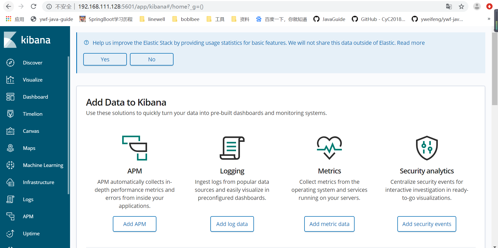
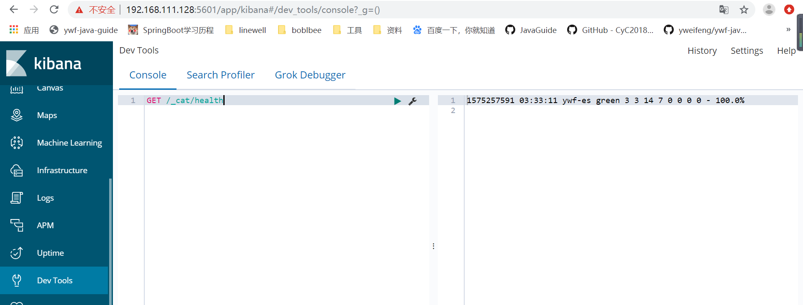

## 下载

从官网[https://www.elastic.co/cn/downloads/kibana](https://www.elastic.co/cn/downloads/kibana)下载与elasticsearch版本一致的kibana。

历史版本可以点击[past releases](https://www.elastic.co/downloads/past-releases#kibana).进行选择。

## 安装

```shell
# 解压缩
tar -zxvf kibana-6.7.1-linux-x86_64.tar.gz
# 重命名
mv kibana-6.7.1-linux-x86_64 kibana
```

## 修改配置文件

**vim config/kibana.yml**

```properties
server.port: 5601

server.host: "192.168.111.128"
 
# 一定要加http
elasticsearch.hosts: ["http://192.168.111.128:9200","http://192.168.111.129:9200","http://192.168.111.130:9200"]
# kibana.index：原来默认是".kibana"，但是新版本的kibana启动之后发现无法访问，访问之后抛出一个异常：kibana server is not ready yet，那么回来把配置更改成".newkibana"，然后重启kibana，再次访问，即可成功。
kibana.index: ".newkibana"
```

## 启动kibana

```shell
cd bin
nohup ./kibana &
```

## 浏览器访问



点击**Dev Tool** 可以进行es语句操作

## 查询集群状态

