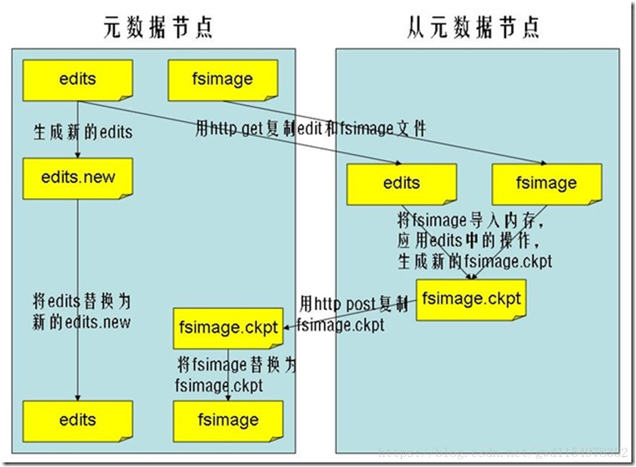
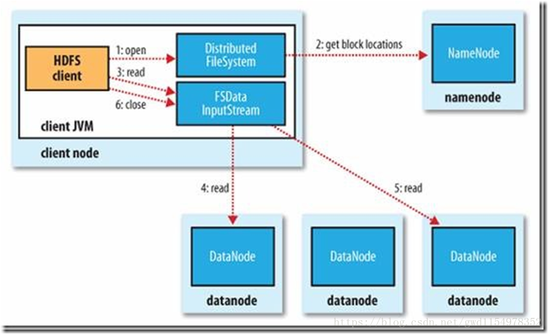
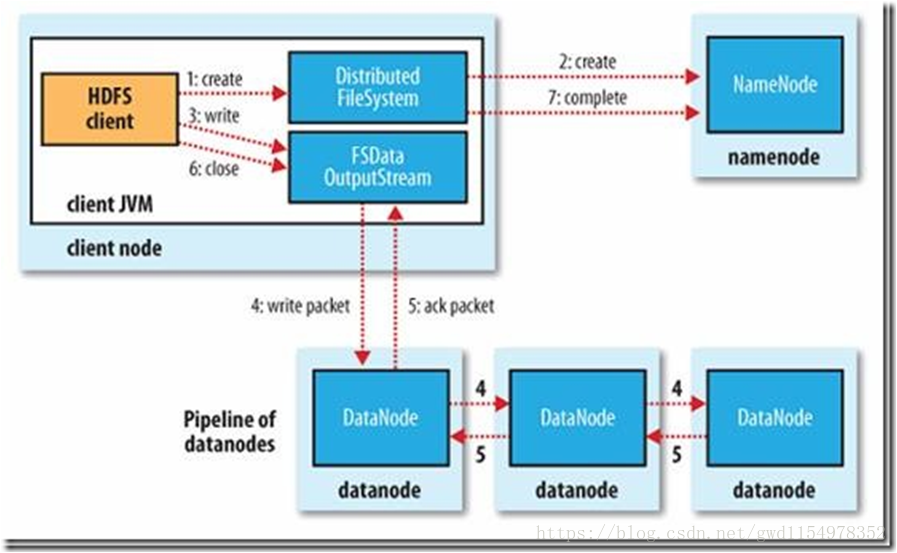

## 一.hadoop是什么

Hadoop被公认是一套行业大数据标准开源软件，在分布式环境下提供了海量数据的处理能力。几乎所有主流厂商都围绕Hadoop开发工具、开源软件、商业化工具和技术服务。今年大型IT公司，如EMC、Microsoft、Intel、Teradata、Cisco都明显增加了Hadoop方面的投入。

 

## 二 .hadoop能干什么

hadoop擅长日志分析，facebook就用Hive来进行日志分析，2009年时facebook就有非编程人员的30%的人使用HiveQL进行数据分析；淘宝搜索中的自定义筛选也使用的Hive；利用Pig还可以做高级的数据处理，包括Twitter、LinkedIn 上用于发现您可能认识的人，可以实现类似Amazon.com的协同过滤的推荐效果。淘宝的商品推荐也是！在Yahoo！的40%的Hadoop作业是用pig运行的，包括垃圾邮件的识别和过滤，还有用户特征建模。（2012年8月25新更新，天猫的推荐系统是hive，少量尝试mahout！）

 

## 三.hadoop的核心

- **HDFS**: Hadoop Distributed File System  分布式文件系统
- **YARN**: Yet Another Resource Negotiator   资源管理调度系统

- **Mapreduce**：分布式运算框架

 

## 四.HDFS的架构

主从结构

    •主节点， namenode
    
    •从节点，有很多个: datanode

namenode负责：

    •接收用户操作请求
    
    •维护文件系统的目录结构
    
    •管理文件与block之间关系，block与datanode之间关系

datanode负责：

    •存储文件
    
    •文件被分成block存储在磁盘上
    
    •为保证数据安全，文件会有多个副本

 

Secondary NameNode负责：

    合并fsimage和edits文件来更新NameNode的metedata

 

## 五.Hadoop的特点

**扩容能力（Scalable）**：能可靠地（reliably）存储和处理千兆字节（PB）数据。

**成本低（Economical）**：可以通过普通机器组成的服务器群来分发以及处理数据。这些服务器群总计可达数千个节点。

**高效率（Efficient）**：通过分发数据，hadoop可以在数据所在的节点上并行地（parallel）处理它们，这使得处理非常的快速。

**可靠性（Reliable）**：hadoop能自动地维护数据的多份副本，并且在任务失败后能自动地重新部署（redeploy）计算任务。

 

## 六.NameNode

### 1.简介

namenode是整个文件系统的管理节点。他维护着整个文件系统的文件目录树，文件/目录的元信息和每个文件对应的数据块列表。接收用户的操作请求。

文件包括：

**fsimage** : 元数据镜像文件。存储某一时段NameNode内存元数据信息。

**edits **: 操作日志文件。

**fstime** : 保存最近一次checkpoint的时间。

 

### 2.NameNode的工作特点

NameNode始终在内存中保存metedata，用于处理“读请求”，到有“写请求”到来时，NameNode首先会写editlog到磁盘，即向edits文件中写日志，成功返回后，才会修改内存，并且向客户端返回。

Hadoop会维护一个人fsimage文件，也就是NameNode中metedata的镜像，但是fsimage不会随时与NameNode内存中的metedata保持一致，而是每隔一段时间通过合并edits文件来更新内容。Secondary NameNode就是用来合并fsimage和edits文件来更新NameNode的metedata的。

 

### 3.什么时候checkpoint

fs.checkpoint.period 指定两次checkpoint的最大时间间隔，默认3600秒。 
fs.checkpoint.size    规定edits文件的最大值，一旦超过这个值则强制checkpoint，不管是否到达最大时间间隔。默认大小是64M。

 

 

## 七.SecondaryNameNode

### 1.简介

HA的一个解决方案。但不支持热备。配置即可。
执行过程：从NameNode上下载元数据信息（fsimage,edits），然后把二者合并，生成新的fsimage，在本地保存，并将其推送到NameNode，替换旧的fsimage.
默认在安装在NameNode节点上，但这样...不安全！

### 2.工作流程

1. NamdeNode生成一个新的文件:edit.new。
2. 每隔一段时间(默认1小时)，SNN将NN上最新的FSImage和积累的edits通过http协议下载到本地，并加载到内存。
3.  SNN将fsimage和editlog进行merge（合并）,生成一个新的镜像文件(fsimage.ckpt) 这个过程称为checkpoint。
4.  然后SNN将新生成的fsimage.ckpt通过http协议发送到namenode。
5. NameNode将edits.new重命名为edits,将fsimage.ckpt重命名为fsimage

 

## 八.DataNode

提供真实文件数据的存储服务。
**文件块（block）**：最基本的存储单位。对于文件内容而言，一个文件的长度大小是size，那么从文件的０偏移开始，按照固定的大小，顺序对文件进行划分并编号，划分好的每一个块称一个Block。HDFS默认Block大小是128MB，以一个256MB文件，共有256/128=2个Block.
dfs.block.size
不同于普通文件系统的是，HDFS中，如果一个文件小于一个数据块的大小，并不占用整个数据块存储空间;
Replication:多复本。默认是三个。

 

## 九.HDFS

### （1）读过程

 

1. Client向NameNode发起RPC请求，来确定请求文件block所在的位置；

2. NameNode会视情况返回文件的部分或者全部block列表，对于每个block，NameNode 都会返回含有该 block 副本的 DataNode 地址； 这些返回的 DN 地址，会按照集群拓扑结构得出 DataNode 与客户端的距离，然后进行排序，排序两个规则：网络拓扑结构中距离 Client 近的排靠前；心跳机制中超时汇报的 DN 状态为 STALE，这样的排靠后；
3. Client 选取排序靠前的 DataNode 来读取 block，如果客户端本身就是DataNode,那么将从本地直接获取数据(短路读取特性)；
4. 底层上本质是建立 Socket Stream（FSDataInputStream），重复的调用父类 DataInputStream 的 read 方法，直到这个块上的数据读取完毕；
5. 当读完列表的 block 后，若文件读取还没有结束，客户端会继续向NameNode 获取下一批的 block 列表；
6. 读取完一个 block 都会进行 checksum 验证，如果读取 DataNode 时出现错误，客户端会通知 NameNode，然后再从下一个拥有该 block 副本的DataNode 继续读。
7. read 方法是并行的读取 block 信息，不是一块一块的读取；NameNode 只是返回Client请求包含块的DataNode地址，并不是返回请求块的数据；
8. 最终读取来所有的 block 会合并成一个完整的最终文件。

### （2）写过程

1. Client 发起文件上传请求, 通过 RPC 与 NameNode 建立通讯, NameNode 检查目标文件是否已存在, 父目录是否存在, 返回是否可以上传 。
2. Client 请求第一个 block 该传输到哪些 DataNode 服务器上。
3. NameNode 根据配置文件中指定的备份数量及机架感知原理进行文件分配, 返回可用的 DataNode 的地址如: A, B, C。
4. Client 请求 3 台 DataNode 中的一台 A 上传数据（本质上是一个 RPC 调用，建立 pipeline ）, A 收到请求会继续调用 B, 然后 B 调用 C, 将整个 pipeline 建立完成, 后逐级返回 client。
5. Client 开始往 A 上传第一个 block（先从磁盘读取数据放到一个本地内存缓存）, 以 packet 为单位（默认64K）, A 收到一个 packet 就会传给 B, B 传给 C. A 每传一个 packet 会放入一个应答队列等待应答。
6. 数据被分割成一个个 packet 数据包在 pipeline 上依次传输, 在 pipeline 反方向上, 逐个发送 ack（命令正确应答）, 最终由 pipeline 中第一个 DataNode 节点 A 将 pipelineack 发送给 Client。
7. 当一个 block 传输完成之后, Client 再次请求 NameNode 上传第二个 block 到服务。

