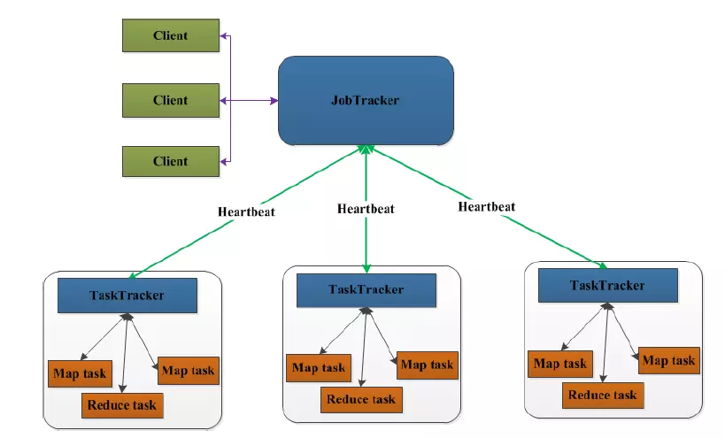
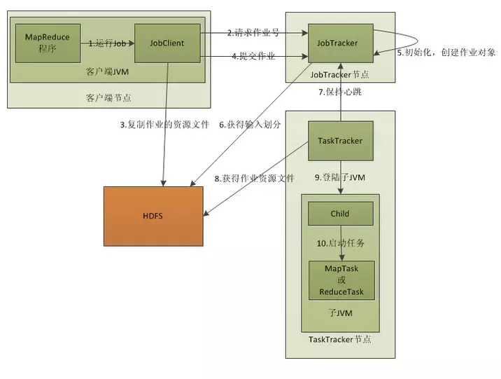
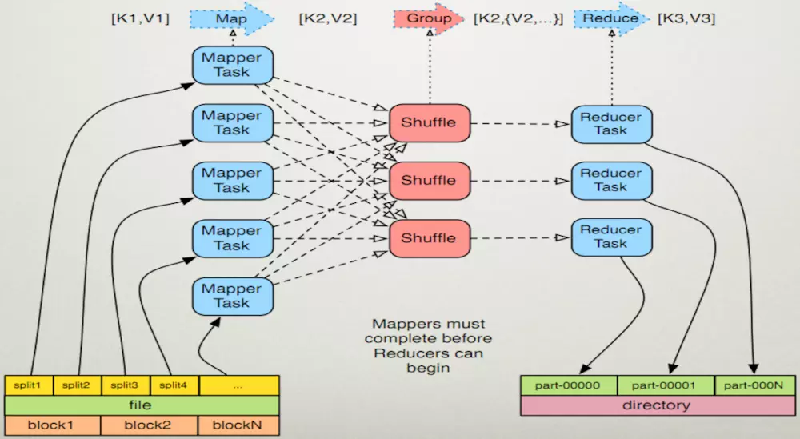
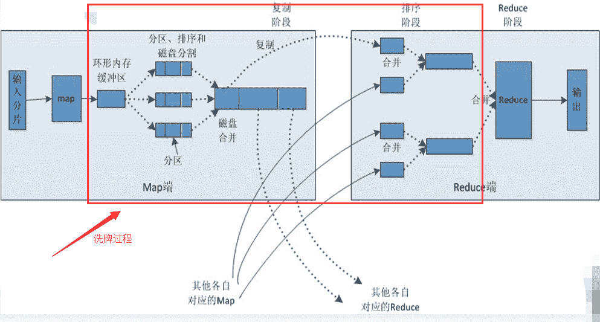

<!-- TOC -->

- [mapreduce使用](#mapreduce使用)
    - [MapReduce原理](#mapreduce原理)
        - [MapReduce架构](#mapreduce架构)
        - [MapReduce执行过程](#mapreduce执行过程)
        - [MapReduce的map与reduce过程](#mapreduce的map与reduce过程)
            - [`MapReduce`流程总览](#mapreduce流程总览)
            - [`MapReduce`详细流程](#mapreduce详细流程)
            - [`Map`端分析：](#map端分析)
            - [`Shuffle`过程分析：](#shuffle过程分析)
                - [`map`端的`shuffle`](#map端的shuffle)
                - [`Reduce`端的`shuffle`](#reduce端的shuffle)
            - [`Reduce`端分析：](#reduce端分析)
    - [MapReduce案例](#mapreduce案例)
        - [准备工作](#准备工作)
            - [上传数据到hdfs](#上传数据到hdfs)
            - [添加输出目录](#添加输出目录)
        - [java代码](#java代码)
            - [pom.xml](#pomxml)
            - [WordCountMapper.java](#wordcountmapperjava)
            - [WordCountReducer.java](#wordcountreducerjava)
            - [WordCountJob.java](#wordcountjobjava)
        - [运行jar包](#运行jar包)
        - [查看结果](#查看结果)

<!-- /TOC -->
# mapreduce使用

## MapReduce原理

### MapReduce架构

在MapReduce中，用于执行MapReduce任务的机器有两个角色：**JobTracker**和**TaskTracker**。其中**JobTracker是用于调度工作的**。**TaskTracker是用于执行工作的**。一个Hadoop集群中只有一台JobTracker。MapReduce架构图如下：


客户端向JobTracker提交一个作业，JobTracker把这个作业拆分成很多份，然后分配给TaskTracker去执行，TaskTracker会隔一段时间向JobTracker发送心跳信息（Heartbeat），如果JobTracker在一段时间内没有收到TaskTracker的心跳信息，JobTracker会认为TaskTracker挂掉了，会把TaskTracker的作业任务分配给其他TaskTracker。


### MapReduce执行过程



**执行过程详细步骤：**

1. 客户端启动一个Job。
2. 客户端向JobTracker请求一个作业号（JobID）。
3. 将运行作业所需要的资源文件复制到HDFS上，包括MapReduce程序打包的JAR文件、配置文件和客户端计算所得的输入划分信息。这些文件都存放在JobTracker专门为该作业创建的文件夹中，文件夹名为该作业JobID。JAR文件默认会有10个副本，输入划分信息告诉JobTracker应该为这个作业启动多少个map任务等信息。
4. JobTracker接收到作业后将其放在作业队列中，等待JobTracker对其进行调度。当JobTracker根据自己的调度算法调度该作业时，会根据输入划分信息为每个划分创建一个map任务，并将map任务分配给TaskTracker执行。这里需要注意的是，map任务不是随便分配给某个TaskTracker的，Data-Local（数据本地化）将map任务分配给含有该map处理的数据库的TaskTracker上，同时将程序JAR包复制到该TaskTracker上运行，但是分配reducer任务时不考虑数据本地化。
5. TaskTracker每隔一段时间给JobTracker发送一个Heartbeat告诉JobTracker它仍然在运行，同时心跳还携带很多比如map任务完成的进度等信息。当JobTracker收到作业的最后一个任务完成信息时，便把作业设置成“成功”，JobClient再传达信息给用户。


### MapReduce的map与reduce过程

#### `MapReduce`流程总览

Map端从HDFS读取一个文件（一个文件在HDFS有多个块），将这个文件分片，不同的分片进入不同的Map任务执行操作。再经过Shuffle阶段进入到Reduce阶段，最后根据Reduce任务的个数输入到HDFS中，有一个Reduce任务就有一个part-r-0000x文件，其中Reduce任务的数量是可以通过job.setNumReduceTasks(int num)设置的。

shuffle过程其实是包含在map和reduce中的，并不是独立的一个阶段。




#### `MapReduce`详细流程



#### `Map`端分析：

1. 每个输入分片会让一个map任务来处理，默认情况下，以HDFS的一个块的大小（hadoop 1.x默认64M，hadoop 2.x默认128M）为一个分片，当然我们也可以设置块的大小。
2. map任务的结果会先输出到一个环形内存缓冲区（默认大小为100M，由io.sort.mb属性控制，缓冲区的作用是批量收集map结果，减少磁盘IO的影响），当该缓冲区快要溢出时（默认为缓冲区大小的80%，由io.sort.spill.percent属性控制），会在本地文件系统中创建一个溢出文件，将该缓冲区中的数据写入这个文件。
3. 在写入磁盘之前，线程首先根据reduce任务的数目将数据划分为相同数目的分区，也就是一个reduce任务对应一个分区的数据。这样做是为了避免有些reduce任务分配到大量数据，而有些reduce任务却分到很少数据，甚至没有分到数据的尴尬局面。其实分区就是对数据进行hash的过程。然后对每个分区中的数据进行排序，如果此时设置了Combiner，将排序后的结果进行Combianer操作，这样做的目的是让尽可能少的数据写入到磁盘。
4. 当map任务输出最后一个记录时，可能会有很多的溢出文件，这时需要将这些文件合并。合并的过程中会不断地进行排序和combiner操作，目的有两个：1、尽量减少每次写入磁盘的数据量；2、尽量减少下一复制阶段网络传输的数据量。最后合并成了一个已分区且已排序的文件。为了减少网络传输的数据量，这里可以将数据压缩，只要将mapred.compress.map.out设置为true就可以。数据压缩：Gzip、Lzo、snappy。
5. 将合并的文件写入磁盘，告知reduce端主动来读取数据。

#### `Shuffle`过程分析：

##### `map`端的`shuffle`

```
每个map task都有一个内存缓冲区，存储着map的输出结果，当缓冲区快满的时候需要将缓冲区的数据以一个临时文件的方式存放到磁盘，当整个map task结束后在对磁盘中这个map task产生的所有临时文件做一个合并，生成最终的正式输出文件，然后等待reduce task来拉数据。
在map task执行时，它的输入数据来源于HDFS的block，当然在MapReduce概念中，map task只读取split。split与block对应关系可能是多对一，默认是一对一。在wordcount例子里，假设map的输入数据都是是像“aaa”这样的字符串。
在经过mapper的运行后，我们得知mapper的输出是这样一个key/value对：key是“aaa”，value是数值1。因为当前map端只做加1的操作，在reduce task里采取合并结果集。前面我们知道这个job有3个reduce task。那到底当前的“aaa”究竟该丢给哪个reduce去处理呢？是需要现在做决定的。
MapReduce提供Partitioner接口，作用就是根据key或value及reduce的数量来决定当前的输出数据最终应该交由哪个reduce task处理。默认对key hash后再以reduce task数据取模。默认的取模方式只是为了平均reduce的处理能力，如果用户自己对Partitioner有需求，可以定制并设置到job上。
在例子中，“aaa”经过Partition后返回0，也就是这对值应当交由第一个reduce来处理。接下来，需要将数据写入内存缓冲区中，缓冲区的作用是批量收集map结果，减少磁盘IO的影响。我们的key/value对以及Partition的结果都会被写入缓冲区。当然，写入之前，key与value值都会被序列化成字节数组。
内存缓冲区是有大小限制的，默认是100MB。当map task的输出结果很多时，就可能会撑爆内存，所以需要在一定条件下将缓冲区中的数据临时写入磁盘，然后重新利用这块缓冲区。这个从内存往磁盘写数据的过程被称为spill，中文可理解为溢写。溢写是由单独线程来完成，不影响往缓冲区写map结果的线程。溢写线程启动时不应该阻止map的结果输出，所以整个缓冲区有个溢写的比例spill.percent。比例默认是0.8，也就是当缓冲区的数据值已经达到阈值（buffer size * spill percent = 100MB * 0.8 = 80MB），溢写线程启动，锁定这80MB的内存，执行溢写过程。map task的输出结果还可以往剩下的20MB内存中写，互不影响。
当溢写线程启动后，需要对这80MB空间内的key做排序（sort）。排序是MapReduce模型默认的行为，这里的排序也是对序列化的字节做的排序。
因为map task的输出是需要发送到不同的reduce端去，而内存缓冲区没有对将发送到相同reduce端的数据做合并，那么这种合并应该是体现在磁盘文件中的。从官方图上也可以看到写到磁盘中的一些文件是对不同的reduce端的数值做过合并。所以溢写过程一个很重要的细节在于，如果有很多个key/value对需要发送到某个reduce端去，那么需要将这些key/value值拼接到一块，减少与partition相关的索引记录。
在针对每个reduce端而合并数据时，有些数据可能像这样：“aaa”/1，“aaa”/1。对于wordcount例子，只是简单地统计单词出现的次数，如果在同一个map task的结果中有很多像“aaa”一样出现多次的key，我们就应该把它们的值合并到一块，这个过程叫reduce也叫combine。但MapReduce的术语中，reduce只指reduce端执行从多个map task取数据做计算的过程。除reduce外，非正式地合并数据只能算作combine了。其实大家知道的，MapReduce中将Combiner等同于Reducer。
如果client设置过Combiner，那么现在就是使用Combiner的时候了。将有相同key的key/value对的value加起来，减少溢写到磁盘的数据量。Combiner会优化MapReduce的中间结果，所以它在整个模型中会多次使用。那哪些场景才能使用Combiner呢？从这里分析，Combiner的输出是Reducer的输入，Combiner绝不能改变最终的计算结果。所以从我的想法来看，Combiner只应该用于那种Reduce的输入key/value与输出key/value类型完全一致，且不影响最终结果的场景。比如累加，最大值等。Combiner的使用一定得慎重，如果用好，它对job执行效率有帮助，反之会影响reduce的最终结果。
每次溢写会在磁盘上生成一个溢写文件，如果map的输出结果真的很大，有多次这样的溢写发生，磁盘上相应的就会有多个溢写文件存在。当map task真正完成时，内存缓冲区中的数据也全部溢写到磁盘中形成一个溢写文件。最终磁盘中会至少有一个这样的溢写文件存在（如果map的输出结果很少，当map执行完成时，只会产生一个溢写文件），因为最终的文件只有一个，所以需要将这些溢写文件归并到一起，这个过程就叫Merge。Merge是怎样的？如前面的例子，“aaa”从某个map task读取过来时值是5，从另外一个map读取时值是8，因为他们有相同的key，所以要merge成group。
什么是group：对于“aaa”就是像这样的：{“aaa”，[5,8,2,...]}，数组中的值就是从不同的溢写文件中读取出来的，然后再把这些值加起来。请注意，因为merge是将多个溢写文件合并到一个文件，所以可能也有相同的key存在，在这个过程中，如果client设置过Combiner，也会使用Combiner来合并相同的key。
至此，map端的所有工作都已经结束，最终生成的这个文件也存放在TaskTracker够得到的某个本地目录中。每个reduce task不断地通过RPC从JobTRacker那获取map task是否完成的信息，如果reduce task得到通知，获知某台TaskTracker上的map task执行完成，Shuffle的后半段过程开始启动。
```

##### `Reduce`端的`shuffle`

```
copy过程，简单地拉取数据。Reduce进程启动一些数据copy线程（Fetcher），通过http方式请求map task所在的TaskTracker获取map task的输出文件。因为map task早已结束，这些文件就归TaskTracker管理在本地磁盘中。
Merge阶段。这里的merge和map端的merge动作相同，只是数组中存放的是不同map端copy来的数值。copy过来的数据会先放入内存缓冲区中，这里的缓冲区大小要比map端更为灵活，它基于JVM的heap size设置，因为Shuffle阶段Reducer不运行，所以应该把绝大部分的内存都给Shuffle使用。
Merge有三种形式：1、内存到内存；2、内存到磁盘；3、磁盘到磁盘。默认情况下第一种形式不启用，让人比较困惑。当内存中的数据量到达一定阈值，就启动内存到磁盘的merge。与map端类似，这也是溢写的过程，在这个过程中如果你设置有Combiner，也是会启用的，然后在磁盘中生成了众多溢写文件。第二种merge方式一直在运行，直到没有map端的数据时才结束，然后启动第三种磁盘到磁盘的merge方式生成最终的那个文件。
```


#### `Reduce`端分析：

1. reduce会接收到不同map任务传来的数据，并且每个map传来的数据都是有序的。如果reduce端接收的数据量相当小，则直接存储在内存中（缓冲区大小由mapred.job.shuffle.input.buffer.percent属性控制，表示用作此用途的堆空间百分比），如果数据量超过了该缓冲区大小的一定比例（由mapred.job.shuffle.merg.percent决定），则对数据合并后溢写到磁盘中。
2. 随着溢写文件的增多，后台线程会将它们合并成一个更大的有序的文件，这样做是为了给后面的合并节省空间。其实不管在map端还是在reduce端，MapReduce都是反复地执行排序，合并操作，现在终于明白了有些人为什么会说：排序是hadoop的灵魂。
3. 合并的过程中会产生许多的中间文件（写入磁盘了），但MapReduce会让写入磁盘的数据尽可能地少，并且最后一次合并的结果并没有写入磁盘，而是直接输入到reduce函数。
   *Reducer的输入文件。不断地merge后，最后会生成一个“最终文件”。为什么加引号？因为这个文件可能存在于磁盘上，也可能存在于内存中。对我们来说，希望它存放于内存中，直接作为Reducer的输入，但默认情况下，这个文件是存放于磁盘中的。当Reducer的输入文件已定，整个Shuffle才最终结束。然后就是Reducer执行，把结果放到HDSF上。
4. 注意：对MapReduce的调优在很大程度上就是对MapReduce Shuffle的性能的调优。


## MapReduce案例

> WordCount案例：linux的 hello.txt 上传到 hdfs中，使用mapreduce统计单词出现次数，并保存结果到hdfs中。
>
> 其中hello.txt内容如下:
>
> hello ywf
>
> hello wyp
>
> 输出结果:
>
> hello 2
>
> wyf 1
>
> ywf 1

### 准备工作

#### 上传数据到hdfs

```shell
# 上传hello.txt 到/data目录
hdfs dfs -put /opt/hello.txt /data
```

#### 添加输出目录

```shell
hdfs dfs -mkdir /out
```


### java代码

#### pom.xml

```xml
<dependency>
    <groupId>org.apache.hadoop</groupId>
    <artifactId>hadoop-client</artifactId>
    <version>3.2.1</version>
    <scope>provided</scope>
</dependency>
```

#### WordCountMapper.java

```java
package com.ywf.mapreduce.mapper;

import org.apache.hadoop.io.LongWritable;
import org.apache.hadoop.io.Text;
import org.apache.hadoop.mapreduce.Mapper;

import java.io.IOException;

/**
 * 获取hello.txt内容
 * 输入
 *   k1 (行号), v1(该行数据)
 *   k2 单词  v2 次数： 1
 * 输出结果如下：
 *   hello 1
 *   ywf 1
 *   hello 1
 *   wyp 1
 *
 * @Author:ywf
 */
public class WordCountMapper extends Mapper<LongWritable, Text, Text, LongWritable> {

    @Override
    protected void map(LongWritable k1, Text v1, Context context) throws IOException, InterruptedException {
        String[] words = v1.toString().split(" ");
        for (String word : words) {
            Text k2 = new Text(word);
            LongWritable v2 = new LongWritable(1);
            context.write(k2, v2);
        }
    }
}
```

#### WordCountReducer.java

```java
package com.ywf.mapreduce.reducer;

import org.apache.hadoop.io.LongWritable;
import org.apache.hadoop.io.Text;
import org.apache.hadoop.mapreduce.Reducer;

import java.io.IOException;

/**
 * 描述：
 * 获取 k2, v2s 并统计排序展示
 * 输出 k3, v3
 *     hello 2
 *     wyp 1
 *     ywf 1
 * @Author:ywf
 */
public class WordCountReducer extends Reducer<Text, LongWritable, Text, LongWritable> {

    @Override
    protected void reduce(Text k2, Iterable<LongWritable> v2s, Context context) throws IOException, InterruptedException {
        long sum = 0;
        for (LongWritable v2 : v2s) {
            sum += v2.get();
        }
        Text k3 = k2;
        LongWritable v3 = new LongWritable(sum);
        context.write(k3, v3);
    }
}
```

#### WordCountJob.java

```java
package com.ywf.mapreduce.job;

import com.ywf.mapreduce.mapper.WordCountMapper;
import com.ywf.mapreduce.reducer.WordCountReducer;
import org.apache.hadoop.conf.Configuration;
import org.apache.hadoop.fs.Path;
import org.apache.hadoop.io.LongWritable;
import org.apache.hadoop.io.Text;
import org.apache.hadoop.mapreduce.Job;
import org.apache.hadoop.mapreduce.lib.input.FileInputFormat;
import org.apache.hadoop.mapreduce.lib.output.FileOutputFormat;

import java.io.IOException;

/**
 * @Author:ywf
 */
public class WordCountJob {
    public static void main(String[] args) throws IOException, ClassNotFoundException, InterruptedException {
        Configuration conf = new Configuration();
        Job job = Job.getInstance(conf);
        job.setJarByClass(WordCountJob.class);

        // 设置mapper
        job.setMapperClass(WordCountMapper.class);
        job.setMapOutputKeyClass(Text.class);
        job.setMapOutputValueClass(LongWritable.class);

        // 设置reducer
        job.setReducerClass(WordCountReducer.class);
        job.setOutputKeyClass(Text.class);
        job.setOutputValueClass(LongWritable.class);

        // 指定输入路径和输出路径
        FileInputFormat.setInputPaths(job, new Path(args[0]));
        FileOutputFormat.setOutputPath(job, new Path(args[1]));

        // 提交job
        job.waitForCompletion(true);
    }
}
```

### 运行jar包

```shell
hadoop jar mapreduce-0.0.1-SNAPSHOT.jar  com.ywf.mapreduce.job.WordCountJob /data/hello.txt /out/res
```

### 查看结果

```shell
hdfs dfs -ls /out/res
Found 2 items
-rw-r--r--   3 root supergroup          0 2020-03-18 16:14 /out/res/_SUCCESS
-rw-r--r--   3 root supergroup         20 2020-03-18 16:14 /out/res/part-r-00000
hdfs dfs -cat /out/res/part-r-00000
hello	2
wyp	1
ywf	1
```

_SUCCESS代表mapreduce成功。

