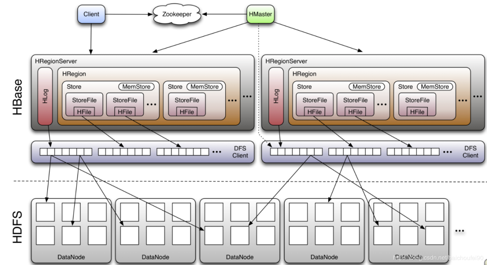
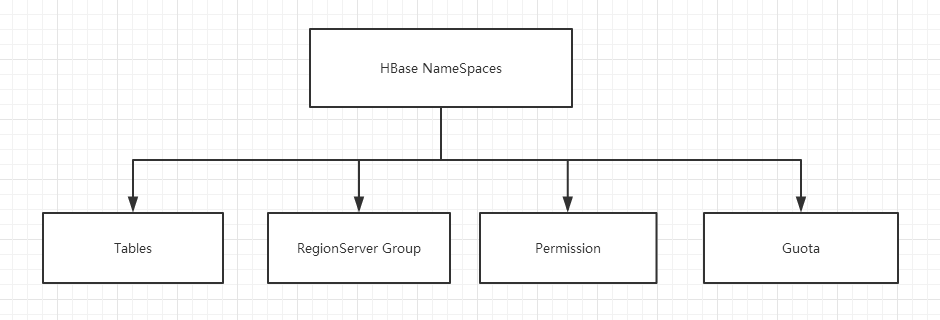
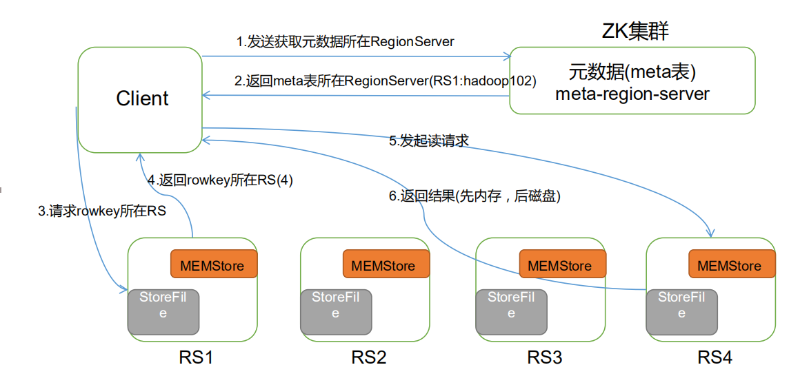
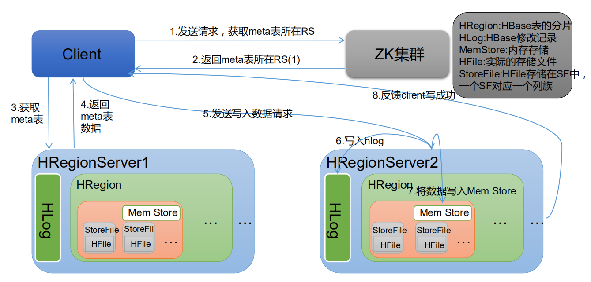

<!-- TOC -->

- [HBase简介](#hbase简介)
    - [什么是HBase](#什么是hbase)
    - [HBase的特点](#hbase的特点)
    - [HBase架构](#hbase架构)
    - [HBase中的角色](#hbase中的角色)
        - [HMaster](#hmaster)
        - [RegionServer](#regionserver)
        - [其他组件](#其他组件)
    - [HBase数据结构](#hbase数据结构)
        - [RowKey](#rowkey)
        - [Column Family](#column-family)
        - [Cell](#cell)
        - [Time Stamp](#time-stamp)
        - [namespace](#namespace)
    - [HBase原理](#hbase原理)
        - [读流程](#读流程)
        - [写流程](#写流程)
        - [数据Flush过程](#数据flush过程)
        - [数据合并过程](#数据合并过程)

<!-- /TOC -->

# HBase简介

## 什么是HBase

HBase的原型是Google的BigTable论文，受到了该论文思想的启发，目前作为Hadoop的子项目来开发维护，用于支持结构化的数据存储。

官方网站：http://hbase.apache.org


HBase是一个**高可靠性、高性能、面向列、可伸缩的分布式存储系统**，利用HBASE技术可在廉价PC Server上搭建起大规模结构化存储集群。

HBase的**目标是存储并处理大型的数据**，更具体来说是仅需使用普通的硬件配置，就能够处理由成千上万的行和列所组成的大型数据。


## HBase的特点

**1）海量存储**

Hbase适合存储PB级别的海量数据，在PB级别的数据以及采用廉价PC存储的情况下，能在几十到百毫秒内返回数据。这与Hbase的极易扩展性息息相关。正式因为Hbase良好的扩展性，才为海量数据的存储提供了便利。

**2）列式存储**

这里的列式存储其实说的是列族存储，Hbase是根据列族来存储数据的。列族下面可以有非常多的列，列族在创建表的时候就必须指定。

**3）极易扩展**

Hbase的扩展性主要体现在两个方面，一个是基于上层处理能力（RegionServer）的扩展，一个是基于存储的扩展（HDFS）。
通过横向添加RegionSever的机器，进行水平扩展，提升Hbase上层的处理能力，提升Hbsae服务更多Region的能力。

**4）高并发**

由于目前大部分使用Hbase的架构，都是采用的廉价PC，因此单个IO的延迟其实并不小，一般在几十到上百ms之间。这里说的高并发，主要是在并发的情况下，Hbase的单个IO延迟下降并不多。能获得高并发、低延迟的服务。

**5）稀疏**

稀疏主要是针对Hbase列的灵活性，在列族中，你可以指定任意多的列，在列数据为空的情况下，是不会占用存储空间的。


## HBase架构





从图中可以看出Hbase是由Client、Zookeeper、Master、HRegionServer、HDFS等几个组件组成，下面来介绍一下几个组件的相关功能：

**1) Client**

Client包含了访问Hbase的接口，另外Client还维护了对应的cache来加速Hbase的访问，比如cache .META.元数据的信息, 并连接对应RegionServer进行数据读写。当master rebalance region时，Client会重新进行查找。


**2) Zookeeper**

HBase通过Zookeeper来做master的高可用、RegionServer的监控、元数据的入口以及集群配置的维护等工作。具体工作如下：

通过Zoopkeeper来保证集群中只有1个master在运行，如果master异常，会通过竞争机制产生新的master提供服务

通过Zoopkeeper来监控RegionServer的状态，当RegionSevrer有异常的时候，通过回调的形式通知Master RegionServer上下线的信息

通过Zoopkeeper存储元数据的统一入口地址


**3) HMaster**

master节点的主要职责如下：
为RegionServer分配Region
维护整个集群的负载均衡
维护集群的元数据信息
发现失效的Region，并将失效的Region分配到正常的RegionServer上
当RegionSever失效的时候，协调对应Hlog的拆分


**4) HregionServer**

HregionServer直接对接用户的读写请求，是真正的“干活”的节点。它的功能概括如下：
管理master为其分配的Region
处理来自客户端的读写请求
负责和底层HDFS的交互，存储数据到HDFS
负责Region变大以后的拆分
负责Storefile的合并工作


**5) HDFS**

HDFS为Hbase提供最终的底层数据存储服务，同时为HBase提供高可用（Hlog存储在HDFS）的支持，具体功能概括如下：
提供元数据和表数据的底层分布式存储服务
数据多副本，保证的高可靠和高可用性

- HBase表的HDFS目录结构如下

  ```
  /hbase
      /data
          /<Namespace>                    (集群里的Namespaces)
              /<Table>                    (该集群的Tables)
                  /<Region>               (该table的Regions)
                      /<ColumnFamily>     (该Region的列族)
                          /<StoreFile>    (该列族的StoreFiles)
  ```

- HLog的HDFS目录结构如下

  ```
  /hbase
      /WALs
          /<RegionServer>    (RegionServers)
              /<WAL>         (WAL files for the RegionServer)
  ```


## HBase中的角色

### HMaster

**功能**

1．监控RegionServer

2．处理RegionServer故障转移

3．处理元数据的变更

4．处理region的分配或转移

5．在空闲时间进行数据的负载均衡

6．通过Zookeeper发布自己的位置给客户端

### RegionServer

**功能**

1．负责存储HBase的实际数据

2．处理分配给它的Region

3．刷新缓存到HDFS

4．维护Hlog

5．执行压缩

6．负责处理Region分片


### 其他组件

**1．Write-Ahead logs**

HBase的修改记录，当对HBase读写数据的时候，数据不是直接写进磁盘，它会在内存中保留一段时间（时间以及数据量阈值可以设定）。但把数据保存在内存中可能有更高的概率引起数据丢失，为了解决这个问题，数据会先写在一个叫做Write-Ahead logfile的文件中，然后再写入内存中。所以在系统出现故障的时候，数据可以通过这个日志文件重建。

**2．Region**

Hbase表的分片，HBase表会根据RowKey值被切分成不同的region存储在RegionServer中，在一个RegionServer中可以有多个不同的region。

**3．Store**

HFile存储在Store中，一个Store对应HBase表中的一个列族。

**4．MemStore**

顾名思义，就是内存存储，位于内存中，用来保存当前的数据操作，所以当数据保存在WAL中之后，RegsionServer会在内存中存储键值对。

**5．HFile**

这是在磁盘上保存原始数据的实际的物理文件，是实际的存储文件。StoreFile是以Hfile的形式存储在HDFS的。


## HBase数据结构

### RowKey

与nosql数据库们一样,RowKey是用来检索记录的主键。访问HBASE table中的行，只有三种方式：

- 通过单个RowKey访问

- 通过RowKey的range（正则）

- 全表扫描

RowKey行键 (RowKey)可以是任意字符串(最大长度是64KB，实际应用中长度一般为 10-100bytes)，在HBASE内部，RowKey保存为字节数组。存储时，数据按照RowKey的字典序(byte order)排序存储。设计RowKey时，要充分排序存储这个特性，将经常一起读取的行存储放到一起。(位置相关性)

#### Rowkey 设计三原则

 一条数据的唯一标识就是 rowkey，那么这条数据存储于哪个分区，取决于 rowkey 处于哪个一个预分区的区间内，设计 rowkey 的主要目的 ，就是让数据均匀的分布于所有的 region 中，在一定程度上防止数据倾斜。接下来我们就谈一谈 rowkey 常用的设计方案。

##### 1. rowkey 长度原则

　　Rowkey 是一个二进制码流，Rowkey 的长度被很多开发者建议说设计在 10~100 个字节，不过建议是越短越好，不要超过 16 个字节，存为byte[]字节数组，**一般设计成定长的**。

**原因如下：**

1、数据的持久化文件 HFile 中是按照 KeyValue 存储的，如果 Rowkey 过长比如 100 个字 节，1000 万列数据光 Rowkey 就要占用 100*1000 万=10 亿个字节，将近 1G 数据，这会极大 影响 HFile 的存储效率；

2、MemStore 将缓存部分数据到内存，如果 Rowkey 字段过长内存的有效利用率会降低， 系统将无法缓存更多的数据，这会降低检索效率。因此 Rowkey 的字节长度越短越好。

3、目前操作系统是都是 64 位系统，内存 8 字节对齐。控制在 16 个字节，8 字节的整数 倍利用操作系统的最佳特性。


##### 2. rowkey 散列原则

　　如果 Rowkey 是按时间戳的方式递增，不要将时间放在二进制码的前面，建议将 Rowkey 的高位作为散列字段，由程序循环生成，低位放时间字段，这样将提高数据均衡分布在每个 Regionserver 实现负载均衡的几率。如果没有散列字段，首字段直接是时间信息将产生所有 新数据都在一个 RegionServer 上堆积的热点现象，这样在做数据检索的时候负载将会集中 在个别 RegionServer，降低查询效率。

   row key是按照**字典序**存储，因此，设计row key时，要充分利用这个排序特点，将经常一起读取的数据存储到一块，将最近可能会被访问的数据放在一块。

举个例子：如果最近写入HBase表中的数据是最可能被访问的，可以考虑将时间戳作为row key的一部分，由于是字典序排序，所以可以使用Long.MAX_VALUE - timestamp作为row key，这样能保证新写入的数据在读取时可以被快速命中。


##### 3. rowkey 唯一原则

　　必须在设计上保证其唯一性。rowkey 是按照字典顺序排序存储的，因此，设计 rowkey 的时候，要充分利用这个排序的特点，将经常读取的数据存储到一块，将最近可能会被访问 的数据放到一块。


### Column Family

列族：HBASE表中的每个列，都归属于某个列族。列族是表的schema的一部 分(而列不是)，必须在使用表之前定义。列名都以列族作为前缀。例如 courses:history，courses:math都属于courses 这个列族。

####  列簇设计

　　追求的原则是：目前Hbase官方建议不超过2~3个column family。因为某个column family在flush的时候，它邻近的column family也会因关联效应被触发flush，最终导致系统产生更多的I/O。

　　最优设计是：将所有相关性很强的 key-value 都放在同一个列簇下，这样既能做到查询效率 最高，也能保持尽可能少的访问不同的磁盘文件。

　　以用户信息为例，可以将必须的基本信息存放在一个列族，而一些附加的额外信息可以放在 另一列族。

### Cell

由{rowkey, column Family:columu, version} 唯一确定的单元。cell中的数据是没有类型的，全部是字节码形式存贮。

关键字：无类型、字节码

### Time Stamp

HBASE 中通过rowkey和columns确定的为一个存贮单元称为cell。每个 cell都保存 着同一份数据的多个版本。版本通过时间戳来索引。时间戳的类型是 64位整型。时间戳可以由HBASE(在数据写入时自动 )赋值，此时时间戳是精确到毫秒 的当前系统时间。时间戳也可以由客户显式赋值。如果应用程序要避免数据版 本冲突，就必须自己生成具有唯一性的时间戳。每个 cell中，不同版本的数据按照时间倒序排序，即最新的数据排在最前面。

为了避免数据存在过多版本造成的的管理 (包括存贮和索引)负担，HBASE提供 了两种数据版本回收方式。一是保存数据的最后n个版本，二是保存最近一段 时间内的版本（比如最近七天）。用户可以针对每个列族进行设置。

### namespace

 

**1) Table**：表，所有的表都是命名空间的成员，即表必属于某个命名空间，如果没有指定，则在default默认的命名空间中。

**2) RegionServer group**：一个命名空间包含了默认的RegionServer Group。

**3) Permission**：权限，命名空间能够让我们来定义访问控制列表ACL（Access Control List）。例如，创建表，读取表，删除，更新等等操作。

**4) Quot**：限额，可以强制一个命名空间可包含的region的数量。


## HBase原理

### 读流程



1）Client 先访问 zookeeper，从 meta 表读取 region 的位置，然后读取 meta 表中的数据。meta

中又存储了用户表的 region 信息；

2）根据 namespace、表名和 rowkey 在 meta 表中找到对应的 region 信息；

3）找到这个 region 对应的 regionserver； 

4）查找对应的 region； 

5）先从 MemStore 找数据，如果没有，再到 BlockCache 里面读；

6）BlockCache 还没有，再到 StoreFile 上读(为了读取的效率)； 

7）如果是从 StoreFile 里面读取的数据，不是直接返回给客户端，而是先写入 BlockCache，

再返回给客户端。


### 写流程



1）Client 向 HregionServer 发送写请求；

2）HregionServer 将数据写到 HLog（write ahead log）。为了数据的持久化和恢复；

3）HregionServer 将数据写到内存（MemStore）；

4）反馈 Client 写成功。


### 数据Flush过程

1）当 MemStore 数据达到阈值（默认是 128M，老版本是 64M），将数据刷到硬盘，将内存

中的数据删除，同时删除 HLog 中的历史数据；

2）并将数据存储到 HDFS 中；

3）在 HLog 中做标记点。


### 数据合并过程

1）当数据块达到 4 块，Hmaster 触发合并操作，Region 将数据块加载到本地，进行合并；

2）当合并的数据超过 256M，进行拆分，将拆分后的 Region 分配给不同的 HregionServer

管理；

3）当HregionServer宕机后，将HregionServer上的hlog拆分，然后分配给不同的HregionServer

加载，修改.META.； 

4）注意：HLog 会同步到 HDFS。