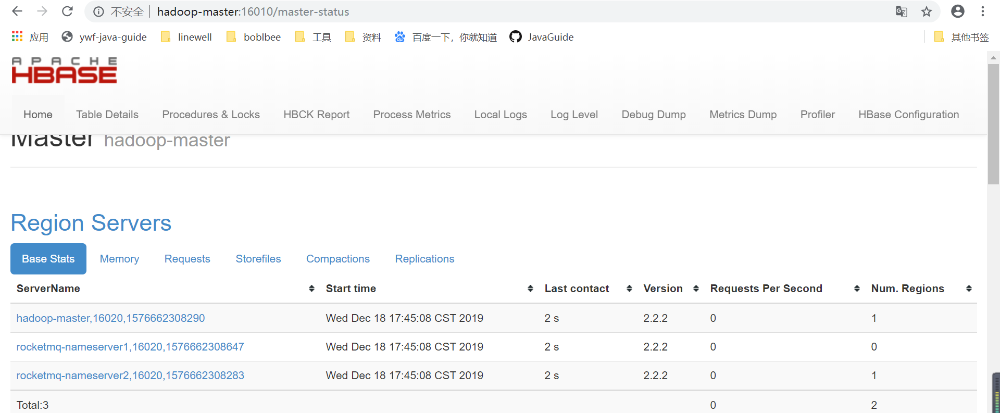

### 环境配置

| IP地址          | hosts  |
| --------------- | ------ |
| 192.168.111.140 | master |
| 192.168.111.141 | slave1 |
| 192.168.111.142 | slave2 |

### 版本信息

| 软件信息  | 版本      |
| --------- | --------- |
| 操作系统  | centos7.0 |
| jdk       | 1.8       |
| zookeeper | 3.4.12    |
| hbase     | 2.2.2     |

- **前置部署**
  - [zookeeper集群部署手册](https://yweifeng.github.io/ywf-java-guide/doc/zookeeper/zookeeper集群部署.html)
  - [hadoop集群部署手册](https://yweifeng.github.io/ywf-java-guide/doc/hadoop/hadoop集群部署.html)


### 下载并安装

- [下载地址](https://hbase.apache.org/downloads.html)

```shell
# 解压
tar -zxvf hbase-2.2.2-bin.tar.gz
# 重命名
mv hbase-2.2.2 hbase
# 设置环境变量
vim /etc/profile

export HBASE_HOME=/opt/hbase
export PATH=${HBASE_HOME}/bin:$PATH
# 重启生效环境变量
source /etc/profile

# 拷贝到从服务器
scp /etc/profile root@slave1:/etc/
scp /etc/profile root@slave2:/etc/
```


### 修改hosts

```shell
vim /etc/hosts
# 添加以下信息

192.168.111.140 master
192.168.111.141 slave1
192.168.111.142 slave2
```


### 保持集群服务器时间同步

```shell
# 3台服务器都执行
yum install -y ntpdate
ntpdate 120.24.81.91
```


### 修改配置信息

- 修改**reigionservers**

```shell
cd /opt/hbase/conf
vim regionservers

master
slave1
slave2
```

- 修改 **hbase-site.xml**

```xml
<configuration>
  <property>
    <name>hbase.rootdir</name>
    <!-- 和hadoop的core-site.xml 的 fs.defaultFS 的 HDFS 的 IP 地址或者域名、端口必须一致 -->
    <value>hdfs://master:8020/hbase</value>
  </property>
  <property>
     <name>hbase.cluster.distributed</name>
     <value>true</value>
  </property>
   <property>
    <name>hbase.zookeeper.property.dataDir</name>
    <value>/opt/zookeeper/data</value>
  </property>
  <property>
    <name>hbase.zookeeper.quorum</name>
    <value>master,slave1,slave2</value>
  </property>
  <property>
    <name>hbase.zookeeper.property.clientPort</name>
    <value>2181</value>
  </property>
  <property> 
    <name>hbase.unsafe.stream.capability.enforce</name>  
    <value>false</value> 
  </property>
</configuration>
```

- 修改**hbase-env.sh**

```properties
export JAVA_HOME=/opt/jdk/jdk1.8.0_141
# HBASE_MANAGES_ZK=false 表示，hbase和大家公用一个zookeeper集群，而不是自己管理集群。
export HBASE_MANAGES_ZK=false
```

- 拷贝hadoop的配置文件hdfs-site.xml 到hbase的配置文件目录

```shell
cp /opt/hadoop/etc/hadoop/hdfs-site.xml /opt/hbase/conf/
```

### 拷贝到其他服务器

```shell
# 拷贝hbase
scp -r /opt/hbase root@slave1:/opt/
scp -r /opt/hbase root@slave2:/opt/

# 拷贝/etc/hosts
scp /etc/hosts root@slave1:/etc/
scp /etc/hosts root@slave2:/etc/

# 拷贝/etc/profile
scp /etc/profile root@slave1:/etc/
scp /etc/profile root@slave2:/etc/
	
# 每个服务器重启/etc/profile
source /etc/profile

# 权限分配
chown -R hadoop:hadoop /opt/*
# 切换用户
su hadoop
```


### 启动

- 启动zookeeper集群

```shell
cd /opt/zookeeper/bin
./zkServer.sh start
```


- 启动dfs集群

```shell
cd /opt/hadoop/sbin
./start-dfs.sh
```


- 启动hbase集群

```shell
cd /opt/hbase/bin
./start-hbase.sh
```


### 浏览器访问

[http://192.168.111.140:16010/master-status](http://192.168.111.140:16010/master-status)

