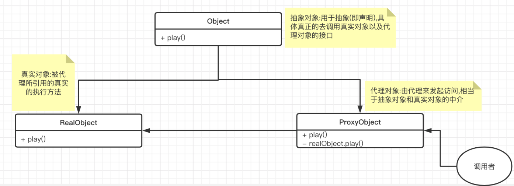
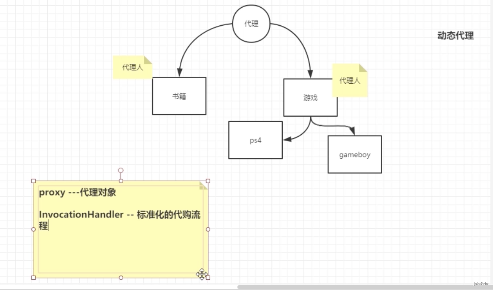

### 注解

> 注解:是Java5引入的一种代码辅助工作,它的核心作用是对类、方法、变量、参数和包进行标注,通过反射来访问这些标注信息,以此运行时改变所注解对象的行为.Java中注解由内置注解和元注解组成.


注解与注释:

Java注解又称Java标注,是Java语言5.0版本开始支持加入源代码的特殊语法元数据.

普通的注释在编译后的class文件中不存在的

而注解附加的信息则根据需要可以保存到class文件中,甚至运行期加载的class对象中.


#### 元注解介绍

1. 创建注解: public @interface AnnotationName{}
2. 元注解(描述注解的一种方式)

1. 1. @Retention 定义注解的生命周期:[source -> class -> runntime]
   2. @Documented 文档注解,会被Javadoc工具文档化
   3. @Inherited 是否让之类继承该注解
   4. @Target 描述了注解的应用范围 


@Target 描述的应用范围

```java
public enum ElementType {
    /** 表示可以用来修饰类、接口、注解类型或枚举类型 */
    TYPE,

    /** 可以用来修饰属性(包括枚举常量) */
    FIELD,

    /** 可以用来修饰方法 */
    METHOD,

    /** 可以用来修饰参数 */
    PARAMETER,

    /** 可以用来修饰构造器 */
    CONSTRUCTOR,

    /** 可以用来修饰局部变量 */
    LOCAL_VARIABLE,

    /** 可以用来修饰注解类型 */
    ANNOTATION_TYPE,

    /** 可以用来修饰包 */
    PACKAGE,

    /**
     * Type parameter declaration
     *
     * @since 1.8
     */
    TYPE_PARAMETER,

    /**
     * Use of a type
     *
     * @since 1.8
     */
    TYPE_USE
 }
```

创建一个注解: 一般使用注解的生命周期@Retention以及应用范围@Target

```java
/**
 * 自定义注解 - 设置元注解
 */
@Retention(RetentionPolicy.RUNTIME)//元注解 定义注解的生命周期
@Target({ElementType.FIELD, ElementType.TYPE,ElementType.METHOD})  //元注解 通过 { } 设置多个注解的应用范围
public @interface Study {
    String name() default "kane";//Java基本类型
    String[] moves(); //如果没有定义default 默认属性 如果用到这个注解必须要定义这个属性值
}

@Study(moves = {"hard", "jake"},name = "jake")
public class Person {
    private String name;

    @Study(moves = {"18"})
    private int age;

    @Study(moves = {"hard", "jake"},name = "method")
    public String getString() {
        return "str";
    }

    public String getName() {
        return name;
    }

    public void setName(String name) {
        this.name = name;
    }

    public int getAge() {
        return age;
    }

    public void setAge(int age) {
        this.age = age;
    }
}
```

注解的使用,只是做到了一个标记的作用,其他的并没有任何操作.

注解的创建方式:

1. 配置元注解,由元注解来当前注解的作用范围和生命周期.
2. 注解中如果需要添加信息,可以用以上方式添加.
3. 注解信息支持Java的基本数据结构


### 反射

> 反射 Reflection:在运行状态中,对于任意一个类,都能够知道这个类的所有属性和方法;对于任意一个对象,都能够调用它的任意一个方法和属性;这种动态获取的信息以及动态调用对象的方法的功能称为Java语言的反射


#### 反射的优缺点

- 通过反射可以使程序代码访问装载到JVM中的类的内部信息,获取已装载类的属性信息,获取已装载类的方法,获取已装载类的构造方法信息.
- 反射提高了Java程序的灵活性和扩展性,降低耦合性,提高自适应能力.
- 反射会对性能造成一定的影响,同时让代码的可读性变低.


反射常用的API

| 方法名                  | 返回值               | 参数描述              |
| ----------------------- | -------------------- | --------------------- |
| Class.forName(String)   | 获取类的元信息       | 当前类文件的具体位置  |
| 类.getClass()           | 获取类的元信息       | -                     |
| clz.getDeclaredFields() | 获取当前类的所有属性 | -                     |
| setAccessible(true)     | 设置当前类属性为可见 | true 或者 false       |
| getMethods()            | 获取类所有方法       | -                     |
| invoke(obj)             | 通过反射执行方法     | 类的元信息            |
| getAnnotation(class)    | 获取注解             | 需要获取的注解的Class |

- 获取类的元信息

```java
        //1 通过反射获取到class类的元信息
        Person person = new Person();
        Class<? extends Person> aClass = person.getClass();//获取到class对象 类的元信息
        //其他方式反射
        Class<?> aClass1 = Class.forName("com.jakeprim.model.Person");//spring
        //<bean name="", class="com.jakeprim.model.Person" />
        //2 通过反射获取类名 包名
        String name = aClass1.getName();//全类名
        String simpleName = aClass1.getSimpleName();//类名
        System.out.println("simpleName:" + simpleName);
        System.out.println("name:" + name);
        System.out.println("aClass1:" + aClass1);
        System.out.println("aClass:" + aClass);
```

- 获取类的属性

```java
        Field[] declaredFields = aClass.getDeclaredFields();//获取类的所有属性
        for (Field field : declaredFields) {
            System.out.println(field);
        }
        //获取指定的属性
        Field ageField = aClass.getDeclaredField("age");
        System.out.println("ageField:" + ageField);
        //4 获取到属性的具体值
        person.setName("jakeprim");
        person.setAge(18);
        for (Field declaredField : declaredFields) {
            declaredField.setAccessible(true);//设置属性为可见
            System.out.println(declaredField.get(person));
        }
```

- 反射中实例化

```java
        Object p = aClass.newInstance();//相当于在反射中实例化
        for (Field field : declaredFields) {
            field.setAccessible(true);
            if (field.getName().equals("name")) {
                field.set(p, "kane");
            } else {
                field.set(p, 18);
            }
            System.out.println(field.get(p));
        }
```

- *反射获取方法 并执行方法*

```java
        Method[] methods = aClass.getMethods();//获取所有方法
        for (Method method : methods) {
//            System.out.println(method.getName());
        }
        //获取指定的方法
        Method method = aClass.getMethod("getString");//方法名 参数类型
        Object invoke = method.invoke(p);//传递：类对象 参数值 并执行方法
        System.out.println(invoke);
```

- 反射获取类的注解

```java
        Study study = aClass.getAnnotation(Study.class);
        //获取注解的内容
        String[] moves = study.moves();
        String name1 = study.name();
        System.out.println("moves:" + moves[0] + " name:" + name1);
```

- 反射获取方法的注解

```java
        Study methodAnnotation = method.getAnnotation(Study.class);
        String[] methodMoves = methodAnnotation.moves();
        String methodName1 = methodAnnotation.name();
        System.out.println("get method annotation moves:" + methodMoves[0] + " methodName1:" + methodName1);
```

- 反射获取属性的注解

```java
        for (Field field : declaredFields) {
            Study fieldAnnotation = field.getAnnotation(Study.class);
            if (fieldAnnotation == null) {
                continue;
            }
            System.out.println("get fields annotation moves:" + fieldAnnotation.moves()[0] + " name:" + fieldAnnotation.name());
        }
        Study ageAnnotation = ageField.getAnnotation(Study.class);
        System.out.println("ageAnnotation:"+ageAnnotation.moves()[0]);
```


### 注解与反射实战

通过注解加反射,实现一个对SQL语句的封装,代码如下:

@SqlState 来标记实体类中的SQL的表名 

```java
@Target(ElementType.TYPE)
@Retention(RetentionPolicy.RUNTIME)
public @interface SqlState {
    String value() default "";
}
```

@Column 来标记实体了属性的SQL中的字段名

```java
@Target(ElementType.FIELD)
@Retention(RetentionPolicy.RUNTIME)
public @interface Column {
    String value() default "";
}
```

Order 实体类(setter和getter方法这里就不在显示了)

```java
@SqlState("t_order")
public class Order {
    @Column //默认和字段名一致
    private Long id;

    @Column("order_no") //Java驼峰命名 SQL _ 命名
    private String orderNo;//一旦有值 作为查询条件

    @Column("user_name")
    private String userName;

    @Column("user_id")
    private int userId;

    @Column("shop_id")
    private int shopId;
}
```

然后通过工具类,来实现:*select 字段 表名 from where 条件 自动拼接返回SQL语句 如果属性的值不为空则作为条件*

```java
public String query(Object obj) throws Exception {
        StringBuffer buffer = new StringBuffer();//拼接整体的查询SQL语句
        StringBuffer whereBuffer = new StringBuffer(" where "); //拼接查询条件SQL语句
        //select 字段 from 表名 where 条件
        buffer.append("select");
        //反射对象上的注解
        Class<?> objClass = obj.getClass();
        SqlState sqlState = objClass.getAnnotation(SqlState.class);//表名
        if (sqlState == null) {
            throw new RuntimeException("注解缺失");
        }
        String tableName = sqlState.value();
        Field[] fields = objClass.getDeclaredFields();//获取对象属性
        for (Field field : fields) {
            Column column = field.getAnnotation(Column.class);
            if (column == null) {
                continue;//不生成查询字段
            }
            if (column.value().equals("")) {//表字段名和属性名是一致的
                String name = field.getName();
                field.setAccessible(true);
                Object value = field.get(obj);
                buffer.append(" " + name + ",");
                if (value != null && Integer.parseInt(value.toString()) != 0) {
                    whereBuffer.append(" and " + name + "=" + value);
                }
            } else {
                String name = column.value();//表字段名和属性名不一致
                field.setAccessible(true);
                Object value = field.get(obj);
                buffer.append(" " + name + ",");
                if (value != null && Integer.parseInt(value.toString()) != 0) {
                    whereBuffer.append(" and " + name + "=" + value);
                }
            }
        }
        buffer.deleteCharAt(buffer.length() - 1);//删除最后一个逗号
        buffer.append(" from " + tableName);
        buffer.append(whereBuffer);
        return buffer.toString();
    }
```

测试一下:

```java
        GenerateSqlUtil generateSqlUtil = new GenerateSqlUtil();
        Order order = new Order();
        order.setOrderNo("7789");
        String query = generateSqlUtil.query(order);
        System.out.println("query:" + query);
```

返回结果如下: 注解加反射在很大的程度上帮助我们提高了开发效率 不用再去写繁琐的SQL语句.

> query:select id, order_no, user_name, user_id, shop_id from t_order where  and order_no=7789


### 代理模式

> 代理模式(Proxy)为其他对象提供一种代理,以控制对这个对象的访问.代理对象在客户端和目标对象之间起到中介的作用





#### 静态代理

如下是生产玩具的工厂接口

```java
public interface GameFactory {//生产所有的玩具
    String make();
}
```

如下是购买图书的工厂接口

```java
public interface BookFactory {
    String printed();
}
```

如下两个类,是两款游戏,都实现了GameFactory

```java
public class GameBoyFactory implements GameFactory {
    @Override
    public String make() {
        return "gameBoy";
    }
}
public class PS4Factory implements GameFactory {
    @Override
    public String make() {
        return "ps4";
    }
}
```

有人发现了商机,准备去代理游戏和图书,代理人就要实现GameFactory, BookFactory,由购买者向代理人传递购买哪个游戏或者图书

```java
/**
 * 代理人
 * 静态代理
 */
public class JakeProxy implements GameFactory, BookFactory {

    GameFactory factory;

    /**
     * 告诉代理人 你要买的东西
     *
     * @param factory
     */
    public JakeProxy(GameFactory factory) {
        this.factory = factory;
    }

    @Override
    public String make() {
        //售前服务
        dosomethingBefore();
        String make = factory.make();
        System.out.println("make:" + make);
        //售后服务
        dosomethingAfter();
        return null;
    }

    private void dosomethingAfter() {
        System.out.println("售后服务");
    }

    private void dosomethingBefore() {
        System.out.println("售前服务");
    }

    @Override
    public String printed() {
        //越来越多的业务 会使这个代理类越来越难以维护
        return null;
    }
}
```

有一个土豪想要去购买ps4,找到代理人告诉他我要购买ps4,如下代码调用

```java
        //想要去购买ps4
        PS4Factory factory = new PS4Factory();
        //找代理人 我要买ps4
        JakeProxy jakeProxy = new JakeProxy(factory);
        //买回来了
        jakeProxy.make();

        //在比如 土豪现在想买图书了 那么代理人就需要继承bookfactory 以后代理人扩展业务 就需要实现不同的接口
```

上述的代码就属于静态代理,如果以后代理人要扩展其他业务就需要在实现其他的接口,如果接口中的方法修改或者添加,那么代理人同样也需要修改和添加,非常不利于以后的扩展,最终代理人会被累死......


#### 动态代理

代理人经过了多重思考最终成立一个代理公司:

代理游戏,直接找游戏公司,给我提供一个代理人,在比如书籍直接找厂商给我提供一个代理人,进行代理,而不用在自己负责代理了.即便厂商接口发生变化也不会影响代理公司,因为厂商提供的代理人都会知道.




动态代理代码实现如下:

```java
/**
 * 动态代理 不关注具体的代理对象 只需要代理即可
 */
public class JakeProxy2 implements InvocationHandler {

    private Object target;//目标的代理对象 被代理对象

    public Object getTarget() {
        return target;
    }

    public void setTarget(Object target) {
        this.target = target;
    }

    public Object getProxy() {//我只负责跟总公司联系 而不在负责具体的店铺
        return Proxy.newProxyInstance(target.getClass().getClassLoader(), target.getClass().getInterfaces(), this);
    }

    @Override
    public Object invoke(Object proxy, Method method, Object[] args) throws Throwable {
        dosomethingBefore();
        Object invoke = method.invoke(target, args);
        System.out.println(invoke);
        dosomethingAfter();
        return invoke;
    }

    //标准化的服务定制流程
    private void dosomethingAfter() {
        System.out.println("售后服务");
    }

    private void dosomethingBefore() {
        System.out.println("售前服务");
    }
}
```

调用如下:由代理厂商直接提供一个代理人

```java
        //动态代理 不管是增加接口还是新的代理 不会影响代理人的代码业务
        JakeProxy2 jakeProxy2 = new JakeProxy2();
        jakeProxy2.setTarget(new PS4Factory());
        GameFactory proxyGame = (GameFactory) jakeProxy2.getProxy();//获得一个代理
        proxyGame.make();
```

