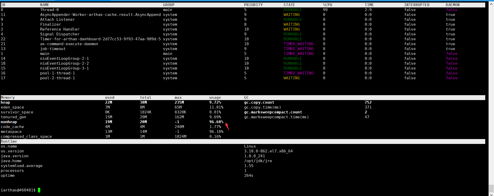
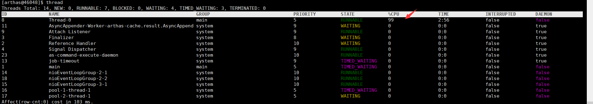
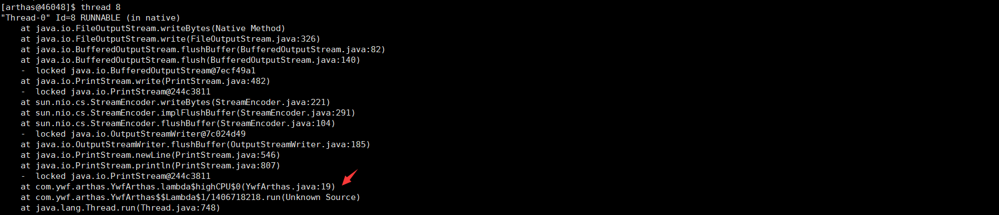
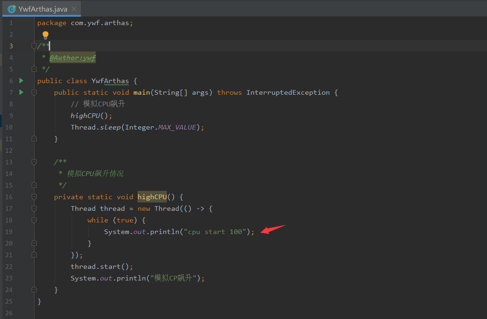
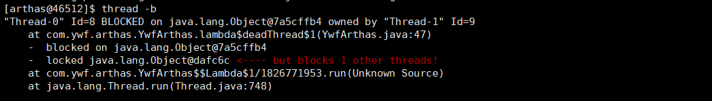
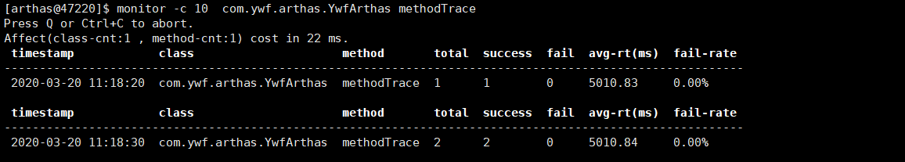

## 前言

>  在使用 **Arthas** 之前，当遇到 Java 线上问题时，如 CPU 飙升、负载突高、内存溢出等问题，你需要查命令，查网络，然后 jps、jstack、jmap、jhat、jstat、hprof 等一通操作。最终焦头烂额，还不一定能查出问题所在。而现在，大多数的常见问题你都可以使用 **Arthas** 轻松定位，迅速解决，及时止损，准时下班。


## Arthas 介绍

**Arthas** 是 `Alibaba` 在 2018 年 9 月开源的 **Java 诊断**工具。支持 `JDK6+`， 采用命令行交互模式，提供 `Tab` 自动不全，可以方便的定位和诊断线上程序运行问题。截至本篇文章编写时，已经收获 `Star` 17000+。

**Arthas** 官方文档十分详细，本文也参考了官方文档内容，同时在开源在的 `Github` 的项目里的 `Issues` 里不仅有问题反馈，更有大量的使用案例，也可以进行学习参考。

开源地址：*https://github.com/alibaba/arthas*

官方文档：*https://alibaba.github.io/arthas*


## Arthas 使用场景

得益于 **Arthas** 强大且丰富的功能，让 **Arthas** 能做的事情超乎想象。下面仅仅列举几项常见的使用情况，更多的使用场景可以在熟悉了 **Arthas** 之后自行探索。

1. 是否有一个全局视角来查看系统的运行状况？
2. 为什么 CPU 又升高了，到底是哪里占用了 CPU ？
3. 运行的多线程有死锁吗？有阻塞吗？
4. 程序运行耗时很长，是哪里耗时比较长呢？如何监测呢？
5. 这个类从哪个 jar 包加载的？为什么会报各种类相关的 Exception？
6. 我改的代码为什么没有执行到？难道是我没 commit？分支搞错了？
7. 遇到问题无法在线上 debug，难道只能通过加日志再重新发布吗？
8. 有什么办法可以监控到 JVM 的实时运行状态？


## 安装

可以在官方 Github 上进行下载，如果速度较慢，可以尝试国内的码云 Gitee 下载。

```shell
# github下载
wget https://alibaba.github.io/arthas/arthas-boot.jar
# 或者 Gitee 下载
wget https://arthas.gitee.io/arthas-boot.jar
# 打印帮助信息
java -jar arthas-boot.jar -h
```


## 运行

**Arthas** 只是一个 java 程序，所以可以直接用 `java -jar` 运行。运行时或者运行之后要选择要监测的 Java 进程。

```shell
# 运行方式1，先运行，在选择 Java 进程 PID
java -jar arthas-boot.jar
# 选择进程(输入[]内编号(不是PID)回车)
[INFO] arthas-boot version: 3.1.4
[INFO] Found existing java process, please choose one and hit RETURN.
* [1]: 11616 com.Arthas
  [2]: 8676
  [3]: 16200 org.jetbrains.jps.cmdline.Launcher
  [4]: 21032 org.jetbrains.idea.maven.server.RemoteMavenServer

# 运行方式2，运行时选择 Java 进程 PID
java -jar arthas-boot.jar [PID]
```


## 常用命令

| 命令                                                         | 介绍                                                         |
| ------------------------------------------------------------ | ------------------------------------------------------------ |
| [dashboard](https://alibaba.github.io/arthas/dashboard.html) | 当前系统的实时数据面板                                       |
| [**thread**](https://alibaba.github.io/arthas/thread.html)   | 查看当前 JVM 的线程堆栈信息                                  |
| [**watch**](https://alibaba.github.io/arthas/watch.html)     | 方法执行数据观测                                             |
| **[trace](https://alibaba.github.io/arthas/trace.html)**     | 方法内部调用路径，并输出方法路径上的每个节点上耗时           |
| [**stack**](https://alibaba.github.io/arthas/stack.html)     | 输出当前方法被调用的调用路径                                 |
| [**tt**](https://alibaba.github.io/arthas/tt.html)           | 方法执行数据的时空隧道，记录下指定方法每次调用的入参和返回信息，并能对这些不同的时间下调用进行观测 |
| [monitor](https://alibaba.github.io/arthas/monitor.html)     | 方法执行监控                                                 |
| [jvm](https://alibaba.github.io/arthas/jvm.html)             | 查看当前 JVM 信息                                            |
| [vmoption](https://alibaba.github.io/arthas/vmoption.html)   | 查看，更新 JVM 诊断相关的参数                                |
| [sc](https://alibaba.github.io/arthas/sc.html)               | 查看 JVM 已加载的类信息                                      |
| [sm](https://alibaba.github.io/arthas/sm.html)               | 查看已加载类的方法信息                                       |
| [jad](https://alibaba.github.io/arthas/jad.html)             | 反编译指定已加载类的源码                                     |
| [classloader](https://alibaba.github.io/arthas/classloader.html) | 查看 classloader 的继承树，urls，类加载信息                  |
| [heapdump](https://alibaba.github.io/arthas/heapdump.html)   | 类似 jmap 命令的 heap dump 功能                              |


## 常用操作

### 全局监控  dashboard




### CPU飙升  thread



- 分析：Thread ID为8的线程内存占用99%, 查看thread 8详情。

```
thread 8
```



- **分析**：找到出现问题的代码为 YwfArthas.java 第19行。




### 线程池线程状态

**RUNNABLE** 运行中
**TIMED_WAITIN** 调用了以下方法的线程会进入**TIMED_WAITING**：

- Thread#sleep()
- Object#wait() 并加了超时参数
- Thread#join() 并加了超时参数
- LockSupport#parkNanos()
- LockSupport#parkUntil()

**WAITING** 当线程调用以下方法时会进入WAITING状态：

- Object#wait() 而且不加超时参数
- Thread#join() 而且不加超时参数
  LockSupport#park()

**BLOCKED** 阻塞，等待锁


### 线程死锁  thread -b



- **分析**：ID=8 和 ID=9 的线程产生死锁， 问题代码行: YwfArthas.java 47行

```java
/**
  * 死锁
  */
private static void deadThread() {
    /** 创建资源 */
    Object resourceA = new Object();
    Object resourceB = new Object();
    // 创建线程
    Thread threadA = new Thread(() -> {
        synchronized (resourceA) {
            System.out.println(Thread.currentThread() + " get ResourceA");
            try {
                Thread.sleep(1000);
            } catch (InterruptedException e) {
                e.printStackTrace();
            }
            System.out.println(Thread.currentThread() + "waiting get resourceB");
            synchronized (resourceB) {
                System.out.println(Thread.currentThread() + " get resourceB");
            }
        }
    });

    Thread threadB = new Thread(() -> {
        synchronized (resourceB) {
            System.out.println(Thread.currentThread() + " get ResourceB");
            try {
                Thread.sleep(1000);
            } catch (InterruptedException e) {
                e.printStackTrace();
            }
            System.out.println(Thread.currentThread() + "waiting get resourceA");
            synchronized (resourceA) {
                System.out.println(Thread.currentThread() + " get resourceA");
            }
        }
    });
    threadA.start();
    threadB.start();
}
```


### 反编译 jad

```shell
#jad 类包路径
[arthas@46745]$ jad com.ywf.arthas.YwfArthas
```


### 查看字段信息 sc -d -f 

```shell
# sc -d -f 
[arthas@46745]$ sc -d -f com.ywf.arthas.YwfArthas
 class-info        com.ywf.arthas.YwfArthas                                                                                                                                                                      
 code-source       /opt/jar/arthas-0.0.1-SNAPSHOT.jar                                                                                                                                                            
 name              com.ywf.arthas.YwfArthas                                                                                                                                                                      
 isInterface       false                                                                                                                                                                                         
 isAnnotation      false                                                                                                                                                                                         
 isEnum            false                                                                                                                                                                                         
 isAnonymousClass  false                                                                                                                                                                                         
 isArray           false                                                                                                                                                                                         
 isLocalClass      false                                                                                                                                                                                         
 isMemberClass     false                                                                                                                                                                                         
 isPrimitive       false                                                                                                                                                                                         
 isSynthetic       false                                                                                                                                                                                         
 simple-name       YwfArthas                                                                                                                                                                                     
 modifier          public                                                                                                                                                                                        
 annotation                                                                                                                                                                                                      
 interfaces                                                                                                                                                                                                      
 super-class       +-java.lang.Object                                                                                                                                                                            
 class-loader      +-sun.misc.Launcher$AppClassLoader@70dea4e                                                                                                                                                    
                     +-sun.misc.Launcher$ExtClassLoader@5c2a7cb8                                                                                                                                                 
 classLoaderHash   70dea4e                                                                                                                                                                                       
 fields                                                                                                                                                                                                          

Affect(row-cnt:1) cost in 37 ms.

```


### 查看方法信息 sm

```shell
[arthas@46745]$ sm com.ywf.arthas.YwfArthas
com.ywf.arthas.YwfArthas <init>()V
com.ywf.arthas.YwfArthas lambda$highCPU$0()V
com.ywf.arthas.YwfArthas highCPU()V
com.ywf.arthas.YwfArthas lambda$deadThread$2(Ljava/lang/Object;Ljava/lang/Object;)V
com.ywf.arthas.YwfArthas deadThread()V
com.ywf.arthas.YwfArthas lambda$deadThread$1(Ljava/lang/Object;Ljava/lang/Object;)V
com.ywf.arthas.YwfArthas main([Ljava/lang/String;)V
Affect(row-cnt:7) cost in 9 ms.

```


### 运行较慢、耗时较长 trace

- 模拟代码如下：

```java
 /**
   * 追踪运行时间
   */
private static void methodTrace() throws InterruptedException {
    methodFast();
    methodSlow();
}

/**
  * 快速方法
  */
private static void methodFast() throws InterruptedException {
    System.out.println("method fast");
    Thread.sleep(10);
}

/**
  * 缓慢方法
  */
private static void methodSlow() throws InterruptedException {
    System.out.println("method fast");
    Thread.sleep(5000);
}
```

用法：

```shell
trace 包类名 方法名
```


```shell
[arthas@47220]$ trace com.ywf.arthas.YwfArthas methodTrace
Press Q or Ctrl+C to abort.
Affect(class-cnt:1 , method-cnt:1) cost in 65 ms.
`---ts=2020-03-20 11:14:31;thread_name=main;id=1;is_daemon=false;priority=5;TCCL=sun.misc.Launcher$AppClassLoader@70dea4e
    `---[5012.834351ms] com.ywf.arthas.YwfArthas:methodTrace()
        +---[11.81502ms] com.ywf.arthas.YwfArthas:methodFast() #26
        `---[5000.290587ms] com.ywf.arthas.YwfArthas:methodSlow() #27
```


### 统计方法耗时 monitor -c 

- 每个10秒统计一次

```shell
[arthas@47220]$ monitor -c 10  com.ywf.arthas.YwfArthas methodTrace
```




### 观察方法的调用路径 stack 

```shell
[arthas@47220]$ stack  com.ywf.arthas.YwfArthas methodFast
Press Q or Ctrl+C to abort.
Affect(class-cnt:1 , method-cnt:1) cost in 14 ms.
ts=2020-03-20 11:20:47;thread_name=main;id=1;is_daemon=false;priority=5;TCCL=sun.misc.Launcher$AppClassLoader@70dea4e
    @com.ywf.arthas.YwfArthas.methodTrace()
        at com.ywf.arthas.YwfArthas.main(YwfArthas.java:16)
```


## 热更新 redefine

```shell
# redefine class路径
[arthas@50117]$ redefine /opt/jar/YwfArthas.class 
redefine success, size: 1
```


**临时现场更新方法, 反编译代码和本地代码可能不同**：

```shell
# 反编译，并保存到linux目录
jad --source-only com.ywf.arthas.YwfArthas > /opt/tmpJava/YwfArthas.java

#vim YwfArthas.java文件，修改代码

# 编译 YwfArthas.java 为 YwfArthas.class文件 生成到 /opt/tmpJava/com/ywf/arthas
mc /opt/tmpJava/YwfArthas.java -d /opt/tmpJava

# 热更新
redefine /opt/tmpJava/com/ywf/arthas/YwfArthas.class
```


**JVM热更新的局限**

基于Attach机制实现的热更新，更新类需要与原来的类在包名，类名，修饰符上完全一致，否则在classRedefine过程中会产生classname don't match 的异常。

例如显示这样的报错：redefineClasses exception class redefinition failed: attempted to delete a method.

具体来说，JVM热更新局限总结：

1. 函数参数格式不能修改，只能修改函数内部的逻辑
2. 不能增加类的函数或变量
3. 函数必须能够退出，如果有函数在死循环中，无法执行更新类（笔者实验发现，死循环跳出之后，再执行类的时候，才会是更新类）


