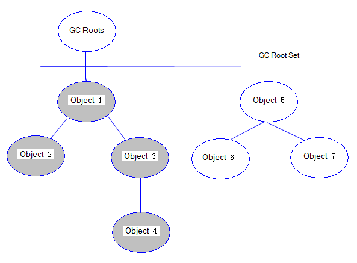

> 程序计数器、虚拟机栈、本地方法栈，3个区域随着线程的生存而生存的。内存分配和回收都是确定的。随着线程的结束内存自然就被回收了，因此不需要考虑垃圾回收的问题。而Java堆和方法区则不一样，各线程共享，内存的分配和回收都是动态的。因此垃圾收集器所关注的都是这部分内存。 


### 回收算法

#### 引用计数算法

给对象添加一个引用计数器，每当有一个地方引用它时计数器就+1，当引用失效时计数器就-1,。只要计数器等于0的对象就是不可能再被使用的。

　　此算法在大部分情况下都是一个不错的选择，也有一些著名的应用案例。但是Java虚拟机中是没有使用的。

　　**优点**：实现简单、判断效率高。

　　**缺点**：很难解决对象之间循环引用的问题。例如下面这个例子

```java
Object a = new Object();
Object b = new Object();
a=b;
b=a;
a=b=null;
//这样就导致gc无法回收他们。　`
```

#### 可达性分析算法

　　通过一系列的称为“GC Roots”的对象作为起始点，从这些节点开始向下搜索，搜索所走过的路径称为引用链，当一个对象到GC Roots没有使用任何引用链时，则说明该对象是不可用的。

　　主流的商用程序语言（Java、C#等）在主流的实现中，都是通过可达性分析来判定对象是否存活的。

　　通过下图来清晰的感受gc root与对象展示的联系。所示灰色区域对象是存活的，Object5/6/7均是可回收的对象

 

　**在Java语言中，可作为GC Roots 的对象包括下面几种**

- 虚拟机栈（栈帧中的本地变量表）中引用的对象
- 方法区中静态变量引用的对象
- 方法区中常量引用的对象
- 本地方法栈（即一般说的 Native 方法）中JNI引用的对象

　**优点**：更加精确和严谨，可以分析出循环数据结构相互引用的情况；

　**缺点**：实现比较复杂、需要分析大量数据，消耗大量时间、分析过程需要GC停顿（引用关系不能发生变化），即停顿所有Java执行线程（称为"Stop The World"，是垃圾回收重点关注的问题）。


### 引用

　在jdk1.2之后，Java对引用的概念进行了扩充，总体分为4类：强引用、软引用、弱引用、虚引用，这4中引用强度依次逐渐减弱。

- **强引用**：指在代码中普遍存在的，类似 Object obj = new Object(); 这类的引用，只有强引用还存在，GC就永远不会收集被引用的对象。
- **软引用**：指一些还有用但并非必须的对象。直到内存空间不够时（抛出OutOfMemoryError之前），才会被垃圾回收。采用SoftReference类来实现软引用
- **弱引用**：用来描述非必须对象。当垃圾收集器工作时就会回收掉此类对象。采用WeakReference类来实现弱引用。
- **虚引用**：一个对象是否有虚引用的存在，完全不会对其生存时间构成影响， 唯一目的就是能在这个对象被回收时收到一个系统通知， 采用PhantomRenference类实现


### 判断一个对象生存还是死亡

宣告一个对象死亡，至少要经历两次标记。

#### 第一次标记

　　如果对象进行可达性分析算法之后没发现与GC Roots相连的引用链，那它将会第一次标记并且进行一次筛选。

　　**筛选条件**：判断此对象是否有必要执行finalize()方法。

　　**筛选结果**：当对象没有覆盖finalize()方法、或者finalize()方法已经被JVM执行过，则判定为可回收对象。如果对象有必要执行finalize()方法，则被放入F-Queue队列中。稍后在JVM自动建立、低优先级的Finalizer线程（可能多个线程）中触发这个方法；　　

#### 第二次标记

　　GC对F-Queue队列中的对象进行二次标记。

　　如果对象在finalize()方法中重新与引用链上的任何一个对象建立了关联，那么二次标记时则会将它移出“即将回收”集合。如果此时对象还没成功逃脱，那么只能被回收了。

#### finalize() 方法

　　finalize()是Object类的一个方法、一个对象的finalize()方法只会被系统自动调用一次，经过finalize()方法逃脱死亡的对象，第二次不会再调用；

　　特别说明：并不提倡在程序中调用finalize()来进行自救。建议忘掉Java程序中该方法的存在。因为它执行的时间不确定，甚至是否被执行也不确定（Java程序的不正常退出），而且运行代价高昂，无法保证各个对象的调用顺序（甚至有不同线程中调用）。


### 回收方法区　　

　　永久代的垃圾收集主要分为两部分内容：废弃常量和无用的类。

### 回收废弃常量

　　回收废弃常量与Java堆的回收类似。下面举个栗子说明

　　假如一个字符串“abc” 已经进入常量池中，但当前系统没有一个string对象是叫做abc的，也就是说，没有任何string对象的引用指向常量池中的abc常量，也没用其他地方引用这个字面量。如果这是发生内存回收，那么这个常量abc将会被清理出常量池。常量池中的其他类（接口）、方法、字段的符号引用也与此类似。

### 回收无用的类

　　需要同时满足下面3个条件的才能算是无用的类。

1. 该类所有的实例都已经被回收，也就是Java堆中无任何改类的实例。
2. 加载该类的ClassLoader已经被回收。
3. 该类对应的java.lang.Class对象没有在任何地方被引用，无法在任何地方通过反射访问该类的方法

　　虚拟机可以对同时满足这三个条件的类进行回收，但不是必须进行回收的。是否对类进行回收，HotSpot虚拟机提供了-Xnoclassgc参数进行控制。
