### Dump文件生成方式

#### 事后生成

- **JVM启动时添加参数**

```properties
# 出现 OOME 时生成堆 dump: 
-XX:+HeapDumpOnOutOfMemoryError
# 实现在Full GC前dump
-XX:+HeapDumpBeforeFullGC
# 实现在Full GC后dump
-XX:+HeapDumpAfterFullGC
# 生成dump文件地址：
-XX:HeapDumpPath=/opt/logs/jvmlogs/
```


**模拟OutOfMemoryError**

```java
package com.ywf.jvm;

import java.util.ArrayList;
import java.util.List;

/**
 * @Author:ywf
 */
public class YwfJvmMain {

    public static void main(String[] args) throws InterruptedException {
        testOutOfMemoryError();
    }

    /**
     * 测试生成大对象，产生OutOfMemoryError
     */
    public static void testOutOfMemoryError() throws InterruptedException {
        System.out.println("开始生成大对象");
        List<byte[]> dataList = new ArrayList<>();
        while(true) {
            // 生成一个100MB 的大对象
            byte[] bigData = new  byte[1024 * 1024*100];
            dataList.add(bigData);
            Thread.sleep(1000);
        }
    }
}
```


- 运行jar包

```shell
java -jar -XX:+HeapDumpOnOutOfMemoryError -XX:HeapDumpPath=F:/jvmlogs/ ywf-jvm.jar
```

- 生成dump文件

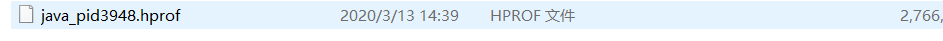


- 使用Eclipse插件**Memory Analyzer Tool（MAT）**来打开heap.hprof文件

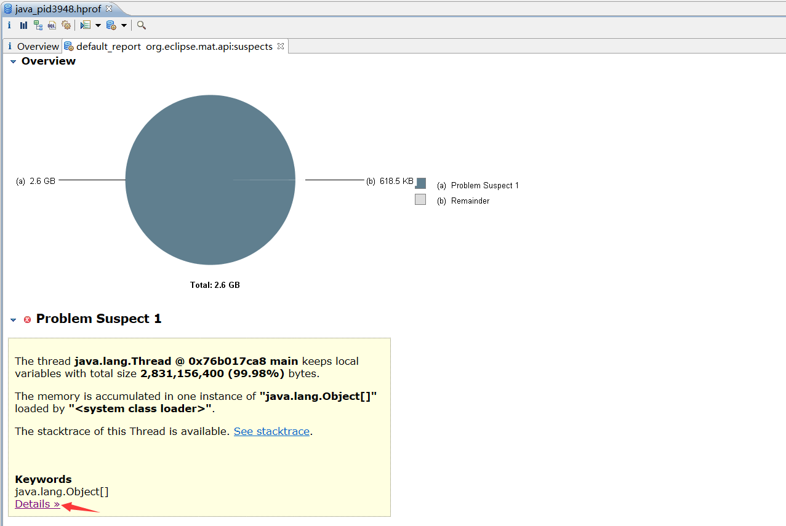


- **点击 Details**


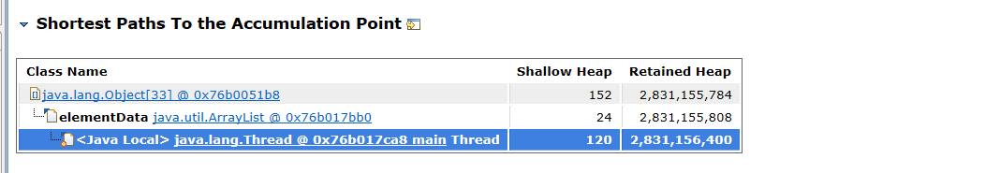

> **分析：发现java.util.ArrayList占用大量堆内存**


- 点击按钮，查看完整的+0x76b0051b8  Dominator Tree

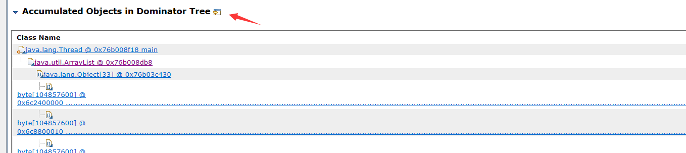


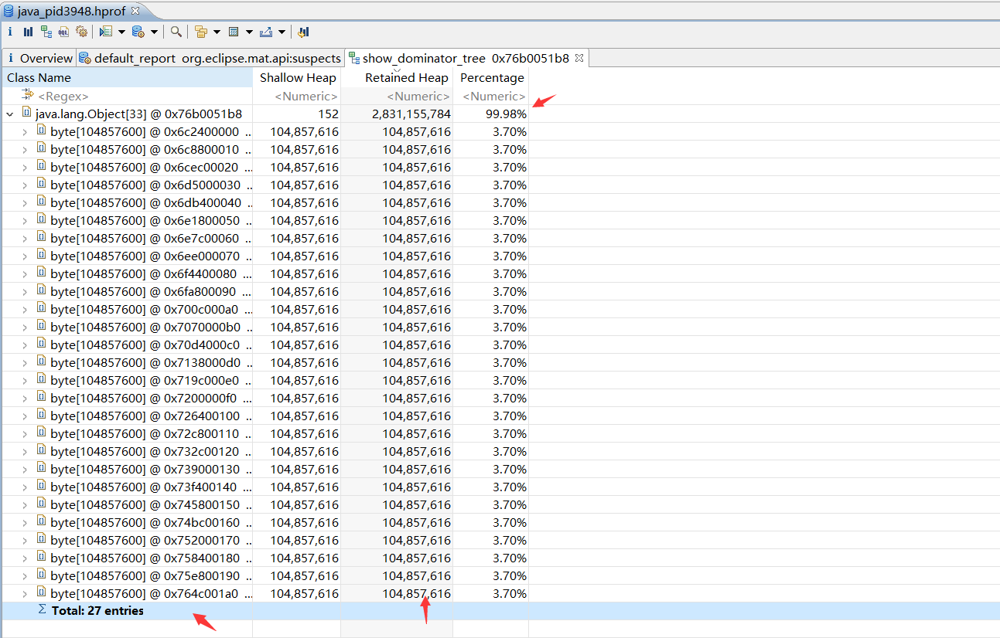

> **分析：发现java.util.ArrayList下共有27个byte[]，每个byte[]占用100M的内存，27个占用了2.7G，占用整过JVM内存的99.98%。**


- 查看Thread Stack

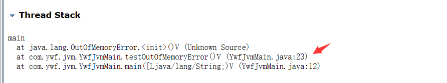

> **分析：发现代码出现在YwfJvmMain.java 第23行上**

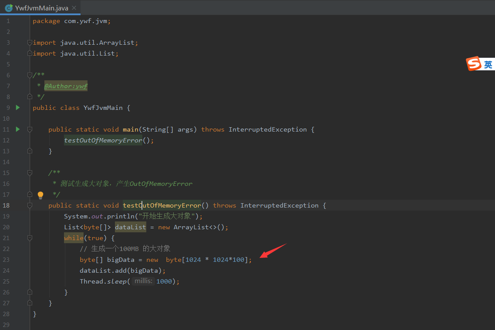

> 分析：定位代码位置，找出问题所在


#### 手动执行生成

```shell
# dump堆到文件，format指定输出格式，live指明是活着的对象，file指定文件名。
jmap -dump:live,format=b,file=f:/jvmlogs/heap.hprof pid
```

- jmap参数

  - option：选项参数，不可同时使用多个选项参数。
    - heap：显示Java堆详细信息；
    - histo：线下堆中对象的统计信息；
    - clstats：Java堆中内存的类加载器的统计信息；
    - finalizerinfo：显示在F-Queue队列等待Finlizer线程执行finalizer方法的对象；
    - dump：生成堆转储快照；

  - F：当-dump没有响应时，强制生成dump快照；
  - pid：Java进程id。
  - executable：产生核心dump的Java可执行文件。
  - core：需要打印配置信息的核心文件。
  - remote-hostname-or-ip：远程调试的主机名或ip。


运行代码如下：

```java
package com.ywf.jvm;

import java.util.ArrayList;
import java.util.List;

/**
 * @Author:ywf
 */
public class YwfJvmMain {

    public static void main(String[] args) throws InterruptedException {
        testFullGc();
    }
    
    /**
     * 测试生成大对象
     */
    public static void testFullGc() throws InterruptedException {
        System.out.println("开始生成大对象");
        List<byte[]> dataList = new ArrayList<>();
        while(true) {
            // 生成一个10MB 的大对象
            byte[] bigData = new  byte[1024 * 1024*10];
            dataList.add(bigData);
            Thread.sleep(1000);
        }
    }
}
```

- 运行jar包

```shell
java -jar -XX:+HeapDumpOnOutOfMemoryError -XX:HeapDumpPath=F:/jvmlogs/ ywf-jvm.jar
```

- 查看java的PID

```shell
# windows使用tasklist 或者 任务管理器查找出 pid
tasklist
```

- 使用jmap生成heap.hprof

```shell
jmap -dump:live,format=b,file=f:/jvmlogs/heap.hprof 20468
```


- 使用Eclipse插件**Memory Analyzer Tool（MAT）**来打开heap.hprof文件

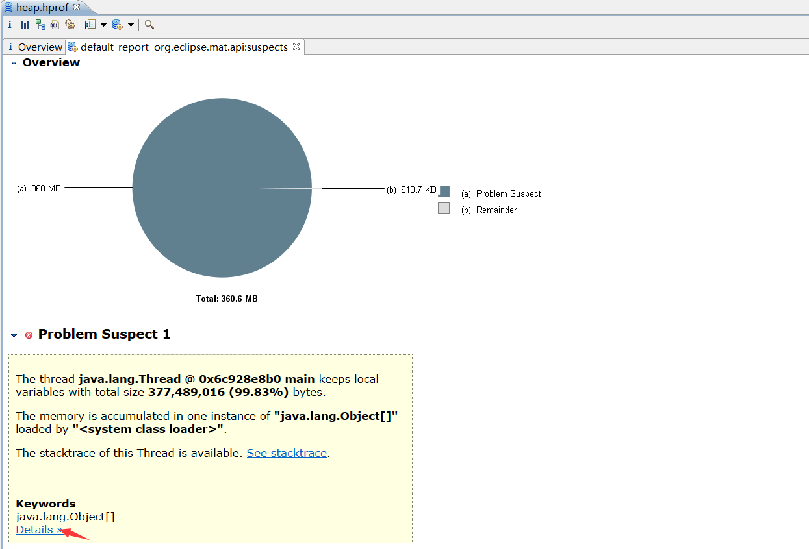

**点击 Details**

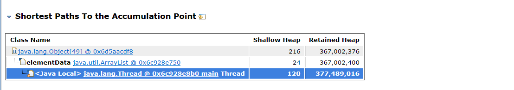

- 点击按钮，查看完整的+0x6c928e750 Dominator Tree

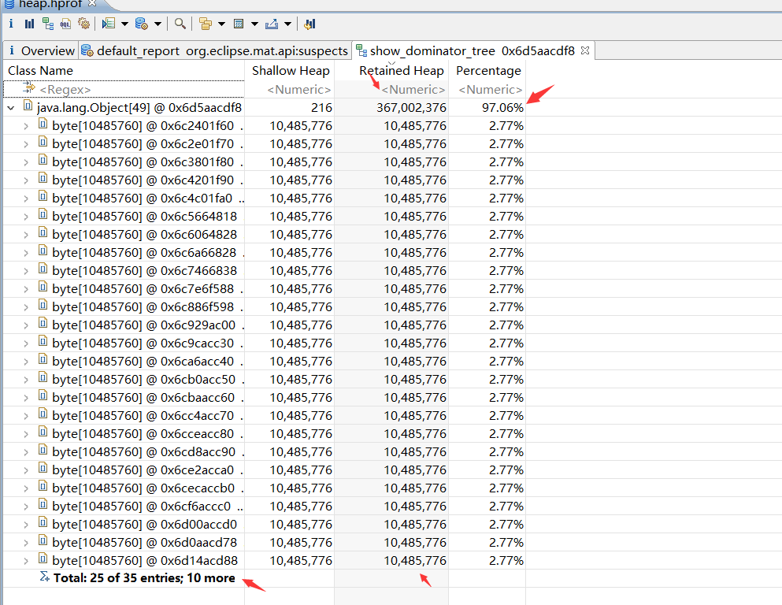

> **分析：共有35个byte[]，每个byte[]占用了10M，共占用了350M，占用此时JVM内存的97.06%**


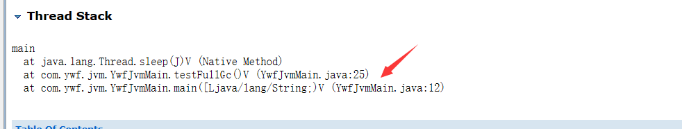

> **分析：代码出现在YwfJvmMain.java第25行**


