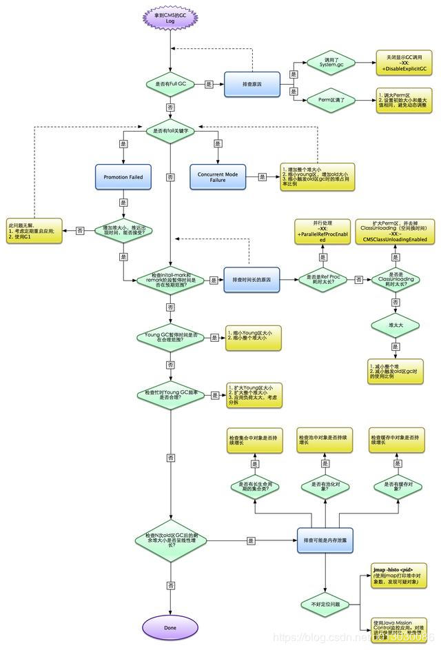
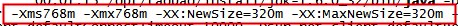
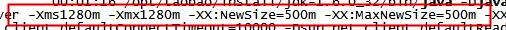

[TOC]

# 调优篇

## 一：调优步骤

### 监控GC的状态

使用各种JVM工具，查看当前日志，分析当前JVM参数设置，并且分析当前堆内存快照和gc日志，根据实际的各区域内存划分和GC执行时间，觉得是否进行优化。
举一个例子： 系统崩溃前的一些现象：

每次垃圾回收的时间越来越长，由之前的10ms延长到50ms左右，FullGC的时间也有之前的0.5s延长到4、5s
FullGC的次数越来越多，最频繁时隔不到1分钟就进行一次FullGC
年老代的内存越来越大并且每次FullGC后年老代没有内存被释放
之后系统会无法响应新的请求，逐渐到达OutOfMemoryError的临界值，这个时候就需要分析JVM内存快照dump。

### 生成堆的dump文件

通过JMX的MBean生成当前的堆（Heap）信息，大小为一个3G（整个堆的大小）的hprof文件，如果没有启动JMX可以通过Java的jmap命令来生成该文件。 

### 分析dump文件

打开这个3G的堆信息文件，显然一般的Window系统没有这么大的内存，必须借助高配置的Linux，几种工具打开该文件：	Visual VM
、IBM HeapAnalyzer、JDK 自带的Hprof工具、Mat(Eclipse专门的静态内存分析工具)推荐使用。
 注：文件太大，建议使用Eclipse专门的静态内存分析工具Mat打开分析。

### 分析结果，判断是否需要优化

如果各项参数设置合理，系统没有超时日志出现，GC频率不高，GC耗时不高，那么没有必要进行GC优化，如果GC时间超过1-3秒，或者频繁GC，则必须优化。
　　 注：如果满足下面的指标，则一般不需要进行GC：

Minor GC执行时间不到50ms；
Minor GC执行不频繁，约10秒一次；
Full GC执行时间不到1s；
Full GC执行频率不算频繁，不低于10分钟1次

### 调整GC类型和内存分配

如果内存分配过大或过小，或者采用的GC收集器比较慢，则应该优先调整这些参数，并且先找1台或几台机器进行beta，然后比较优化过的机器和没有优化的机器的性能对比，并有针对性的做出最后选择 。

### 不断分析和调整

 通过不断的试验和试错，分析并找到最合适的参数，如果找到了最合适的参数，则将这些参数应用到所有服务器。
 

### 调优实例

实例1：

部分开发测试机器出现异常：java.lang.OutOfMemoryError: GC overhead limit exceeded，这个异常代表：

GC为了释放很小的空间却耗费了太多的时间，其原因一般有两个：1，堆太小，2，有死循环或大对象；

笔者首先排除了第2个原因，因为这个应用同时是在线上运行的，如果有问题，早就挂了。所以怀疑是这台机器中堆设置太小；

使用ps -ef |grep "java"查看，发现：

   

该应用的堆区设置只有768m，而机器内存有2g，机器上只跑这一个java应用，没有其他需要占用内存的地方。另外，这个应用比较大，需要占用的内存也比较多；

通过上面的情况判断，只需要改变堆中各区域的大小设置即可，于是改成下面的情况：

   

跟踪运行情况发现，相关异常没有再出现；

 

实例2：

一个服务系统，经常出现卡顿，分析原因，发现Full GC时间太长：

jstat -gcutil:

S0     S1    E     O       P        YGC YGCT FGC FGCT  GCT

12.16 0.00 5.18 63.78 20.32  54   2.047 5     6.946  8.993 

分析上面的数据，发现Young GC执行了54次，耗时2.047秒，每次Young GC耗时37ms，在正常范围，而Full GC执行了5次，耗时6.946秒，每次平均1.389s，数据显示出来的问题是：Full GC耗时较长，分析该系统的是指发现，NewRatio=9，也就是说，新生代和老生代大小之比为1:9，这就是问题的原因：

1，新生代太小，导致对象提前进入老年代，触发老年代发生Full GC；

2，老年代较大，进行Full GC时耗时较大；

优化的方法是调整NewRatio的值，调整到4，发现Full GC没有再发生，只有Young GC在执行。这就是把对象控制在新生代就清理掉，没有进入老年代（这种做法对一些应用是很有用的，但并不是对所有应用都要这么做）

 

实例3：

一应用在性能测试过程中，发现内存占用率很高，Full GC频繁，使用sudo -u admin -H  jmap -dump:format=b,file=文件名.hprof pid 来dump内存，生成dump文件，并使用Eclipse下的mat差距进行分析，发现：

  

从图中可以看出，这个线程存在问题，队列LinkedBlockingQueue所引用的大量对象并未释放，导致整个线程占用内存高达378m，此时通知开发人员进行代码优化，将相关对象释放掉即可

## 二：JVM调优参数参考

针对JVM堆的设置，一般可以通过-Xms -Xmx限定其最小、最大值，为了防止垃圾收集器在最小、最大之间收缩堆而产生额外的时间，通常把最大、最小设置为相同的值;
年轻代和年老代将根据默认的比例（1：2）分配堆内存， 可以通过调整二者之间的比率NewRadio来调整二者之间的大小，也可以针对回收代。比如年轻代，通过 -XX:newSize -XX:MaxNewSize来设置其绝对大小。同样，为了防止年轻代的堆收缩，我们通常会把-XX:newSize -XX:MaxNewSize设置为同样大小。

**年轻代和年老代设置多大才算合理**
更大的年轻代必然导致更小的年老代，大的年轻代会延长普通GC的周期，但会增加每次GC的耗时；小的年老代会导致更频繁的Full GC

更小的年轻代必然导致更大年老代，小的年轻代会导致普通GC很频繁，但每次的GC时间会更短；大的年老代会减少Full GC的频率

**如何选择应该依赖应用程序对象生命周期的分布情况** 

如果应用存在大量的临时对象，应该选择更大的年轻代；如果存在相对较多的持久对象，年老代应该适当增大。但很多应用都没有这样明显的特性。
　　 在抉择时应该根据以下两点：
	（1）本着Full GC尽量少的原则，让年老代尽量缓存常用对象，JVM的默认比例1：2也是这个道理 。
    （2）通过观察应用一段时间，看其他在峰值时年老代会占多少内存，在不影响Full GC的前提下，根据实际情况加大年轻代，比如可以把比例控制在1：1。但应该给年老代至少预留1/3的增长空间。
在配置较好的机器上（比如多核、大内存），可以为年老代选择并行收集算法： -XX:+UseParallelOldGC 。
线程堆栈的设置：每个线程默认会开启1M的堆栈，用于存放栈帧、调用参数、局部变量等，对大多数应用而言这个默认值太了，一般256K就足用。
　　 理论上，在内存不变的情况下，减少每个线程的堆栈，可以产生更多的线程，但这实际上还受限于操作系统。

## 三：堆大小设置

JVM 中最大堆大小有三方面限制：相关操作系统的数据模型（32-bt还是64-bit）限制；系统的可用虚拟内存限制；系统的可用物理内存限制。

**32位系统下，一般限制在1.5G~2G；64为操作系统对内存无限制。**

我在Windows Server 2003 系统，3.5G物理内存，JDK5.0下测试，最大可设置为1478m。

典型设置：

- java -Xmx3550m -Xms3550m -Xmn2g -Xss128k
  -Xmx3550m：设置JVM最大可用内存为3550M。
  -Xms3550m：设置JVM促使内存为3550m。此值可以设置与-Xmx相同，以避免每次垃圾回收完成后JVM重新分配内存。
  -Xmn2g：设置年轻代大小为2G。整个JVM内存大小=年轻代大小 + 年老代大小 + 持久代大小。持久代一般固定大小为64m，所以增大年轻代后，将会减小年老代大小。此值对系统性能影响较大，Sun官方推荐配置为整个堆的3/8。
  -Xss128k：设置每个线程的堆栈大小。JDK5.0以后每个线程堆栈大小为1M，以前每个线程堆栈大小为256K。更具应用的线程所需内存大小进行调整。在相同物理内存下，减小这个值能生成更多的线程。但是操作系统对一个进程内的线程数还是有限制的，不能无限生成，经验值在3000~5000左右。
- java -Xmx3550m -Xms3550m -Xss128k -XX:NewRatio=4 -XX:SurvivorRatio=4 -XX:MaxPermSize=16m -XX:MaxTenuringThreshold=0
  -XX:NewRatio=4:设置年轻代（包括Eden和两个Survivor区）与年老代的比值（除去持久代）。设置为4，则年轻代与年老代所占比值为1：4，年轻代占整个堆栈的1/5
  -XX:SurvivorRatio=4：设置年轻代中Eden区与Survivor区的大小比值。设置为4，则两个Survivor区与一个Eden区的比值为2:4，一个Survivor区占整个年轻代的1/6
  -XX:MaxPermSize=16m:设置持久代大小为16m。
  -XX:MaxTenuringThreshold=0：设置垃圾最大年龄。如果设置为0的话，则年轻代对象不经过Survivor区，直接进入年老代。对于年老代比较多的应用，可以提高效率。如果将此值设置为一个较大值，则年轻代对象会在Survivor区进行多次复制，这样可以增加对象再年轻代的存活时间，增加在年轻代即被回收的概论。

## 四：回收器选择

JVM给了三种选择：串行收集器、并行收集器、并发收集器，但是串行收集器只适用于小数据量的情况，所以这里的选择主要针对并行收集器和并发收集器。默认情况下，JDK5.0以前都是使用串行收集器，如果想使用其他收集器需要在启动时加入相应参数。JDK5.0以后，JVM会根据当前系统配置进行判断。

### 吞吐量优先的并行收集器

如上文所述，并行收集器主要以到达一定的吞吐量为目标，适用于科学技术和后台处理等。

典型配置：

- java -Xmx3800m -Xms3800m -Xmn2g -Xss128k -XX:+UseParallelGC -XX:ParallelGCThreads=20
  -XX:+UseParallelGC：选择垃圾收集器为并行收集器。此配置仅对年轻代有效。即上述配置下，年轻代使用并发收集，而年老代仍旧使用串行收集。
  -XX:ParallelGCThreads=20：配置并行收集器的线程数，即：同时多少个线程一起进行垃圾回收。此值最好配置与处理器数目相等。
- java -Xmx3550m -Xms3550m -Xmn2g -Xss128k -XX:+UseParallelGC -XX:ParallelGCThreads=20 -XX:+UseParallelOldGC
  -XX:+UseParallelOldGC：配置年老代垃圾收集方式为并行收集。JDK6.0支持对年老代并行收集。
- java -Xmx3550m -Xms3550m -Xmn2g -Xss128k -XX:+UseParallelGC -XX:MaxGCPauseMillis=100
  -XX:MaxGCPauseMillis=100:设置每次年轻代垃圾回收的最长时间，如果无法满足此时间，JVM会自动调整年轻代大小，以满足此值。
- java -Xmx3550m -Xms3550m -Xmn2g -Xss128k -XX:+UseParallelGC -XX:MaxGCPauseMillis=100 -XX:+UseAdaptiveSizePolicy
  -XX:+UseAdaptiveSizePolicy：设置此选项后，并行收集器会自动选择年轻代区大小和相应的Survivor区比例，以达到目标系统规定的最低相应时间或者收集频率等，此值建议使用并行收集器时，一直打开。

### 响应时间优先的并发收集器

如上文所述，并发收集器主要是保证系统的响应时间，减少垃圾收集时的停顿时间。适用于应用服务器、电信领域等。

典型配置：

- java -Xmx3550m -Xms3550m -Xmn2g -Xss128k -XX:ParallelGCThreads=20 -XX:+UseConcMarkSweepGC -XX:+UseParNewGC
  -XX:+UseConcMarkSweepGC：设置年老代为并发收集。测试中配置这个以后，-XX:NewRatio=4的配置失效了，原因不明。所以，此时年轻代大小最好用-Xmn设置。
  -XX:+UseParNewGC:设置年轻代为并行收集。可与CMS收集同时使用。JDK5.0以上，JVM会根据系统配置自行设置，所以无需再设置此值。
- java -Xmx3550m -Xms3550m -Xmn2g -Xss128k -XX:+UseConcMarkSweepGC -XX:CMSFullGCsBeforeCompaction=5 -XX:+UseCMSCompactAtFullCollection
  -XX:CMSFullGCsBeforeCompaction：由于并发收集器不对内存空间进行压缩、整理，所以运行一段时间以后会产生“碎片”，使得运行效率降低。此值设置运行多少次GC以后对内存空间进行压缩、整理。
  -XX:+UseCMSCompactAtFullCollection：打开对年老代的压缩。可能会影响性能，但是可以消除碎片

1. 辅助信息

   JVM提供了大量命令行参数，打印信息，供调试使用。主要有以下一些：

   - -XX:+PrintGC

     输出形式：[GC 118250K->113543K(130112K), 0.0094143 secs]

     ​        [Full GC 121376K->10414K(130112K), 0.0650971 secs]

   - -XX:+PrintGCDetails

     输出形式：[GC [DefNew: 8614K->781K(9088K), 0.0123035 secs] 118250K->113543K(130112K), 0.0124633 secs]

     ​        [GC [DefNew: 8614K->8614K(9088K), 0.0000665 secs][Tenured: 112761K->10414K(121024K), 0.0433488 secs] 121376K->10414K(130112K), 0.0436268 secs]

   - -XX:+PrintGCTimeStamps -XX:+PrintGC：PrintGCTimeStamps可与上面两个混合使用
     输出形式：11.851: [GC 98328K->93620K(130112K), 0.0082960 secs]

   - -XX:+PrintGCApplicationConcurrentTime:打印每次垃圾回收前，程序未中断的执行时间。可与上面混合使用
     输出形式：Application time: 0.5291524 seconds

   - -XX:+PrintGCApplicationStoppedTime：打印垃圾回收期间程序暂停的时间。可与上面混合使用
     输出形式：Total time for which application threads were stopped: 0.0468229 seconds

   - -XX:PrintHeapAtGC:打印GC前后的详细堆栈信息
     输出形式：
     34.702: [GC {Heap before gc invocations=7:
      def new generation  total 55296K, used 52568K [0x1ebd0000, 0x227d0000, 0x227d0000)
     eden space 49152K, 99% used [0x1ebd0000, 0x21bce430, 0x21bd0000)
     from space 6144K, 55% used [0x221d0000, 0x22527e10, 0x227d0000)
      to  space 6144K,  0% used [0x21bd0000, 0x21bd0000, 0x221d0000)
      tenured generation  total 69632K, used 2696K [0x227d0000, 0x26bd0000, 0x26bd0000)
     the space 69632K,  3% used [0x227d0000, 0x22a720f8, 0x22a72200, 0x26bd0000)
      compacting perm gen total 8192K, used 2898K [0x26bd0000, 0x273d0000, 0x2abd0000)
       the space 8192K, 35% used [0x26bd0000, 0x26ea4ba8, 0x26ea4c00, 0x273d0000)
       ro space 8192K, 66% used [0x2abd0000, 0x2b12bcc0, 0x2b12be00, 0x2b3d0000)
       rw space 12288K, 46% used [0x2b3d0000, 0x2b972060, 0x2b972200, 0x2bfd0000)
     34.735: [DefNew: 52568K->3433K(55296K), 0.0072126 secs] 55264K->6615K(124928K)Heap after gc invocations=8:
      def new generation  total 55296K, used 3433K [0x1ebd0000, 0x227d0000, 0x227d0000)
     eden space 49152K,  0% used [0x1ebd0000, 0x1ebd0000, 0x21bd0000)
      from space 6144K, 55% used [0x21bd0000, 0x21f2a5e8, 0x221d0000)
      to  space 6144K,  0% used [0x221d0000, 0x221d0000, 0x227d0000)
      tenured generation  total 69632K, used 3182K [0x227d0000, 0x26bd0000, 0x26bd0000)
     the space 69632K,  4% used [0x227d0000, 0x22aeb958, 0x22aeba00, 0x26bd0000)
      compacting perm gen total 8192K, used 2898K [0x26bd0000, 0x273d0000, 0x2abd0000)
       the space 8192K, 35% used [0x26bd0000, 0x26ea4ba8, 0x26ea4c00, 0x273d0000)
       ro space 8192K, 66% used [0x2abd0000, 0x2b12bcc0, 0x2b12be00, 0x2b3d0000)
       rw space 12288K, 46% used [0x2b3d0000, 0x2b972060, 0x2b972200, 0x2bfd0000)
     }
     , 0.0757599 secs]

   - -Xloggc:filename:与上面几个配合使用，把相关日志信息记录到文件以便分析。

2. 常见配置汇总

   1. 堆设置
      - -Xms:初始堆大小
      - -Xmx:最大堆大小
      - -XX:NewSize=n:设置年轻代大小
      - -XX:NewRatio=n:设置年轻代和年老代的比值。如:为3，表示年轻代与年老代比值为1：3，年轻代占整个年轻代年老代和的1/4
      - -XX:SurvivorRatio=n:年轻代中Eden区与两个Survivor区的比值。注意Survivor区有两个。如：3，表示Eden：Survivor=3：2，一个Survivor区占整个年轻代的1/5
      - -XX:MaxPermSize=n:设置持久代大小
   2. 收集器设置
      - -XX:+UseSerialGC:设置串行收集器
      - -XX:+UseParallelGC:设置并行收集器
      - -XX:+UseParalledlOldGC:设置并行年老代收集器
      - -XX:+UseConcMarkSweepGC:设置并发收集器
   3. 垃圾回收统计信息
      - -XX:+PrintGC
      - -XX:+PrintGCDetails
      - -XX:+PrintGCTimeStamps
      - -Xloggc:filename
   4. 并行收集器设置
      - -XX:ParallelGCThreads=n:设置并行收集器收集时使用的CPU数。并行收集线程数。
      - -XX:MaxGCPauseMillis=n:设置并行收集最大暂停时间
      - -XX:GCTimeRatio=n:设置垃圾回收时间占程序运行时间的百分比。公式为1/(1+n)
   5. 并发收集器设置
      - -XX:+CMSIncrementalMode:设置为增量模式。适用于单CPU情况。
      - -XX:ParallelGCThreads=n:设置并发收集器年轻代收集方式为并行收集时，使用的CPU数。并行收集线程数。

### 回收器搭配方案

  

#### 1）年轻代收集器

**Serial收集器：** Serial收集器是在client模式下默认的新生代收集器，其收集效率大约是100M左右的内存需要几十到100多毫秒；在client模式下，收集桌面应用的内存垃圾，基本上不影响用户体验。所以，一般的Java桌面应用中，直接使用Serial收集器（不需要配置参数，用默认即可）。

**ParNew收集器：**Serial收集器的多线程版本，这种收集器默认开通的线程数与CPU数量相同，-XX:ParallelGCThreads可以用来设置开通的线程数。
可以与CMS收集器配合使用，事实上用-XX:+UseConcMarkSweepGC选择使用CMS收集器时，默认使用的就是ParNew收集器，所以不需要额外设置-XX:+UseParNewGC，设置了也不会冲突，因为会将ParNew+Serial Old作为一个备选方案；
如果单独使用-XX:+UseParNewGC参数，则选择的是ParNew+Serial Old收集器组合收集器。
一般情况下，在server模式下，如果选择CMS收集器，则优先选择ParNew收集器。

**Parallel Scavenge收集器：**关注的是吞吐量（关于吞吐量的含义见上一篇博客），可以这么理解，关注吞吐量，意味着强调任务更快的完成，而如CMS等关注停顿时间短的收集器，强调的是用户交互体验。
在需要关注吞吐量的场合，比如数据运算服务器等，就可以使用Parallel Scavenge收集器。

#### 2）老年代收集器

**Serial Old收集器：**在1.5版本及以前可以与 Parallel Scavenge结合使用（事实上，也是当时Parallel Scavenge唯一能用的版本），另外就是在使用CMS收集器时的备用方案，发生 Concurrent Mode Failure时使用。
如果是单独使用，Serial Old一般用在client模式中。

**Parallel Old收集器：**在1.6版本之后，与 Parallel Scavenge结合使用，以更好的贯彻吞吐量优先的思想，如果是关注吞吐量的服务器，建议使用Parallel Scavenge + Parallel Old 收集器。

**CMS收集器：**这是当前阶段使用很广的一种收集器，国内很多大的互联网公司线上服务器都使用这种垃圾收集器（http://blog.csdn.net/wisgood/article/details/17067203），笔者公司的收集器也是这种，CMS收集器以获取最短回收停顿时间为目标，非常适合对用户响应比较高的B/S架构服务器。

 **CMSIncrementalMode：** CMS收集器变种，属增量式垃圾收集器，在并发标记和并发清理时交替运行垃圾收集器和用户线程。

 **G1 收集器：**面向服务器端应用的垃圾收集器，计划未来替代CMS收集器。

- 一般来说，如果是Java桌面应用，建议采用Serial+Serial Old收集器组合，即：-XX:+UseSerialGC（-client下的默认参数）
- 在开发/测试环境，可以采用默认参数，即采用Parallel Scavenge+Serial Old收集器组合，即：-XX:+UseParallelGC（-server下的默认参数）
- 在线上运算优先的环境，建议采用Parallel Scavenge+Serial Old收集器组合，即：-XX:+UseParallelGC
- 在线上服务响应优先的环境，建议采用ParNew+CMS+Serial Old收集器组合，即：-XX:+UseConcMarkSweepGC

另外在选择了垃圾收集器组合之后，还要配置一些辅助参数，以保证收集器可以更好的工作。关于这些参数，请在http://kenwublog.com/docs/java6-jvm-options-chinese-edition.htm中查询其意义和用法，如：

- 选用了ParNew收集器，你可能需要配置4个参数： -XX:SurvivorRatio, -XX:PretenureSizeThreshold, -XX:+HandlePromotionFailure,-XX:MaxTenuringThreshold；
- 选用了 Parallel Scavenge收集器，你可能需要配置3个参数： -XX:MaxGCPauseMillis，-XX:GCTimeRatio， -XX:+UseAdaptiveSizePolicy ；
- 选用了CMS收集器，你可能需要配置3个参数： -XX:CMSInitiatingOccupancyFraction， -XX:+UseCMSCompactAtFullCollection, -XX:CMSFullGCsBeforeCompaction；

