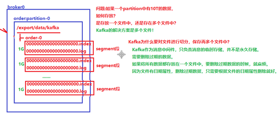
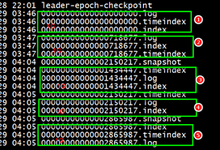
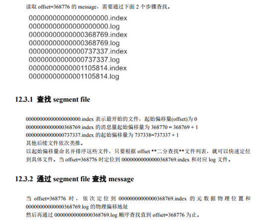
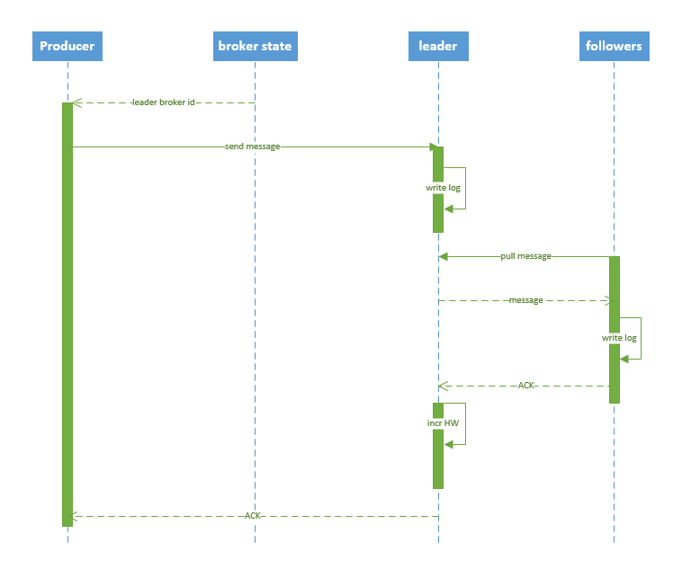

### 消息队列的优缺点

| 优点 | 缺点       |
| ---- | ---------- |
| 异步 | 复杂性变大 |
| 解耦 | 一致性     |
| 削峰 |            |


### kafka如何保证消息不丢失

生产者端：

​		同步：当生产者发数据到kafka的partition leader，partition 所有follow都同步到数据之后，返回ack确认才确认该消息成功生产。

​		异步：异步机制是把消息缓存到缓冲区，再批量发送给kafka。

​				方法一：当缓冲区满了，就堵塞等待缓冲区清空。

​				方法二：设置消息回调，如果失败，就记录失败日志，后面重发。

消费者端：

​		关闭自动提交功能，只有消息成功消费才提交。	


### kafka如何保证消息不重复

​		这个只考虑消费端进行消息去重，可以使用redis或者去重表去重。


### kafka如何保证消息有顺序

​		kafka只能保证每个partiton内部是有序的，而生产消息到kafka中，如果指定了消息的key，那么kafka会根据key的hashcode去取模得到要生产到哪个partition。我们可以设置同一个业务逻辑的数据为同一个key值。但是现在为止只是保证了到partition是有序的。在消费端，我们要确保针对同一个partion是单线程消费，才能保证消息的顺序性。


### AR和ISR

AR是(assigned replicas)指partition中的所有副本。

ISR(in sync replicas): 跟得上leader同步的副本。

OSR(out sync replicas) 跟不上leader同步的副本。

AR = ISR + OSR


### kafka数据存储

  


segment段中有两个核心的文件一个是log,一个是index。 当log文件等于1G时，新的会写入到下一个segment中。

 通过下图中的数据，可以看到一个segment段差不多会存储70万条数据。




### kafka查询机制

  


### kafka producer发布消息

#### 写入方式

```
producer把消息push到broker.broker将消息append到partition。属于顺序写入磁盘。
```


#### 消息路由方式

```
1、指定partition，则push到指定partition。
2、未指定partition,指定key,根据key进行hash选出一个partition。
3、未指定partition和key,使用轮询选出partition。
```


#### 写入流程

  

流程说明：

```
1、producer 先从zookeeper获取partition leader节点信息。
2、producer 发送消息到partition leader。
3、leader将消息写入log。
4、followers pull消息，写入本地log，并返回ack。
5、leader修改highwater和offset,并返回ack给producer。
```
