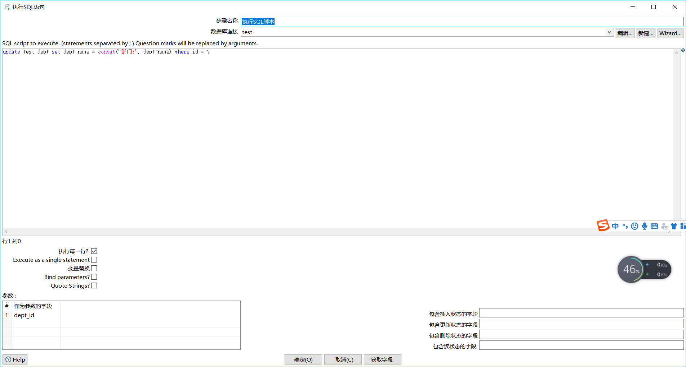

<!-- TOC -->

- [映射控件和脚本控件](#映射控件和脚本控件)
    - [映射控件](#映射控件)
        - [映射](#映射)
    - [脚本控件](#脚本控件)
        - [javascript代码](#javascript代码)
        - [java代码](#java代码)
        - [执行SQL脚本](#执行sql脚本)

<!-- /TOC -->

# 映射控件和脚本控件

## 映射控件

### 映射

自转换：

## 脚本控件

### javascript代码

> 使用javascript语言对数据流进行操作。

注意事项：分兼容模式和非兼容模式。

| 方法     | 兼容模式                      | 不兼容模式        |
| -------- | ----------------------------- | ----------------- |
| 获取字段 | myVar = FieldName.getString() | myVar = FieldName |
| 设置字段 | FieldName.setValue(myVar)     | FieldName = myVar |

案例：生成1000条记录，日期从2011年01月01日开始增加。

### java代码

> 使用java进行数据流的操作, **main函数对应processRow()**

案例：从Excel读取数据，对年龄字段前面拼接name：。

### 执行SQL脚本

> 执行SQL脚本用来执行一个**update语句**，用来**更新记录**

案例：读取test_user的dept_id，对部门名称前加 **部门：**

