<!-- TOC -->

- [转换控件和应用控件](#转换控件和应用控件)
    - [转换控件](#转换控件)
        - [Concat fileds](#concat-fileds)
        - [值映射](#值映射)
        - [增加常量](#增加常量)
        - [增加序列](#增加序列)
        - [字段选择](#字段选择)
        - [计算器](#计算器)
        - [字符串剪切、字符串替换、字符串操作](#字符串剪切字符串替换字符串操作)
        - [去除重复记录、排序记录](#去除重复记录排序记录)
        - [唯一行(哈希值)](#唯一行哈希值)
        - [拆分字段](#拆分字段)
    - [应用控件](#应用控件)
        - [替换NULL值](#替换null值)
        - [写日志](#写日志)

<!-- /TOC -->
# 转换控件和应用控件

## 转换控件

### Concat fileds

> Concat fields就是**多个字段连接成一个新字段**

- 示例：读取Excel的First Name和LastName 连接成新字段 name, 并输出到Excel。

1. 添加Excel输入控件、Concat fields控件和Excel输出控件。
2. 配置控件信息，Concat控件配置如下：

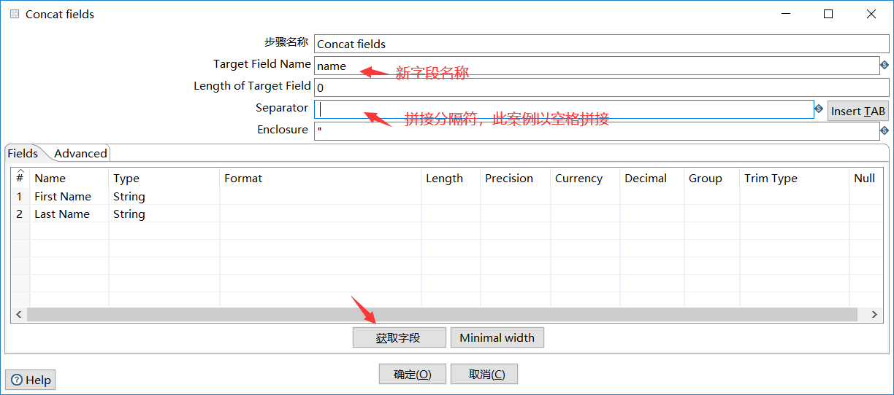

3、执行，并查看执行结果:

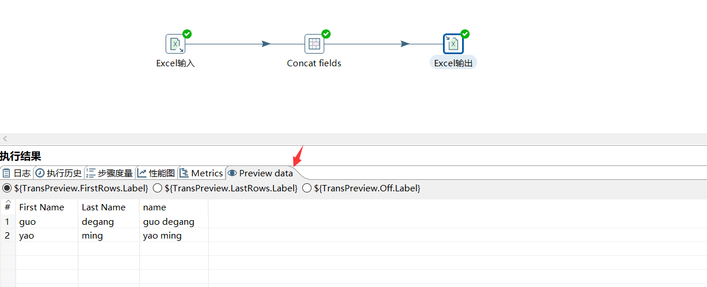

### 值映射

> 值映射就是把字段的指映射成其他值。

案例：在很多系统中，对性别的定义不同。

如： f：男   m：女

数据仓库统一 female代表男，male代表女。

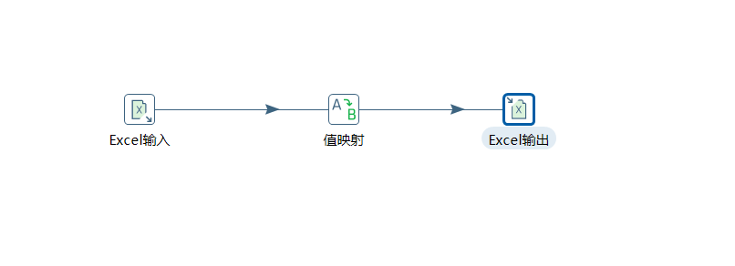

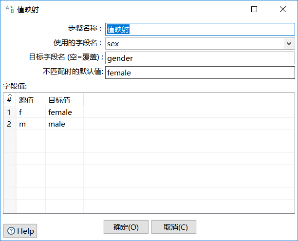

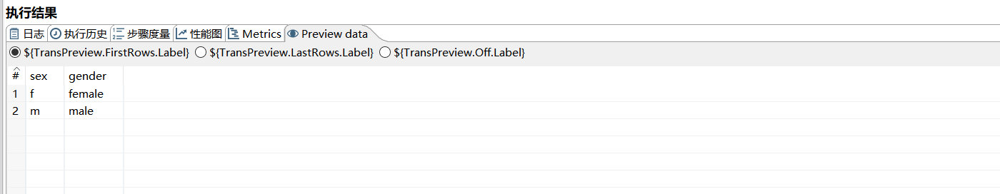

### 增加常量

> 增加常量就是在**本身的数据流**里面**添加一列数据**，该列的数据都是**相同的值**。

案例：从Excel读取数据，添加一列新列为version,都为1.0。

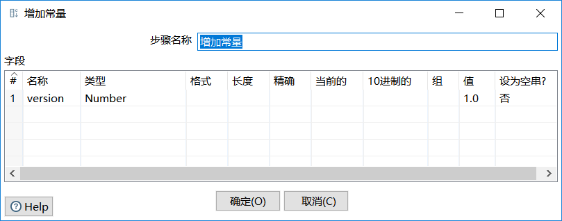

运行结果：

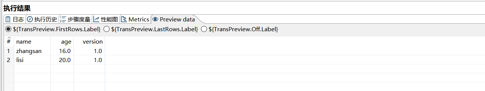

### 增加序列

> 增加序列就是给数据流添加一个序列字段。

案例：从Excel读取数据，并添加id序列，其中id序列从1开始递增，step为1。

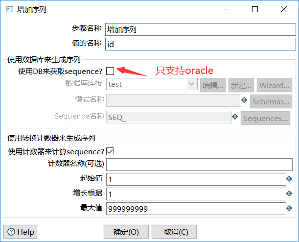

执行结果：

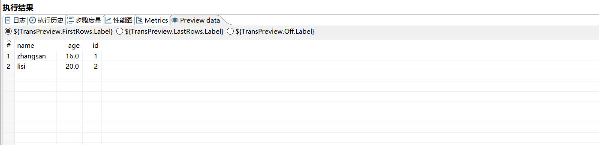

### 字段选择

> 字段选择是指从数据流中**获取字段，修改名称，修改字段类型**或者**移除不需要的字段**。

案例：从Excel读取数据，并修改sex字改名为gender, 移除version字段。

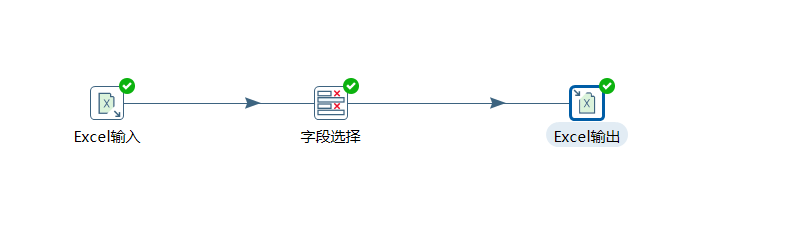

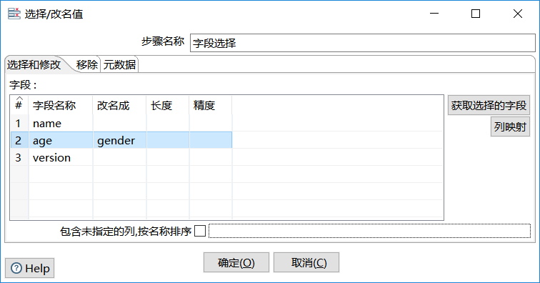

Excel输入节点数据：

Excel输出节点数据：

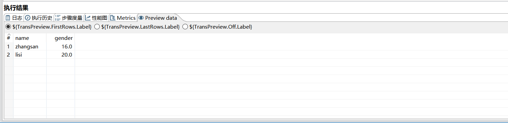

### 计算器

> 计算器是一个**函数集合来创建新的字段**，还可以设置字段是否移除（临时字段）

案例：读取Excel数据，计算员工一个月的总工时。

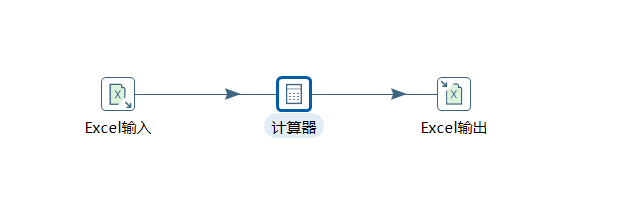

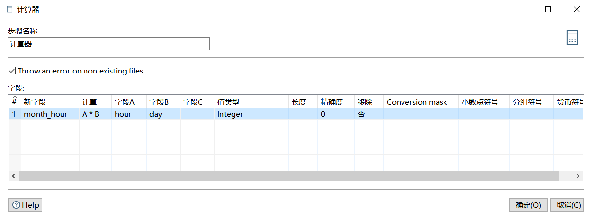

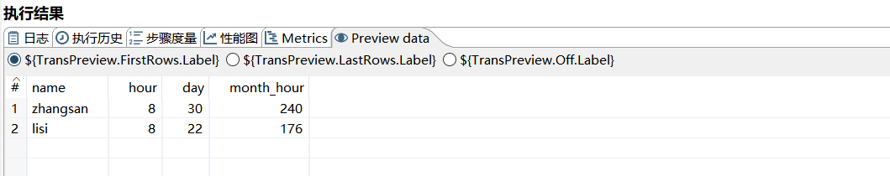

### 字符串剪切、字符串替换、字符串操作

案例：剪切字段name的首字母，，替换字段content中的world为 everyone, 去除字段content的首位空格，并转为大写。

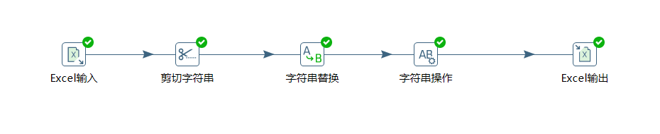

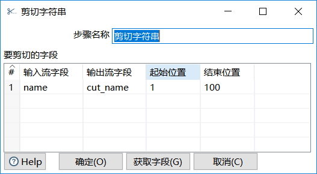

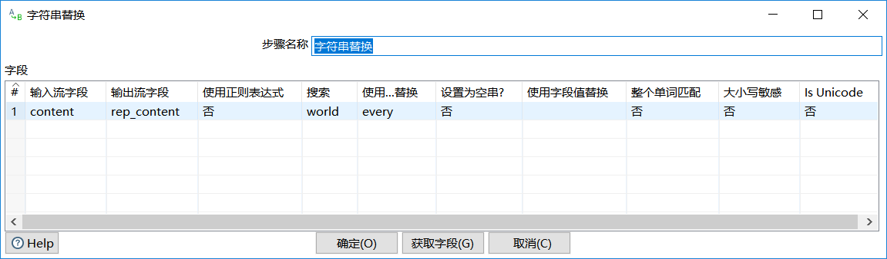

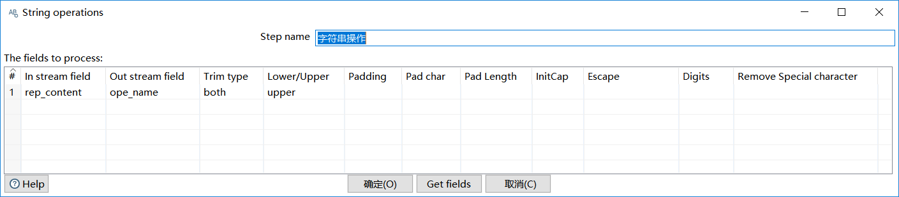

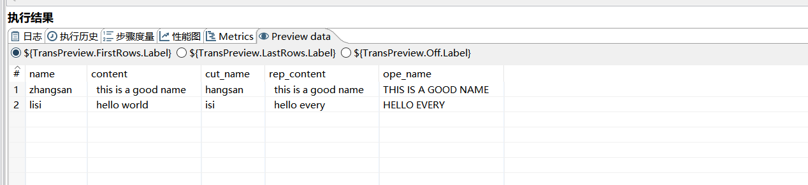

### 去除重复记录、排序记录

> 去除重复就是去除数据流中重复的数据，使用前必须先使用排序记录

案例：从Excel中获取数据，去掉重复的数据，并输出到Excel中。

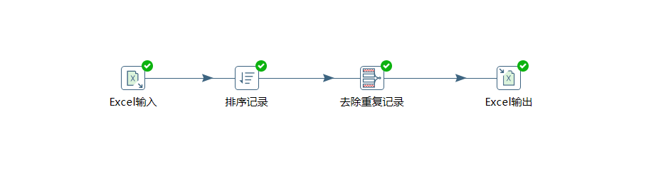

Excel输入节点数据：

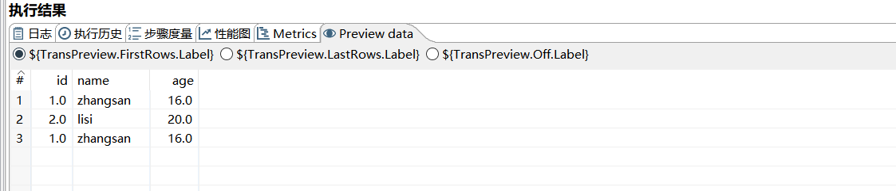

Excel输出节点数据：

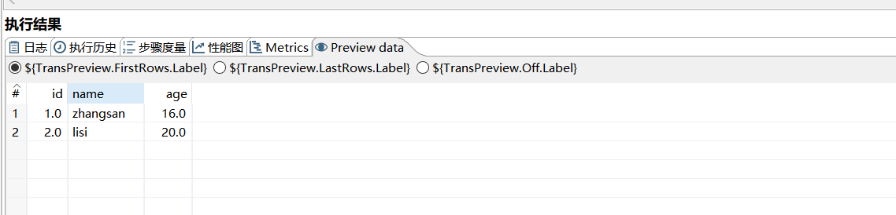

### 唯一行(哈希值)

> 原理和去除重复不一样，唯一行的原理是对**选中的字段进行哈希**取出哈希值进行比较，使用前不需要排序记录。

案例：从Excel读取数据，通过唯一行去重，输出到Excel。

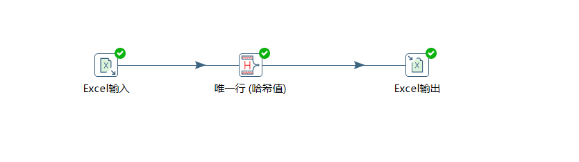

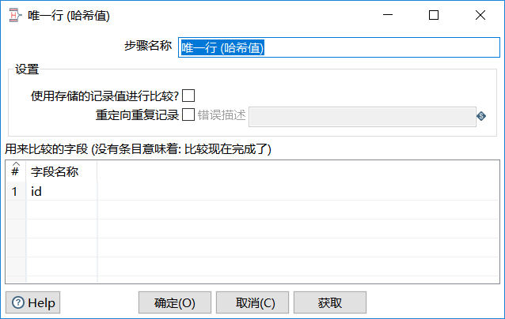

Excel输入节点数据：

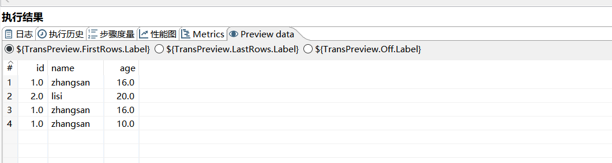

Excel输出节点数据：

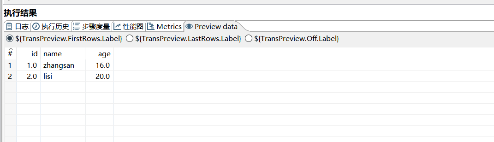

### 拆分字段

> 拆分字段就是把一个字段根据分隔符拆成多个字段，拆分字段后，原来的字段将不在。

案例：从Excel读取字段为name的字段，根据空格切分成First Name 和 Last Name字段。

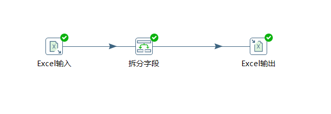

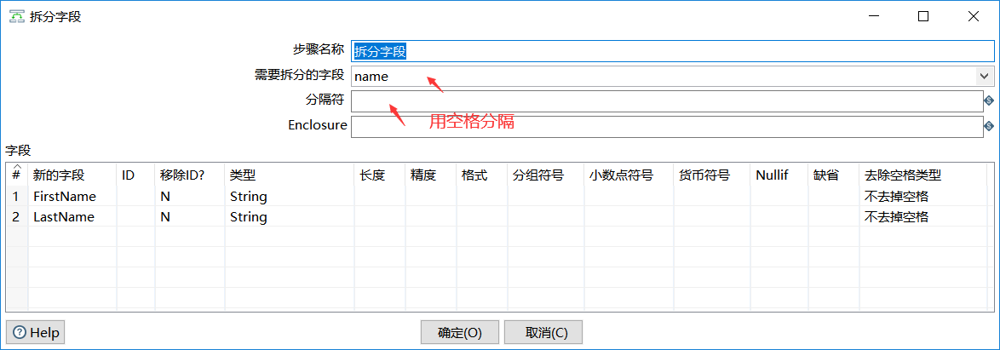

Excel输入节点数据：

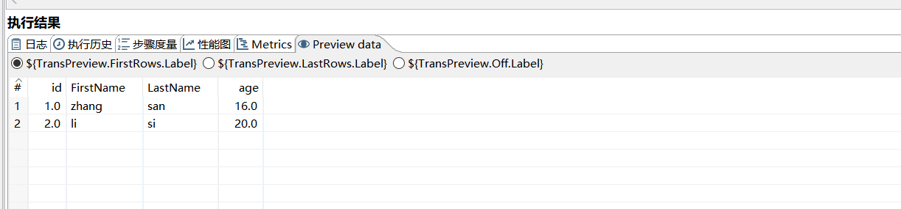

Excel输出节点数据：

## 应用控件

### 替换NULL值

> 把字段中NULL值替换成其他值

案例： 读取Excel，对sex字段为NULL的替换为female

Excel输入节点数据：

Excel输出节点数据：

### 写日志

> 写日志主要在**调试**的时候，把日志信息打印到窗口

案例：读取Excel的数据，将读取到的数据输出到控制台。

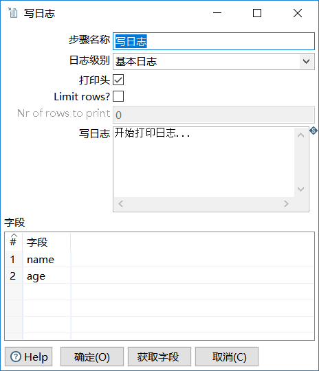

