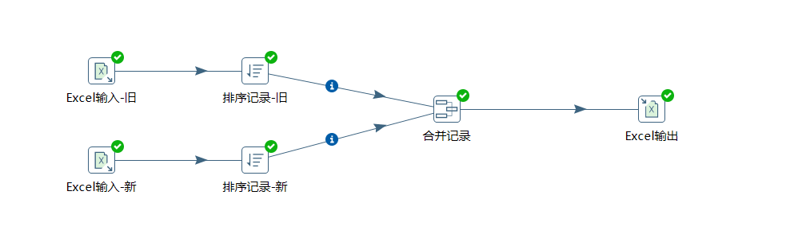
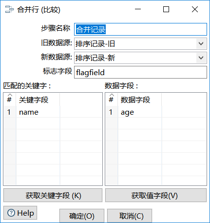
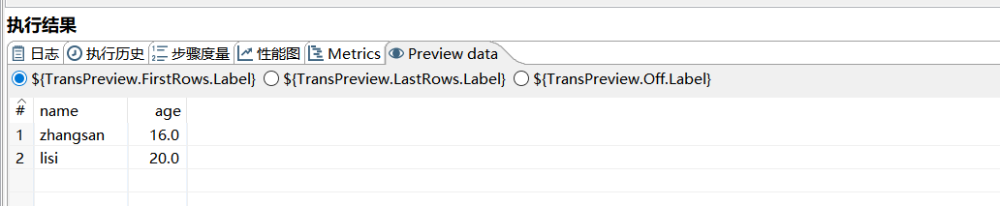
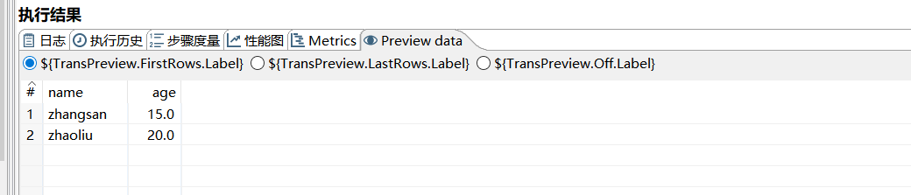
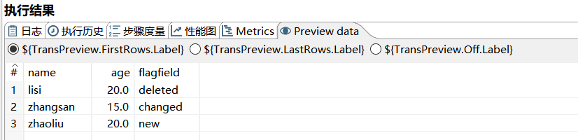
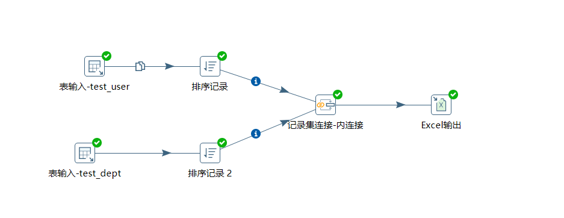
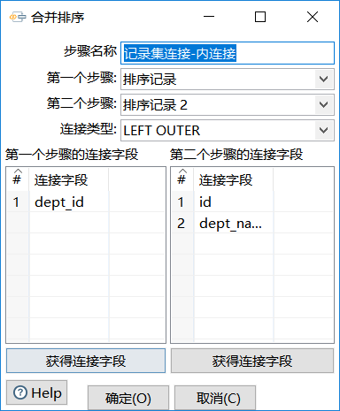
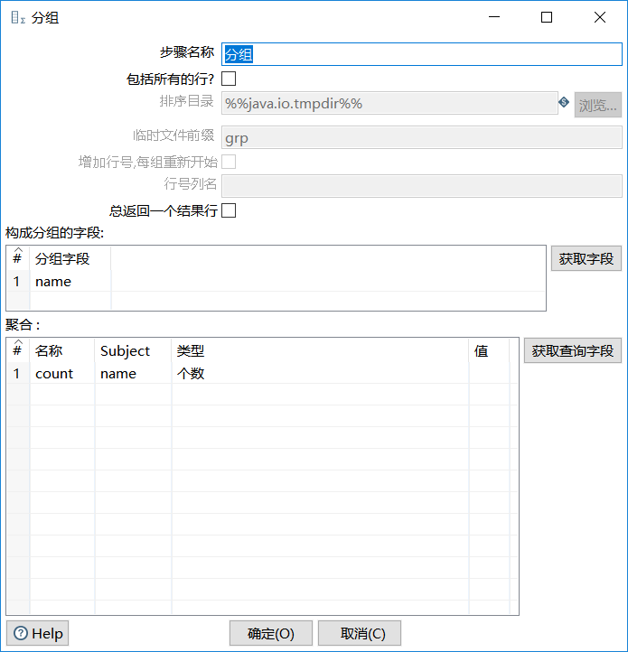

<!-- TOC -->

- [连接控件和统计控件](#连接控件和统计控件)
    - [连接控件](#连接控件)
        - [合并记录](#合并记录)
        - [记录集连接](#记录集连接)
    - [统计控件](#统计控件)
        - [分组](#分组)

<!-- /TOC -->

# 连接控件和统计控件

## 连接控件

### 合并记录

> 合并记录就是将旧数据和新数据进行合并比较。**合并记录前需先使用排序记录**

比较的结果有以下可能：

- "identical"  —  旧数据和新数据一样
- "changed"  —   数据发生了变化
- "new"   —  新数据中有，旧数据中没有
- "deleted"  —  新数据中没有，旧数据中有

案例：比较Excel-旧和Excel新，讲合并后的数据输出到Excel

旧记录：

新记录：

合并结果：

### 记录集连接

> 记录集连接就像数据库的左连接、右连接、内连接和外连接

案例：对test_user和test_dept内连接。

## 统计控件

### 分组

> 分组就是对一组或者几组数据进行分组，其余字段可以按照某种规则合并，**分组前要对数据进行排序!**

案例：按姓名进行个数统计。

