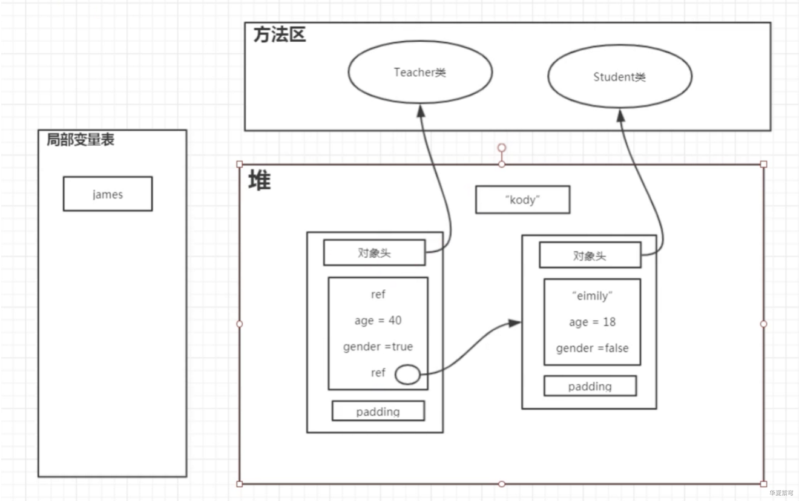
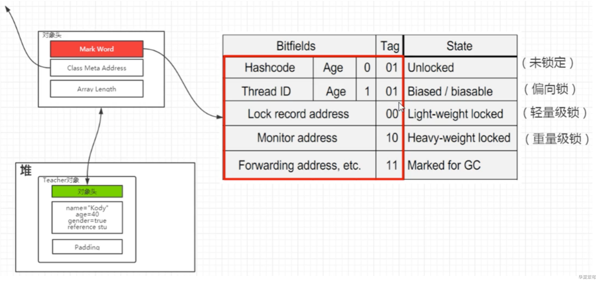
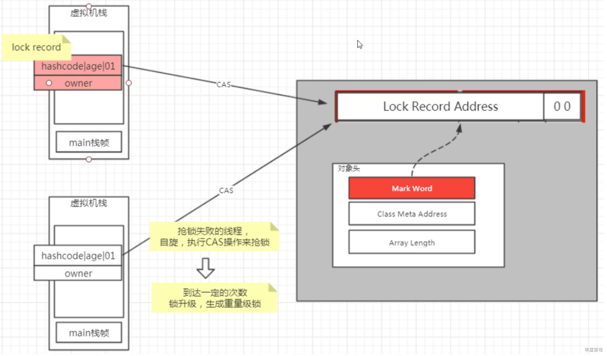
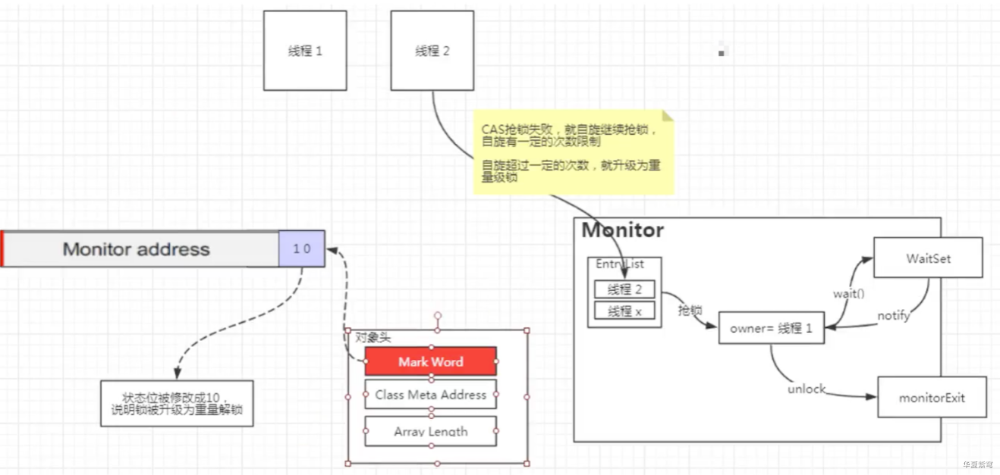
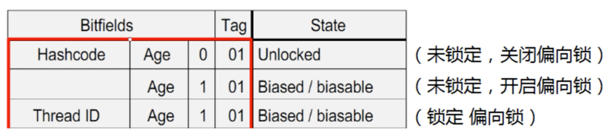
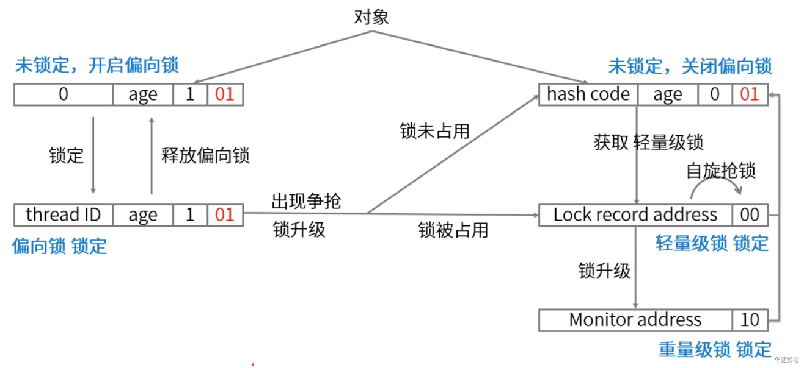

<!-- TOC -->

- [JAVA中锁的概念](#java中锁的概念)
- [同步关键字 synchronized](#同步关键字-synchronized)
  - [基本介绍](#基本介绍)
  - [特性: 可重入、独享、悲观锁。](#特性-可重入独享悲观锁)
  - [锁优化](#锁优化)
  - [Note](#note)
- [堆内存中的Java对象](#堆内存中的java对象)
  - [堆内存存储展示](#堆内存存储展示)
  - [对象头部 Mark Word](#对象头部-mark-word)
  - [轻量级锁](#轻量级锁)
  - [重量级锁](#重量级锁)
  - [偏向锁](#偏向锁)
  - [锁的升级过程](#锁的升级过程)

<!-- /TOC -->

### JAVA中锁的概念

- 自旋锁: 是指当一个线程在获取锁的时候，如果锁已经被其他线程获取，那么该线程将循环等待，然后不断地判断锁是否能够被成功获取，直到获取到锁才会退出循环。
- 乐观锁: 假如没有冲突，在修改数据时如果发现数据和之前获取的不一样，则读最新数据，修改后重试修改。
- 悲观锁: 假如会发生并发冲突，同步所有对数据的相关操作，从读数据就开始上锁。
- 独享锁(写): 给资源加上写锁，线程可以修改资源，其他线程不能再加锁；(单写)
- 共享锁(读): 给资源加上读锁后只能读不能改，其他线程也只能加读锁，不能加写锁；(多读)
- 可重入锁、不可重入锁: 现成拿到一把锁之后，可以自由进入同一把锁所同步的其他代码。

```java
// 可重入锁代码演示
public class Demo1_ReentrantTest {
    private static int i = 0;
    private final static Lock lc = new ReentrantLock(); // 可重入锁

    public static void recursive() throws InterruptedException {
        lc.lock();

        i ++;

        System.out.println("here i am...");
        Thread.sleep(1000);
        recursive();

        lc.unlock();
    }

    public static void main(String[] args) throws InterruptedException {
        recursive();
    }
}
```

- 公平锁、非公平锁: 争抢锁的顺序，如果是按先来后到，则为公平。
- 几种重要的锁实现方式: synchronized、ReentrantLock、ReentrantReadWriteLock


### 同步关键字 synchronized

#### 基本介绍

- 用于实例方法、静态方法时，隐式指定锁对象。
- 用于代码块时，显示指定锁对象。
- 锁的作用域: 对象锁、类锁、分布式锁。


#### 特性: 可重入、独享、悲观锁。

#### 锁优化

- 锁消除

- 开启锁消除的参数: -XX:+DoEscapeAnalysis -XX:+EliminateLocks)
- 单线程下才会进行优化。

```java
// JIT即时编译时，进行了锁消除(方法调用一定次数才会触发JIT编译)
public class Demo4_LockElimination {

    public void test1(Object arg) {
        // StringBuilder 线程不安全，StringBuffer 用了 synchronized，是线程安全的
        // jit 优化，消除了锁
        StringBuffer stringBuffer = new StringBuffer();
        stringBuffer.append("a");
        stringBuffer.append("b");
        stringBuffer.append("c");

        stringBuffer.append("a");
        stringBuffer.append("b");
        stringBuffer.append("c");

        stringBuffer.append("a");
        stringBuffer.append("b");
        stringBuffer.append("c");
    }

    public static void main(String[] args) {
        for (int i = 0; i < 100000; i ++) {
            new Demo4_LockElimination().test1("123");
        }
    }

}
```

- 锁粗化

- JDK做了锁粗化的优化，但我们可从代码层面优化。
- 多线程下也会进行优化。

```java
// 锁粗化(运行时 jit 编译优化)
public class Demo5_LockCoarsening {

    // 若如下代码被多次调用，触发 jit 编译，可能会被 jit 优化为如 test2 方法那样的代码
    public void test1(Object arg) {
        int i = 0;

        synchronized (this) {
            i ++;
        }

        synchronized (this) {
            i --;
        }

        // 若该步为耗时操作，可能不会进行优化
        System.out.println("dsfsadssffs");

        synchronized (this) {
            System.out.println("werkdfjskf");
        }

        synchronized (this) {
            i ++;
        }
    }

    public void test2(Object arg) {
        int i = 0;
        synchronized (this) {
            i ++;
            i --;
            System.out.println("dsfsadssffs");
            System.out.println("werkdfjskf");
            i ++;
        }
    }

}
```


#### Note

- synchronized 关键字，不仅实现同步。
- JMM 中规定，synchronized 要保证可见性(不能够被缓存)。


### 堆内存中的Java对象

#### 堆内存存储展示

```java
public class Demo5_Main {
    public static void main(String[] args) {
        int a = 1;

        Teacher kody = new Teacher();
        kody.stu = new Student();
    }
}

class Teacher {
    String name = "Kody";
    int age = 40;
    boolean gender = true;

    Student stu;
}

class Student {
    String name = "Emily";
    int age = 18;
    boolean gender = false;
}
```





#### 对象头部 Mark Word





- 默认情况下 JVM 锁会经历: 未锁定 -> 偏向锁 -> 轻量级锁 -> 重量级锁 这四个状态。
- 参考资料:

- https://www.cs.princeton.edu/picasso/mats/HotspotOverview.pdf
- https://wiki.openjdk.java.net/display/HotSpot/Synchronization
- 《深入理解Java虚拟机》


#### 轻量级锁

- 在未锁定的状态下，可以通过 CAS 来抢锁，抢到的是轻量级锁




#### 重量级锁

- 重点: owner、锁池、等待池
- 轻量级锁中的自旋有一定的次数限制，超过了次数限制，轻量级锁升级为重量级锁。




#### 偏向锁

- 在 JDK6 之后，默认已经开启了偏向锁这个优化，通过 JVM 参数 `-XX:UseBiasedLocking` 来禁用偏向锁。
- 若偏向锁开启，只有一个线程抢锁，可获取到偏向锁。




#### 锁的升级过程

