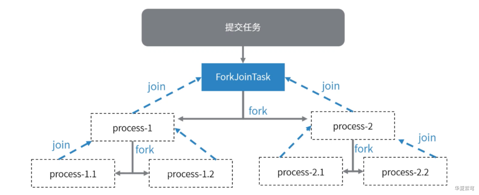

<!-- TOC -->

- [CountDownLatch](#countdownlatch)
  - [AQS 实现自己的 CountDownLatch](#aqs-实现自己的-countdownlatch)
  - [使用](#使用)
- [Semaphore](#semaphore)
  - [自定义 Semaphore](#自定义-semaphore)
  - [使用](#使用)
- [CyclicBarrier](#cyclicbarrier)
  - [定义自己的 CyclicBarrier](#定义自己的-cyclicbarrier)
  - [CyclicBarrier 测试](#cyclicbarrier-测试)
- [FutureTask](#futuretask)
  - [创建自己的 FutureTask](#创建自己的-futuretask)
  - [FutureTask 测试](#futuretask-测试)
- [fork/join 并发处理框架](#forkjoin-并发处理框架)
  - [使用线程池实现一个任务拆分](#使用线程池实现一个任务拆分)
  - [使用场景](#使用场景)
  - [意图梳理](#意图梳理)
  - [使用 fork/join 进行业务拆分](#使用-forkjoin-进行业务拆分)

<!-- /TOC -->

### CountDownLatch

#### AQS 实现自己的 CountDownLatch

```java
public class MyCountDownLatch {

    private Sync sync;

    public MyCountDownLatch(int count) {
        sync = new Sync(count);
    }

    public void await() {
        sync.acquireShared(1);
    }

    public void countDown() {
        sync.releaseShared(1);
    }

    class Sync extends AbstractQueuedSynchronizer {
        public Sync(int count) {
            setState(count);
        }

        @Override
        protected int tryAcquireShared(int arg) {
            return getState() == 0 ? 1 : -1;
        }

        @Override
        protected boolean tryReleaseShared(int arg) {
            while (true) {
                int c = getState();
                if (c == 0) {
                    return false;
                }
                int nextC = c - 1;
                if (compareAndSetState(c, nextC)) {
                    return nextC == 0;
                }
            }
        }
    }

}
```


#### 使用

```java
public class Test_CountDownLatch {

    /**
      * 每隔 1s 开启一个线程，共开启 6 个线程
      * 若希望6个线程同时执行某一操作
     */
    public static void test01() throws InterruptedException {
        CountDownLatch ctl = new CountDownLatch(6);

        for (int i = 0; i < 6; i ++) {
            new Thread(() -> {
                ctl.countDown();
                try {
                    ctl.await();
                    System.out.println("here I am...");
                } catch (InterruptedException e) {
                    e.printStackTrace();
                }
            }).start();
            Thread.sleep(1000L);
        }
    }

    /**
      *开启6个线程，main 线程希望6个线程都执行完某个操作后，才执行某个操作
     */
    public static void test02() throws InterruptedException {
        MyCountDownLatch ctl = new MyCountDownLatch(6);

        for (int i = 0; i < 6; i ++) {
            new Thread(() ->{
                System.out.println("after print...");
                ctl.countDown();
            }).start();
            Thread.sleep(1000L);
        }

        ctl.await();
        System.out.println("main thread do something ...");
    }

    public static void main(String[] args) throws InterruptedException {
//        test01();
        test02();
    }

}
```


### Semaphore

- Semaphore 是一个计数信号量，常用于限制可以访问某些资源(物理或逻辑的)线程数目。
- 简单说，是一种用来控制并发量的共享锁。


#### 自定义 Semaphore

```java
public class MySemaphore {
    private Sync sync;

    public MySemaphore(int permits) {
        sync = new Sync(permits);
    }

    public void acquire() {
        sync.tryAcquireShared(1);
    }

    public void release() {
        sync.releaseShared(1);
    }

    class Sync extends AbstractQueuedSynchronizer {
        private int permits;

        public Sync(int permits) {
            this.permits = permits;
        }

        @Override
        protected int tryAcquireShared(int arg) {
            // 如果信号量没满，加锁的个数没有打到 permits
            while (true) {
                int state = getState();
                int nextState = state + arg;

                if (nextState <= permits) {
                    if (compareAndSetState(state, nextState))
                        return 1;
                }
            }
        }

        @Override
        protected boolean tryReleaseShared(int arg) {
            while (true) {
                int state = getState();
                if (compareAndSetState(state, state - arg)) {
                    return true;
                }
            }
        }
    }

}
```


#### 使用

```java
public class Test_Semaphore {
    static MySemaphore sp = new MySemaphore(6);

    public static void main(String[] args) {
        for (int i = 0; i < 24; i ++) {
            new Thread(() -> {
                try {
                    sp.acquire(); // 抢信号量就是在加锁
                    Thread.sleep(2000);
                } catch (InterruptedException e) {
                    e.printStackTrace();
                }

                queryDB("localhost:3306");
                sp.release(); // 释放信号量就是解锁
            }).start();
        }
    }

    public static void queryDB(String url){
        System.out.println("query " + url);
    }
}
```


### CyclicBarrier

- 循环栅栏，可以循环利用的屏障。


#### 定义自己的 CyclicBarrier

```java
public class MyCyclicBarrier {

    private final ReentrantLock lock = new ReentrantLock();
    private final Condition condition = lock.newCondition();

    // 记录当前批次有多少个
    private int count = 0;

    // 记录批次的大小
    private final int parties;

    // 分代
    private Object generation = new Object();

    public MyCyclicBarrier(int parties) {
        if (parties <= 0)
            throw new IllegalArgumentException();
        this.parties = parties;
    }

    public void await() {
        // 实现排队，需要将线程放入等待队列
        // 还需要将线程挂起
        final ReentrantLock lock = this.lock;
        lock.lock();
        try {
            // 记录当前的 generation，相当于记录当前批次的 ID
            final Object g = this.generation;

            int index = ++count;
            // 批次已经打到 parties
            if (index == parties) {
                // 进入下一个批次
                nextGeneration();
                return;
            }

            // 若未达到批次，就进入等待
            for (;;) {
                try {
                    condition.await();
                } catch (InterruptedException e) {
                    e.printStackTrace();
                }
                if (g != generation) {
                    return;
                }
            }
        } finally {
            lock.unlock();
        }
    }

    // 进入下一个分代
    private void nextGeneration() {
        condition.signalAll();
        count = 0;
        generation = new Object();
    }
}
```


#### CyclicBarrier 测试

```java
public class Test_CyclicBarrier {
    public static void test01() {
        CyclicBarrier cyclicBarrier = new CyclicBarrier(4);
        for (int i = 0; i < 100; i ++) {
            new Thread(() -> {
                try {
                    cyclicBarrier.await();
                    System.out.println("上到摩天轮...");
                } catch (InterruptedException e) {
                    e.printStackTrace();
                } catch (BrokenBarrierException e) {
                    e.printStackTrace();
                }
            }).start();
            LockSupport.parkNanos(1000 * 1000 * 1000L);
        }
    }

    public static void test02() {
        MyCyclicBarrier cyclicBarrier = new MyCyclicBarrier(4);
        for (int i = 0; i < 100; i ++) {
            new Thread(() -> {
                cyclicBarrier.await();
                System.out.println("上到摩天轮...");
            }).start();
            LockSupport.parkNanos(1000 * 1000 * 1000L);
        }
    }

    public static void main(String[] args) {
//        test01();
        test02();
    }
}
```


### FutureTask

- Callable 配合 FutureTask 接收线程执行的返回值。


#### 创建自己的 FutureTask

```java
public class MyFutureTask<T> implements Runnable {
    // future 只能执行一次
    private volatile int state = NEW;
    private static final int NEW = 0;
    private static final int RUNNING = 1;
    private static final int FINISHED = 2;

    // 要运行的任务
    private Callable<T> callable;

    // 程序执行的结果
    private T result;

    // 获取结果的线程等待队列
    private LinkedBlockingQueue<Thread> waiters = new LinkedBlockingQueue<>();

    // 执行当前 FutureTask 的线程，用 CAS 进行争抢
    AtomicReference<Thread> runner = new AtomicReference<>();

    public MyFutureTask(Callable<T> task) {
        this.callable = task;
    }

    @Override
    public void run() {
        // 判读当前的任务状态，如果是 NEW，就执行
        if (state != NEW || ! runner.compareAndSet(null, Thread.currentThread()))
            return;

        state = RUNNING;

        try {
            result = callable.call();
        } catch (Exception e) {
            e.printStackTrace();
        } finally {
            state = FINISHED;
        }

        // 方法执行完，唤醒所有线程
        while (true) {
            Thread waiter = waiters.poll();
            if (waiter == null)
                break;
            LockSupport.unpark(waiter);
        }
    }

    public T get() {
        if (state != FINISHED) {
            waiters.offer(Thread.currentThread());
        }

        while (state != FINISHED) {
            LockSupport.park();
        }

        return result;
    }
}
```


#### FutureTask 测试

```java
public class Demo3_CallableTest {
    public static void main(String[] args) throws ExecutionException, InterruptedException {
        CallTask callTask = new CallTask();
//        FutureTask<String> futureTask = new FutureTask<>(callTask);
        MyFutureTask<String> futureTask = new MyFutureTask<>(callTask);

        // 执行第一次
        Thread th = new Thread(futureTask);
        th.start();

        System.out.println("begin to get ...");
        String result = futureTask.get();
        System.out.println(result);

        // 执行第二次
        Thread th2 = new Thread(futureTask);
        th2.start();
    }
}

class CallTask implements Callable<String> {

    @Override
    public String call() {
        LockSupport.parkNanos(1000 * 1000 * 1000 * 5L);
        System.out.println("done...");
        return "success";
    }
}
```


### fork/join 并发处理框架

#### 使用线程池实现一个任务拆分

```java
public class Demo1_ExecuteTasks {
    /**
     * 思考：现在有很多网络地址存在 ArrayList 中，我需要做网络请求
     * 为了并发执行，我就需要将这个列表拆分
     */

    static ArrayList<String> urls = new ArrayList<String>() {
        {
            add("http://www.baidu.com");
            add("http://www.sina.com");
            add("http://www.baidu.com");
            add("http://www.sina.com");
            add("http://www.baidu.com");
            add("http://www.sina.com");
            add("http://www.baidu.com");
            add("http://www.sina.com");
            add("http://www.baidu.com");
            add("http://www.sina.com");
            add("http://www.baidu.com");
            add("http://www.sina.com");
            add("http://www.baidu.com");
            add("http://www.sina.com");
            add("http://www.baidu.com");
            add("http://www.sina.com");
            add("http://www.baidu.com");
            add("http://www.sina.com");
            add("http://www.baidu.com");
            add("http://www.sina.com");
            add("http://www.baidu.com");
            add("http://www.sina.com");
            add("http://www.baidu.com");
            add("http://www.sina.com");
            add("http://www.baidu.com");
            add("http://www.sina.com");
            add("http://www.baidu.com");
            add("http://www.sina.com");
            add("http://www.baidu.com");
            add("http://www.sina.com");
            add("http://www.baidu.com");
            add("http://www.sina.com");
            add("http://www.baidu.com");
            add("http://www.sina.com");
            add("http://www.baidu.com");
            add("http://www.sina.com");
            add("http://www.baidu.com");
            add("http://www.sina.com");
            add("http://www.baidu.com");
            add("http://www.sina.com");
            add("http://www.baidu.com");
            add("http://www.sina.com");
            add("http://www.baidu.com");
            add("http://www.sina.com");
            add("http://www.baidu.com");
            add("http://www.sina.com");
            add("http://www.baidu.com");
            add("http://www.sina.com");
            add("http://www.baidu.com");
            add("http://www.sina.com");
            add("http://www.baidu.com");
            add("http://www.sina.com");
            add("http://www.baidu.com");
            add("http://www.sina.com");
            add("http://www.baidu.com");
            add("http://www.sina.com");
            add("http://www.baidu.com");
            add("http://www.sina.com");
            add("http://www.baidu.com");
            add("http://www.sina.com");
            add("http://www.baidu.com");
            add("http://www.sina.com");
            add("http://www.baidu.com");
            add("http://www.sina.com");
            add("http://www.baidu.com");
            add("http://www.sina.com");
            add("http://www.baidu.com");
            add("http://www.sina.com");
            add("http://www.baidu.com");
            add("http://www.sina.com");
            add("http://www.baidu.com");
            add("http://www.sina.com");
            add("http://www.baidu.com");
            add("http://www.sina.com");
            add("http://www.baidu.com");
            add("http://www.sina.com");
            add("http://www.baidu.com");
            add("http://www.sina.com");
            add("http://www.baidu.com");
            add("http://www.sina.com");
            add("http://www.baidu.com");
            add("http://www.sina.com");
            add("http://www.baidu.com");
            add("http://www.sina.com");
            add("http://www.baidu.com");
            add("http://www.sina.com");
            add("http://www.baidu.com");
            add("http://www.sina.com");
            add("http://www.baidu.com");
            add("http://www.sina.com");
        }
    };

    public static void main(String[] args) throws ExecutionException, InterruptedException {
        // 开启线程池，用来执行任务分组
        ExecutorService pool = Executors.newFixedThreadPool(3);

        // 用一个 ArrayList 收集线程的执行结果
        List<Future<String>> futureList = new ArrayList<>();

        // 当任务列表比较大、单个任务比较大的时候，我们要将任务进行拆分
        int size = urls.size();

        // 设定一组任务的大小
        int groupSize = 10;

        // 计算有多少组任务
        int groupCount = (size - 1) / groupSize + 1;

        // 任务拆分
        for (int groupIndex = 0; groupIndex < groupCount - 1; groupIndex ++) {
            int leftIndex = groupSize * groupIndex;
            int rightIndex = groupSize * (groupIndex + 1);

            Future<String> future = pool.submit(new Task(leftIndex, rightIndex));
            futureList.add(future);
        }

        int leftIndex = groupSize * (groupCount - 1);
        int rightIndex = size;

        Future<String> future = pool.submit(new  Task(leftIndex, rightIndex));
        futureList.add(future);

        // 打印任务执行结果
        for (Future<String> item : futureList) {
            System.out.println(item.get());
        }
    }

    public static String doRequest(String url) {
        // 模拟网络请求
        return "Kody ... test ... " + url + "\n";
    }

    static class Task implements Callable<String> {

        private int start;
        private int end;

        public Task(int start, int end) {
            this.start = start;
            this.end = end;
        }

        @Override
        public String call() {
            StringBuilder result = new StringBuilder();
            for (int i = start; i < end; i ++) {
                result.append(doRequest(urls.get(i)));
            }
            return result.toString();
        }
    }
}
```


#### 使用场景

- ForkJoinPool 是 ExecutorService 接口的实现，它专为可以递归分解成小块的工作而设计。
- fork/join 框架将任务分配给线程池中的工作线程，充分利用多处理器的优势，提高程序性能。
- 使用 fork/join 框架的第一步是编写执行一部分工作的代码，类似的伪代码如下：

```
如果（当前工作部分足够小）
    直接做这项工作
其他
    把当前工作分成两部分
    调用这两个部分并等待结果
```

- 将此代码包装在 ForkJoinTask 子类中，通常是 RecursiveTask（可以返回结果）或 RecursiveAction。


#### 意图梳理

- 关键点：分解任务 fork 出新任务，汇集 join 任务执行结果。





#### 使用 fork/join 进行业务拆分

```java
public class ForkJoinTest {

    static ArrayList<String> urls = new ArrayList<String>(){
        {
            add("http://www.baidu.com");
            add("http://www.sina.com");
            add("http://www.baidu.com");
            add("http://www.sina.com");
            add("http://www.baidu.com");
            add("http://www.sina.com");
            add("http://www.baidu.com");
            add("http://www.sina.com");
            add("http://www.baidu.com");
            add("http://www.sina.com");
            add("http://www.baidu.com");
            add("http://www.sina.com");
            add("http://www.baidu.com");
            add("http://www.sina.com");
            add("http://www.baidu.com");
            add("http://www.sina.com");
            add("http://www.baidu.com");
            add("http://www.sina.com");
            add("http://www.baidu.com");
            add("http://www.sina.com");
            add("http://www.baidu.com");
            add("http://www.sina.com");
            add("http://www.baidu.com");
            add("http://www.sina.com");
            add("http://www.baidu.com");
            add("http://www.sina.com");
            add("http://www.baidu.com");
            add("http://www.sina.com");
            add("http://www.baidu.com");
            add("http://www.sina.com");
            add("http://www.baidu.com");
            add("http://www.sina.com");
            add("http://www.baidu.com");
            add("http://www.sina.com");
            add("http://www.baidu.com");
            add("http://www.sina.com");
            add("http://www.baidu.com");
            add("http://www.sina.com");
            add("http://www.baidu.com");
            add("http://www.sina.com");
            add("http://www.baidu.com");
            add("http://www.sina.com");
            add("http://www.baidu.com");
            add("http://www.sina.com");
            add("http://www.baidu.com");
            add("http://www.sina.com");
            add("http://www.baidu.com");
            add("http://www.sina.com");
            add("http://www.baidu.com");
            add("http://www.sina.com");
            add("http://www.baidu.com");
            add("http://www.sina.com");
            add("http://www.baidu.com");
            add("http://www.sina.com");
            add("http://www.baidu.com");
            add("http://www.sina.com");
            add("http://www.baidu.com");
            add("http://www.sina.com");
            add("http://www.baidu.com");
            add("http://www.sina.com");
            add("http://www.baidu.com");
            add("http://www.sina.com");
            add("http://www.baidu.com");
            add("http://www.sina.com");
            add("http://www.baidu.com");
            add("http://www.sina.com");
            add("http://www.baidu.com");
            add("http://www.sina.com");
            add("http://www.baidu.com");
            add("http://www.sina.com");
            add("http://www.baidu.com");
            add("http://www.sina.com");
            add("http://www.baidu.com");
            add("http://www.sina.com");
            add("http://www.baidu.com");
            add("http://www.sina.com");
            add("http://www.baidu.com");
            add("http://www.sina.com");
            add("http://www.baidu.com");
            add("http://www.sina.com");
            add("http://www.baidu.com");
            add("http://www.sina.com");
            add("http://www.baidu.com");
            add("http://www.sina.com");
            add("http://www.baidu.com");
            add("http://www.sina.com");
            add("http://www.baidu.com");
            add("http://www.sina.com");
            add("http://www.baidu.com");
            add("http://www.sina.com");
            add("http://www.baidu.com");
            add("http://www.sina.com");
        }
    };

    static ForkJoinPool forkJoinPool = new ForkJoinPool(3,
            ForkJoinPool.defaultForkJoinWorkerThreadFactory,
            null,
            true);

    public static void main(String[] args) throws ExecutionException, InterruptedException {
        Job job = new Job(urls, 0, urls.size());
        ForkJoinTask<String> forkJoinTask = forkJoinPool.submit(job);

        String result = forkJoinTask.get();
        System.out.println(result);
    }

    public static   String doRequest(String url){
        //模拟网络请求
        return "Kody ... test ... " + url + "\n";
    }

    static class Job extends RecursiveTask<String> {
        private List<String> urls;
        private int start;
        private int end;

        public Job(List<String> urls, int start, int end) {
            this.urls = urls;
            this.start = start;
            this.end = end;
        }

        @Override
        protected String compute() {
            // 计算任务的大小
            int count = end - start;

            if (count <= 10) {
                // 直接执行
                StringBuilder result = new StringBuilder();
                for (int i = start; i < end; i ++) {
                    String resp = doRequest(urls.get(i));
                    result.append(resp);
                }
                return result.toString();
            } else {
                // 继续拆分任务
                int x = (start + end) / 2;

                Job job1 = new Job(urls, start, x);
                job1.fork();

                Job job2 = new Job(urls, x, end);
                job2.fork();

                // 收集结果
                return job1.join() + job2.join();
            }
        }
    }
}
```

