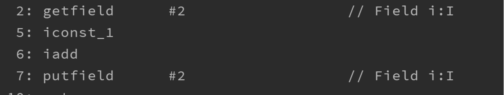
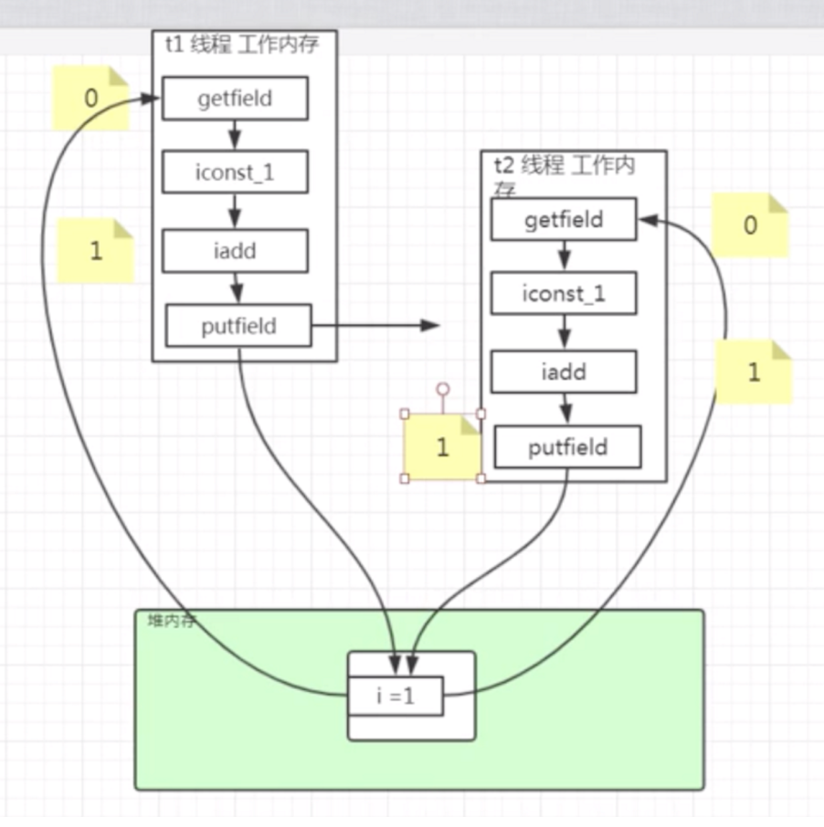
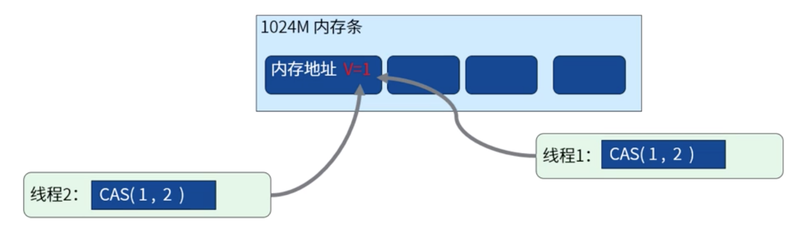
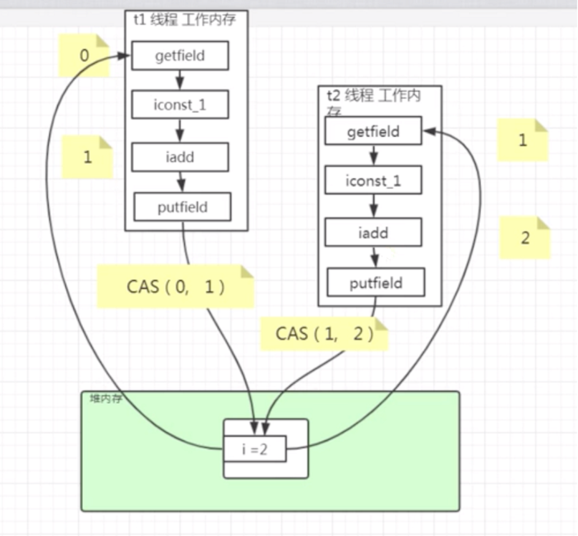
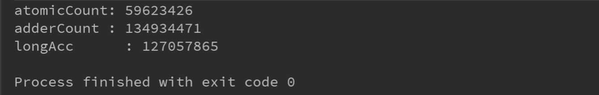
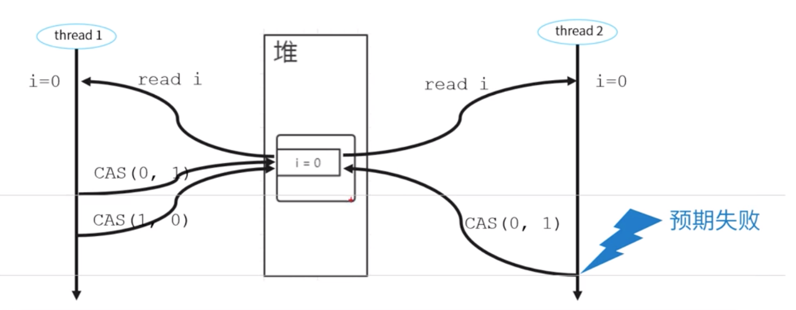
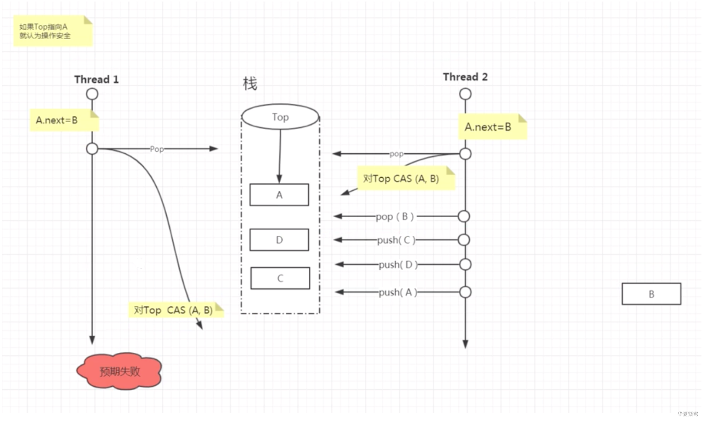
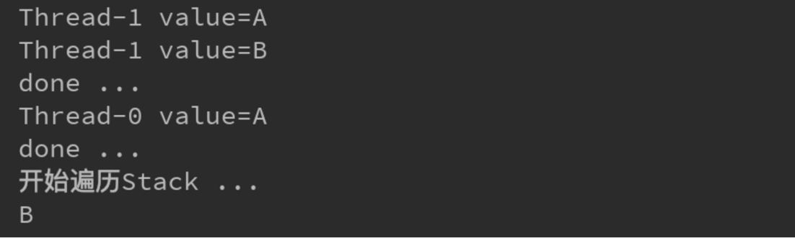
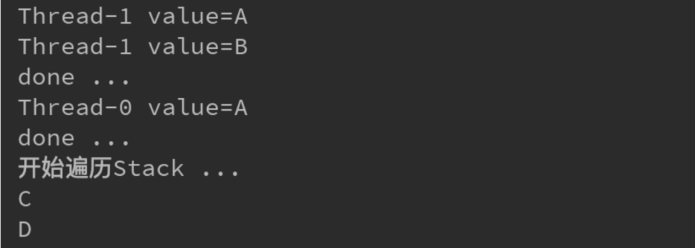

<!-- TOC -->

- [理解原子操作](#理解原子操作)
  - [实现一个简单的测试用例](#实现一个简单的测试用例)
  - [结果分析](#结果分析)
  - [原子操作描述](#原子操作描述)
  - [针对以上问题的解决办法](#针对以上问题的解决办法)
- [CAS(Compare and swap)](#cascompare-and-swap)
  - [基本概念](#基本概念)
  - [针对上述问题使用CAS处理](#针对上述问题使用cas处理)
  - [代码实现](#代码实现)
- [J.U.C 包内的原子操作封装类](#juc-包内的原子操作封装类)
  - [封装累列举](#封装累列举)
  - [AtomicLong、LongAdder、LongAccumulator 三者计数器的性能比较](#atomiclonglongadderlongaccumulator-三者计数器的性能比较)
- [CAS 的三个问题](#cas-的三个问题)
- [ABA 问题](#aba-问题)
  - [使用`AtomicReference`复现ABA问题](#使用atomicreference复现aba问题)
  - [使用`AtomicStampedReference`解决ABA问题](#使用atomicstampedreference解决aba问题)
- [线程安全的概念](#线程安全的概念)
- [共享资源](#共享资源)

<!-- /TOC -->


### 理解原子操作

#### 实现一个简单的测试用例

```java
public class Counter {
    volatile int i = 0;

    public void add() {
        i++;
    }
}
```


```java
public class Demo1_CounterTest {

    public static void main(String[] args) throws InterruptedException {
        final Counter ct = new Counter();

        for (int i = 0; i < 6; i++) {
            new Thread(() -> {
                for (int j = 0; j < 10000; j++) {
                    ct.add();
                }
                System.out.println("done...");
            }).start();
        }

        Thread.sleep(6000L);
        System.out.println(ct.i);
    }

}
```


#### 结果分析


- 最终的结果是小于等于60000。
- 原因：`i++`并不是一个原子操作。
- 反编译 Counter 类，部分结果如下：




- 针对操作进行了切分：




#### 原子操作描述

- 原子操作可以是一个步骤，也可以是多个步骤，但是其顺序不可以被打乱，也不可以被切割而只执行其中的一部分（不可中断性）。
- 将整个操作是做一个整体，资源在该次操作中保持一致，这是原子性的核心特征。


#### 针对以上问题的解决办法

- 最简单的就是给方法添加`synchronized`关键字

```java
public synchronized void add() {
    i++;
}
```

- 同步锁避免了操作的切分。

- 使用lock(ReentrantLock:互斥锁)

```java
public class Counter {
    volatile int i = 0;

    Lock lock = new ReentrantLock();

    public void add() {
        lock.lock();
        i++;
        lock.unlock();
    }
}
```

- 使用`AtomicInteger`

```java
public class Counter {
    AtomicInteger i = new AtomicInteger(0);

    public void add() {
        i.incrementAndGet();
    }
}
```


### CAS(Compare and swap)

#### 基本概念

- Compare and swap 比较和交换。属于硬件同步原语，处理器提供了基本内存操作的原子性保证。
- CAS 操作需要输入两个数值，一个旧值A（期望操作前的值）和一个新值B，在操作期间先对旧值进行比较，若没有发生变化，才交换成新值，发生了变化则不叫唤。
- JAVA中的`sun.misc.Unsafe`类，提供了 compareAndSwapInt() 和 compareAndSwapLong() 等几个方法实现CAS。





#### 针对上述问题使用CAS处理





#### 代码实现

```java
public class Counter {
    volatile int i = 0;

    private static Unsafe unsafe = null;

    private static long valueOffset;

    static {
//        unsafe = Unsafe.getUnsafe(); // 不可用的
        try {
            Field field = Unsafe.class.getDeclaredField("theUnsafe");
            field.setAccessible(true);
            unsafe = (Unsafe) field.get(null);

            Field iField = Counter.class.getDeclaredField("i");
            valueOffset = unsafe.objectFieldOffset(iField);
        } catch (NoSuchFieldException e) {
            e.printStackTrace();
        } catch (IllegalAccessException e) {
            e.printStackTrace();
        }
    }

    public void add() {
        while(true) {
            // 拿旧值
            int current = unsafe.getIntVolatile(this, valueOffset);
            // 通过CAS操作修改i的值
            if (unsafe.compareAndSwapInt(this, valueOffset, current, current + 1)) {
                break;
            }
        }
    }
}
```


### J.U.C 包内的原子操作封装类

#### 封装累列举

1. 基本类型

- AtomicBoolean：原子更新布尔类型
- AtomicInteger：原子更新整型
- AtomicLong：原子更新长整型

1. 数组类型

- AtomicIntegerArray：原子更新整型数组里的元素
- AtomicLongArray：原子更新长整型数组里的元素
- AtomicReferenceArray：原子更新引用类型数组里的元素

```java
public class AtomicTest {
    public static void main(String[] args) {
        AtomicIntegerArray array = new AtomicIntegerArray(3);
        array.set(1, 14);
        array.compareAndSet(1, 12, 14);
        
        AtomicReference<Thread> th = new AtomicReference<>();
        th.get();
        th.compareAndSet(null, Thread.currentThread());
    }
}
```

1. updater

- AtomicIntegerFieldUpdater：原子更新整型的字段的更新器
- AtomicLongFieldUpdater：原子更新长整型字段的更新器
- AtomicReferenceFieldUpdater：原子更新引用类型里的字段

```java
public class Demo2_AtomicIntegerFieldUpdater {
    private static AtomicIntegerFieldUpdater<User> atom = AtomicIntegerFieldUpdater.newUpdater(User.class, "id");
    
    public static void main(String[] args) {
        User user = new User(100, 100, "Kody");
        atom.addAndGet(user, 50);
        System.out.println("atom.addAndGet(user, 50) 调用后值变为：" + user);
    }
}
class User {
    volatile int id;
    volatile int age;
    
    private String name;
    
    public User(int id, int age, String name) {
        this.id = id;
        this.age = age;
        this.name = name;
    }
}
```

1. reference

- AtomicReference：原子更新引用类型
- AtomicStampedReference：原子更新带有版本号的引用类型
- AtomicMarkableReference：原子更新带有标记位的引用类型

1. 1.8 更新

- 计数器增强版，高并发下性能更好。

- 更新器：DoubleAccumulator、LongAccumulator
- 计数器：DoubleAdder、LongAdder

- 原理：分成多个操作单元，不同线程更新不同的单元。只有需要汇总的时候才计算所有单元的操作。
- 场景：高并发频繁更新、不太频繁读取。


#### AtomicLong、LongAdder、LongAccumulator 三者计数器的性能比较

```java
package com.study.hc.thread.chapter1.atomic;

import java.util.concurrent.atomic.AtomicLong;
import java.util.concurrent.atomic.LongAccumulator;
import java.util.concurrent.atomic.LongAdder;

// 测试用例：同时运行2秒，检查谁的次数最多
public class Demo5_PerformanceTest {

    public static void main(String[] args) throws InterruptedException {
        Demo5_PerformanceTest demo = new Demo5_PerformanceTest();
        long atomicCount = demo.testAtomic();
        long adderCount = demo.testLongAdder();
        long longAcc = demo.testAccumulator();

        System.out.println("atomicCount: " + atomicCount);
        System.out.println("adderCount: " + adderCount);
        System.out.println("longAcc: " + longAcc);
    }

    // AtomicLong
    public long testAtomic() throws InterruptedException {
        AtomicLong account = new AtomicLong(0L);

        for (int i = 0; i < 6; i ++) {
            new Thread(() -> {
                long startTime = System.currentTimeMillis();
                while (System.currentTimeMillis() - startTime < 2000) {
                    account.incrementAndGet();
                }
            }).start();
        }

        Thread.sleep(3000);
        return account.get();
    }

    // LongAdder
    public long testLongAdder() throws InterruptedException {
        LongAdder account = new LongAdder();

        for (int i = 0; i < 6; i ++) {
            new Thread(() -> {
                long startTime = System.currentTimeMillis();
                while (System.currentTimeMillis() - startTime < 2000) {
                    account.increment();
                }
            }).start();
        }

        Thread.sleep(3000);
        return account.sum();
    }

    // LongAccumulator
    public long testAccumulator() throws InterruptedException {
        LongAccumulator account = new LongAccumulator((x, y) -> x + y, 0L);

        for (int i = 0; i < 6; i ++) {
            new Thread(() -> {
                long startTime = System.currentTimeMillis();
                while (System.currentTimeMillis() - startTime < 2000) {
                    account.accumulate(1);
                }
            }).start();
        }

        Thread.sleep(3000);
        return account.get();
    }

}
```





### CAS 的三个问题

- 循环+CAS，自旋的实现让所有的线程都处于高频运行，争抢CPU执行时间的状态。如果操作长时间不成功，会带来很大的CPU资源消耗。
- 仅针对单个变量的操作，不能用于多个变量来实现原子操作 。
- ABA问题。


### ABA 问题




- thread1、thread2 同时读取到 i=0 后
- thread1、thread2 都要执行 CAS(0,1) 操作
- 假如 thread2 操作稍之后与 thread1，则 thread1 执行成功
- thread1 紧接着执行了 CAS(1,0)，则 i 的值改为 0
- 此时 thread2 还是执行成功了





#### 使用`AtomicReference`复现ABA问题

1. 定义一个Node

```java
public class Node {
    public final String value;
    public Node next;

    public Node(String value) {
        this.value = value;
    }

    @Override
    public String toString() {
        return "value=" + value;
    }
}
```

1. 使用`AtomicReference`实现一个栈

```java
// 实现一个 栈 (后进先出)
public class Stack {
    // top cas 无锁修改
    AtomicReference<Node> top = new AtomicReference<>();

    public void push(Node node) { // 入栈
        Node oldTop;
        do {
            oldTop = top.get();
            node.next = oldTop;
        } while (!top.compareAndSet(oldTop, node)); // CAS 替换栈顶
    }

    // 出栈 -- 取出栈顶，为了演示ABA效果，增加一个CAS操作的延时
    public Node pop(int time) {
        Node newTop;
        Node oldTop;
        do {
            oldTop = top.get();
            if (oldTop == null) { // 如果没有值，就返回null
                return null;
            }
            newTop = oldTop.next;
            if (time != 0) { // 模拟延时
                LockSupport.parkNanos(1000 * 1000 * time); // 休眠指定的时间
            }
        } while (!top.compareAndSet(oldTop, newTop)); // 将下一个节点设置为top
        return oldTop; // 将旧的top作为值返回
    }
}
```

1. 测试类

```java
public class Test {
    public static void main(String[] args) {
        Stack stack = new Stack();

        stack.push(new Node("B"));
        stack.push(new Node("A"));

        Thread thread1 = new Thread(() -> {
            Node node = stack.pop(800);
            System.out.println(Thread.currentThread().getName() + " " + node.toString());

            System.out.println("done ...");
        });
        thread1.start();

        Thread thread2 = new Thread(() -> {
            LockSupport.parkNanos(1000 * 1000 * 300L);

            Node nodeA = stack.pop(0); // 取出A
            System.out.println(Thread.currentThread().getName() + " " + nodeA.toString());

            Node nodeB = stack.pop(0); // 取出B，之后B处于游离状态
            System.out.println(Thread.currentThread().getName() + " " + nodeB.toString());

            stack.push(new Node("D"));
            stack.push(new Node("C"));
            stack.push(nodeA);

            System.out.println("done ...");
        });
        thread2.start();

        LockSupport.parkNanos(1000 * 1000 * 1000 * 2L);

        System.out.println("开始遍历Stack ...");
        Node node = null;
        while ((node = stack.pop(0)) != null) {
            System.out.println(node.value);
        }
    }
}
```

1. 结果



#### 使用`AtomicStampedReference`解决ABA问题

1. 实现栈

```java
public class ConCurrentStack {
    // top cas 无锁修改
    AtomicStampedReference<Node> top = new AtomicStampedReference<>(null, 0);

    public void push(Node node) {
        Node oldTop;
        int v;
        do {
            v = top.getStamp();
            oldTop = top.getReference();
            node.next = oldTop;
        } while (!top.compareAndSet(oldTop, node, v, v+1)); // CAS 替换栈顶
    }

    // 出栈 -- 取出栈顶，为了演示ABA效果，增加一个CAS操作的延时
    public Node pop(int time) {
        Node newTop;
        Node oldTop;
        int v;

        do {
            v = top.getStamp();
            oldTop = top.getReference();
            if (oldTop == null) {
                return null;
            }
            newTop = oldTop.next;
            if (time != 0) { // 模拟延时
                LockSupport.parkNanos(1000 * 1000 * time);
            }
        } while (!top.compareAndSet(oldTop, newTop, v, v+1)); // 将下一个节点设置为top
        return oldTop;
    }
}
```

1. 测试类

```java
public class Test {
    public static void main(String[] args) {
        ConCurrentStack stack = new ConCurrentStack();

        stack.push(new Node("B"));
        stack.push(new Node("A"));

        Thread thread1 = new Thread(() -> {
            Node node = stack.pop(800);
            System.out.println(Thread.currentThread().getName() + " " + node.toString());

            System.out.println("done ...");
        });
        thread1.start();

        Thread thread2 = new Thread(() -> {
            LockSupport.parkNanos(1000 * 1000 * 300L);

            Node nodeA = stack.pop(0); // 取出A
            System.out.println(Thread.currentThread().getName() + " " + nodeA.toString());

            Node nodeB = stack.pop(0); // 取出B，之后B处于游离状态
            System.out.println(Thread.currentThread().getName() + " " + nodeB.toString());

            stack.push(new Node("D"));
            stack.push(new Node("C"));
            stack.push(nodeA);

            System.out.println("done ...");
        });
        thread2.start();

        LockSupport.parkNanos(1000 * 1000 * 1000 * 2L);

        System.out.println("开始遍历Stack ...");
        Node node = null;
        while ((node = stack.pop(0)) != null) {
            System.out.println(node.value);
        }
    }
}
```

1. 结果




### 线程安全的概念

```java
public class Demo {
    public int i = 0;
    
    public void incr() {
        i++;
    }
}
```


- 竞态条件：如果程序运行顺序的改变会影响最终结果，就说存在竞态条件。大多数竞态条件的本质，就是基于某种可能失效的观察结果来作出判断或执行某个计算。
- 临界区：存在竞态条件的代码区域叫临界区。


### 共享资源

- 只有当多个线程更新共享资源时，才会发生竞态条件，可能会出现线程安全问题。
- 栈封闭时，不会在线程之间共享的变量，都是线程安全的。
- 局部对象引用本身不共享，但是引用的对象存储在共享堆中。如果方法内创建的对象，只有在方法中传递，并且不对其他线程可用，那么也是线程安全的。
- 不可变的共享对象来保证对象在线程件共享时不会被修改，从而实现线程安全。
- 实例被创建，value变量就不能再被修改，这就是不可变性。

```java
public class Demo2_ImmutableObj {
    private int value = 0;

    public Demo2_ImmutableObj(int value) {
        this.value = value;
    }

    // 只有get方法
    public int getValue() {
        return this.value;
    }
}
```

- 使用 ThreadLocal 时，相当于不同的线程操作的是不同的资源，所以不存在线程安全问题。