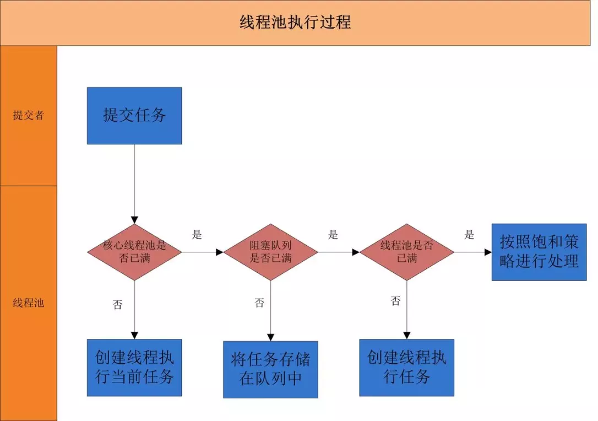

### 线程池的好处

- 降低资源消耗

- 提高响应速度

- 提高线程的可管理性


### 实现原理



ThreadPoolExecutor执行execute方法分下面4中情况：

- 如果当前运行的线程少于corePoolSize，则创建新线程来执行任务( 执行这一步骤需要获取全局锁 )

- 如果运行的线程等于或多于corePoolSize，则将任务加入BlockingQueue

- 如果无法将任务加入BlockingQueue(列队已满)，则创建新的线程来处理任务( 执行这一步骤需要获取全局锁 )

- 如果创建新线程将使当前运行的线程超出maximumPoolSize，任务将被拒绝，并调用RejectExecutionHandler.rejectExecution()方法


### 线程池的创建

```java
 /**
     * 用给定的初始参数创建一个新的ThreadPoolExecutor。
     */
    public ThreadPoolExecutor(int corePoolSize,
                              int maximumPoolSize,
                              long keepAliveTime,
                              TimeUnit unit,
                              BlockingQueue<Runnable> workQueue,
                              ThreadFactory threadFactory,
                              RejectedExecutionHandler handler) {
        if (corePoolSize < 0 ||
            maximumPoolSize <= 0 ||
            maximumPoolSize < corePoolSize ||
            keepAliveTime < 0)
            throw new IllegalArgumentException();
        if (workQueue == null || threadFactory == null || handler == null)
            throw new NullPointerException();
        this.corePoolSize = corePoolSize;
        this.maximumPoolSize = maximumPoolSize;
        this.workQueue = workQueue;
        this.keepAliveTime = unit.toNanos(keepAliveTime);
        this.threadFactory = threadFactory;
        this.handler = handler;
    }
```

参数说明如下：

- **coolPoolSize**(线程池的基本大小)：当提交一个任务到线程池时，线程池会创建一个线程来执行任务，即使其他空闲的基本线程能够执行新任务也会创建线程，得到需要执行的任务数大于线程池基本大小时就不再创建。如果调用了线程池的prestartAllCoolThreads()方法，线程池会提前创建并启动所有基本线程
- **maximumPoolSize**(线程池最大数量)：线程池允许创建的最大线程数。如果队列满了，并且创建的线程数小于最大线程数，则线程池会出再创建新的线程执行任务； 如果使用了无界的任务队列，这个参数就没有什么效果了
- **keepAliveTime**(线程活动保持时间)：线程池的工作线程空闲后，保存存活的时间；如果任务很多，并且每个任务执行的时间较短，可以调大时间，提高线程的利用率

- **TimeUnit**(线程活动保持时间单位)

- **runnableTaskQueue**(任务队列)：用于保存等待执行的任务的阻塞队列。可以选择一下几个阻塞队列：

- - **ArrayBlockingQueue**：一个基于数组结构的有界阻塞队列，此队列按FIFO(先进先出)原则对元素进行排序

- - **LinkedBlockingQueue**：一个基于链表结构的阻塞队列，此队列按FIFO排序元素，吞吐量通常要高于**ArrayBlockingQueue**。静态工厂方法Executors.newFixedThreadPool()使用了这个队列

- - **SynchronousQueue**：一个不存储元素的阻塞队列。每个插入操作必须等到另一个线程调用移除操作，否则插入操作一直处于阻塞状态，吞吐量通常要高于LinkedBlockingQueue，静态工程方法Executors.newCachedThreadPool使用了这个队列

- - **PriorityBlockingQueue**：一个具有优先级的阻塞队列

- **ThreadFactory**：用于设置创建线程的工厂，可以通过线程工厂给每个创建出来的线程设置更有意义的名字

- **RejectedExecutionHandler**(饱和策略)：当队列和线程池都满了，说明线程池处于饱和状态，那么必须采取一种策略处理提交的新任务。这个策略默认情况下是AbortPolicy，表示无法处理新任务时抛出异常。

- - **AbortPolicy**：直接抛出异常

- - **CallerRunsPolicy**：只用调用者所在线程来运行任务

- - **DiscardOldestPolicy**：丢弃队列里最近一个任务，并执行当前任务

- - **DiscardPolicy**：不处理，丢弃掉

- - 自定义实现**RejectedExecutionHandler**策略，如：记录日志或者持久化存储不能处理的任务


### 向线程池提交任务

可以使用两个方法向线程池提交任务：execute()和submit()

- execute()方法用于提交不需要返回值的任务，所以无法判断任务是否被线程池执行成功

- submit()方法用于提交需要返回值的任务；线程池会返回一个future类型的对象，通过这个对象可以判断任务是否执行成功，并且可以通过future对象的get方法来获取返回值，get()方法会阻塞当前线程直到任务完成 ，因此同时提供了get(long timeout, TimeUnit unit)方法阻塞当前线程一段时间后立即返回


### 关闭线程池

通过调用线程池的shutdown或者shutdownNow方法来关闭线程池。原理是：遍历线程池中的工作线程，然后逐个调用线程的interrupt方法来中断线程；

**shutdown与shutdownNow区别**：

- shutdowNow首先将线程池的状态设置为STOP，然后尝试停止所有正在执行或暂停任务的线程，并返回有等待执行任务的列表，比较暴力，直接中断运行中的任务

- shutdown只是将线程池的状态设置为SHUTDOWN状态，然后中断所有没有正在执行任务的线程，运行中的任务会运行完

调用了上面的关闭线程池方法后，isShutdown


### Demo: Runnable + ThreadPoolExecutor

#### MyRunnable.java

```java
import java.util.Date;

/**
 * 这是一个简单的Runnable类，需要大约5秒钟来执行其任务。
 * @author shuang.kou
 */
public class MyRunnable implements Runnable {

    private String command;

    public MyRunnable(String s) {
        this.command = s;
    }

    @Override
    public void run() {
        System.out.println(Thread.currentThread().getName() + " Start. Time = " + new Date());
        processCommand();
        System.out.println(Thread.currentThread().getName() + " End. Time = " + new Date());
    }

    private void processCommand() {
        try {
            Thread.sleep(5000);
        } catch (InterruptedException e) {
            e.printStackTrace();
        }
    }

    @Override
    public String toString() {
        return this.command;
    }
}
```


#### ThreadPoolExecutorDemo.java

```java
import java.util.concurrent.ArrayBlockingQueue;
import java.util.concurrent.ThreadPoolExecutor;
import java.util.concurrent.TimeUnit;

public class ThreadPoolExecutorDemo {

    private static final int CORE_POOL_SIZE = 5;
    private static final int MAX_POOL_SIZE = 10;
    private static final int QUEUE_CAPACITY = 100;
    private static final Long KEEP_ALIVE_TIME = 1L;
    public static void main(String[] args) {

        //使用阿里巴巴推荐的创建线程池的方式
        //通过ThreadPoolExecutor构造函数自定义参数创建
        ThreadPoolExecutor executor = new ThreadPoolExecutor(
                CORE_POOL_SIZE,
                MAX_POOL_SIZE,
                KEEP_ALIVE_TIME,
                TimeUnit.SECONDS,
                new ArrayBlockingQueue<>(QUEUE_CAPACITY),
                new ThreadPoolExecutor.CallerRunsPolicy());

        for (int i = 0; i < 200; i++) {
            //创建WorkerThread对象（WorkerThread类实现了Runnable 接口）
            Runnable worker = new MyRunnable("" + i);
            //执行Runnable
            executor.execute(worker);
        }
        //终止线程池
        executor.shutdown();
        while (!executor.isTerminated()) {
        }
        System.out.println("Finished all threads");
    }
}
```


1. `corePoolSize`: 核心线程数为 5。
2. `maximumPoolSize` ：最大线程数 10
3. `keepAliveTime` : 等待时间为 1L。
4. `unit`: 等待时间的单位为 TimeUnit.SECONDS。
5. `workQueue`：任务队列为 `ArrayBlockingQueue`，并且容量为 100;
6. `handler`:饱和策略为 `CallerRunsPolicy`。

> 我们在代码中模拟了 200 个任务，我们配置的核心线程数为 5 、等待队列容量为 100 ，所以每次只可能存在 5 个任务同时执行，剩下的 5 个任务会被放到等待队列中去。当前的 5 个任务之行完成后，才会之行剩下的 5 个任务。当队列满，并且超过最大线程数，则使用淘汰策略