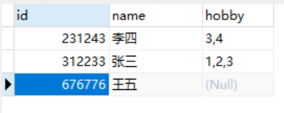
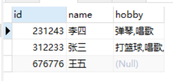
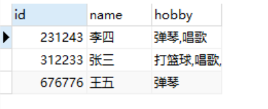
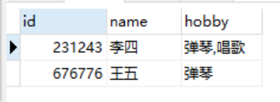
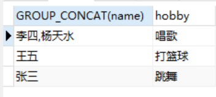
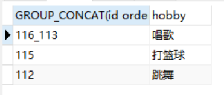

> **场景**：当我们使用mysql数据库，查询一张的数据，其中的一列存放的是是另一张表id用","拼接的字符


如下图所示：

**person表：**



**hobby表：**


我们前端页面想展示（把person表hobby一栏存放hobby表id字符串改成name连接的字符串）:



### SQL

这时我们可以使用mysql中的两个函数**FIND_IN_SET()**和**GROUP_CONCAT()**

sql如下：

```sql
SELECT p.id, p.`name`,GROUP_CONCAT(h.`name`) as hobby from person p
LEFT JOIN hobby h ON FIND_IN_SET(h.id,p.hobby)
GROUP BY p.id
```


那 mysql中FIND_IN_SET（）和GROUP_CONCAT() 分别是什么意思呢？

### FIND_IN_SET()

 **语法:  FIND_IN_SET(str,strlist)**

 **定义：** 

- 如果字符串str在由N子链组成的字符串列表中，则返回值范围在1-N之间
  
  - 如：select FIND_IN_SET('c','a,b,c,d') 返回值为 3
- 如果str不在strlist中或者strlist为空字符串，则返回值为 0
  
- 如：select FIND_IN_SET('e','a,b,c,d') 返回值为 0
  
- select FIND_IN_SET('e','') 返回值为 0

- 如果任意一个参数为NULL，返回NULL
  - 如：select FIND_IN_SET('e',NULL)，返回值为NULL
  
**使用**：在下面表中，如果我们想查询人员爱好弹琴的所有人员的话，该怎么查询呢？



**sql**：

```sql
SELECT * from
(SELECT p.id, p.`name`,GROUP_CONCAT(h.`name`) as hobby from person p
LEFT JOIN hobby h ON FIND_IN_SET(h.id,p.hobby)
GROUP BY p.id) person1
WHERE FIND_IN_SET("弹琴",hobby)
```

查询结果：




### GROUP_CONCAT()

**语法：group_concat( [distinct] 要连接的字段 [order by 排序字段 asc/desc] [separator '分隔符']）**

**功能：将group by产生的同一分组中的值连接起来，返回一个字符串结果**

> 例如 a.表 person1 数据如下：查询相同爱好的所有人的名字


 **sql**:

```sql
 SELECT GROUP_CONCAT(name),hobby from person1 GROUP BY hobby
```

查询结果：



  

> 查询相同爱好的人员的id,按照从大到小，用“_”拼接

**sql**:

```sql
SELECT GROUP_CONCAT(id order by id desc separator '_' ),hobby from person1 GROUP BY hobby
```

查询结果：

