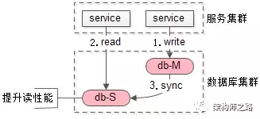
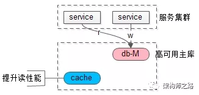
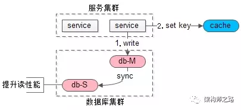
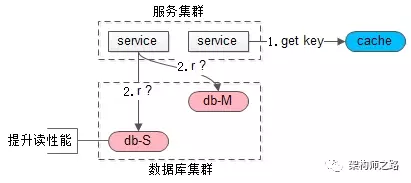

### 工作原理

```
1、主库会开启一个log dump线程，用来给从库的I/O线程传输binlog。
2、从库开启两个线程：I/0线程 和 sql线程.
  I/O 线程用来请求主库的binlog、并写入本地relay-log(中继文件)中
  sql线程解析本地的relay-log文件，并解析成sql语句处理。
```

 

 


### 好处

```
1、数据备份、保证数据的安全和容灾
2、读写分离、提高系统并发和存储空间。
3、负载均衡
```


### 配置环境

```
虚拟机环境 （centos 7.5 64位）:
主：192.168.111.129
从：192.168.111.128
mysql 版本：mysql 5.7
```


### mysql安装

```shell
#下载并安装mysql yum

wget -i -c http://dev.mysql.com/get/mysql57-community-release-el7-10.noarch.rpm

yum -y install mysql57-community-release-el7-10.noarch.rpm

yum -y install mysql-community-server

#mysql配置
#启动mysql 
[root@localhost /]# systemctl start mysqld.service
#查看mysql状态
[root@localhost /]# systemctl status mysqld.service
#查找root密码 
[root@localhost /]# grep "password" /var/log/mysqld.log 
2019-11-13T15:27:05.345051Z 1 [Note] A temporary password is generated for root@localhost: hoe8rTf!50u.
#登录mysql修改密码
[root@localhost /]# mysql -uroot -p
mysql> ALTER USER 'root'@'localhost' IDENTIFIED BY '!QAZ2wsx';

#密码太简单策略修改
mysql> SHOW VARIABLES LIKE 'validate_password%';
+--------------------------------------+--------+
| Variable_name                        | Value  |
+--------------------------------------+--------+
| validate_password_check_user_name    | OFF    |
| validate_password_dictionary_file    |        |
| validate_password_length             | 8      |
| validate_password_mixed_case_count   | 1      |
| validate_password_number_count       | 1      |
| validate_password_policy             | MEDIUM |
| validate_password_special_char_count | 1      |
+--------------------------------------+--------+
7 rows in set (0.00 sec)


#修改密码策略
mysql> set global validate_password_policy=0;
mysql> set global validate_password_length=1;

#设置远程访问权限
mysql> grant all privileges on *.* to 'root' @'%' identified by '!QAZ2wsx';

#卸载yum自动更新
[root@localhost /]# yum -y remove mysql57-community-release-el7-10.noarch
```


### 主库配置

```shell
#修改主库 /etc/my.cnf
[root@localhost etc]# vim my.cnf
[mysqld]
log_bin=master-bin
server-id=129 #不要和别的冲突
expire-logs-days=7
binlog_ignore_db=mysql
binlog_ignore_db=information_schema
binlog_ignore_db=performation_schema
binlog_ignore_db=sys

#重启mysql服务
[root@localhost etc]# service mysqld restart

#查看mysql master状态
mysql> show master status;

+-------------------+----------+--------------+--------------------------------------------------+-------------------+
| File              | Position | Binlog_Do_DB | Binlog_Ignore_DB                                 | Executed_Gtid_Set |
+-------------------+----------+--------------+--------------------------------------------------+-------------------+
| master-bin.000001 |      154 |              | mysql,information_schema,performation_schema,sys |                   |
+-------------------+----------+--------------+--------------------------------------------------+-------------------+

#创建数据同步账号
mysql> CREATE USER 'master'@'%' IDENTIFIED BY '!QAZ2wsx';
#授权
mysql> GRANT REPLICATION SLAVE ON *.* TO 'master'@'%' IDENTIFIED BY '!QAZ2wsx' WITH GRANT OPTION;

```


### 配置从库服务器

```shell
#修改从库 /etc/my.cnf
server-id = 128
relay-log = slave-relay-bin
relay-log-index = slave-relay-bin.index

#重启mysql服务
service mysqld restart

#进入mysql,执行
#关闭slave
stop slave;

#设置主库
change master to
master_host='192.168.111.129',
master_port=3306,
master_user='master',
master_password='!QAZ2wsx',
master_log_file='master-bin.000001',
master_log_pos=154;

#开启slave
start slave

#查看状态
show slave status \G

*************************** 1. row ***************************
               Slave_IO_State: Waiting for master to send event
                  Master_Host: 192.168.111.129
                  Master_User: master
                  Master_Port: 3306
                Connect_Retry: 60
              Master_Log_File: master-bin.000001
          Read_Master_Log_Pos: 704
               Relay_Log_File: slave-relay-bin.000002
                Relay_Log_Pos: 871
        Relay_Master_Log_File: master-bin.000001
             Slave_IO_Running: Yes
            Slave_SQL_Running: Yes
              Replicate_Do_DB: 
          Replicate_Ignore_DB: 
           Replicate_Do_Table: 
       Replicate_Ignore_Table: 
      Replicate_Wild_Do_Table: 
  Replicate_Wild_Ignore_Table: 
                   Last_Errno: 0
                   Last_Error: 
                 Skip_Counter: 0
          Exec_Master_Log_Pos: 704
              Relay_Log_Space: 1078
              Until_Condition: None
               Until_Log_File: 
                Until_Log_Pos: 0
           Master_SSL_Allowed: No
           Master_SSL_CA_File: 
           Master_SSL_CA_Path: 
              Master_SSL_Cert: 
            Master_SSL_Cipher: 
               Master_SSL_Key: 
        Seconds_Behind_Master: 0
Master_SSL_Verify_Server_Cert: No
                Last_IO_Errno: 0
                Last_IO_Error: 
               Last_SQL_Errno: 0
               Last_SQL_Error: 
  Replicate_Ignore_Server_Ids: 
             Master_Server_Id: 129
                  Master_UUID: 0b8e431c-062a-11ea-b7b4-000c294300dc
             Master_Info_File: /var/lib/mysql/master.info
                    SQL_Delay: 0
          SQL_Remaining_Delay: NULL
      Slave_SQL_Running_State: Slave has read all relay log; waiting for more updates
           Master_Retry_Count: 86400
                  Master_Bind: 
      Last_IO_Error_Timestamp: 
     Last_SQL_Error_Timestamp: 
               Master_SSL_Crl: 
           Master_SSL_Crlpath: 
           Retrieved_Gtid_Set: 
            Executed_Gtid_Set: 
                Auto_Position: 0
         Replicate_Rewrite_DB: 
                 Channel_Name: 
           Master_TLS_Version: 
1 row in set (0.00 sec)


```


### 解决主从不一致问题

**常见的数据库集群架构如何？**

一主多从，主从同步，读写分离。


如上图：


- 一个主库提供写服务；
- 多个从库提供读服务，可以增加从库提升读性能；
- 主从之间同步数据；


**为什么会出现不一致？**


主从同步有时延，这个时延期间读从库，可能读到不一致的数据。





如上图：


- 服务发起了一个写请求；
- 服务又发起了一个读请求，此时同步未完成，读到一个不一致的脏数据；
- 数据库主从同步最后才完成；


**如何避免这种主从延时导致的不一致？**


常见的方案有下面几种。


### 方案


#### 忽略


任何脱离业务的架构设计都是耍流氓，绝大部分业务，例如：百度搜索，淘宝订单，QQ 消息，58帖子都允许短时间不一致。


如果业务能够接受，别把系统架构搞得太复杂。


#### 强制读主





如上图：


- 使用一个高可用主库提供数据库服务；
- 读和写都落到主库上；
- 采用缓存来提升系统读性能；


这是很常见的微服务架构，可以避免数据库主从一致性问题。


#### 选择性读主


强制读主过于粗暴，毕竟只有少量写请求，很短时间，可能读取到脏数据。


**有没有可能实现，****只有这一段时间，可能读到从库脏数据的读请求读主****，平时读从呢？**

 

可以利用一个缓存记录必须读主的数据。





如上图，当写请求发生时：


1. 写主库；
2. 将哪个库，哪个表，哪个主键三个信息拼装一个 key 设置到 cache 里，这条记录的超时时间，设置为“主从同步时延”，key 的格式为 db:table:PK，假设主从延时为1s，这个 key 的 cache 超时时间也为1s。





如上图，当读请求发生时：


这是要读哪个库，哪个表，哪个主键的数据呢，也将这三个信息拼装一个 key，到 cache 里去查询，如果，


- cache 里有这个 key，说明1s内刚发生过写请求，数据库主从同步可能还没有完成，此时就应该去主库查询；
- cache 里没有这个 key，说明最近没有发生过写请求，此时就可以去从库查询；


以此，保证读到的一定不是不一致的脏数据。


