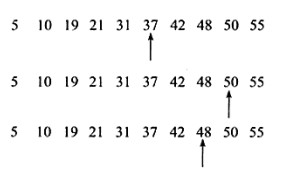
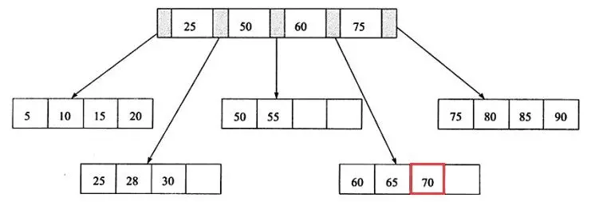
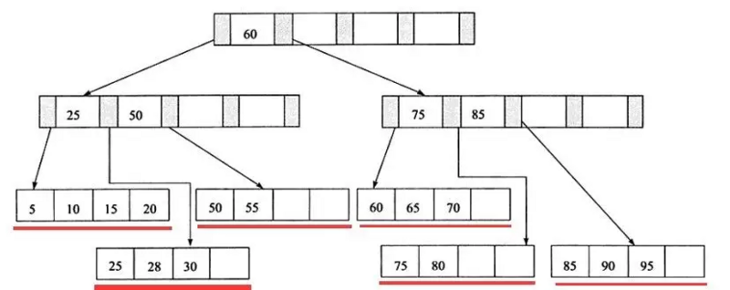

### B+树索引

1、B+树中的B不是代表的二叉（Binary） ，而是代表平衡（Balance），因为B+树是从最早的平衡二叉树演化而来，但是B+树不是一个二叉树。

2、B+树是为磁盘或其他直接存取辅助设备设计的一种平衡查找树，在B+树中，所有的记录节点都是按照键值大小顺序存在同一层的叶子节点，由叶子节点指针进行相连。

3、B+树在数据库中的特点就是高扇出，因此在数据库中B+树的高度一般都在2~4层，这也就是说查找一个键值记录时，最多只需要2到4次IO,当前的机械硬盘每秒至少可以有100次IO，2~4次IO意味着查询时间只需要0.02~0.04秒。

4、B+树索引并不能找到一个给定键值的具体行，B+树索引能找到的只是被查找的键值所在行的页，然后数据库把页读到内存，再内存中进行查找，最后找到要查找的数据。

5、数据库中B+树索引可以分为，聚集索引和非聚集索引，但是不管是聚集索引还是非聚集索引，其内部都是B+树实现的，即高度是平衡的，叶子节点存放着所有的数据，聚集索引和非聚集索引不同的是，叶子节点是否存储的是一整行信息。每张表只能有一个聚集索引。

6、B+树的每个数据页（叶子节点）是通过一个双向链表进行链接，数据页上的数据的顺序是按照主键顺序存储的。

先来看一个B+树，其高度为2，每页可以放4条记录，扇出为5。


图：一颗高度为2的B+树

#### 索引的查找

B+树索引使用二分法查找，也称折半查找法，基本思想就是：将记录有序化（递增或递减）排列，在超找过程中采用跳跃式方式查找，既先以有序数列的中心点位置比较对象，如果要查找的元素小于该元素的中心点元素，则将待查找的元素缩小为左半部分，否则为右半部分，通过一次比较，将查找区间缩小一半。

如图所示，从有序列表中查找 48，只需要3步：




#### 索引的插入

B+树的查找速度很快，但是维护一颗平衡的B+树代价就是非常大的，通常来说，需要1次或者多次左旋右旋来保证插入后树的平衡性。

B+树的插入为了保持树的平衡，需要做大量的页（叶子节点）的拆分，页的存储基本都在磁盘，页的拆分意味着磁盘的操作，所以应该尽量减少页的拆分，在采用自增长ID，作为主键，会大量的减少页的拆分，提升的性能。

**B+树 插入的三种情况**

| Leaf Page满 | Index Page满 | 操作                                                         |
| ----------- | ------------ | ------------------------------------------------------------ |
| No          | No           | 直接将记录插入叶子节点                                       |
| Yes         | No           | 1、拆分Leaf Page 2、将中间的节点放入到Index Page中 3、小于中间节点的记录放左边 4、大于或等于中间节点的记录放右边 |
| Yes         | Yes          | 1、拆分Leaf Page 2、小于中间节点的记录放左边 3、大于或等于中间节点的记录放右边 4、拆分Index Page 5、小于中间节点的记录放左边 6、大于中间节点的记录放右边 7、中间节点放入上一层 Index Page |

**图：一颗高度为2的B+树**


**我们用实例来分析B+树的插入。**

（1）我们插入28这个键值，发现当前Leaf Page和Index Page都没有满，我们直接插入就可以了。


（2）这次我们再插入一条70这个键值，这时原先的Leaf Page已经满了，但是Index Page还没有满，**符合表（B+树 插入的三种情况）的第二种情况**，这时插入Leaf Page后的情况为**50、55、60、65、70**。我们根据**中间的值60拆分叶节点**。将**中间节点放入到Index Page**中。



（3）因为图片显示的关系，这次我没有能在各叶节点加上双向链表指针。最后我们来插入记录95，**这时符合表（B+树 插入的三种情况）讨论的第三种情况**，即Leaf Page和Index Page都满了，这时需要做两次拆分。



可以看到，不管怎么变化，B+树总是会保持平衡。但是为了保持平衡，对于新插入的键值可能需要做大量的拆分页（split）操作，而B+树主要用于磁盘，因此页的拆分意味着磁盘的操作，应该在可能的情况下尽量减少页的拆分。因此，B+树提供了旋转（rotation）的功能。


#### 索引的删除

B+树使用填充因子（fill factor） 来控制树的删除变化，50%是填充因子可设的最小值，B+树的删除也同样必须保证删除后树的平衡性，删除的过程中会涉及，合并叶子节或兄弟节点，但是都是为了保持树的平衡。


### 索引的分类

在了解B+树索引的本质和实现后，我们看看索引分为几类，聚集索引，辅助索引，联合索引，覆盖索引

#### 聚集索引

就是按照每张表的主键构造一颗B+树，同时叶子节点存储整张表的行记录数，也将聚集索引的叶子节点成为“数据页”，聚集索引的特性决定了表中的行记录数据也是索引的一部分。同B+树数据结构一样，每个数据页都通过一个双向链表进行链接。

数据页只能按照一颗B+树进行排序，因此每张表只能有一个聚集索引，由于数据页定义了逻辑顺序，聚集索引能够很快的在数据页访问指针进行范围的查找数据。

聚集索引在物理上不是连续的，在逻辑上是连续的，前面已经说过是通过双向链表进行维护，物理存储可以不按照主键顺序存储。


#### 辅助索引

辅助索引（也称非聚集索引），叶子节点并不包含行记录的全部数据。叶子节点除了包含键值外，每个叶子节点还包含了一个书签，该书签告诉InnoDB 存储引擎可以从哪里找到辅助索引相对应行的记录。因此InnoDB 存储引擎的辅助索引的书签就是相应整行数据的聚集索引键。

一个表中可以有多个辅助索引。例如，一个辅助索引树需要遍历3次才能找到主键索引，如果聚集索引树的高为同样为3，那么它还需要对聚集索引树进行三次查找，最终才能找到一个完整的数据页，因此一共需要6次IO访问才能得到最终的数据页。


#### 联合索引

联合索引是指对表上多个列进行建立索引，联合索引本质还是一颗B+树，不同的是索引的键值数量不是1个，而是大于等于2。联合索引的键值在B+树中也是有序的，通过叶子节点可以在逻辑的顺序上读出所有数据。


#### 覆盖索引

InnoDB存储引擎支持覆盖索引（或称索引覆盖），就是从辅助索引中就可以直接得到查询的记录，而不需要再次查询聚集索引中的记录。使用覆盖索引的好处就是，辅助索引不包括整行记录的所有信息，所以覆盖索引的大小要小于聚集索引，因此可以减少IO操作。

通俗的解释：

覆盖索引是非聚集组合索引的一种形式，它包括在查询里的Select、Join和Where子句用到的所有列（即建立索引的字段正好是覆盖查询语句[select子句]与查询条件[Where子句]中所涉及的字段，也就是索引包含了查询正在查找的所有数据）


#### 哈希索引

学习哈希索引之前，我们先了解一些基础的知识：哈希算法。哈希算法是一种常用的算法，时间复杂度为`O(1)`。它不仅应用在索引上，各个数据库应用中也都会使用。


#### 哈希算法

InnoDB存储引擎使用哈希算法来对字典进行查找，哈希碰撞采用转链表解决，哈希函数采用除法散列方式。

例如：当前参数InnoDB_buffer_pool_size大小为10M，则共有640个16k的页，对于缓冲页内存的哈希表来说，需要分配640×2=1280个槽，但是由于1280不是质数，所以需要取比1280更大的一点的质数，应该是1399，所以启动的时候，会分配1399个槽的哈希表，用来哈希查询所在的缓冲池中的页。

InnoDB存储引擎是通过除法散列到1399个其中的一个槽中。


#### 自适应哈希索引

自适应哈希索引采用之前说的哈希表方式，不同的是哈希索引对字典类型的等值查找非常快，对范围查询就无能为力了。

所以说哈希索引只能用于搜索等值查询，范围查询是不能使用哈希索引。


### 全文索引

之前已经说过，B+树索引的特点，对于使用如下sql，是支持B+树索引的，只要content 加了B+树索引，就能利用索引进项快速查询。

我们通过 B+ 树索引可以进行前缀查找，如：

```
select * from blog where content like 'xxx%';
```

只要为content列添加了B+树索引（聚集索引或辅助索引），就可快速查询。但在更多情况下，我们在博客或搜索引擎中需要查询的是某个单词，而不是某个单词开头，如：

```
select * from blog where content like '%xxx%';
```

此时如果使用B+树索引依然是全表扫描，而全文检索（Full-Text Search）就是将整本书或文章内任意内容检索出来的技术。

根据B+树索引的特点是不支持的，InnoDB存储引擎从1.2.x开始支持全文索引技术，其特性支MyISAM的全部功能。

具体实现原理接下来会介绍


#### 倒排索引

全文检索使用倒排索引来实现，倒排索引同B+树索引一样，也是一种数据结构，它在辅助表中存储了单词与单词自身在一个或多个文档中所在位置的映射，这通常利用关联数组实现。

倒排索引它需要将分词（word）存储在一个辅助表（Auxiliary Table）中，为了提高全文检索的并行性能，共有6张辅助表。辅助表中存储了单词和单词在各行记录中位置的映射关系。它分为两种：**倒排文件索引，详细倒排索引**

1、inverted file index（**倒排文件索引**），表现为{单词，单词所在文档ID}
2、full inverted index（**详细倒排索引**），表现为{单词，(单词所在文档ID, 文档中的位置)}

**全文检索表**

| DocumentID | Text 文档内容                            |
| ---------- | ---------------------------------------- |
| 1          | Souyunku Technical team (搜云库技术团队) |
| 2          | Go Technical stack (Go技术栈)            |

**inverted file index（倒排文件索引）-辅助表存储为**

倒排文件索引类型的辅助表存储为：

| Number | Text 分词 | Documents (单词所在文档ID) |
| ------ | --------- | -------------------------- |
| 1      | Souyunku  | 1                          |
| 2      | Technical | 1，2                       |
| 3      | team      | 1                          |
| 4      | Go        | 2                          |
| 5      | stack     | 2                          |

**full inverted index（ 详细倒排索引）-辅助表存储为**

详细倒排索引类型的辅助表存储为，占用更多空间，也更好的定位数据，比提供更多的搜索特性：

| Number | Text 分词 | Documents (单词所在文档ID:文档中的位置) |
| ------ | --------- | --------------------------------------- |
| 1      | Souyunku  | 1:1                                     |
| 2      | Technical | 1:2 ，2:2                               |
| 3      | team      | 1:3                                     |
| 4      | Go        | 2:1                                     |
| 5      | stack     | 2:3                                     |


#### 全文检索索引缓存

辅助表是存在与磁盘上的持久化的表，由于磁盘I/O比较慢，因此提供FTS Index Cache（全文检索索引缓存）来提高性能。FTS Index Cache是一个红黑树结构，根据（word, list）排序，在有数据插入时，索引先更新到缓存中，而后InnoDB存储引擎会批量进行更新到辅助表中。

当数据库宕机时，尚未落盘的索引缓存数据会自动读取并存储，配置参数innodb_ft_cache_size控制缓存的大小，默认为32M，提高该值，可以提高全文检索的性能，但在故障时，需要更久的时间恢复。

在删除数据时，InnoDB不会删除索引数据，而是保存在DELETED辅助表中，因此一段时间后，索引会变得非常大，可以通过optimize table命令手动删除无效索引记录。如果需要删除的内容非常多，会影响应用程序的可用性，参数innodb_ft_num_word_optimize控制每次删除的分词数量，默认为2000，用户可以调整该参数来控制删除幅度。


#### 全文索引的一些限制

1、现在只支持myisam和innodb
2、不支持分区表
3、多列组合的全文检索索引必须使用相同的字符集和字符序
4、象形文字不支持。需要ngram来分词
5、建立全文索引的各个字段必须统一
6、match（）里的查找列，必须是在fulltext索引里定义过的
7、against（）必须为字符串且为常量
8、索引提示会更差
9、在innodb中，所有涉及到全文索引列的DML操作（update，insert，delete），只会在事务提交的时候，执行。中间可能要分词，标记等
10、不能用 % 通配符
11、不支持没有单词界定符`（delimiter）`的语言，如中文、日语、韩语等