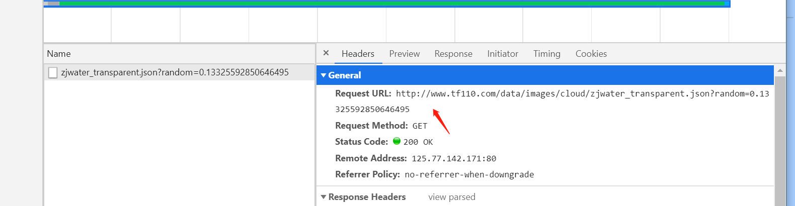

- 示例：爬取台风网json接口



- 代码

```python
import requests
import json

url = 'http://www.tf110.com/data/images/cloud/zjwater_transparent.json?random=0.13325592850646495'
headers = {'User-Agent': 'Mozilla/5.0 (Windows NT 6.1; WOW64) AppleWebKit/537.36 (KHTML, like Gecko) Chrome/64.0.3282.119 Safari/537.36'}
response = requests.get(url, headers=headers)
html_str = response.content.decode()
dict_json = json.loads(html_str)
print(dict_json)
#将json保存到文件中
fanyi_str = json.dumps(dict_json, ensure_ascii=False, indent=2)
with open('zjwater_transparent.txt', 'w', encoding='utf-8') as f:
    f.write(fanyi_str)
```

- 生成结果

```json
[
  {
    "name": "202006160730.png",
    "url": "https://upy.istrongcloud.com/cloud/zjwater_transparent/202006/16/202006160730pmpR6e5H.png",
    "md5": "5523b6ad457b7764a4fca60fce29cb6f",
    "dt": null
  },
  {
    "name": "202006160740.png",
    "url": "https://upy.istrongcloud.com/cloud/zjwater_transparent/202006/16/202006160740cjm0BHHz.png",
    "md5": "edc04387f0192278c18f7608540e5e05",
    "dt": null
  },
  {
    "name": "202006160750.png",
    "url": "https://upy.istrongcloud.com/cloud/zjwater_transparent/202006/16/202006160750HYDlJkQn.png",
    "md5": "657c74bfea6197c1c2f73dc12cca0df2",
    "dt": null
  },
  {
    "name": "202006160800.png",
    "url": "https://upy.istrongcloud.com/cloud/zjwater_transparent/202006/16/202006160800y34Q76NP.png",
    "md5": "ba4448fe5e0ca33bc773fc1422fadf7a",
    "dt": null
  },
  {
    "name": "202006160810.png",
    "url": "https://upy.istrongcloud.com/cloud/zjwater_transparent/202006/16/202006160810HOpDwVdx.png",
    "md5": "8be093bc0f132adee7171748d9e09c1b",
    "dt": null
  },
  {
    "name": "202006160820.png",
    "url": "https://upy.istrongcloud.com/cloud/zjwater_transparent/202006/16/202006160820yRTYBNL9.png",
    "md5": "72cab48eac52dd031585f4db7759b98a",
    "dt": null
  },
  {
    "name": "202006160830.png",
    "url": "https://upy.istrongcloud.com/cloud/zjwater_transparent/202006/16/202006160830jHobosjB.png",
    "md5": "10475abe739d4b0b169d76a7972a91f4",
    "dt": null
  },
  {
    "name": "202006160840.png",
    "url": "https://upy.istrongcloud.com/cloud/zjwater_transparent/202006/16/2020061608407AGwrkmi.png",
    "md5": "6582d1c1a57a8e59f2101513c3794e7a",
    "dt": null
  },
  {
    "name": "202006160850.png",
    "url": "https://upy.istrongcloud.com/cloud/zjwater_transparent/202006/16/202006160850l9ZzWUP3.png",
    "md5": "d3930e4ce1399282d13869804f5b2f7f",
    "dt": null
  },
  {
    "name": "202006160900.png",
    "url": "https://upy.istrongcloud.com/cloud/zjwater_transparent/202006/16/202006160900WglYM73f.png",
    "md5": "caaf4aa847d1437be104ed55f641ddc1",
    "dt": null
  }
]
```

