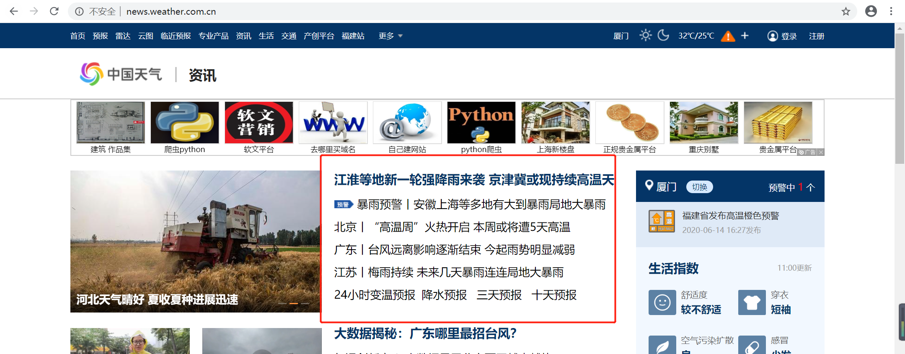

- 示例：爬取中国天气网

- 爬取内容

  

- 爬取代码

```python
import requests
from apscheduler.schedulers.blocking import BlockingScheduler
from bs4 import BeautifulSoup

def getContent(url):
  page = requests.get(url)
  soup = BeautifulSoup(page.content, 'html.parser')
  tb = soup.find('div', class_='articleBody')
  return tb

# 爬取中国天气网
def zgtq():
  url = "http://news.weather.com.cn"
  page = requests.get(url)
  soup = BeautifulSoup(page.content, 'html.parser')
  tb = soup.find('div', class_='newcard')
  for link in tb.find_all('p'):
    name = link.find('a')
    title = name.get_text('title')
    url = name['href']
    content = getContent(url)
    if title and url and content :
      print(title)
      print(url)
      print(content)

# 定时处理，10秒处理一次
scheduler = BlockingScheduler()
scheduler.add_job(zgtq, 'interval', seconds=10)
scheduler.start()
```