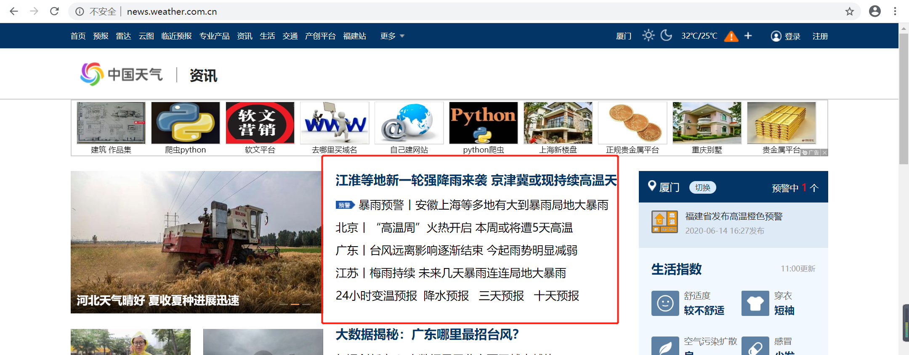

- 示例：爬取中国天气网

- 爬取内容

  

- 爬取代码

```python
import requests
from lxml import etree
from apscheduler.schedulers.blocking import BlockingScheduler

def getContent(url, xpathDetail):
  page = requests.get(url)
  html = etree.HTML(page.content)
  html = html.xpath(xpathDetail)
  if len(html) > 0:
    html = etree.tostring(html[0], encoding = "utf-8", pretty_print = True, method = "html").decode("utf-8")
  return html

# 爬取中国天气网
def zgtq(config):
  page = requests.get(config['url'])
  html = etree.HTML(page.content)
  html_data = html.xpath(config['xpath'])
  print(html_data)
  for a in html_data:
    title = a.text
    url = a.get('href')
    content = getContent(url, config['xpathDetail'])
    if content and url and title :
      print(title)
      print(url)
      print(content)
  print(config['url'] + '爬取成功')

# 定时任务,每隔5s执行
configs = [{
  'name': '中国天气网', # 名称
  'url': 'http://news.weather.com.cn', # 爬取网站
  'xpath': '//div[@class="newcard"][position()=1]/p/a', # 目标超链接XPATH
  'xpathDetail': '//div[@class="articleBody"][position()=1]' # 详情内容XPATH
}]

for config in configs:
  scheduler = BlockingScheduler()
  scheduler.add_job(zgtq, 'interval', seconds=5, args = [config])
  scheduler.start()
```

