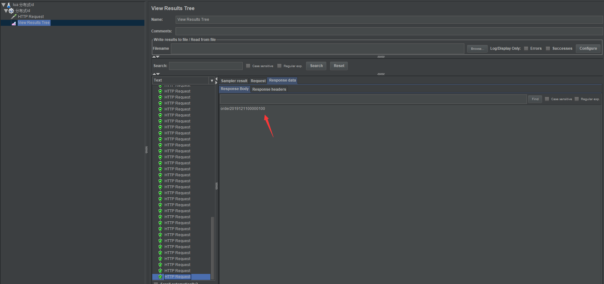

> 背景：数据库采用分库分表、系统架构采用微服务架构，需要提供一个全局的分布式ID

### 分布式ID需求

- ID不重复且递增。
- 和日期有关联，同一天的日期从1开始递增。
- 支持高并发
- 高可靠、高容错

| 方案             | 优点                               | 缺点                           |
| ---------------- | ---------------------------------- | ------------------------------ |
| UUID             | 方便简单                           | 不好排序、无递增、不可读       |
| twitter 雪花算法 | 高性能、低延迟、时间有序           | 需独立部署开发、和时钟高度耦合 |
| redis + lua      | 集群可防止系统故障、灵活方便、有序 | 需部署redis集群                |

### 方案选型

- 由于系统中已经搭建有redis集群，所以采用 redis集群生成全局方案策略，配合lua脚本开发。

- 分布式ID编码规则： 前缀+日期+8位自增序列号（不够补0）

### SpringBoot开发

#### pom.xml

```xml
<?xml version="1.0" encoding="UTF-8"?>
<project xmlns="http://maven.apache.org/POM/4.0.0" xmlns:xsi="http://www.w3.org/2001/XMLSchema-instance"
         xsi:schemaLocation="http://maven.apache.org/POM/4.0.0 https://maven.apache.org/xsd/maven-4.0.0.xsd">
    <modelVersion>4.0.0</modelVersion>
    <parent>
        <groupId>org.springframework.boot</groupId>
        <artifactId>spring-boot-starter-parent</artifactId>
        <version>2.2.2.RELEASE</version>
        <relativePath/> <!-- lookup parent from repository -->
    </parent>
    <groupId>com.ywf</groupId>
    <artifactId>redis-lua</artifactId>
    <version>0.0.1-SNAPSHOT</version>
    <name>redis-lua</name>
    <description>Demo project for Spring Boot</description>

    <properties>
        <java.version>1.8</java.version>
    </properties>

    <dependencies>
        <dependency>
            <groupId>org.springframework.boot</groupId>
            <artifactId>spring-boot-starter</artifactId>
        </dependency>
        <dependency>
            <groupId>org.springframework.boot</groupId>
            <artifactId>spring-boot-starter-web</artifactId>
        </dependency>
        <dependency>
            <groupId>org.springframework.boot</groupId>
            <artifactId>spring-boot-starter-test</artifactId>
            <scope>test</scope>
            <exclusions>
                <exclusion>
                    <groupId>org.junit.vintage</groupId>
                    <artifactId>junit-vintage-engine</artifactId>
                </exclusion>
            </exclusions>
        </dependency>
        <dependency>
            <groupId>org.springframework.boot</groupId>
            <artifactId>spring-boot-starter-data-redis</artifactId>
        </dependency>
        <dependency>
            <groupId>redis.clients</groupId>
            <artifactId>jedis</artifactId>
        </dependency>
    </dependencies>

    <build>
        <plugins>
            <plugin>
                <groupId>org.springframework.boot</groupId>
                <artifactId>spring-boot-maven-plugin</artifactId>
            </plugin>
        </plugins>
    </build>

</project>
```

#### RedisClusterConfig

```java
package com.ywf.redislua.config;

import org.springframework.beans.factory.annotation.Value;
import org.springframework.context.annotation.Bean;
import org.springframework.context.annotation.Configuration;
import org.springframework.data.redis.connection.RedisClusterConfiguration;
import org.springframework.data.redis.connection.RedisNode;
import org.springframework.data.redis.connection.jedis.JedisConnectionFactory;
import org.springframework.data.redis.core.RedisTemplate;
import org.springframework.data.redis.serializer.JdkSerializationRedisSerializer;
import org.springframework.data.redis.serializer.StringRedisSerializer;
import redis.clients.jedis.JedisPoolConfig;

import java.util.HashSet;
import java.util.Set;

/**
 * @Author:ywf
 */

@Configuration
public class RedisClusterConfig {
    @Value("${spring.redis.cluster.nodes}")
    private String clusterNodes;
    @Value("${spring.redis.cluster.max-redirects}")
    private int maxRedirects;
    @Value("${redis.timeout}")
    private int timeout;
    @Value("${redis.maxIdle}")
    private int maxIdle;
    @Value("${redis.maxTotal}")
    private int maxTotal;
    @Value("${redis.maxWaitMillis}")
    private int maxWaitMillis;
    @Value("${redis.minEvictableIdleTimeMillis}")
    private int minEvictableIdleTimeMillis;
    @Value("${redis.numTestsPerEvictionRun}")
    private int numTestsPerEvictionRun;
    @Value("${redis.timeBetweenEvictionRunsMillis}")
    private int timeBetweenEvictionRunsMillis;
    @Value("${redis.testOnBorrow}")
    private boolean testOnBorrow;
    @Value("${redis.testWhileIdle}")
    private boolean testWhileIdle;
    @Bean
    public JedisPoolConfig getJedisPoolConfig() {
        JedisPoolConfig jedisPoolConfig = new JedisPoolConfig();
        // 最大空闲数
        jedisPoolConfig.setMaxIdle(maxIdle);
        // 连接池的最大数据库连接数
        jedisPoolConfig.setMaxTotal(maxTotal);
        // 最大建立连接等待时间
        jedisPoolConfig.setMaxWaitMillis(maxWaitMillis);
        // 逐出连接的最小空闲时间 默认1800000毫秒(30分钟)
        jedisPoolConfig.setMinEvictableIdleTimeMillis(minEvictableIdleTimeMillis);
        // 每次逐出检查时 逐出的最大数目 如果为负数就是 : 1/abs(n), 默认3
        jedisPoolConfig.setNumTestsPerEvictionRun(numTestsPerEvictionRun);
        // 逐出扫描的时间间隔(毫秒) 如果为负数,则不运行逐出线程, 默认-1
        jedisPoolConfig.setTimeBetweenEvictionRunsMillis(timeBetweenEvictionRunsMillis);
        // 是否在从池中取出连接前进行检验,如果检验失败,则从池中去除连接并尝试取出另一个
        jedisPoolConfig.setTestOnBorrow(testOnBorrow);
        // 在空闲时检查有效性, 默认false
        jedisPoolConfig.setTestWhileIdle(testWhileIdle);
        return jedisPoolConfig;
    }

    /**
     * Redis集群的配置
     * @return RedisClusterConfiguration
     * @throws
     */
    @Bean
    public RedisClusterConfiguration redisClusterConfiguration(){
        RedisClusterConfiguration redisClusterConfiguration = new RedisClusterConfiguration();
        //Set<RedisNode> clusterNodes
        String[] serverArray = clusterNodes.split(",");
        Set<RedisNode> nodes = new HashSet<RedisNode>();
        for(String ipPort:serverArray){
            String[] ipAndPort = ipPort.split(":");
            nodes.add(new RedisNode(ipAndPort[0].trim(),Integer.valueOf(ipAndPort[1])));
        }
        redisClusterConfiguration.setClusterNodes(nodes);
        redisClusterConfiguration.setMaxRedirects(maxRedirects);
//        redisClusterConfiguration.setPassword(RedisPassword.of(password));
        return redisClusterConfiguration;
    }

    /**
     * @param
     * @return
     * @Description:redis连接工厂类
     * @date 2018/10/25 19:45
     */
    @Bean
    public JedisConnectionFactory jedisConnectionFactory() {
        //集群模式
        JedisConnectionFactory  factory = new JedisConnectionFactory(redisClusterConfiguration(),getJedisPoolConfig());
        factory.setDatabase(0);
        factory.setTimeout(timeout);
        factory.setUsePool(true);
        return factory;
    }

    /**
     * 实例化 RedisTemplate 对象
     *
     * @return
     */
    @Bean
    public RedisTemplate<String, Object> redisTemplate() {
        RedisTemplate<String, Object> redisTemplate = new RedisTemplate<>();
        initDomainRedisTemplate(redisTemplate);
        return redisTemplate;
    }

    /**
     * 设置数据存入 redis 的序列化方式,并开启事务
     * 使用默认的序列化会导致key乱码
     *
     */
    private void initDomainRedisTemplate(RedisTemplate<String, Object> redisTemplate) {
        //如果不配置Serializer，那么存储的时候缺省使用String，如果用User类型存储，那么会提示错误User can't cast to String！
        redisTemplate.setKeySerializer(new StringRedisSerializer());
        //这个地方有一个问题，这种序列化器会将value序列化成对象存储进redis中，如果
        //你想取出value，然后进行自增的话，这种序列化器是不可以的，因为对象不能自增；
        //需要改成StringRedisSerializer序列化器。
        redisTemplate.setValueSerializer(new JdkSerializationRedisSerializer());
        redisTemplate.setEnableTransactionSupport(false);
        redisTemplate.setConnectionFactory(jedisConnectionFactory());
    }
}
```

#### DistributedIdUtil.java

```java
package com.ywf.redislua.util;

import com.sun.xml.internal.bind.v2.model.core.ID;
import org.slf4j.Logger;
import org.slf4j.LoggerFactory;
import org.springframework.beans.factory.annotation.Autowired;
import org.springframework.core.io.ClassPathResource;
import org.springframework.data.redis.core.RedisTemplate;
import org.springframework.data.redis.core.script.DefaultRedisScript;
import org.springframework.data.redis.serializer.StringRedisSerializer;
import org.springframework.scripting.support.ResourceScriptSource;
import org.springframework.stereotype.Component;

import javax.annotation.PostConstruct;
import java.text.SimpleDateFormat;
import java.util.Calendar;
import java.util.Collections;
import java.util.Date;

/**
 * 分布式ID
 * 需求：
 * - ID不重复且递增。
 * - 和日期有关联，同一天的日期从1开始递增。
 * - 支持高并发
 * - 高可靠、高容错
 *
 * @Author:ywf
 */
@Component
public class DistributedIdUtil {
    private Logger logger = LoggerFactory.getLogger(DistributedIdUtil.class);

    @Autowired
    private RedisTemplate redisTemplate;

    private StringRedisSerializer stringRedisSerializer;

    private DefaultRedisScript distributedIdScript;

    private SimpleDateFormat sdf = new SimpleDateFormat("yyyyMMdd");

    @PostConstruct
    public void init() {
        stringRedisSerializer = new StringRedisSerializer();
        distributedIdScript = new DefaultRedisScript();
        distributedIdScript.setResultType(Long.class);
        distributedIdScript.setScriptSource(new ResourceScriptSource(new ClassPathResource("lua/distributedId.lua")));
    }

    /**
     * 获取分布式ID  前缀+日期+8位自增序列号（不够补0）
     * @param preKey key前缀
     * @return
     */
    public String generateId(String preKey) {
        // 获取当前日期
        Date d = new Date();
        String key = preKey + sdf.format(d);
        Long id = (Long) redisTemplate.execute(distributedIdScript, stringRedisSerializer, stringRedisSerializer,
                Collections.singletonList(key));
        return key + String.format("%08d", id.intValue());
    }
}
```

#### distributedId.lua

```lua
local key = KEYS[1]
-- 判断当天是否存在主键
return tonumber(redis.call('INCRBY', key, 1))
```


#### 启动应用测试

JMeter   100个并发测试

[localhost:8080/testGeneratorId?key=order](localhost:8080/testGeneratorId?key=order)

