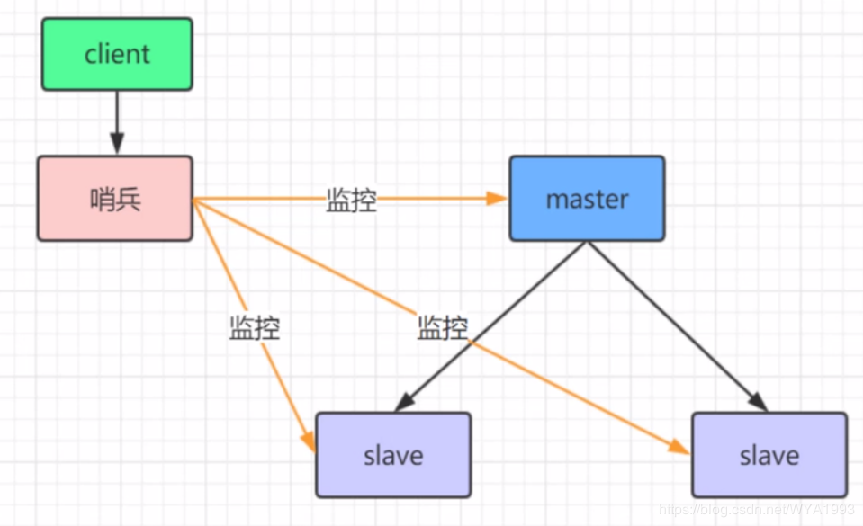
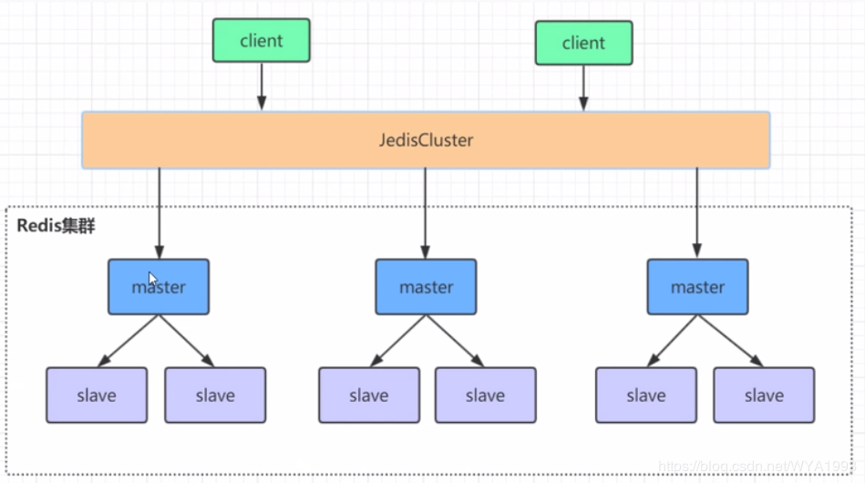

## redis集群模式对比

### 哨兵模式

 

在 redis3.0以前的版本要实现集群一般是借助哨兵 sentinel工具来监控 master节点的状态，如果 master节点异常，则会主从切换，将某一台 slave作为 master，哨兵的配置略微复杂，并且性能和高可用性等各方面表现一般，特別是在主从切换瞬间存在访问瞬断的情况。

### 高可用集群模式

  

redis集群是一个由多个主从节点群组成的分布式服务器群，它具有复制、高可用和分片特性。Reds集群不需要sentinel哨兵也能完成节点移除和故障转移的功能。需要将每个节点设置成集群模式，这种集群模式没有中心点，可水平扩展，据官方文档称可以线性扩展到1000点节。redis集群的性能和高可用性均优于之前版本的哨兵模式，且集群配置非常简单。

这种模式每一个master和各自的slave相当于一个小集群，当其中的master节点挂掉后，会在剩余的slave节点选择一个升级为master节点，当这个小集群所有的节点挂掉则这个小集群不能提供服务了，也就无法访问这个集群中缓存的数据了。

根据压测，redis每秒最高可承受10w或者15w的并发，由于哨兵模式只有一个master节点，所以哨兵模式最高就是10w或者15w的承受能力，而redis-cluster集群可以有多个master节点，所以是要比哨兵模式承压能力强很多的。

现在阿里、京东这些BAT巨头都是使用第二种模式的，所以这篇文章主要介绍redis高可用集群的搭建方式。


## 高可用集群搭建

### 服务器配置


 要让 Redis3.0 集群正常工作至少需要 3 个 Master 节点，要想实现高可用，每个 Master 节点要配备至少 1 个Slave 节点。根据以上特点和要求，进行如下的集群实施规划：使用 3 台服务器（物理机或虚拟机）部署 3 个 Master + 3 个Slave； 

| alias  | IP              |
| ------ | --------------- |
| master | 192.168.172.128 |
| slave1 | 192.168.172.129 |
| slave2 | 192.168.172.130 |


### redis安装

#### 1)  安装gcc

```shell
yum install gcc-c++
```

#### 2)  安装zlib 

```shell
yum -y install zlib zlib-devel
```

#### 3)  下载redis 

```shell
wget http://download.redis.io/releases/redis-4.0.1.tar.gz
tar -zxvf redis-4.0.1.tar.gz
```

#### 4)  安装redis

```shell
mv redis-4.0.1 redis
cd redis
make && make install (确保安装了gcc 和 zlib)
```

#### 5) 确认安装成功

```shell
redis-server -v
```

#### 6) 创建集群文件夹

```shell
mkdir -p /opt/redis/redis-cluster/{6379,6380}
#复制配置信息
cp /opt/redis/redis.conf /opt/redis/redis-cluster/6379/redis-6379.conf
```

#### 7) 修改redis-6379.conf

```
vim /opt/redis/redis-cluster/6379/redis-6379.conf

daemonize yes
port 6379（分别对每个机器的端口号进行设置）
bind 192.168.172.128（必须要绑定当前机器的ip，这里方便redis集群定位机器，不绑定可能会出现循环查找集群节点机器的情况）
dir  /opt/redis/redis-cluster/6379/（指定数据文件存放位置，必须要指定不同的目录位置，不然会丢失数据）
cluster-enabled yes（启动集群模式）
cluster-config-file nodes-6379.conf（这里700x最好和port对应上） 集群内部配置文件，改掉端口号　
cluster-node-timeout 15000 节点超时时间
appendonly yes 写操作写日志
protected-mode no
```

#### 8) 复制配置文件

```shell
cp /opt/redis/redis-cluster/6379/redis-6379.conf /opt/redis/redis-cluster/6380/redis-6380.conf
```

#### 9)  使用批量修改模式修改

```shell
vim /opt/redis/redis-cluster/6380/redis-6380.conf
:%s/6379/6380/g
:wq
```

#### 10) 拷贝到其他服务器

```shell
#将redis文件夹拷贝到slave1、slave2
scp -r /opt/redis root@slave1:/opt/
scp -r /opt/redis root@slave2:/opt/
# 修改各服务器的conf中的bind
vim /opt/redis/redis-cluster/6379/redis-6379.conf
vim /opt/redis/redis-cluster/6380/redis-6380.conf
bind 192.168.172.129
bind 192.168.172.130
```

#### 11) 安装 **redis-trib.rb** 

```shell
# redis-trib.rb环境准备（该文件存在于redis-4.0.1/src/目录中）//只需要在其中一台上执行此步骤！！
# redis-trib.rb是采用Ruby实现的Redis集群管理工具。内部通过Cluster相关命令帮助我们简化集群创建、检查、槽迁移和均衡等常见操作，使用之前需要安装Ruby依赖环境。
# 安装在192.168.172.128
cd /opt
wget http://cache.ruby-lang.org/pub/ruby/2.3/ruby-2.3.5.tar.gz
tar -zxvf  ruby-2.3.5.tar.gz
cd ruby-2.3.5
./configure  --prefix=/opt/ruby
make && make install
ln -s /opt/ruby/bin/ruby /usr/bin/ruby
ln -s /opt/ruby/bin/gem /usr/bin/gem
```

#### 12) 检查ruby是否安装成功

```
ruby -v
```

#### 13)  安装rubygem redis依赖　 

```
wget http://rubygems.org/downloads/redis-3.3.0.gem
gem install -l redis-3.3.0.gem
```

#### 14) 开启redis-server

```shell
# 分别启动 master、slave1、slave2
# 指定conf开启redis
cd /opt/redis/src
./redis-server /opt/redis/redis-cluster/6379/redis-6379.conf
./redis-server /opt/redis/redis-cluster/6380/redis-6380.conf
```

#### 15) 创建集群

```shell
#--replicas参数指定集群中每个主节点配备几个从节点，这里设置为1，每个主节点只有一个从节点。

#这里因为测试，只用了3台机器，如果部署节点使用不同的IP地址，redis-trib-rb会尽可能保证主从节点不分配在同一台机器下，因此会重新排序节点表顺序。节点列表顺序用于确定主从角色，先主节点之后是从节点。创建过程中首先会给出主从节点角色分配的计划

# 注意 不能使用master slave1 slave2
./redis-cli -c -h master -p 6379


```

#### 16) 完整性检查

```shell
[root@master src]# ./redis-trib.rb check master:6379
>>> Performing Cluster Check (using node master:6379)
M: 035218ed678107f601fcd74a35153fd2f88e9e26 master:6379
   slots:0-5460 (5461 slots) master
   1 additional replica(s)
M: a09e1d78620d4d8ac02ab47c5f9548608960cdc5 192.168.172.130:6379
   slots:10923-16383 (5461 slots) master
   1 additional replica(s)
S: 2e84949867da404ce5ef9d584c316f0acb1c53b9 192.168.172.129:6380
   slots: (0 slots) slave
   replicates 035218ed678107f601fcd74a35153fd2f88e9e26
S: adc211d7f014dfdba019b6596e820c2a507db93a 192.168.172.128:6380
   slots: (0 slots) slave
   replicates 45fc5fbd200fdbf679f25b4575008818dd163e0f
M: 45fc5fbd200fdbf679f25b4575008818dd163e0f 192.168.172.129:6379
   slots:5461-10922 (5462 slots) master
   1 additional replica(s)
S: 2e85e8c7dd73f55128e1c956c5ffd49b0a1a9cfb 192.168.172.130:6380
   slots: (0 slots) slave
   replicates a09e1d78620d4d8ac02ab47c5f9548608960cdc5
[OK] All nodes agree about slots configuration.
>>> Check for open slots...
>>> Check slots coverage...
[OK] All 16384 slots covered.

```

#### 17) 连接一个结点测试

```shell
[root@master src]# ./redis-cli -c -h master -p 6379
master:6379> set test:name yangweifeng
-> Redirected to slot [12554] located at 192.168.172.130:6379
OK

```

#### 18) 查看集群信息

```
cluster info 查看集群信息 cluster nodes 查看节点信息
```

#### 19）kill 掉一个结点查看进程变化

```shell
ps -ef|grep redis 

#kill 掉端口为6379的redis
cluster nodes #询结点变化

d94b0325279de460c90431cff558ddc18d7629f4 192.168.172.129:6379@16379 master - 0 1574323888061 3 connected 5461-10922
d19e902ba317e32db13f9367dcd95734d12d811f 192.168.172.130:6380@16380 slave 19cd8cd3db09ac339e49935a00266e7ac185c8e6 0 1574323887000 6 connected
19cd8cd3db09ac339e49935a00266e7ac185c8e6 192.168.172.130:6379@16379 master - 0 1574323887054 5 connected 10923-16383
e5c66421daff6ccdf9890242e366823ef39d29fe 192.168.172.129:6380@16380 master - 0 1574323889066 7 connected 0-5460
757dc54c4d28093acb6a640d110dbc111723cf6a 192.168.172.128:6380@16380 myself,slave d94b0325279de460c90431cff558ddc18d7629f4 0 1574323886000 2 connected
fbb7a4b55d4d840a6f26392db590a07297a61bf2 192.168.172.128:6379@16379 master,fail - 1574323870829 1574323869000 1 disconnected
```


## redis集群问题集

### 集群是如何判断是否有某个节点挂掉

　　首先要说的是，每一个节点都存有这个集群所有主节点以及从节点的信息。它们之间通过互相的ping-pong判断是否节点可以连接上。如果有一半以上的节点去ping一个节点的时候没有回应，集群就认为这个节点宕机了，然后去连接它的备用节点。

 

### 集群进入fail状态的必要条件

A、某个主节点和所有从节点全部挂掉，我们集群就进入faill状态。

B、如果集群超过半数以上master挂掉，无论是否有slave，集群进入fail状态.

 C、如果集群任意master挂掉,且当前master没有slave.集群进入fail状态

 

### redis集群去中心化（所有Master节点并发处理读写）

集群中原则每个Master节点都有一个或多个Slave节点。集群中所有的Master节点都可以进行读写数据，不分主次，记redis集群式去中心化的。每个Master节点与Slave节点间通过Goossip协议内部通信，异步复制。不用我们瞎操心（所有的redis节点彼此互联(PING-PONG机制),内部使用二进制协议优化传输速度和带宽.），但是异步赋值会导致某些特定情况下的数据丢失，即，redis集群不能保证数据的强一致性

 

### redis集群的分区规则：虚拟槽分区(槽：slot)

RedisCluster采用此分区，所有的键根据哈希函数(CRC16[key]&16383)映射到0－16383槽内，共16384个槽位，每个节点维护部分槽及槽所映射的键值数据

  哈希函数: Hash()=CRC16[key]&16383 按位与

**redis用虚拟槽分区原因：解耦数据与节点关系，节点自身维护槽映射关系，分布式存储**

 

### redisCluster的缺陷（虚拟槽分区的缺点）

a，键的批量操作支持有限，比如mset, mget，如果多个键映射在不同的槽，就不支持了

b，键事务支持有限，当多个key分布在不同节点时无法使用事务，同一节点是支持事务

c，键是数据分区的最小粒度，不能将一个很大的键值对映射到不同的节点

d，不支持多数据库

e，复制结构只支持单层结构，不支持树型结构。 

 

### 客户端与redis集群交互方式

由于Cluster架构中无Proxy层，客户端是直接与集群中的任意可用节点直接交互的，【话是这么说，但是一个请求是怎么找到集群中的一个节点的呢，redis有多种策略，一般使用CRC16去hash(key)计算改请求要分配到具体的哪一个节点上。然后才是 客户端与节点的直接操作】对象保存到Redis之前先经过CRC16哈希到一个指定的Node上


