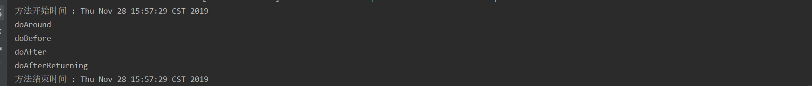

**pom.xml 添加aop依赖**

```xml
<dependency>
    <groupId>org.springframework.boot</groupId>
    <artifactId>spring-boot-starter-aop</artifactId>
</dependency>
```


## 方法一：创建切面

**新建类LogAspect**

```java
package com.ywf.srpingbootproject.aspect;

import org.aspectj.lang.JoinPoint;
import org.aspectj.lang.ProceedingJoinPoint;
import org.aspectj.lang.annotation.*;
import org.springframework.stereotype.Component;

@Component
@Aspect
public class LogAspect {

    /**
     * 切入点，其中execution用于使用切面的连接点。
     * 使用方法：execution(方法修饰符(可选) 返回类型 方法名 参数 异常模式(可选)) ，
     */
    @Pointcut("execution(public * com.ywf.srpingbootproject.controller.*.*(..))")
    public void LogAspect() {
    }

    /**
     * 在方法前执行
     *
     * @param joinPoint JoinPoint包含了类名，被切面的方法名，参数等信息。
     */
    @Before("LogAspect()")
    public void doBefore(JoinPoint joinPoint) {
        System.out.println("doBefore");
    }

    /**
     * 在方法后执行
     */
    @After("LogAspect()")
    public void doAfter(JoinPoint joinPoint) {
        System.out.println("doAfter");
    }

    /**
     * 在方法执行后返回一个结果后执行
     *
     * @param joinPoint
     */
    @AfterReturning("LogAspect()")
    public void doAfterReturning(JoinPoint joinPoint) {
        System.out.println("doAfterReturning");
    }

    /**
     * 在方法执行过程中抛出异常的时候执行
     *
     * @param joinPoint
     */
    @AfterThrowing("LogAspect()")
    public void doAfterThrowing(JoinPoint joinPoint) {
        System.out.println("doAfterThrowing");
    }

    /**
     * 环绕通知，就是可以在执行前后都使用，
     *
     * @param joinPoint
     * @return
     * @throws Throwable
     */
    @Around("LogAspect()")
    public Object doAround(ProceedingJoinPoint joinPoint) throws Throwable {
        System.out.println("doAround");
        // 被切面的方法
        return joinPoint.proceed();
    }
}
```


## 方法二：自定义注解使用aop

**新建注解  DoneTime**

```java
package com.ywf.srpingbootproject.annotation;

import java.lang.annotation.ElementType;
import java.lang.annotation.Retention;
import java.lang.annotation.RetentionPolicy;
import java.lang.annotation.Target;

@Target({ElementType.METHOD, ElementType.TYPE})
@Retention(RetentionPolicy.RUNTIME)
public @interface DoneTime {
    String value() default "";
}
```

**新建自定义注解对应的界面**

```java
package com.ywf.srpingbootproject.aspect;

import com.ywf.srpingbootproject.annotation.DoneTime;
import org.aspectj.lang.ProceedingJoinPoint;
import org.aspectj.lang.annotation.Around;
import org.aspectj.lang.annotation.Aspect;
import org.springframework.stereotype.Component;

import java.util.Date;

@Aspect
@Component
public class DoneTimeAspect {

    @Around("@annotation(doneTime)")
    public Object around(ProceedingJoinPoint joinPoint, DoneTime doneTime) throws  Throwable{
        System.out.println("方法开始时间 : " + new Date());
        Object o = joinPoint.proceed();
        System.out.println("方法结束时间 : " + new Date());
        System.out.println("doneTime : " + doneTime.value());
        return o;
    }
}

```

**Controller设置注解**

```java
package com.ywf.srpingbootproject.controller;

import com.ywf.srpingbootproject.annotation.DoneTime;
import org.springframework.web.bind.annotation.RequestMapping;
import org.springframework.web.bind.annotation.RestController;

import java.util.Map;

@RestController
public class IndexController {

    @RequestMapping("/")
    public String index() {
        return "index";
    }

    @RequestMapping("/testError")
    public String testError() {
        Map map = null;
        return map.toString();
    }

    @RequestMapping("/testDoneTime")
    @DoneTime("IndexController")
    public String testDoneTime() {
        return "doneTime";
    }
}
```


浏览器访问 [localhost:8080/testDoneTime](localhost:8080/testDone)




