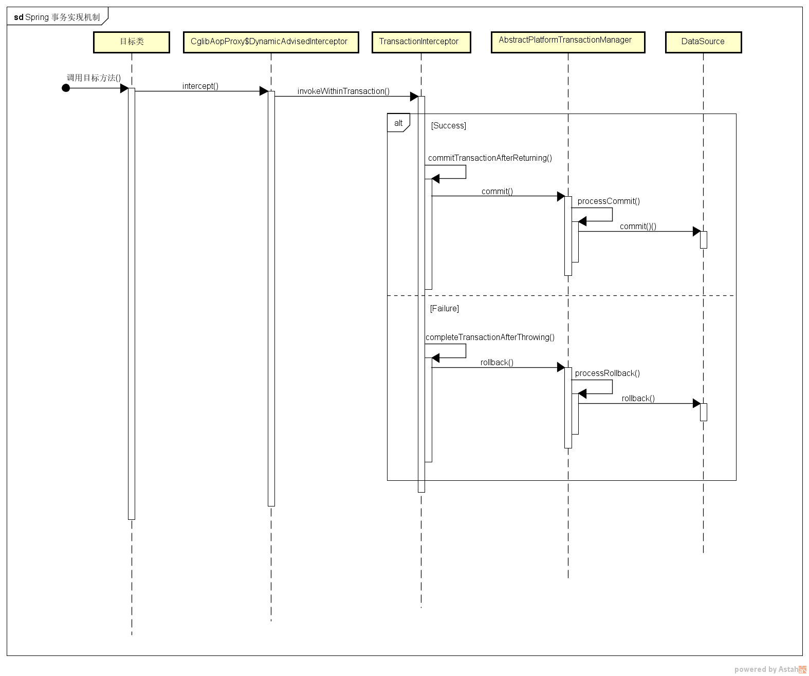
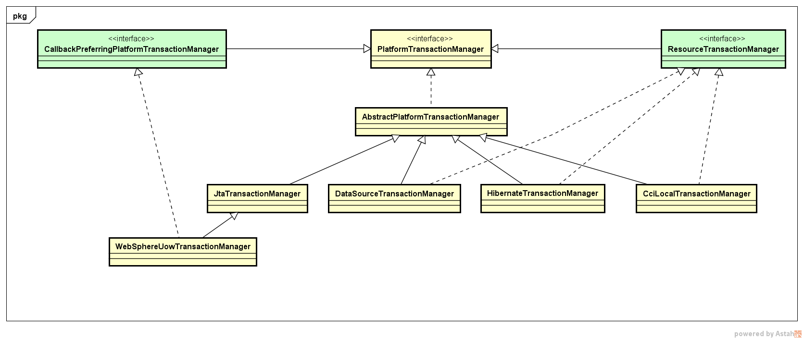

# SpringBoot使用事务

### 一：方法添加@Transactional

```java
@Transactional(rollbackFor = Exception.class)
public void insertUser(String username) {
    User u = new User();
    u.setUser_name(username);
    u.setUser_password("1");
    userMapper.insertUser(u);
    // 测试异常
    int i = 1/0;
}
```

**@Transactional 注解的属性介绍**

**propagation** 属性(以下面有详细解说)
事务的传播行为，默认值为 Propagation.REQUIRED。

事务的传播说明
**@Transactional(propagation = Propagation.REQUIRED)**

其中,Propagation有7个常量值,常用的有REQUIRED和SUPPORTS,下面是各种值的解释:

**PROPAGATION_REQUIRED**:如果当前没有事务，就新建一个事务，如果已经存在一个事务中，加入到这个事务中。这是最常见的选择。
**PROPAGATION_SUPPORTS**:支持当前事务，如果当前没有事务，就以非事务方式执行。
**PROPAGATION_MANDATORY**:使用当前的事务，如果当前没有事务，就抛出异常。
**PROPAGATION_REQUIRES_NEW**:新建事务，如果当前存在事务，把当前事务挂起。
**PROPAGATION_NOT_SUPPORTED**:以非事务方式执行操作，如果当前存在事务，就把当前事务挂起。
**PROPAGATION_NEVER**:以非事务方式执行，如果当前存在事务，则抛出异常。
**PROPAGATION_NESTED**:如果当前存在事务，则在嵌套事务内执行。如果当前没有事务，则执行REQUIRED类似操作。

**isolation** 属性
事务的隔离级别，默认值为 Isolation.DEFAULT。
可选的值有：

**Isolation.DEFAULT** 使用底层数据库默认的隔离级别。
**Isolation.READ_UNCOMMITTED(读未提交)**

```
在一个事务中，可以读取到其他事务未提交的数据变化，这种读取其他会话还没提交的事务，叫做脏读现象，在生产环境中切勿使用。
```

**Isolation.READ_COMMITTED**(读已提交)

```
在一个事务中，可以读取到其他事务已经提交的数据变化，这种读取也就叫做不可重复读，因为两次同样的查询可能会得到不一样的结果。
```

**Isolation.REPEATABLE_READ(可重复读)**

```
MySQL默认隔离级别，在一个事务中，直到事务结束前，都可以反复读取到事务刚开始时看到的数据，并一直不会发生变化，避免了脏读、不可重复读现象，但是它还是无法解决幻读问题。
```

**Isolation.SERIALIZABLE**

```
这是最高的隔离级别，它强制事务串行执行，避免了前面说的幻读现象，简单来说，它会在读取的每一行数据上都加锁，所以可能会导致大量的超时和锁争用问题。
```

#### 隔离级别一览表

| 隔离级别 | 读数据一致性                           | 脏读 | 不可重复读 | 幻读 |
| -------- | -------------------------------------- | ---- | ---------- | ---- |
| 未提交读 | 最低级别，只保证不读取物理上损坏的数据 | 有   | 有         | 有   |
| 已提交读 | 语句级                                 | 无   | 有         | 有   |
| 可重复读 | 事务级                                 | 无   | 无         | 有   |
| 可串行化 | 最高级别，事务级                       | 无   | 无         | 无   |

 

**timeout** 属性
事务的超时时间，默认值为-1。如果超过该时间限制但事务还没有完成，则自动回滚事务。

**readOnly** 属性
指定事务是否为只读事务，默认值为 false；为了忽略那些不需要事务的方法，比如读取数据，可以设置 read-only 为 true。

**rollbackFor** 属性
用于指定能够触发事务回滚的异常类型，可以指定多个异常类型。

**noRollbackFor** 属性
抛出指定的异常类型，不回滚事务，也可以指定多个异常类型。


### 二：使用aop切面添加事务

```java
package com.ywf.srpingbootproject.configuration;

import org.springframework.aop.Advisor;
import org.springframework.aop.aspectj.AspectJExpressionPointcut;
import org.springframework.aop.support.DefaultPointcutAdvisor;
import org.springframework.beans.factory.annotation.Autowired;
import org.springframework.context.annotation.Bean;
import org.springframework.context.annotation.Configuration;
import org.springframework.transaction.PlatformTransactionManager;
import org.springframework.transaction.TransactionDefinition;
import org.springframework.transaction.interceptor.*;

import java.util.Collections;
import java.util.HashMap;
import java.util.Map;

@Configuration
public class TxAnotationConfig {
    private static final int TX_METHOD_TIMEOUT = 5;
    private static final String AOP_POINTCUT_EXPRESSION = "com.ywf.srpingbootproject.service";

    @Autowired
    private PlatformTransactionManager transactionManager;

    @Bean
    public TransactionInterceptor txAdvice() {
        NameMatchTransactionAttributeSource source = new NameMatchTransactionAttributeSource();
        /*只读事务，不做更新操作*/
        RuleBasedTransactionAttribute readOnlyTx = new RuleBasedTransactionAttribute();
        readOnlyTx.setReadOnly(true);
        readOnlyTx.setPropagationBehavior(TransactionDefinition.PROPAGATION_NOT_SUPPORTED );
        /*当前存在事务就使用当前事务，当前不存在事务就创建一个新的事务*/
        RuleBasedTransactionAttribute requiredTx = new RuleBasedTransactionAttribute();
        requiredTx.setRollbackRules(
                Collections.singletonList(new RollbackRuleAttribute(Exception.class)));
        requiredTx.setPropagationBehavior(TransactionDefinition.PROPAGATION_REQUIRED);
        requiredTx.setTimeout(TX_METHOD_TIMEOUT);
        Map<String, TransactionAttribute> txMap = new HashMap<>();
        txMap.put("add*", requiredTx);
        txMap.put("save*", requiredTx);
        txMap.put("insert*", requiredTx);
        txMap.put("update*", requiredTx);
        txMap.put("delete*", requiredTx);
        txMap.put("get*", readOnlyTx);
        txMap.put("query*", readOnlyTx);
        source.setNameMap( txMap );
        TransactionInterceptor txAdvice = new TransactionInterceptor(transactionManager, source);
        return txAdvice;
    }

    @Bean
    public Advisor txAdviceAdvisor() {
        AspectJExpressionPointcut pointcut = new AspectJExpressionPointcut();
        pointcut.setExpression(AOP_POINTCUT_EXPRESSION);
        return new DefaultPointcutAdvisor(pointcut, txAdvice());
    }
}
```


### 事务传播方式讲解

#### 情况一

```java
@Transactional(propagation = Propagation.REQUIRED)
public void outer(){
}
```

outer方法在不同事务的传播等级下的回滚(outer方法发生异常)情况如下

| 传播等级 | **REQUIRED** | **SUPPORTS** | **MANDATORY**    | **REQUIRES_NEW** | **NOT_SUPPORTED** | **NEVER** | **NESTED** |
| -------- | ------------ | ------------ | ---------------- | ---------------- | ----------------- | --------- | ---------- |
| 是否回滚 | 是           | 否           | 在进入方法前报错 | 是               | 否                | 否        | 是         |

#### 情况二

```java
class Out{
    @Transactional(propagation = Propagation.NESTED)
    public void outer(){
        In.inner();
        ......
        throw new NullPointerException();
    }
}

class In{
    @Transactional(propagation = Propagation.REQUIRED)
    public void inner(){
        ......
    }
}
```

- 在outer方法以非事务方式执行

  inner回滚情况跟`情况一类似`

  而且inner的回滚不会导致outer的回滚,无论什么情况outer都不会回滚

- 在outer方法以事务方式执行,且outer发生异常的情况下

  `outer都会回滚`

  `inner回滚如下表`


| **inner的**传播等级 | **REQUIRED** | **SUPPORTS** | **MANDATORY** | **REQUIRES_NEW** | **NOT_SUPPORTED** | **NEVER**      | **NESTED** |
| ------------------- | ------------ | ------------ | ------------- | ---------------- | ----------------- | -------------- | ---------- |
| 是否回滚            | 是           | 是           | 是            | 否               | 否                | 执行方法前报错 | 是         |

在outer方法以事务方式执行,且inner发生异常的情况下

```
outer都会回滚,因为inner方法抛出异常会导致outer也抛出异常触发回滚
inner因为NOT_SUPPORTED才非事务执行所以不回滚,NEVER执行方法时会出现异常,其它的都会回滚
```

```
总结:

以事务执行的情况下以发生异常必定会回滚,非事务执行不回滚

同一个事务的情况下,任何一个方法发生异常,都会导致同一事务的所有方法回滚

不同事务的方法发生异常,不会互相影响
```


### @Transactional 事务实现机制

在应用系统调用声明了 @Transactional 的目标方法时，Spring Framework 默认使用 AOP 代理，在代码运行时生成一个代理对象，根据 @Transactional 的属性配置信息，这个代理对象决定该声明 @Transactional 的目标方法是否由拦截器 TransactionInterceptor 来使用拦截，在 TransactionInterceptor 拦截时，会在目标方法开始执行之前创建并加入事务，并执行目标方法的逻辑, 最后根据执行情况是否出现异常，利用抽象事务管理器 AbstractPlatformTransactionManager 操作数据源 DataSource 提交或回滚事务。

Spring AOP 代理有 CglibAopProxy 和 JdkDynamicAopProxy 两种，以 CglibAopProxy 为例，对于 CglibAopProxy，需要调用其内部类的 DynamicAdvisedInterceptor 的 intercept 方法。对于 JdkDynamicAopProxy，需要调用其 invoke 方法。


正如上文提到的，事务管理的框架是由抽象事务管理器 AbstractPlatformTransactionManager 来提供的，而具体的底层事务处理实现，由 PlatformTransactionManager 的具体实现类来实现，如事务管理器 DataSourceTransactionManager。不同的事务管理器管理不同的数据资源 DataSource，比如 DataSourceTransactionManager 管理 JDBC 的 Connection。
