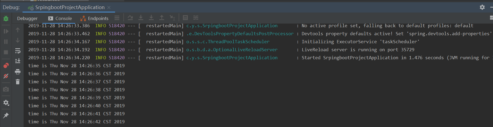

springboot整合定时任务其实就两点，
1.创建一个能被定时任务类，方法上加入@Scheduled注解
2.在启动类application上加入@EnableScheduling注解

代码如下，pom文件我只加入了devtools，其实不加入也可以

```xml
<?xml version="1.0" encoding="UTF-8"?>
<project xmlns="http://maven.apache.org/POM/4.0.0" xmlns:xsi="http://www.w3.org/2001/XMLSchema-instance"
         xsi:schemaLocation="http://maven.apache.org/POM/4.0.0 https://maven.apache.org/xsd/maven-4.0.0.xsd">
    <modelVersion>4.0.0</modelVersion>
    <parent>
        <groupId>org.springframework.boot</groupId>
        <artifactId>spring-boot-starter-parent</artifactId>
        <version>2.2.1.RELEASE</version>
        <relativePath/> <!-- lookup parent from repository -->
    </parent>
    <groupId>com.ywf</groupId>
    <artifactId>srpingboot-project</artifactId>
    <version>0.0.1-SNAPSHOT</version>
    <name>srpingboot-project</name>
    <description>Demo project for Spring Boot</description>

    <properties>
        <java.version>1.8</java.version>
    </properties>

    <dependencies>
        <dependency>
            <groupId>org.springframework.boot</groupId>
            <artifactId>spring-boot-starter</artifactId>
        </dependency>

        <dependency>
            <groupId>org.springframework.boot</groupId>
            <artifactId>spring-boot-starter-test</artifactId>
            <scope>test</scope>
            <exclusions>
                <exclusion>
                    <groupId>org.junit.vintage</groupId>
                    <artifactId>junit-vintage-engine</artifactId>
                </exclusion>
            </exclusions>
        </dependency>
        <dependency>
            <groupId>org.springframework.boot</groupId>
            <artifactId>spring-boot-devtools</artifactId>
            <scope>runtime</scope>
        </dependency>
    </dependencies>

    <build>
        <plugins>
            <plugin>
                <groupId>org.springframework.boot</groupId>
                <artifactId>spring-boot-maven-plugin</artifactId>
            </plugin>
        </plugins>
    </build>

</project>
```

 application类代码如下： 

```java
package com.ywf.srpingbootproject;

import org.springframework.boot.SpringApplication;
import org.springframework.boot.autoconfigure.SpringBootApplication;
import org.springframework.scheduling.annotation.EnableScheduling;

@SpringBootApplication
@EnableScheduling
public class SrpingbootProjectApplication {

    public static void main(String[] args) {
        SpringApplication.run(SrpingbootProjectApplication.class, args);
    }

}
```

 定时任务类TestSchedule代码如下：

```java
package com.ywf.srpingbootproject.schedule;

import org.springframework.scheduling.annotation.Scheduled;
import org.springframework.stereotype.Component;

import java.util.Date;

@Component
public class TestSchedule {

    @Scheduled(cron = "0/1 * * * * ?")
    public void test() {
        System.out.println("time is " + new Date());
    }
}
```



