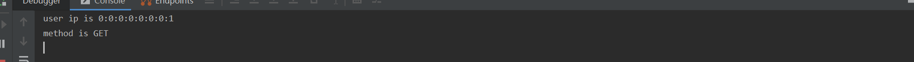

在实际开发中，总存在着这样的场景，比如拦截请求的ip地址，或者在所有的请求都返回相同的数据，如果每一个方法都写出相同数据固然可以实现，但是随着项目的变大，重复的代码会越来越多，所以在这种情况我们可以用拦截器来实现。


**新建一个拦截器CommonInterceptor，继承HandlerInterceptorAdapter。**

给大家说一下，在继承HandlerInterceptorAdapter有三个拦截器是经常使用的：
**preHandle**：在业务处理器处理请求之前被调用
**postHandle**：在业务处理器处理请求执行完成后,生成视图之前执行
**afterCompletion**：在DispatcherServlet完全处理完请求后被调用 

```java
package com.ywf.srpingbootproject.interceptor;

import org.springframework.stereotype.Component;
import org.springframework.web.servlet.ModelAndView;
import org.springframework.web.servlet.handler.HandlerInterceptorAdapter;

import javax.servlet.http.HttpServletRequest;
import javax.servlet.http.HttpServletResponse;

@Component
public class CommonInterceptor extends HandlerInterceptorAdapter {

    /**
     * preHandle在业务处理器处理请求之前被调用，
     * postHandle在业务处理器处理请求执行完成后,生成视图之前执行
     * afterCompletion在DispatcherServlet完全处理完请求后被调用
     *
     * @param request
     * @param response
     * @param handler
     * @param modelAndView
     * @throws Exception
     */
    @Override
    public void postHandle(HttpServletRequest request, HttpServletResponse response, Object handler, ModelAndView modelAndView) throws Exception {
        // 记录用户IP
        System.out.println("user ip is " + request.getRemoteAddr());

        // 记录调用的方法
        System.out.println("method is " + request.getMethod());

    }
}
```

①implements WebMvcConfigurer（官方推荐）

②extends WebMvcConfigurationSupport（不推荐，方法都要重写）

```java
package com.ywf.srpingbootproject.configuration;

import com.ywf.srpingbootproject.interceptor.CommonInterceptor;
import org.springframework.beans.factory.annotation.Autowired;
import org.springframework.context.annotation.Configuration;
import org.springframework.web.servlet.config.annotation.InterceptorRegistry;
import org.springframework.web.servlet.config.annotation.WebMvcConfigurer;

@Configuration
public class WebMvcConfig implements WebMvcConfigurer {

    /**
     * 注入拦截器
     */
    @Autowired
    private CommonInterceptor commonInterceptor;

    @Override
    public void addInterceptors(InterceptorRegistry registry) {
        registry.addInterceptor(commonInterceptor).addPathPatterns("/*");
    }

}
```

访问浏览器[localhost:8080](localhost:8080),查看控制台



