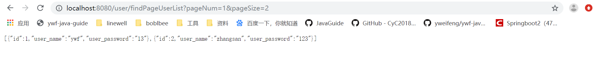
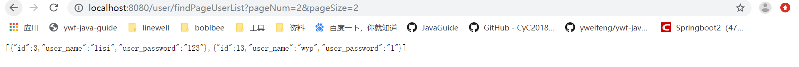

### pom.xml引入依赖

```xml
<dependency>
    <groupId>com.github.pagehelper</groupId>
    <artifactId>pagehelper-spring-boot-starter</artifactId>
    <version>1.2.5</version>
</dependency>
```

### 修改application.properties

```properties
#pagehelper分页插件配置
pagehelper.helperDialect=mysql
```

### UserController

```java
package com.ywf.srpingbootproject.controller;

import com.github.pagehelper.Page;
import com.ywf.srpingbootproject.entity.User;
import com.ywf.srpingbootproject.service.IUserService;
import io.swagger.annotations.Api;
import io.swagger.annotations.ApiOperation;
import org.springframework.beans.factory.annotation.Autowired;
import org.springframework.web.bind.annotation.PathVariable;
import org.springframework.web.bind.annotation.RequestMapping;
import org.springframework.web.bind.annotation.RequestParam;
import org.springframework.web.bind.annotation.RestController;

import java.util.List;

@RestController
@RequestMapping("/user")
@Api(value = "用户控制层",tags = {"用户操作"})
public class UserController {

    @Autowired
    private IUserService userService;

    @ApiOperation(value = "分页获取用户列表",notes = "分页获取用户列表")
    @RequestMapping("/findPageUserList")
    public Page<User> findPageUserList(@RequestParam int pageNum, @RequestParam int pageSize) {
        return userService.findPageUserList(pageNum, pageSize);
    }
}
```

### IUserService

```java
package com.ywf.srpingbootproject.service;

import com.github.pagehelper.Page;
import com.ywf.srpingbootproject.entity.User;

import java.util.List;

public interface IUserService {

    Page<User> findPageUserList(int pageNum, int pageSize);
}
```

### UserServiceImpl

```java
package com.ywf.srpingbootproject.service.impl;

import com.github.pagehelper.Page;
import com.github.pagehelper.PageHelper;
import com.ywf.srpingbootproject.dao.UserMapper;
import com.ywf.srpingbootproject.entity.User;
import com.ywf.srpingbootproject.service.IUserService;
import org.springframework.beans.factory.annotation.Autowired;
import org.springframework.stereotype.Service;

import java.util.List;

@Service
public class UserServiceImpl implements IUserService {

    @Autowired
    private UserMapper userMapper;

    @Override
    public Page<User> findPageUserList(int pageNum, int pageSize) {
        PageHelper.startPage(pageNum, pageSize);
        Page<User> records = userMapper.findUserList();
        return records;
    }
}
```

### UserMapper

```java
package com.ywf.srpingbootproject.dao;

import com.github.pagehelper.Page;
import com.ywf.srpingbootproject.entity.User;
import org.apache.ibatis.annotations.Mapper;
import org.apache.ibatis.annotations.Select;

@Mapper
public interface UserMapper {

    @Select("SELECT * FROM USER")
    Page<User> findUserList();
}

```

### 启动应用，浏览器访问

[localhost:8080/user/findPageUserList?pageNum=1&pageSize=2](localhost:8080/user/findPageUserList?pageNum=1&pageSize=2)



[localhost:8080/user/findPageUserList?pageNum=2&pageSize=2](localhost:8080/user/findPageUserList?pageNum=2&pageSize=2)

