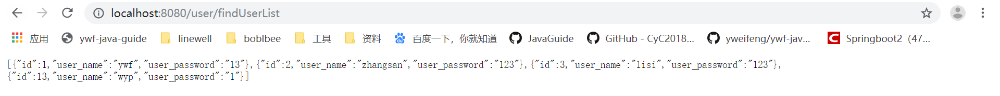

### pom.xml添加依赖

```xml
<dependency>
    <groupId>com.baomidou</groupId>
    <artifactId>mybatisplus-spring-boot-starter</artifactId>
    <version>1.0.5</version>
</dependency>
<dependency>
    <groupId>com.baomidou</groupId>
    <artifactId>mybatis-plus</artifactId>
    <version>2.3</version>
</dependency>
```

### 修改application.properties

```properties
#mybatis-plus mapper xml 文件地址
mybatis-plus.mapper-locations=classpath*:mapper/*Mapper.xml
#mybatis-plus type-aliases 文件地址
mybatis-plus.type-aliases-package=com.ywf.srpingbootproject.entity
#会自动将下划线格式的表字段，转换为以驼峰格式命名的属性
mybatis-plus.configuration.map-underscore-to-camel-case: true
```

### 新建MybatisPlusConfig

```java
package com.ywf.srpingbootproject.configuration;

import com.baomidou.mybatisplus.plugins.PaginationInterceptor;
import org.springframework.context.annotation.Bean;
import org.springframework.context.annotation.Configuration;

@Configuration
public class MybatisPlusConfig {
    @Bean
    public PaginationInterceptor paginationInterceptor(){
        PaginationInterceptor page = new PaginationInterceptor();
        //设置方言类型
        page.setDialectType("mysql");
        return page;
    }
}
```

### UserController新增方法

```java
package com.ywf.srpingbootproject.controller;

import com.ywf.srpingbootproject.entity.User;
import com.ywf.srpingbootproject.service.IUserService;
import io.swagger.annotations.Api;
import io.swagger.annotations.ApiOperation;
import org.springframework.beans.factory.annotation.Autowired;
import org.springframework.web.bind.annotation.PathVariable;
import org.springframework.web.bind.annotation.RequestMapping;
import org.springframework.web.bind.annotation.RequestParam;
import org.springframework.web.bind.annotation.RestController;

import java.util.List;

@RestController
@RequestMapping("/user")
@Api(value = "用户控制层",tags = {"用户操作"})
public class UserController {

    @Autowired
    private IUserService userService;

    @ApiOperation(value = "获取用户列表",notes = "获取用户列表")
    @RequestMapping("/findUserList")
    public List<User> findUserList() {
        return userService.findUserList();
    }
}
```

### IUserService新增接口

```java
package com.ywf.srpingbootproject.service;

import com.ywf.srpingbootproject.entity.User;

import java.util.List;

public interface IUserService {

    List<User> findUserList();
}
```

### UserServiceImpl实现方法

```java
package com.ywf.srpingbootproject.service.impl;

import com.ywf.srpingbootproject.dao.UserPlusMapper;
import com.ywf.srpingbootproject.entity.User;
import com.ywf.srpingbootproject.service.IUserService;
import org.springframework.beans.factory.annotation.Autowired;
import org.springframework.stereotype.Service;

import java.util.List;

@Service
public class UserServiceImpl implements IUserService {

    @Autowired
    private UserPlusMapper userPlusMapper;

    @Override
    public List<User> findUserList() {
        return userPlusMapper.findUserList();
    }
}
```

### 新建UserPlusMapper

```java
package com.ywf.srpingbootproject.dao;

import com.baomidou.mybatisplus.mapper.BaseMapper;
import com.ywf.srpingbootproject.entity.User;
import org.apache.ibatis.annotations.Mapper;

import java.util.List;

@Mapper
public interface UserPlusMapper extends BaseMapper<User> {
    List<User> findUserList();
}
```

### 新建UserPlusMapper.xml

```xml
<?xml version="1.0" encoding="UTF-8" ?>
<!DOCTYPE mapper PUBLIC "-//mybatis.org//DTD Mapper 3.0//EN" "http://mybatis.org/dtd/mybatis-3-mapper.dtd" >
<mapper namespace="com.ywf.srpingbootproject.dao.UserPlusMapper">

    <select id="findUserList" resultType="com.ywf.srpingbootproject.entity.User">
        SELECT  * FROM USER
    </select>
</mapper>
```

### 启动应用，浏览器访问

[localhost:8080/user/findUserList](localhost:8080/user/findUserList)

