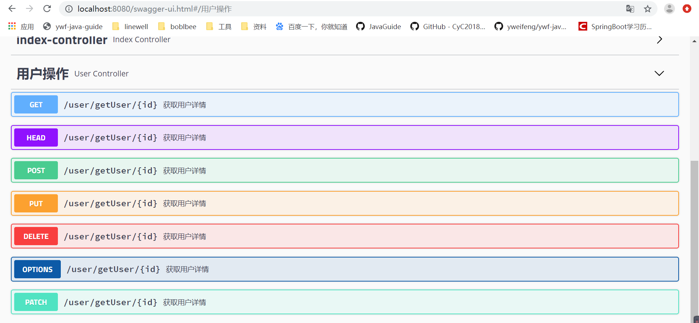

### pom.xml添加依赖

```xml
<dependency>
     <groupId>io.springfox</groupId>
     <artifactId>springfox-swagger2</artifactId>
     <version>2.9.2</version>
</dependency>
<dependency>
    <groupId>io.springfox</groupId>
    <artifactId>springfox-swagger-ui</artifactId>
    <version>2.9.2</version>
</dependency>
<dependency>
    <groupId>org.springframework.boot</groupId>
    <artifactId>spring-boot-starter-web</artifactId>
</dependency>
```


### 新建 Swagger2Config 

```java
package com.ywf.srpingbootproject.configuration;

import org.springframework.context.annotation.Bean;
import org.springframework.context.annotation.Configuration;
import springfox.documentation.builders.ApiInfoBuilder;
import springfox.documentation.builders.PathSelectors;
import springfox.documentation.builders.RequestHandlerSelectors;
import springfox.documentation.service.ApiInfo;
import springfox.documentation.spi.DocumentationType;
import springfox.documentation.spring.web.plugins.Docket;
import springfox.documentation.swagger2.annotations.EnableSwagger2;

@Configuration
@EnableSwagger2
public class Swagger2Config {
    @Bean
    public Docket createRestApi() {
        return new Docket(DocumentationType.SWAGGER_2)
                .apiInfo(apiInfo())
                .select()
                .apis(RequestHandlerSelectors.basePackage("com.ywf.srpingbootproject.controller"))
                .paths(PathSelectors.any())
                .build();
    }

    private ApiInfo apiInfo() {
        return new ApiInfoBuilder()
                .title("使用Swagger2构建RESTful APIs")
                .description("关注博主博客：https://yweifeng.github.io/ywf-java-guide/")
                .termsOfServiceUrl("https://yweifeng.github.io/ywf-java-guide/")
                .contact("ywf")
                .version("1.0")
                .build();
    }
}
```


### Controller添加Swagger2注解

```java
package com.ywf.srpingbootproject.controller;

import com.ywf.srpingbootproject.entity.User;
import com.ywf.srpingbootproject.service.IUserService;
import io.swagger.annotations.Api;
import io.swagger.annotations.ApiOperation;
import org.springframework.beans.factory.annotation.Autowired;
import org.springframework.web.bind.annotation.PathVariable;
import org.springframework.web.bind.annotation.RequestMapping;
import org.springframework.web.bind.annotation.RestController;

@RestController
@RequestMapping("/user")
@Api(value = "用户控制层",tags = {"用户操作"})
public class UserController {

    @Autowired
    private IUserService userService;

    @RequestMapping("/getUser/{id}")
    @ApiOperation(value = "根据用户id获取用户详情",notes = "根据用户id获取用户详情")
    public User getUser(@PathVariable int id) {
        User user = userService.getUser(id);
        return user;
    }
}
```

### 启动应用，浏览器访问

[localhost:8080/swagger-ui.html](localhost:8080/swagger-ui.html)

