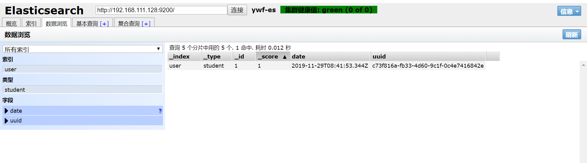

# SpringBoot整合elasticsearch

 spring-data-elasticsearch暂不支持elasticsearch6.0以上版本 

### Deprecated in 7.0.0.

The `TransportClient` is deprecated in favour of the [Java High Level REST Client](https://links.jianshu.com/go?to=https%3A%2F%2Fwww.elastic.co%2Fguide%2Fen%2Felasticsearch%2Fclient%2Fjava-rest%2F7.1%2Fjava-rest-high.html) and will be removed in Elasticsearch 8.0. The [migration guide](https://links.jianshu.com/go?to=https%3A%2F%2Fwww.elastic.co%2Fguide%2Fen%2Felasticsearch%2Fclient%2Fjava-rest%2F7.1%2Fjava-rest-high-level-migration.html) describes all the steps needed to migrate.

后续不支持**`TransportClient`** 方式，使用**High Level Java REST Client** 

### pom.xml引入依赖

```xml
<dependency>
    <groupId>org.elasticsearch</groupId>
    <artifactId>elasticsearch</artifactId>
</dependency>
<dependency>
    <groupId>org.elasticsearch.client</groupId>
    <artifactId>elasticsearch-rest-high-level-client</artifactId>
    <version>6.8.5</version>
</dependency>
```

### 修改application.properties

```properties
# 集群逗号隔开
elasticsearch.ip=192.168.111.128:9200,192.168.111.129:9200,192.168.111.130:9200
```

### 新建EsConfig

```java
package com.ywf.srpingbootproject.configuration;

import com.baomidou.mybatisplus.toolkit.StringUtils;
import org.apache.http.HttpHost;
import org.elasticsearch.client.RestClient;
import org.elasticsearch.client.RestClientBuilder;
import org.elasticsearch.client.RestHighLevelClient;
import org.springframework.beans.factory.annotation.Autowired;
import org.springframework.beans.factory.annotation.Value;
import org.springframework.context.annotation.Bean;
import org.springframework.context.annotation.Configuration;

import java.util.Arrays;
import java.util.Objects;

@Configuration
public class EsConfig {
    private static final int ADDRESS_LENGTH = 2;
    private static final String HTTP_SCHEME = "http";

    /**
     * 使用冒号隔开ip和端口1
     */
    @Value("${elasticsearch.ip}")
    String[] ipAddress;

    @Bean
    public RestClientBuilder restClientBuilder() {
        HttpHost[] hosts = Arrays.stream(ipAddress)
                .map(this::makeHttpHost)
                .filter(Objects::nonNull)
                .toArray(HttpHost[]::new);
        System.out.println("hosts:" + Arrays.toString(hosts));
        return RestClient.builder(hosts);
    }

    @Bean(name = "highLevelClient")
    public RestHighLevelClient highLevelClient(@Autowired RestClientBuilder restClientBuilder) {
        return new RestHighLevelClient(restClientBuilder);
    }

    private HttpHost makeHttpHost(String s) {
        assert StringUtils.isNotEmpty(s);
        String[] address = s.split(":");
        if (address.length == ADDRESS_LENGTH) {
            String ip = address[0];
            int port = Integer.parseInt(address[1]);
            return new HttpHost(ip, port, HTTP_SCHEME);
        } else {
            return null;
        }
    }
}
```


### 新建EsController

```java
package com.ywf.srpingbootproject.controller;

import com.ywf.srpingbootproject.service.IEsService;
import org.springframework.beans.factory.annotation.Autowired;
import org.springframework.web.bind.annotation.RequestMapping;
import org.springframework.web.bind.annotation.RequestParam;
import org.springframework.web.bind.annotation.RestController;

@RestController
@RequestMapping("/es")
public class EsController {

    @Autowired
    private IEsService esService;

    @RequestMapping("/index")
    public String index(@RequestParam String index, @RequestParam String type, @RequestParam String id) {
        esService.index(index, type, id);
        return "success";
    }

    @RequestMapping("/get")
    public Object get(@RequestParam String index, @RequestParam String type, @RequestParam String id) {
        return esService.get(index, type, id);
    }

    @RequestMapping("/exists")
    public Object exists(@RequestParam String index, @RequestParam String type, @RequestParam String id) {
        return esService.exists(index, type, id);
    }

    @RequestMapping("/update")
    public Object update(@RequestParam String index, @RequestParam String type, @RequestParam String id) {
        return esService.update(index, type, id);
    }

    @RequestMapping("/delete")
    public Object delete(@RequestParam String index, @RequestParam String type, @RequestParam String id) {
        return esService.delete(index, type, id);
    }

    @RequestMapping("/searchByDFSQueryThenFetch")
    public Object searchByDFSQueryThenFetch(@RequestParam String index, @RequestParam String key) {
        return esService.searchByDFSQueryThenFetch(index, key);
    }

    @RequestMapping("/searchByQueryThenFetch")
    public Object searchByQueryThenFetch(@RequestParam String index, @RequestParam String key) {
        return esService.searchByQueryThenFetch(index, key);
    }

    @RequestMapping("/query")
    public Object query(@RequestParam String index, @RequestParam String key, @RequestParam int pageNum, @RequestParam int pageSize) {
        return esService.query(index, key, pageNum, pageSize);
    }

}
```

### IEsService

```java
package com.ywf.srpingbootproject.service;

public interface IEsService {
    void index(String index, String type, String id);

    Object get(String index, String type, String id);

    Object exists(String index, String type, String id);

    Object update(String index, String type, String id);

    Object delete(String index, String type, String id);

    Object searchByDFSQueryThenFetch(String index, String key);

    Object searchByQueryThenFetch(String index, String key);

    Object query(String index, String key, int pageNum, int pageSize);
}
```

### EsServiceImpl

```java
package com.ywf.srpingbootproject.service.impl;

import com.ywf.srpingbootproject.service.IEsService;
import org.elasticsearch.action.delete.DeleteRequest;
import org.elasticsearch.action.delete.DeleteResponse;
import org.elasticsearch.action.get.GetRequest;
import org.elasticsearch.action.get.GetResponse;
import org.elasticsearch.action.index.IndexRequest;
import org.elasticsearch.action.index.IndexResponse;
import org.elasticsearch.action.search.SearchRequest;
import org.elasticsearch.action.search.SearchResponse;
import org.elasticsearch.action.search.SearchType;
import org.elasticsearch.action.update.UpdateRequest;
import org.elasticsearch.action.update.UpdateResponse;
import org.elasticsearch.client.RequestOptions;
import org.elasticsearch.client.RestHighLevelClient;
import org.elasticsearch.index.query.QueryBuilders;
import org.elasticsearch.search.SearchHit;
import org.elasticsearch.search.SearchHits;
import org.elasticsearch.search.builder.SearchSourceBuilder;
import org.elasticsearch.search.fetch.subphase.FetchSourceContext;
import org.elasticsearch.search.sort.SortOrder;
import org.springframework.beans.factory.annotation.Autowired;
import org.springframework.beans.factory.annotation.Qualifier;
import org.springframework.stereotype.Service;

import java.io.IOException;
import java.util.Date;
import java.util.HashMap;
import java.util.Map;

@Service
public class EsServiceImpl implements IEsService {

    @Autowired
    @Qualifier("highLevelClient")
    private RestHighLevelClient client;

    /**
     * 新增或者修改
     *
     * @param index
     * @param type
     * @param id
     */
    @Override
    public void index(String index, String type, String id) {
        IndexRequest request = new IndexRequest(index, type, id);
        Map<String, Object> mapSource = new HashMap<String, Object>();
        mapSource.put("name", "name"+id);
        mapSource.put("date", new Date());
        mapSource.put("index", id);
        request.source(mapSource);
        IndexResponse indexResponse = null;
        try {
            indexResponse = client.index(request, RequestOptions.DEFAULT);
        } catch (IOException e) {
            e.printStackTrace();
        }
        System.out.println(indexResponse.getId());
    }

    /**
     * 根据id查询
     * @param index
     * @param type
     * @param id
     * @return
     */
    @Override
    public Object get(String index, String type, String id) {
        GetRequest request = new GetRequest(index, type, id);
        GetResponse response = null;
        try {
            response = client.get(request, RequestOptions.DEFAULT);
        } catch (IOException e) {
            e.printStackTrace();
        }
        return response.getSource();
    }

    /**
     * 判断是否存在
     * @param index
     * @param type
     * @param id
     * @return
     */
    @Override
    public Object exists(String index, String type, String id) {
        GetRequest request = new GetRequest(index, type, id);
        request.fetchSourceContext(new FetchSourceContext(false));
        request.storedFields("_none_");
        boolean exist = false;
        try {
            exist = client.exists(request, RequestOptions.DEFAULT);
        } catch (IOException e) {
            e.printStackTrace();
        }
        return exist;
    }

    /**
     * 修改
     * @param index
     * @param type
     * @param id
     * @return
     */
    @Override
    public Object update(String index, String type, String id) {
        UpdateRequest request = new UpdateRequest(index, type, id);
        Map<String, Object> updateMap = new HashMap<String, Object>();
        updateMap.put("flag", "update");
        request.doc(updateMap);
        UpdateResponse response = null;
        try {
            response = client.update(request, RequestOptions.DEFAULT);
        } catch (IOException e) {
            e.printStackTrace();
        }
        return response.status();
    }

    /**
     * 删除
     * @param index
     * @param type
     * @param id
     * @return
     */
    @Override
    public Object delete(String index, String type, String id) {
        DeleteRequest request = new DeleteRequest(index, type, id);
        DeleteResponse response = null;
        try {
            response = client.delete(request, RequestOptions.DEFAULT);
        } catch (IOException e) {
            e.printStackTrace();
        }
        return response.status();
    }

    /**
     * SearchType类型4-DFS query then fetch
     * 比第2种方式多了一个DFS步骤。
     *  实现原理
     * 第一步：先对所有分片发送请求，把所有分片中的词频和文档
     * 频率等打分依据全部汇总到一块。
     * 第二步：然后再执行后面的操作后续操作
     *  优点：
     * 返回的数据量是准确的，数据排名也是准确的。
     *  缺点：
     * 性能最差【这个最差只是表示在这四种查询方式中性能最慢，
     * 也不至于不能忍受，如果对查询性能要求不是非常高，而对查询准确
     * 度要求比较高的时候可以考虑这个】
     */
    @Override
    public Object searchByDFSQueryThenFetch(String index, String key) {
        SearchRequest request = new SearchRequest();
        SearchSourceBuilder sourceBuilder = new SearchSourceBuilder();
        sourceBuilder.query(QueryBuilders.termQuery("name", key));
        request.indices(index);
        request.source(sourceBuilder);
        request.searchType(SearchType.DFS_QUERY_THEN_FETCH);

        SearchResponse response = null;
        try {
            response = client.search(request, RequestOptions.DEFAULT);
        } catch (IOException e) {
            e.printStackTrace();
        }
        SearchHits searchHits = response.getHits();
        return searchHits;
    }

    /**
     * 实现原理
     * 第一步，先向所有的shard发出请求，各分片只返回文档id(注
     * 意，不包括文档document)和排名相关的信息(也就是文档对应的分值)，
     * 然后按照各分片返回的文档的分数进行重新排序和排名，取前size个
     * 文档。
     * 第二步，根据文档id去相关的shard取document。这种方式返
     * 回的document数量与用户要求的大小是相等的。
     *  优点：
     * 返回的数据量是准确的。
     *  缺点：
     * 数据排名不准确且性能一般。
     */
    @Override
    public Object searchByQueryThenFetch(String index, String key) {
        SearchRequest request = new SearchRequest();
        SearchSourceBuilder sourceBuilder = new SearchSourceBuilder();
        sourceBuilder.query(QueryBuilders.termQuery("name", key));
        request.indices(index);
        request.source(sourceBuilder);
        request.searchType(SearchType.QUERY_THEN_FETCH);

        SearchResponse response = null;
        try {
            response = client.search(request, RequestOptions.DEFAULT);
        } catch (IOException e) {
            e.printStackTrace();
        }
        SearchHits searchHits = response.getHits();
        return searchHits;
    }

    /**
     * 查询，支持分页和排序以及条件过滤
     * @param index
     * @param key
     * @param pageNum
     * @param pageSize
     * @return
     */
    @Override
    public Object query(String index, String key, int pageNum, int pageSize) {
        SearchRequest request = new SearchRequest();
        request.indices(index);
        SearchSourceBuilder sourceBuilder = new SearchSourceBuilder();
        sourceBuilder.query(QueryBuilders.matchAllQuery())
                .from(pageNum-1)
                .size(pageSize);
//                .sort("index", SortOrder.ASC)
//                .postFilter(QueryBuilders.termQuery("name", key))
//                .explain(true);
        request.source(sourceBuilder);

        SearchResponse response = null;
        try {
            response = client.search(request, RequestOptions.DEFAULT);
        } catch (IOException e) {
            e.printStackTrace();
        }
        SearchHits searchHits = response.getHits();
        return searchHits;
    }
}
```

### 启动应用，浏览器访问

[ http://localhost:8080/es/index?index=user&type=student&id=1 ]( http://localhost:8080/es/index?index=user&type=student&id=1 )

### 访问elasticsearch-header，查看结果

[192.168.111.128:9100](192.168.111.128:9100)

