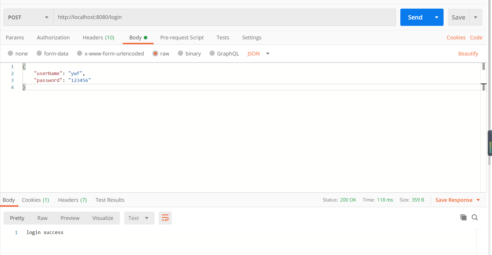
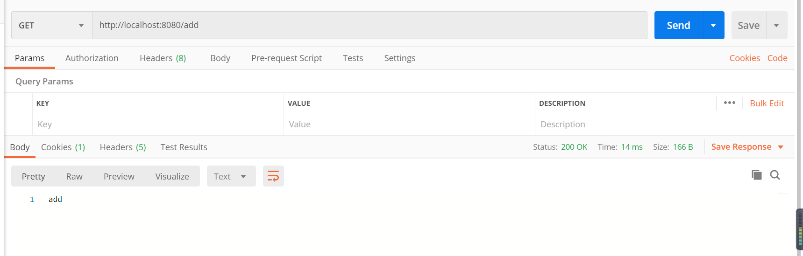
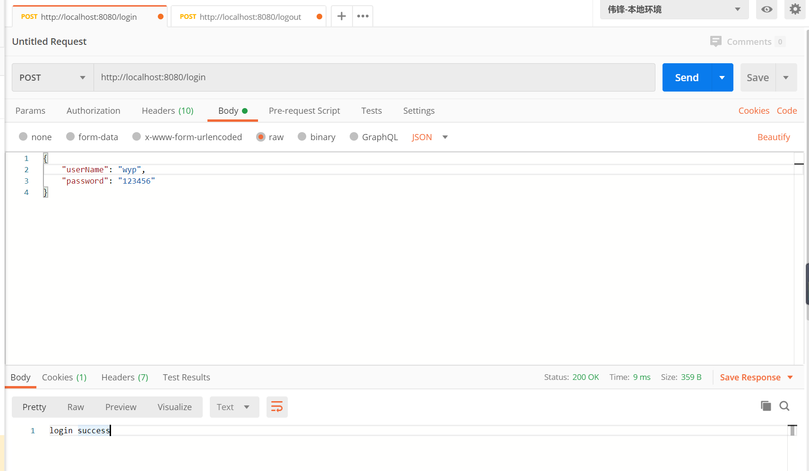
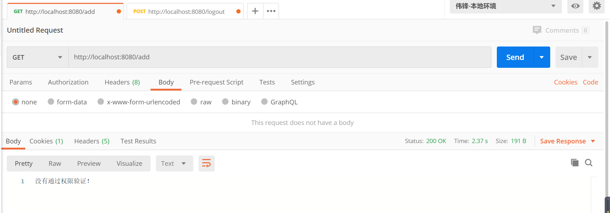

### pom.xml

```xml
<dependency>
    <groupId>org.apache.shiro</groupId>
    <artifactId>shiro-spring</artifactId>
    <version>1.5.3</version>
</dependency>
```


### ShiroConfig.java

```java
package com.ywf.springboot.config;

import com.ywf.springboot.shiro.realm.CustomRealm;
import org.apache.shiro.mgt.SecurityManager;
import org.apache.shiro.spring.security.interceptor.AuthorizationAttributeSourceAdvisor;
import org.apache.shiro.spring.web.ShiroFilterFactoryBean;
import org.apache.shiro.web.mgt.DefaultWebSecurityManager;
import org.springframework.aop.framework.autoproxy.DefaultAdvisorAutoProxyCreator;
import org.springframework.boot.autoconfigure.condition.ConditionalOnMissingBean;
import org.springframework.context.annotation.Bean;
import org.springframework.context.annotation.Configuration;
import java.util.HashMap;
import java.util.Map;

@Configuration
public class ShiroConfig {

    //不加这个注解不生效，具体不详
    @Bean
    @ConditionalOnMissingBean
    public DefaultAdvisorAutoProxyCreator defaultAdvisorAutoProxyCreator() {
        DefaultAdvisorAutoProxyCreator defaultAAP = new DefaultAdvisorAutoProxyCreator();
        defaultAAP.setProxyTargetClass(true);
        return defaultAAP;
    }

    //将自己的验证方式加入容器
    @Bean
    public CustomRealm myShiroRealm() {
        CustomRealm customRealm = new CustomRealm();
        return customRealm;
    }

    //权限管理，配置主要是Realm的管理认证
    @Bean
    public SecurityManager securityManager() {
        DefaultWebSecurityManager securityManager = new DefaultWebSecurityManager();
        securityManager.setRealm(myShiroRealm());
        return securityManager;
    }

    //Filter工厂，设置对应的过滤条件和跳转条件
    @Bean
    public ShiroFilterFactoryBean shiroFilterFactoryBean(SecurityManager securityManager) {
        ShiroFilterFactoryBean shiroFilterFactoryBean = new ShiroFilterFactoryBean();
        shiroFilterFactoryBean.setSecurityManager(securityManager);
        Map<String, String> map = new HashMap<>();
        //登出
        map.put("/logout", "logout");
        //对所有用户认证
        map.put("/**", "authc");
        //登录
        shiroFilterFactoryBean.setLoginUrl("/login");
        //首页
        shiroFilterFactoryBean.setSuccessUrl("/index");
        //错误页面，认证不通过跳转
        shiroFilterFactoryBean.setUnauthorizedUrl("/error");
        shiroFilterFactoryBean.setFilterChainDefinitionMap(map);
        return shiroFilterFactoryBean;
    }

    //加入注解的使用，不加入这个注解不生效
    @Bean
    public AuthorizationAttributeSourceAdvisor authorizationAttributeSourceAdvisor(SecurityManager securityManager) {
        AuthorizationAttributeSourceAdvisor authorizationAttributeSourceAdvisor = new AuthorizationAttributeSourceAdvisor();
        authorizationAttributeSourceAdvisor.setSecurityManager(securityManager);
        return authorizationAttributeSourceAdvisor;
    }
}

```


### User.java

```java
package com.ywf.springboot.entity;

import java.util.Set;

public class User {
    private String id;
    private String userName;
    private String password;

    public User(String id, String userName, String password) {
        this.id = id;
        this.userName = userName;
        this.password = password;
    }

    /**
     * 用户对应的角色集合
     */
    private Set<Role> roles;

    public String getId() {
        return id;
    }

    public void setId(String id) {
        this.id = id;
    }

    public String getUserName() {
        return userName;
    }

    public void setUserName(String userName) {
        this.userName = userName;
    }

    public String getPassword() {
        return password;
    }

    public void setPassword(String password) {
        this.password = password;
    }

    public Set<Role> getRoles() {
        return roles;
    }

    public void setRoles(Set<Role> roles) {
        this.roles = roles;
    }
}

```


### Role.java

```java
package com.ywf.springboot.entity;

import java.util.Set;

public class Role {
    private String id;
    private String roleName;

    public Role(String id, String roleName) {
        this.id = id;
        this.roleName = roleName;
    }

    /**
     * 角色对应权限集合
     */
    private Set<Permission> permissions;

    public String getId() {
        return id;
    }

    public void setId(String id) {
        this.id = id;
    }

    public String getRoleName() {
        return roleName;
    }

    public void setRoleName(String roleName) {
        this.roleName = roleName;
    }

    public Set<Permission> getPermissions() {
        return permissions;
    }

    public void setPermissions(Set<Permission> permissions) {
        this.permissions = permissions;
    }
}

```


### Permission.java

```java
package com.ywf.springboot.entity;

public class Permission {
    private String id;
    private String permissionsName;

    public Permission(String id, String permissionsName) {
        this.id = id;
        this.permissionsName = permissionsName;
    }

    public String getId() {
        return id;
    }

    public void setId(String id) {
        this.id = id;
    }

    public String getPermissionsName() {
        return permissionsName;
    }

    public void setPermissionsName(String permissionsName) {
        this.permissionsName = permissionsName;
    }
}

```


### CustomRealm.java

```java
package com.ywf.springboot.shiro.realm;

import com.ywf.springboot.entity.Permission;
import com.ywf.springboot.entity.Role;
import com.ywf.springboot.entity.User;
import com.ywf.springboot.shiro.service.LoginService;
import org.apache.shiro.authc.AuthenticationException;
import org.apache.shiro.authc.AuthenticationInfo;
import org.apache.shiro.authc.AuthenticationToken;
import org.apache.shiro.authc.SimpleAuthenticationInfo;
import org.apache.shiro.authz.AuthorizationInfo;
import org.apache.shiro.authz.SimpleAuthorizationInfo;
import org.apache.shiro.realm.AuthorizingRealm;
import org.apache.shiro.subject.PrincipalCollection;
import org.springframework.beans.factory.annotation.Autowired;

import java.util.Set;

public class CustomRealm extends AuthorizingRealm {

    @Autowired
    private LoginService loginService;

    /**
     * 用户授权
     * @param principalCollection
     * @return
     */
    @Override
    protected AuthorizationInfo doGetAuthorizationInfo(PrincipalCollection principalCollection) {
        String userName = (String) principalCollection.getPrimaryPrincipal();
        Set<Role> roleSet = loginService.getRoleByUserName(userName);
        // 添加权限
        SimpleAuthorizationInfo authorizationInfo = new SimpleAuthorizationInfo();
        if (userName != null) {
            for (Role role : roleSet) {
                authorizationInfo.addRole(role.getRoleName());
                for (Permission permission : role.getPermissions()) {
                    authorizationInfo.addStringPermission(permission.getPermissionsName());
                }
            }
        }
        return authorizationInfo;
    }

    /**
     * 登录验证
     * @param authenticationToken
     * @return
     * @throws AuthenticationException
     */
    @Override
    protected AuthenticationInfo doGetAuthenticationInfo(AuthenticationToken authenticationToken) throws AuthenticationException {
        // 获取用户基本信息
        String userName = (String) authenticationToken.getPrincipal();
        User user = loginService.getByUserName(userName);
        if (null == user) {
            return null;
        }
        return new SimpleAuthenticationInfo(userName, user.getPassword(), user.getUserName());
    }
}

```


### LoginService.java

```java
package com.ywf.springboot.shiro.service;

import com.ywf.springboot.entity.Role;
import com.ywf.springboot.entity.User;

import java.util.Set;

public interface LoginService {
    User getByUserName(String userName);

    Set<Role> getRoleByUserName(String userName);
}

```


### LoginServiceImpl.java

```java
package com.ywf.springboot.shiro.service.impl;

import com.ywf.springboot.entity.Permission;
import com.ywf.springboot.entity.Role;
import com.ywf.springboot.entity.User;
import com.ywf.springboot.shiro.service.LoginService;
import org.springframework.stereotype.Component;

import java.util.LinkedHashSet;
import java.util.Set;

@Component
public class LoginServiceImpl implements LoginService {
    @Override
    public User getByUserName(String userName) {
        if ("ywf".equalsIgnoreCase(userName)) {
            return new User("001", userName, "123456");
        } else if ("wyp".equalsIgnoreCase(userName)) {
            return new User("00", userName, "123456");
        } else {
            return null;
        }
    }

    @Override
    public Set<Role> getRoleByUserName(String userName) {
        // 模拟数据 设置用户信息、角色和权限
        if ("ywf".equalsIgnoreCase(userName)) {
            // 设置角色、权限
            Role role = new Role("001", "管理员");
            role.setPermissions(new LinkedHashSet<Permission>(){{
                add(new Permission("001", "添加"));
                add(new Permission("002", "删除"));
                add(new Permission("002", "查看"));
            }});
            return new LinkedHashSet<Role>() {{add(role);}};
        } else if ("ywf".equalsIgnoreCase(userName)) {
            // 设置角色、权限
            Role role = new Role("002", "普通用户");
            role.setPermissions(new LinkedHashSet<Permission>(){{
                add(new Permission("003", "查看"));
            }});
            return new LinkedHashSet<Role>() {{add(role);}};
        } else {
            return new LinkedHashSet();
        }
    }
}

```


### MyExceptionHandler.java

```java
package com.ywf.springboot.exception;

import org.apache.shiro.authz.AuthorizationException;
import org.slf4j.Logger;
import org.slf4j.LoggerFactory;
import org.springframework.web.bind.annotation.ControllerAdvice;
import org.springframework.web.bind.annotation.ExceptionHandler;
import org.springframework.web.bind.annotation.ResponseBody;

@ControllerAdvice
public class MyExceptionHandler {
    private Logger logger = LoggerFactory.getLogger(this.getClass());

    @ExceptionHandler
    @ResponseBody
    public String ErrorHandler(AuthorizationException e) {
        logger.error("没有通过权限验证！", e);
        return "没有通过权限验证！";
    }
}

```


### LoginController.java

```java
package com.ywf.springboot.controller;

import com.ywf.springboot.entity.User;
import com.ywf.springboot.shiro.realm.CustomRealm;
import org.apache.shiro.SecurityUtils;
import org.apache.shiro.authc.AuthenticationException;
import org.apache.shiro.authc.UsernamePasswordToken;
import org.apache.shiro.authz.AuthorizationException;
import org.apache.shiro.authz.annotation.RequiresPermissions;
import org.apache.shiro.authz.annotation.RequiresRoles;
import org.apache.shiro.subject.Subject;
import org.slf4j.Logger;
import org.slf4j.LoggerFactory;
import org.springframework.web.bind.annotation.*;

@RestController
public class LoginController {
    private Logger logger = LoggerFactory.getLogger(this.getClass());

    @PostMapping("/login")
    public String login(@RequestBody User user) {
        // 添加用户认证信息
        Subject subject = SecurityUtils.getSubject();
        UsernamePasswordToken token = new UsernamePasswordToken(user.getUserName(), user.getPassword());
        try {
            subject.login(token);
        } catch (AuthenticationException e) {
            logger.info(e.getMessage(), e.getCause());
            return "用户名密码错误";
        } catch (AuthorizationException e) {
            logger.info(e.getMessage(), e.getCause());
            return "用户名无权限";
        }
        return "login success";
    }

    @RequiresRoles("管理员")
    @RequiresPermissions("添加")
    @GetMapping("/add")
    public String add() {
        return "add";
    }
}

```


### 测试

- 管理员角色

  - 用户登录

    

  - 执行添加操作

    

- 普通用户

  - 登录

    

  - 执行添加操作

    