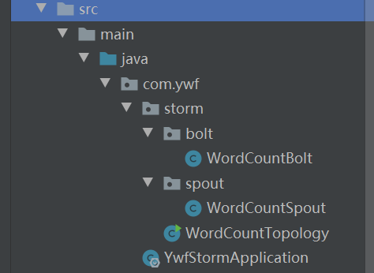

# SpringBoot整合storm

## 本地模式 vs 远程模式 

### 本地模式 

在本地模式下，Storm拓扑结构运行在本地计算机的单一JVM进程上。这个模式用于开发、测试以及调试，因为这是观察所有组件如何协同工作的最简单方法。在这种模式下，我们可以调整参数，观察我们的拓扑结构如何在不同的Storm配置环境下运行。要在本地模式下运行，我们要下载Storm开发依赖，以便用来开发并测试我们的拓扑结构。我们创建了第一个Storm工程以后，很快就会明白如何使用本地模式了。 
NOTE: 在本地模式下，跟在集群环境运行很像。不过很有必要确认一下所有组件都是线程安全的，因为当把它们部署到远程模式时它们可能会运行在不同的JVM进程甚至不同的物理机上，这个时候它们之间没有直接的通讯或共享内存。 

### 远程模式 

在远程模式下，我们向Storm集群提交拓扑，它通常由许多运行在不同机器上的流程组成。远程模式不会出现调试信息， 因此它也称作生产模式。


## 项目目录



## pom.xml

```xml
<?xml version="1.0" encoding="UTF-8"?>
<project xmlns="http://maven.apache.org/POM/4.0.0" xmlns:xsi="http://www.w3.org/2001/XMLSchema-instance"
         xsi:schemaLocation="http://maven.apache.org/POM/4.0.0 https://maven.apache.org/xsd/maven-4.0.0.xsd">
    <modelVersion>4.0.0</modelVersion>
    <parent>
        <groupId>org.springframework.boot</groupId>
        <artifactId>spring-boot-starter-parent</artifactId>
        <version>2.2.1.RELEASE</version>
        <relativePath/> <!-- lookup parent from repository -->
    </parent>
    <groupId>com.ywf</groupId>
    <artifactId>ywf-storm</artifactId>
    <version>0.0.1-SNAPSHOT</version>
    <name>ywf-storm</name>
    <description>Demo project for Spring Boot</description>

    <properties>
        <java.version>1.8</java.version>
        <storm.version>1.2.2</storm.version>
    </properties>

    <dependencies>
        <dependency>
            <groupId>org.springframework.boot</groupId>
            <artifactId>spring-boot-starter</artifactId>
        </dependency>

        <dependency>
            <groupId>org.springframework.boot</groupId>
            <artifactId>spring-boot-starter</artifactId>
            <exclusions>
                <exclusion>
                    <groupId>org.apache.logging.log4j</groupId>
                    <artifactId>log4j-to-slf4j</artifactId>
                </exclusion>
                <exclusion>
                    <groupId>ch.qos.logback</groupId>
                    <artifactId>logback-classic</artifactId>
                </exclusion>
            </exclusions>
        </dependency>
        <!-- test -->
        <dependency>
            <groupId>org.springframework.boot</groupId>
            <artifactId>spring-boot-starter-test</artifactId>
            <scope>test</scope>
        </dependency>

        <!-- storm -->
        <dependency>
            <groupId>org.apache.storm</groupId>
            <artifactId>storm-core</artifactId>
            <version>${storm.version}</version>
            <!--在本地模式运行的时候需要把下面的给注释掉-->
<!--            <scope>provided</scope>-->
        </dependency>
    </dependencies>

    <build>
        <plugins>
            <plugin>
                <groupId>org.springframework.boot</groupId>
                <artifactId>spring-boot-maven-plugin</artifactId>
            </plugin>
        </plugins>
    </build>

</project>
```


## YwfStormApplication

```java
package com.ywf;

import org.springframework.boot.SpringApplication;
import org.springframework.boot.autoconfigure.SpringBootApplication;
import org.springframework.context.ConfigurableApplicationContext;

@SpringBootApplication
public class YwfStormApplication {
    private static ConfigurableApplicationContext context = null;

    public static synchronized void run(String... args) {
        if (null == context) {
            context = SpringApplication.run(YwfStormApplication.class, args);
        }
    }
}
```


## WordCountSpout

```java
package com.ywf.storm.spout;

import com.ywf.YwfStormApplication;
import org.apache.storm.spout.SpoutOutputCollector;
import org.apache.storm.task.TopologyContext;
import org.apache.storm.topology.OutputFieldsDeclarer;
import org.apache.storm.topology.base.BaseRichSpout;
import org.apache.storm.tuple.Fields;
import org.apache.storm.tuple.Values;

import java.util.Map;
import java.util.Optional;
import java.util.Queue;
import java.util.UUID;
import java.util.concurrent.ConcurrentHashMap;
import java.util.concurrent.ConcurrentLinkedDeque;
import java.util.concurrent.TimeUnit;

/**
 * 字母统计Spout 要开启ack机制，必须设置ack>0，并且传递消息时，带上msgId
 *
 * @Author:ywf
 */
public class WordCountSpout extends BaseRichSpout {

    private SpoutOutputCollector collector;

    /**
     * 单词队列
     */
    private Queue<String> wordQueue = new ConcurrentLinkedDeque<>();

    /**
     * 所有发送的集合
     */
    private Map<String, Object> allMap = new ConcurrentHashMap<>();

    /**
     * 发送成功的集合
     */
    private Map<String, Object> successMap = new ConcurrentHashMap<>();

    /**
     * 发送失败的集合
     */
    private Map<String, Object> failMap = new ConcurrentHashMap<>();

    /**
     * 初始化数据源
     */
    private void initWordQueue() {
        this.wordQueue.add("ywf");
        this.wordQueue.add("yang");
        this.wordQueue.add("wyp");
        this.wordQueue.add("ywf");
        this.wordQueue.add("wyp");
        this.wordQueue.add("ywf");
        this.wordQueue.add("wyp");
        this.wordQueue.add("ywf");
        this.wordQueue.add("ywf");
        this.wordQueue.add("ywf");
    }

    /**
     * 在任务集群的工作进程内被初始化,提供spout执行所需要的环境
     *
     * @param conf                 是这个spout的storm配置,提供给拓扑与这台主机上的集群配置一起合并
     * @param topologyContext      主要用来获取这个任务在拓扑中的位置信息,包括该任务的id,该任务的组件id,输入和输出消息等
     * @param spoutOutputCollector collector是收集器,用于从spout发送用,
     *                             收集器是线程安全的,应该作为这个spout对象的实例变量进行保存。
     */
    @Override
    public void open(Map conf, TopologyContext topologyContext, SpoutOutputCollector spoutOutputCollector) {
        // 初始化数据
        initWordQueue();
        // 启动spring容器
        YwfStormApplication.run();
        this.collector = spoutOutputCollector;
    }

    /**
     * nextTuple()方法是Spout实现的核心。 也就是主要执行方法，用于输出信息,通过collector.emit方法发射。
     */
    @Override
    public void nextTuple() {

        while (!wordQueue.isEmpty()) {
            // 移除并取出队列头部元素，如果不存在返回null
            String word = wordQueue.poll();
            if (Optional.ofNullable(word).isPresent()) {
                // 设置key
                String key = UUID.randomUUID().toString().replace("-", "");

                // 存储发送记录
                allMap.put(key, word);
                // 发射消息
                this.collector.emit(new Values(word), key);
            }
        }

    }

    /**
     * 用于声明数据格式。 即输出的一个Tuple中，包含几个字段。
     *
     * @param declarer
     */
    @Override
    public void declareOutputFields(OutputFieldsDeclarer declarer) {
        Fields fields = new Fields("word");
        declarer.declare(fields);
    }

    /**
     * 当一个Tuple处理成功时，会调用这个方法 param obj emit方法中的msgId
     *
     * @param msgId
     */
    @Override
    public void ack(Object msgId) {
        System.out.println("msgId = [" + msgId + "] word =[" + allMap.get(msgId) + "] 发送成功");
        successMap.put(String.valueOf(msgId), allMap.get(msgId));
    }

    /**
     * 当一个Tuple处理失败时，会调用这个方法
     *
     * @param msgId
     */
    @Override
    public void fail(Object msgId) {
        Object word = allMap.get(msgId);
        System.out.println("msgId = [" + msgId + "] word =[" + word + "] 发送失败");
        failMap.put(String.valueOf(msgId), allMap.get(msgId));
        // 再重发一次
        if (Optional.ofNullable(word).isPresent()) {
            collector.emit(new Values(word));
        }
    }

    @Override
    public void close() {
        System.out.println("关闭...");
    }
}
```


## WordCountBolt

```java
package com.ywf.storm.bolt;

import com.ywf.YwfStormApplication;
import org.apache.storm.task.TopologyContext;
import org.apache.storm.topology.BasicOutputCollector;
import org.apache.storm.topology.OutputFieldsDeclarer;
import org.apache.storm.topology.base.BaseBasicBolt;
import org.apache.storm.tuple.Tuple;

import java.util.Map;
import java.util.concurrent.ConcurrentHashMap;

/**
 * 统计每个单词出现的次数
 *
 * @Author:ywf
 */
public class WordCountBolt extends BaseBasicBolt {

    /**
     * 单词频次map
     */
    private Map<String, Integer> wordCountMap = new ConcurrentHashMap<>();

    @Override
    public void prepare(Map stormConf, TopologyContext context) {
        // 启动spring容器
        YwfStormApplication.run();
        super.prepare(stormConf, context);
    }

    /**
     * 执行业务逻辑
     *
     * @param tuple
     * @param basicOutputCollector
     */
    @Override
    public void execute(Tuple tuple, BasicOutputCollector basicOutputCollector) {
        // 获取单词
        String word = tuple.getStringByField("word");
        int count = wordCountMap.getOrDefault(word, 0) + 1;
        wordCountMap.put(word, count);
        System.out.println("线程：" + Thread.currentThread().getName() + ", 单词：" + word + " 出现了 " + count + "次");
    }

    @Override
    public void declareOutputFields(OutputFieldsDeclarer declarer) {
    }
}
```


## WordCountTopology

```java
package com.ywf.storm;

import com.ywf.storm.bolt.WordCountBolt;
import com.ywf.storm.spout.WordCountSpout;
import org.apache.storm.Config;
import org.apache.storm.LocalCluster;
import org.apache.storm.generated.AlreadyAliveException;
import org.apache.storm.generated.AuthorizationException;
import org.apache.storm.generated.InvalidTopologyException;
import org.apache.storm.topology.TopologyBuilder;

/**
 * 单词统计拓扑
 *
 * @Author:ywf
 */
public class WordCountTopology {
    public static void main(String[] args) throws InvalidTopologyException, AuthorizationException, AlreadyAliveException {
        // 创建拓扑
        TopologyBuilder topologyBuilder = new TopologyBuilder();
        // 设置spout
        // parallelism_hint 执行线程数 setNumTasks 所有线程运行任务总数，以下配置是运行一个任务
        topologyBuilder.setSpout("wordCountSpout", new WordCountSpout(), 1)
                .setNumTasks(1);
        // 设置bolt
        // tuple随机分发给下一阶段的bolt ; parallelism_hint 执行线程数  ;
        // setNumTasks 所有线程运行任务总数，以下配置是1个线程运行2个Bolt任务
        topologyBuilder.setBolt("wordCountBolt", new WordCountBolt(), 1)
                .setNumTasks(2).shuffleGrouping("wordCountSpout");

        Config conf = new Config();
        // 本地模式
        LocalCluster localCluster = new LocalCluster();
        // 提交拓扑
        localCluster.submitTopology("myTopology", conf, topologyBuilder.createTopology());

        // 集群模式
//        StormSubmitter.submitTopology("myTopology", conf, topologyBuilder.createTopology());
    }
}
```


## 本地模式启动

**console日志**

```bash
9117 [Thread-24-wordCountSpout-executor[4 4]] INFO  o.s.b.SpringApplication - Started application in 0.73 seconds (JVM running for 9.19)
9118 [Thread-24-wordCountSpout-executor[4 4]] INFO  o.a.s.d.executor - Opened spout wordCountSpout:(4)
9118 [Thread-18-wordCountBolt-executor[2 3]] INFO  o.a.s.d.executor - Prepared bolt wordCountBolt:(2 3)
9119 [Thread-24-wordCountSpout-executor[4 4]] INFO  o.a.s.d.executor - Activating spout wordCountSpout:(4)
线程：Thread-18-wordCountBolt-executor[2 3], 单词：ywf 出现了 1次
线程：Thread-18-wordCountBolt-executor[2 3], 单词：yang 出现了 1次
线程：Thread-18-wordCountBolt-executor[2 3], 单词：wyp 出现了 1次
线程：Thread-18-wordCountBolt-executor[2 3], 单词：ywf 出现了 2次
线程：Thread-18-wordCountBolt-executor[2 3], 单词：wyp 出现了 2次
线程：Thread-18-wordCountBolt-executor[2 3], 单词：ywf 出现了 3次
线程：Thread-18-wordCountBolt-executor[2 3], 单词：wyp 出现了 3次
线程：Thread-18-wordCountBolt-executor[2 3], 单词：ywf 出现了 4次
线程：Thread-18-wordCountBolt-executor[2 3], 单词：ywf 出现了 5次
线程：Thread-18-wordCountBolt-executor[2 3], 单词：ywf 出现了 6次
msgId = [7e00db63da3148288145eab48a2886c1] word =[ywf] 发送成功
msgId = [e601b981139b4b089500aa3358e36ae9] word =[yang] 发送成功
msgId = [1ca655e936724b76acb2adff6f3257a1] word =[wyp] 发送成功
msgId = [0878b26049ca4e8ea28b068d3f29e5a5] word =[ywf] 发送成功
msgId = [f2cb6fb0aef3421781a49fe3144a8388] word =[wyp] 发送成功
msgId = [05a8f49034a646db85d5a0c0dbedf10d] word =[ywf] 发送成功
msgId = [5c6b1d7ccb344ed6a95f2f6f7cab8527] word =[wyp] 发送成功
msgId = [607318b0a92a43d0b223ef7d7cd3f6fb] word =[ywf] 发送成功
msgId = [0702ef417fad4f67a2f8b0fb3bb1abd3] word =[ywf] 发送成功
msgId = [43f0e375f9584a5e8ae3ad58a09567c3] word =[ywf] 发送成功
```


## 远程集群模式启动

### pom.xml

```xml
<!-- storm -->
<dependency>
    <groupId>org.apache.storm</groupId>
    <artifactId>storm-core</artifactId>
    <version>${storm.version}</version>
    <!--在本地模式运行的时候需要把下面的给注释掉-->
    <scope>provided</scope>
</dependency>


```


### 修改拓扑为集群模式

```java
package com.ywf.storm;

import com.ywf.storm.bolt.WordCountBolt;
import com.ywf.storm.spout.WordCountSpout;
import org.apache.storm.Config;
import org.apache.storm.LocalCluster;
import org.apache.storm.StormSubmitter;
import org.apache.storm.generated.AlreadyAliveException;
import org.apache.storm.generated.AuthorizationException;
import org.apache.storm.generated.InvalidTopologyException;
import org.apache.storm.topology.TopologyBuilder;

/**
 * 单词统计拓扑
 *
 * @Author:ywf
 */
public class WordCountTopology {
    public static void main(String[] args) throws InvalidTopologyException, AuthorizationException, AlreadyAliveException {
        // 创建拓扑
        TopologyBuilder topologyBuilder = new TopologyBuilder();
        // 设置spout
        // parallelism_hint 执行线程数 setNumTasks 所有线程运行任务总数，以下配置是运行一个任务
        topologyBuilder.setSpout("wordCountSpout", new WordCountSpout(), 1)
                .setNumTasks(1);
        // 设置bolt
        // tuple随机分发给下一阶段的bolt ; parallelism_hint 执行线程数  ;
        // setNumTasks 所有线程运行任务总数，以下配置是1个线程运行2个Bolt任务
        topologyBuilder.setBolt("wordCountBolt", new WordCountBolt(), 1)
                .setNumTasks(2).shuffleGrouping("wordCountSpout");

        Config conf = new Config();
        // 本地模式
//        LocalCluster localCluster = new LocalCluster();
        // 提交拓扑
//        localCluster.submitTopology("myTopology", conf, topologyBuilder.createTopology());

        // 集群模式
        StormSubmitter.submitTopology("myTopology", conf, topologyBuilder.createTopology());
    }
}
```


### maven打包

```shell
mvn clean compile
mvn clean package -DskipTests -X
```


### 拷贝jar包到nimbus服务器

```shell
cd /opt/storm
# 创建java jar包目录
mkdir java-jar
# ywf-storm-0.0.1-SNAPSHOT.jar 上传到这里
```


### 运行java jar包

```shell
bin/storm jar /opt/storm/java-jar/ywf-storm-0.0.1-SNAPSHOT.jar com.ywf.storm.WordCountTopology

Running: /opt/jdk/jdk1.8.0_141/bin/java -client -Ddaemon.name= -Dstorm.options= -Dstorm.home=/opt/storm -Dstorm.log.dir=/opt/storm/logs -Djava.library.path=/usr/local/lib:/opt/local/lib:/usr/lib -Dstorm.conf.file= -cp /opt/storm/*:/opt/storm/lib/*:/opt/storm/extlib/*:/opt/storm/java-jar/ywf-storm-0.0.1-SNAPSHOT.jar:/opt/storm/conf:/opt/storm/bin -Dstorm.jar=/opt/storm/java-jar/ywf-storm-0.0.1-SNAPSHOT.jar -Dstorm.dependency.jars= -Dstorm.dependency.artifacts={} com.ywf.storm.WordCountTopology
517  [main] WARN  o.a.s.u.Utils - STORM-VERSION new 1.2.3 old null
543  [main] INFO  o.a.s.StormSubmitter - Generated ZooKeeper secret payload for MD5-digest: -6485908658630195769:-7983498244670319884
651  [main] INFO  o.a.s.u.NimbusClient - Found leader nimbus : hadoop-slave1:6627
674  [main] INFO  o.a.s.s.a.AuthUtils - Got AutoCreds []
678  [main] INFO  o.a.s.u.NimbusClient - Found leader nimbus : hadoop-slave1:6627
702  [main] INFO  o.a.s.StormSubmitter - Uploading dependencies - jars...
704  [main] INFO  o.a.s.StormSubmitter - Uploading dependencies - artifacts...
704  [main] INFO  o.a.s.StormSubmitter - Dependency Blob keys - jars : [] / artifacts : []
731  [main] INFO  o.a.s.StormSubmitter - Uploading topology jar /opt/storm/java-jar/ywf-storm-0.0.1-SNAPSHOT.jar to assigned location: /opt/storm/storm-stage/nimbus/inbox/stormjar-c431ed54-9e11-4ff6-afc5-8d92daa8ebfd.jar
833  [main] INFO  o.a.s.StormSubmitter - Successfully uploaded topology jar to assigned location: /opt/storm/storm-stage/nimbus/inbox/stormjar-c431ed54-9e11-4ff6-afc5-8d92daa8ebfd.jar
833  [main] INFO  o.a.s.StormSubmitter - Submitting topology myTopology in distributed mode with conf {"storm.zookeeper.topology.auth.scheme":"digest","storm.zookeeper.topology.auth.payload":"-6485908658630195769:-7983498244670319884"}
833  [main] WARN  o.a.s.u.Utils - STORM-VERSION new 1.2.3 old 1.2.3
1192 [main] INFO  o.a.s.StormSubmitter - Finished submitting topology: myTopology
```


### 浏览器访问

[192.168.111.128:8080](192.168.111.128:8080)

