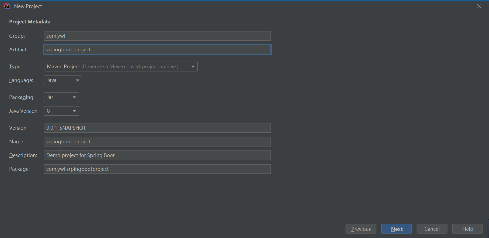
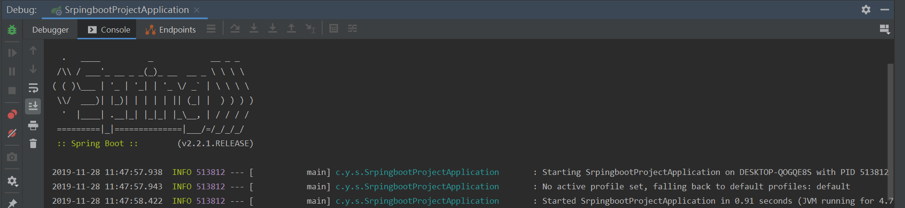

---
title:使用Idea新建SpringBoot项目
category: springboot
order: 1
---

步骤如下：

菜单栏中选择File–New–Project，出现如下图所示，然后选择Spring Initializr。

其中SDK可以根据自己需求选择合适的jdk版本，本人项目均使用的Jdk1.8

Service Url 是Spring官方提供的Spring Initializr工具地址。

 然后点击Next，进入下面页面，其中以下各项内容与创建maven项目填写相同。 

点击Next，如下图所示，可以配置SpringBoot项目或SpringCloud项目各种依赖，需要注意的是，SpringBoot旁边的2.2.1是自己需要使用的SpringBoot版本，根据自己的需求选择。 

 选择依赖和版本后，点击Next进入下图所示。设置项目名称，以及项目存储位置 

以上都设置完成后，点击Finish。

进入项目后，启动项目就可以看到SpringBoot项目启动后的标志Banner，第一个SpringBoot项目就这样搭建完成了。

