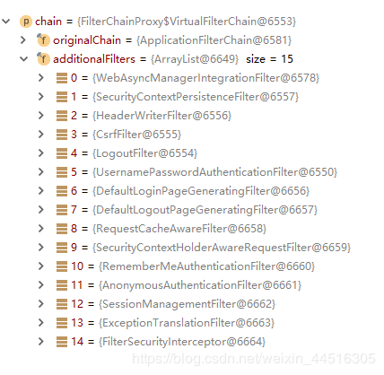
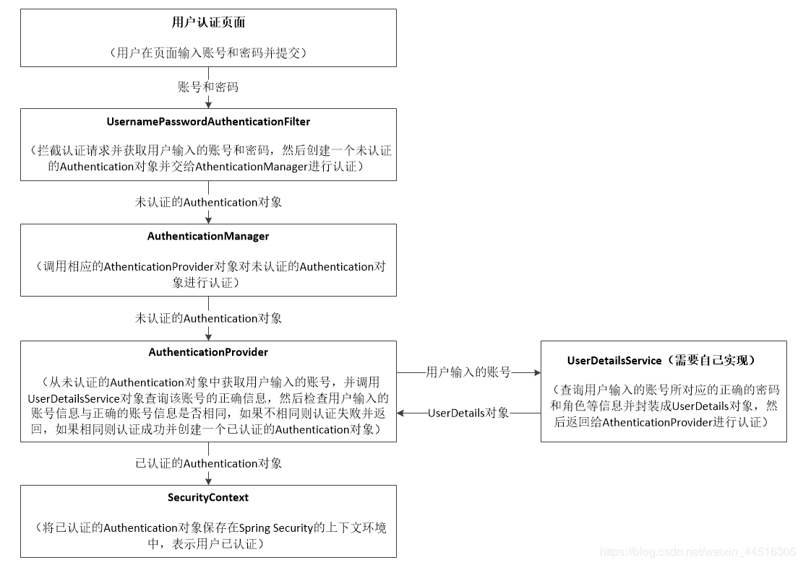

# Spring Security

## 原理分析

Spring Security的用户认证流程是由一系列的过滤器链来实现的，默认的关于用户认证的过滤器链大致如下图所示：



**SecurityContextPersistenceFilter**： 在请求开始时，从配置好的 SecurityContextRepository 中获取 SecurityContext，并设置给 SecurityContextHolder。在请求完成后，把 SecurityContextHolder 所持有的SecurityContext 保存到配置好的 SecurityContextRepository，同时清除 securityContextHolder 所持有的 SecurityContext。

**UsernamePasswordAuthenticationFilter**： 用于处理来自表单提交的认证。该表单必须提供用户名和密码，其内部还有登录成功或失败后的处理器 AuthenticationSuccessHandler 和 AuthenticationFailureHandler。

**ExceptionTranslationFilter**： 能够捕获过滤器链中产生的所有异常，但只处理两类异常：AuthenticationException 和 AccessDeniedException，而其它的异常则继续抛出。
如果捕获到的是 AuthenticationException，那么将会使用其对应的 AuthenticationEntryPoint 的commence()方法进行处理。在处理之前，ExceptionTranslationFilter会先使用 RequestCache 将当前的HttpServerletRequest的信息保存起来，以至于用户登录成功后可以跳转到之前的界面。
如果捕获到的是 AccessDeniedException，那么将会根据当前访问的用户是否已经登录认证而做不同的处理，如果未登录，则使用关联的 AuthenticationEntryPoint 的 commence()方法进行处理，否则使用关联的 AccessDeniedHandler 的handle()方法进行处理。

**FilterSecurityInterceptor**： 用于保护HTTP资源的，它需要一个 AuthenticationManager 和一个 AccessDecisionManager 的引用。它会从 SecurityContextHolder 中获取 Authentication，然后通过 SecurityMetadataSource 可以得知当前请求是否在请求受保护的资源。对于请求那些受保护的资源，如果 Authentication.isAuthenticated() 返回false（即用户未认证），或者FilterSecurityInterceptor 的 alwaysReauthenticate 属性的值为 true，那么将会使用其引用的 AuthenticationManager 对Authentication进行认证，认证之后再使用认证后的 Authentication 替换 SecurityContextHolder 中原有的那个。然后使用 AccessDecisionManager 对用户当前请求进行权限检查。

## 用户认证的流程

Spring Security支持多种用户认证的方式，最常用的是基于用户名和密码的用户认证方式，其认证流程如下图所示：




## 权限控制的原理

Spring Security允许我们通过Spring EL权限验证表达式来指定访问URL或方法所需要的权限，用户在访问某个URL或方法时，如果对应的权限验证表达式返回结果为true，则表示用户拥有访问该URL或方法的权限，如果返回结果为false，则表示没有权限。Spring Security为我们提供了以下的权限验证表达式：

| **表达式**                     | **描述**                                                     |
| ------------------------------ | ------------------------------------------------------------ |
| hasRole([role])                | 当前用户是否拥有指定角色。                                   |
| hasAnyRole([role1,role2])      | 多个角色是一个以逗号进行分隔的字符串。如果当前用户拥有指定角色中的任意一个则返回true。 |
| hasAuthority([auth])           | 等同于hasRole                                                |
| hasAnyAuthority([auth1,auth2]) | 等同于hasAnyRole                                             |
| Principle                      | 代表当前用户的principle对象                                  |
| authentication                 | 直接从SecurityContext获取的当前Authentication对象            |
| permitAll                      | 总是返回true，表示允许所有的                                 |
| denyAll                        | 总是返回false，表示拒绝所有的                                |
| isAnonymous()                  | 当前用户是否是一个匿名用户                                   |
| isRememberMe()                 | 表示当前用户是否是通过Remember-Me自动登录的                  |
| isAuthenticated()              | 表示当前用户是否已经登录认证成功了。                         |
| isFullyAuthenticated()         | 如果当前用户既不是一个匿名用户，同时又不是通过Remember-Me自动登录的，则返回true。 |

权限验证表达式只能验证用户是否具有访问某个URL或方法的权限，但是权限验证的这个步骤可以在不同的阶段进行。Spring Security中定义了以下四个支持使用权限验证表达式的注解，其中前两者可以用来在方法调用前或者调用后进行权限验证，后两者可以用来对集合类型的参数或者返回值进行过滤：

**@PreAuthorize**
**@PostAuthorize**
**@PreFilter**
**@PostFilter**


## 整合Spring Security

**pom.xml**

```xml
<dependency>
    <groupId>org.springframework.boot</groupId>
    <artifactId>spring-boot-starter-security</artifactId>
</dependency>
```


**启动类**

```java
@SpringBootApplication
@EnableGlobalMethodSecurity(prePostEnabled = true)
public class SpringSecurityApplication {

    public static void main(String[] args) {
        SpringApplication.run(SpringSecurityApplication.class, args);
    }

}
```

**BrowserSecurityConfig.java**

```java
package com.ywf.springsecurity.config;

import com.ywf.springsecurity.handle.MyAuthenticationAccessDeniedHandler;
import org.springframework.beans.factory.annotation.Autowired;
import org.springframework.context.annotation.Bean;
import org.springframework.security.config.annotation.authentication.builders.AuthenticationManagerBuilder;
import org.springframework.security.config.annotation.web.builders.HttpSecurity;
import org.springframework.security.config.annotation.web.configuration.EnableWebSecurity;
import org.springframework.security.config.annotation.web.configuration.WebSecurityConfigurerAdapter;
import org.springframework.security.core.userdetails.UserDetailsService;
import org.springframework.security.crypto.bcrypt.BCryptPasswordEncoder;

@EnableWebSecurity
public class BrowserSecurityConfig extends WebSecurityConfigurerAdapter {

    @Autowired
    private UserDetailsService userDetailsServiceImpl;

    @Autowired
    private MyAuthenticationAccessDeniedHandler myAuthenticationAccessDeniedHandler;

    /**
     * 表单登录：使用默认的表单登录页面和登录端点/login进行登录
     * 退出登录：使用默认的退出登录端点/logout退出登录
     * 权限：除了/hello之外的其它请求都要求用户已登录
     * 注意：Controller中也对URL配置了权限，如果WebSecurityConfig中和Controller中都对某文化URL配置了权限，则取较小的权限
     */
    @Override
    protected void configure(HttpSecurity http) throws Exception {
        // 定义无权限处理策略
        http.exceptionHandling().accessDeniedHandler(myAuthenticationAccessDeniedHandler).and()
                // 登录成功，跳转toHome
                .formLogin().defaultSuccessUrl("/toHome", false).permitAll().and()
                // 退出登录
                .logout().permitAll().and()
                //  权限：除了/hello之外的其它请求都要求用户已登录
                .authorizeRequests().antMatchers("/hello").permitAll().anyRequest().authenticated();
    }

    @Override
    protected void configure(AuthenticationManagerBuilder auth) throws Exception {
        /**
         * 指定用户认证时，默认从哪里获取认证用户信息
         */
        auth.userDetailsService(userDetailsServiceImpl);
    }

    @Bean
    public BCryptPasswordEncoder bCryptPasswordEncoder(){ //这里注入了就可以了
        return new BCryptPasswordEncoder();
    }
}

```

**UserDetailsServiceImpl.java**

```java
package com.ywf.springsecurity.service.impl;

import com.ywf.springsecurity.entity.AuthUser;
import com.ywf.springsecurity.service.IAuthUserService;
import org.springframework.beans.factory.annotation.Autowired;
import org.springframework.security.core.GrantedAuthority;
import org.springframework.security.core.authority.SimpleGrantedAuthority;
import org.springframework.security.core.userdetails.User;
import org.springframework.security.core.userdetails.UserDetails;
import org.springframework.security.core.userdetails.UserDetailsService;
import org.springframework.security.core.userdetails.UsernameNotFoundException;
import org.springframework.stereotype.Component;

import java.util.ArrayList;
import java.util.List;

@Component("userDetailsServiceImpl")
public class UserDetailsServiceImpl implements UserDetailsService {

    @Autowired
    private IAuthUserService authUserServiceImpl;

    @Override
    public UserDetails loadUserByUsername(String username) throws UsernameNotFoundException {
        /**
         * 根据用户名查找用户信息
         */
        AuthUser authUser = authUserServiceImpl.getAuthUserByUsername(username);
        if(authUser == null) {
            throw new UsernameNotFoundException(String.format("用户'%s'不存在", username));
        }
        List<GrantedAuthority> grantedAuthorities = new ArrayList<>();
        for (String role : authUser.getRoles()) {
            //封装用户信息和角色信息到SecurityContextHolder全局缓存中
            grantedAuthorities.add(new SimpleGrantedAuthority(role));
        }
        /**
         * 创建一个用于认证的用户对象并返回，包括：用户名，密码，角色
         */
        return new User(authUser.getUsername(), authUser.getPassword(), grantedAuthorities);
    }
}
```

**AuthUser.java**

```java
package com.ywf.springsecurity.entity;

import java.util.List;

public class AuthUser {
    /** 用户ID */
    private Long id;
    /** 用户账号 */
    private String username;
    /** 账号密码 */
    private String password;
    /** 角色集合 */
    private List<String> roles;

    public Long getId() {
        return id;
    }

    public void setId(Long id) {
        this.id = id;
    }

    public String getUsername() {
        return username;
    }

    public void setUsername(String username) {
        this.username = username;
    }

    public String getPassword() {
        return password;
    }

    public void setPassword(String password) {
        this.password = password;
    }

    public List<String> getRoles() {
        return roles;
    }

    public void setRoles(List<String> roles) {
        this.roles = roles;
    }
}
```

**IAuthUserService.java**

```java
package com.ywf.springsecurity.service;

import com.ywf.springsecurity.entity.AuthUser;

public interface IAuthUserService {
    /**
     * 通过用户账号获取认证用户信息
     */
    AuthUser getAuthUserByUsername(String username);
}
```

**AuthUserServiceImpl.java**

```java
package com.ywf.springsecurity.service.impl;

import com.ywf.springsecurity.entity.AuthUser;
import com.ywf.springsecurity.service.IAuthUserService;
import org.springframework.beans.factory.annotation.Autowired;
import org.springframework.security.crypto.bcrypt.BCryptPasswordEncoder;
import org.springframework.stereotype.Service;

import java.util.ArrayList;
import java.util.List;

@Service
public class AuthUserServiceImpl implements IAuthUserService {

    @Autowired
    private BCryptPasswordEncoder bCryptPasswordEncoder;

    @Override
    public AuthUser getAuthUserByUsername(String username) {

        // 先模拟获取用户信息和权限信息，后期改为读取数据库
        if (username.equals("admin")) {
            AuthUser user = new AuthUser();
            user.setId(1L);
            user.setUsername("admin");
            user.setPassword(bCryptPasswordEncoder.encode("123456"));
            List<String> roles = new ArrayList<>();
            roles.add("ROLE_ADMIN");
            user.setRoles(roles);
            return user;
        }  else {
            AuthUser user = new AuthUser();
            user.setId(2L);
            user.setUsername("test");
            user.setPassword(bCryptPasswordEncoder.encode("123456"));
            List<String> roles = new ArrayList<>();
            roles.add("ROLE_EMPLOYEE");
            user.setRoles(roles);
            return user;
        }
    }
}
```

**UserController.java**

```java
package com.ywf.springsecurity.controller;

import org.springframework.security.access.prepost.PreAuthorize;
import org.springframework.security.core.annotation.AuthenticationPrincipal;
import org.springframework.security.core.userdetails.UserDetails;
import org.springframework.web.bind.annotation.GetMapping;
import org.springframework.web.bind.annotation.RestController;

import java.security.Principal;

@RestController
public class UserController {
    /**
     * 获取登录后的Principal（需要登录）
     */
    @GetMapping("/getPrincipal")
    public Object getPrincipal(@AuthenticationPrincipal Principal principal){
        return principal;
    }

    /**
     * 获取登录后的UserDetails（需要登录）
     */
    @GetMapping("/getUserDetails")
    public Object getUserDetails(@AuthenticationPrincipal UserDetails userDetails) {
        return userDetails;
    }

    /**
     * 跳转到admin.html页面（需要登录，且需要ROLE_ADMIN角色）
     */
    @GetMapping("/toAdmin")
    @PreAuthorize("hasRole('ROLE_ADMIN')")
    public String toAdmin() {
        return "admin";
    }

    @GetMapping("/hello")
    public String hello() {
        return "hello";
    }

    @GetMapping("/toHome")
    public String toHome() {
        return "home";
    }

}
```