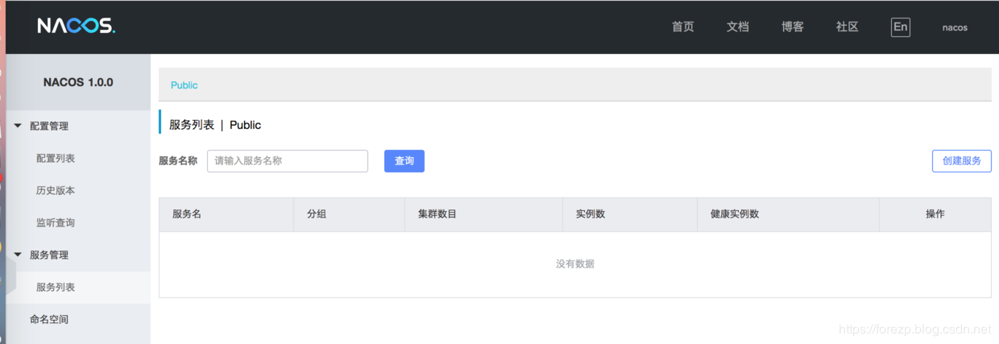
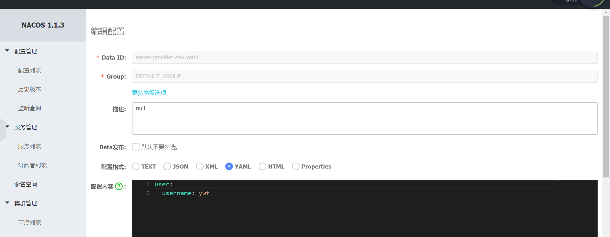

---
title:SpringCloud整合nacos
category: springcloud
order: 1
---
<!-- TOC -->

- [SpringCloud整合nacos](#springcloud整合nacos)
    - [什么是Nacos?](#什么是nacos)
    - [Nacos 的关键特性](#nacos-的关键特性)
    - [部署Nacos](#部署nacos)
    - [Nacos服务发现](#nacos服务发现)
        - [ywf-springcloud](#ywf-springcloud)
        - [nacos-provider](#nacos-provider)
        - [nacos-consumer](#nacos-consumer)
    - [Nacos配置中心](#nacos配置中心)

<!-- /TOC -->


# SpringCloud整合nacos

## 什么是Nacos?

Nacos 致力于帮助您发现、配置和管理微服务。Nacos 提供了一组简单易用的特性集，帮助您快速实现动态服务发现、服务配置、服务元数据及流量管理。
是Spring Cloud A 中的服务注册发现组件，类似于Consul、Eureka，同时它又提供了分布式配置中心的功能，这点和Consul的config类似，支持热加载。

## Nacos 的关键特性

服务发现和服务健康监测
动态配置服务，带管理界面，支持丰富的配置维度。
动态 DNS 服务
服务及其元数据管理

## 部署Nacos

-  **Nacos下载** 

Nacos依赖于Java环境，所以必须安装Java环境。然后从官网下载Nacos的解压包，安装稳定版的。

下载地址：https://github.com/alibaba/nacos/releases

- 浏览器访问： http://localhost:8848/nacos
- 用户名: nacos 密码 nacos




## Nacos服务发现

项目结构 

-- ywf-springcloud

​	-- nacos-consumer(服务消费者)

​	-- nacos-provider(服务提供者)

### ywf-springcloud

**pom.xml**

```xml
<?xml version="1.0" encoding="UTF-8"?>
<project xmlns="http://maven.apache.org/POM/4.0.0"
         xmlns:xsi="http://www.w3.org/2001/XMLSchema-instance"
         xsi:schemaLocation="http://maven.apache.org/POM/4.0.0 http://maven.apache.org/xsd/maven-4.0.0.xsd">
    <modelVersion>4.0.0</modelVersion>

    <groupId>com.ywf</groupId>
    <artifactId>ywf-springcloud</artifactId>
    <version>1.0-SNAPSHOT</version>
    <packaging>pom</packaging>
    <parent>
        <groupId>org.springframework.boot</groupId>
        <artifactId>spring-boot-starter-parent</artifactId>
        <version>2.2.1.RELEASE</version>
        <relativePath/> <!-- lookup parent from repository -->
    </parent>
    <properties>
        <java.version>1.8</java.version>
        <spring-cloud.version>Greenwich.RELEASE</spring-cloud.version>
    </properties>
    <modules>
        <module>nacos-consumer</module>
        <module>nacos-provider</module>
    </modules>
    <dependencies>
        <dependency>
            <groupId>org.springframework.boot</groupId>
            <artifactId>spring-boot-devtools</artifactId>
            <scope>runtime</scope>
            <optional>true</optional>
        </dependency>
        <dependency>
            <groupId>org.springframework.boot</groupId>
            <artifactId>spring-boot-starter-test</artifactId>
            <scope>test</scope>
            <exclusions>
                <exclusion>
                    <groupId>org.junit.vintage</groupId>
                    <artifactId>junit-vintage-engine</artifactId>
                </exclusion>
            </exclusions>
        </dependency>
        <dependency>
            <groupId>org.springframework.cloud</groupId>
            <artifactId>spring-cloud-starter-alibaba-nacos-discovery</artifactId>
            <version>0.9.0.RELEASE</version>
        </dependency>
    </dependencies>
    <dependencyManagement>
        <dependencies>
            <dependency>
                <groupId>org.springframework.cloud</groupId>
                <artifactId>spring-cloud-dependencies</artifactId>
                <version>${spring-cloud.version}</version>
                <type>pom</type>
                <scope>import</scope>
            </dependency>
        </dependencies>
    </dependencyManagement>
</project>
```

### nacos-provider

**pom.xml**

```xml
<?xml version="1.0" encoding="UTF-8"?>
<project xmlns="http://maven.apache.org/POM/4.0.0" xmlns:xsi="http://www.w3.org/2001/XMLSchema-instance"
         xsi:schemaLocation="http://maven.apache.org/POM/4.0.0 https://maven.apache.org/xsd/maven-4.0.0.xsd">
    <modelVersion>4.0.0</modelVersion>
    <groupId>com.ywf</groupId>
    <artifactId>nacos-provider</artifactId>
    <version>0.0.1-SNAPSHOT</version>
    <name>nacos-provider</name>
    <description>Demo project for Spring Boot</description>
    <parent>
        <groupId>com.ywf</groupId>
        <artifactId>ywf-springcloud</artifactId>
        <version>1.0-SNAPSHOT</version>
    </parent>
    <dependencies>
        <dependency>
            <groupId>org.springframework.boot</groupId>
            <artifactId>spring-boot-starter-web</artifactId>
        </dependency>
        <dependency>
            <groupId>org.springframework.cloud</groupId>
            <artifactId>spring-cloud-starter-alibaba-nacos-discovery</artifactId>
            <version>0.9.0.RELEASE</version>
        </dependency>
    </dependencies>

    <build>
        <plugins>
            <plugin>
                <groupId>org.springframework.boot</groupId>
                <artifactId>spring-boot-maven-plugin</artifactId>
            </plugin>
        </plugins>
    </build>
</project>
```

**application.yml**

```properties
server:
  port: 8762
spring:
  application:
    name: nacos-provider
  cloud:
    nacos:
      discovery:
        server-addr: 127.0.0.1:8848
        # 命名空间
        namespace: c2efbc9a-03c3-46ab-9487-94b6e9e6fc53
```

启动类**NacosProviderApplication**

```java
package com.ywf.nacosprovider;

import org.springframework.boot.SpringApplication;
import org.springframework.boot.autoconfigure.SpringBootApplication;
import org.springframework.cloud.client.discovery.EnableDiscoveryClient;

@SpringBootApplication
@EnableDiscoveryClient
public class NacosProviderApplication {

    public static void main(String[] args) {
        SpringApplication.run(NacosProviderApplication.class, args);
    }

}
```

**ProviderController**

```java
package com.ywf.nacosprovider.web;

import org.slf4j.Logger;
import org.slf4j.LoggerFactory;
import org.springframework.beans.factory.annotation.Autowired;
import org.springframework.cloud.client.ServiceInstance;
import org.springframework.cloud.client.discovery.DiscoveryClient;
import org.springframework.web.bind.annotation.GetMapping;
import org.springframework.web.bind.annotation.RequestParam;
import org.springframework.web.bind.annotation.RestController;

import java.util.List;

@RestController
public class ProviderController {
    Logger logger = LoggerFactory.getLogger(ProviderController.class);

    @Autowired
    DiscoveryClient discoveryClient;

    @GetMapping("/services")
    public String getServices() {
        List<String> serviceNames = discoveryClient.getServices();

        StringBuilder stringBuilder = new StringBuilder();
        for (String s : serviceNames) {
            stringBuilder.append(s).append("\n");
            List<ServiceInstance> serviceInstances = discoveryClient.getInstances(s);
            if (serviceInstances != null && serviceInstances.size() > 0) {
                for (ServiceInstance serviceInstance : serviceInstances) {
                    logger.info("serviceName:" + s + " host:" + serviceInstance.getHost() + " port:" + serviceInstance.getPort());
                }
            }
        }
        return stringBuilder.toString();
    }

    @GetMapping("/hi")
    public String hi(@RequestParam(value = "name", defaultValue = "ywf", required = false) String name) {
        return "hi " + name;
    }
}
```

### nacos-consumer

**pom.xml**

```xml
<?xml version="1.0" encoding="UTF-8"?>
<project xmlns="http://maven.apache.org/POM/4.0.0" xmlns:xsi="http://www.w3.org/2001/XMLSchema-instance"
         xsi:schemaLocation="http://maven.apache.org/POM/4.0.0 https://maven.apache.org/xsd/maven-4.0.0.xsd">
    <modelVersion>4.0.0</modelVersion>
    <groupId>com.ywf</groupId>
    <artifactId>nacos-consumer</artifactId>
    <version>0.0.1-SNAPSHOT</version>
    <name>nacos-consumer</name>
    <description>Demo project for Spring Boot</description>
    <parent>
        <groupId>com.ywf</groupId>
        <artifactId>ywf-springcloud</artifactId>
        <version>1.0-SNAPSHOT</version>
    </parent>
    <dependencies>
        <dependency>
            <groupId>org.springframework.boot</groupId>
            <artifactId>spring-boot-starter-web</artifactId>
        </dependency>

        <dependency>
            <groupId>org.springframework.cloud</groupId>
            <artifactId>spring-cloud-starter-netflix-ribbon</artifactId>
        </dependency>

        <dependency>
            <groupId>org.springframework.cloud</groupId>
            <artifactId>spring-cloud-starter-openfeign</artifactId>
        </dependency>
    </dependencies>

    <build>
        <plugins>
            <plugin>
                <groupId>org.springframework.boot</groupId>
                <artifactId>spring-boot-maven-plugin</artifactId>
            </plugin>
        </plugins>
    </build>

</project>
```

**application.yml**

```properties
server:
  port: 8763
spring:
  application:
    name: nacos-consumer
  cloud:
    nacos:
      discovery:
        server-addr: 127.0.0.1:8848
        # 命名空间
        namespace: c2efbc9a-03c3-46ab-9487-94b6e9e6fc53
```

启动类**NacosConsumerApplication**

```java
package com.ywf.nacosconsumer;

import org.springframework.boot.SpringApplication;
import org.springframework.boot.autoconfigure.SpringBootApplication;
import org.springframework.cloud.client.discovery.EnableDiscoveryClient;
import org.springframework.cloud.client.loadbalancer.LoadBalanced;
import org.springframework.cloud.openfeign.EnableFeignClients;
import org.springframework.context.annotation.Bean;
import org.springframework.web.client.RestTemplate;

@EnableDiscoveryClient
@EnableFeignClients
@SpringBootApplication
public class NacosConsumerApplication {

    public static void main(String[] args) {
        SpringApplication.run(NacosConsumerApplication.class, args);
    }

    @LoadBalanced
    @Bean
    public RestTemplate restTemplate(){
        return new RestTemplate();
    }
}
```

**ProviderClient**

```java
package com.ywf.nacosconsumer.client;

import org.springframework.cloud.openfeign.FeignClient;
import org.springframework.web.bind.annotation.GetMapping;
import org.springframework.web.bind.annotation.RequestParam;
@FeignClient("nacos-provider")
public interface ProviderClient {

    @GetMapping("/hi")
    String hi(@RequestParam(value = "name", defaultValue = "ywf", required = false) String name);
}
```

**ConsumerController**

```java
package com.ywf.nacosconsumer.web;

import com.ywf.nacosconsumer.client.ProviderClient;
import org.springframework.beans.factory.annotation.Autowired;
import org.springframework.web.bind.annotation.GetMapping;
import org.springframework.web.bind.annotation.RestController;
import org.springframework.web.client.RestTemplate;

@RestController
public class ConsumerController {

    @Autowired
    RestTemplate restTemplate;

    @Autowired
    ProviderClient providerClient;

    @GetMapping("/hi-resttemplate")
    public String hiResttemplate(){
        return restTemplate.getForObject("http://nacos-provider/hi?name=resttemplate",String.class);

    }

    @GetMapping("/hi-feign")
    public String hiFeign(){
        return providerClient.hi("ywf");
    }
}
```


## Nacos配置中心

**pom.xml**

```xml
<dependency>
    <groupId>org.springframework.cloud</groupId>
    <artifactId>spring-cloud-alibaba-nacos-config</artifactId>
    <version>0.9.0.RELEASE</version>
</dependency>
```

新建**bootstrap.yml**

```properties
spring:
  application:
    name: nacos-provider
  cloud:
    nacos:
      discovery:
        server-addr: 127.0.0.1:8848
        # 命名空间
        namespace: c2efbc9a-03c3-46ab-9487-94b6e9e6fc53
      config:
        server-addr: 127.0.0.1:8848
        file-extension: yaml
        prefix: nacos-provider
        namespace: c2efbc9a-03c3-46ab-9487-94b6e9e6fc53
  profiles:
    active: dev
```

nacos中**nacos-provider-dev.yaml**

dataId:**${prefix}-${spring.profile.active}.${file-extension}**



**ProviderController**

```java
package com.ywf.nacosprovider.web;

import org.slf4j.Logger;
import org.slf4j.LoggerFactory;
import org.springframework.beans.factory.annotation.Autowired;
import org.springframework.beans.factory.annotation.Value;
import org.springframework.cloud.context.config.annotation.RefreshScope;
import org.springframework.web.bind.annotation.GetMapping;
import org.springframework.web.bind.annotation.RequestParam;
import org.springframework.web.bind.annotation.RestController;

import java.util.List;

@RestController
@RefreshScope
public class ProviderController {
    Logger logger = LoggerFactory.getLogger(ProviderController.class);

    @Value("${user.username}")
    private String username;

    @GetMapping("/getUsername")
    public String getUsername() {
        return username;
    }

}
```

**启动应用访问**

[http://localhost:8762/getUsername](http://localhost:8762/getUsername)

**修改user.username值，马上生效**