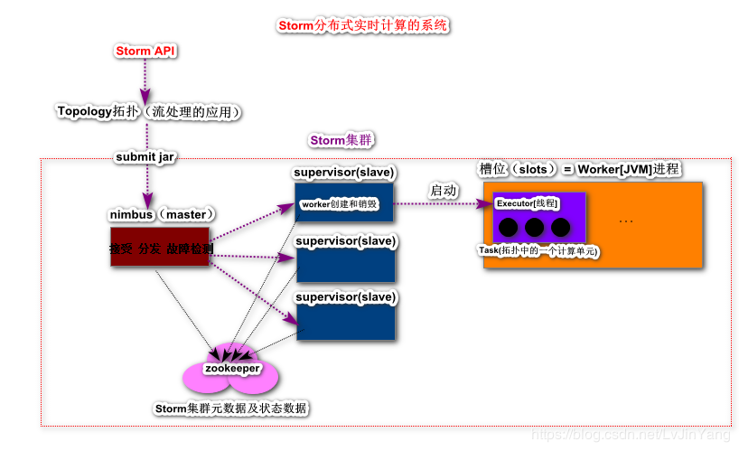
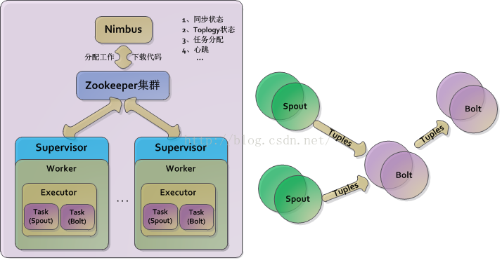
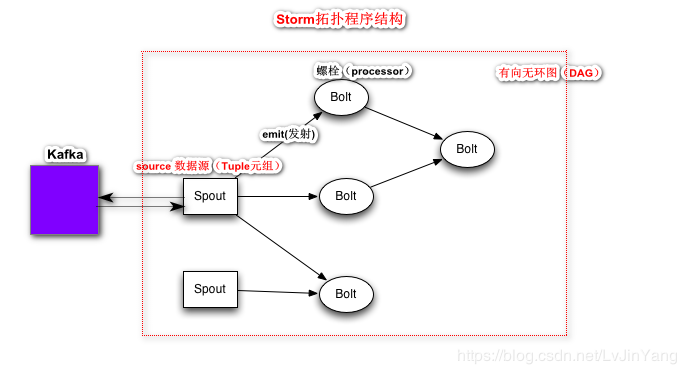

官网地址：[http://storm.apache.org/](http://storm.apache.org/)

## 概述

Apache Storm是一款免费开源的分布式实时计算的框架（流处理）

Apache Storm可以非常容易并且可靠的处理无界的流数据，进行实时的分析处理。

Apache Storm支持多种编程语言（1.x版本Clodure 2.x版本Java重构）。适用场景：实时分析，在线的机器学习，持续计算，分布式的RPC，ETL（数据仓库）。Storm性能极其优异：性能测试单个节点每秒能够处理百万条Tuple（类似于kafka中的record）。

Apache Storm可以非常容易和队列和数据库产品进行无缝集成。

## 架构

### 架构中的核心概念

- **Topology（拓扑）:** 一个流数据处理的应用。topology类似于Hadoop中的MapReduce任务，不同之处，MapReduce负责有界的数据的计算，任务一定终止。但是topology一旦运行，除非人为终止，否则会持续运行下去。

- **Nimbus（Storm集群的master）：** 支持主备集群（主备：备不工作。主从：从同步主机的数据）。主要作用：接受storm客户端提交的topology应用，并且分发代码给supervisor，在supervisor执行计算时，还可以进行故障检测。

- **Supervisor（Storm集群的slave服务）:** 管理Worker（计算容器）的启动和销毁，接受nimbus分配的任务

- **Worker（JVM进程）：** 独立计算容器，任务真实运行。

- **Executors（线程Thread）:** Worker中一个线程资源，有一个到多个Executors

- **Task(任务)：** Topology中的一个计算单元，支持并行Task

- **Zookeeper（分布式服务协调系统）：** 负责Storm集群元数据及状态数据的存储，在Storm集群中nimbus和

  supervisor无状态服务，Storm集群是极其健壮。
  

## Storm Topology基本概念

### 拓扑程序中基本概念

- **Streams:** 流数据，持续不断产生的数据流

- **Spout:** 数据源，类似于Kafka Streaming中Source组件，负责从外部的存储系统获取一条条记录，并且会将这些记录封装为一个==Tuple（元组）==对象。Spout将封装好的Tuple发送给下游的Bolt组件，进行加工处理。 常用Spout类型IRichSpout(最多一次处理)，IBaseSpout（最少一次处理）

- **Bolt:** 处理器，对接口到的Tuple进行加工处理（产生新的Tuple），继续将新产生的Tuple发射交由下游的Bolt进行处理，常用Bolt类型：IRichBolt,IBaseBolt

- **Tuple:** Storm流数据中的一条记录，Tuple本质是一个可以存放任何类型的List集合Tuple=List(1,true,"zs"), Tuple只能赋值一次(read only)