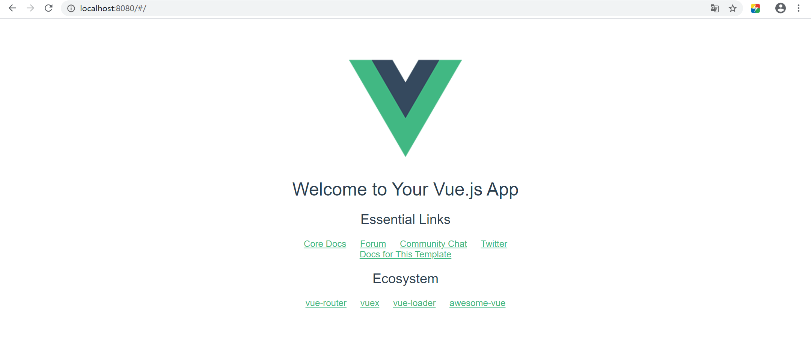
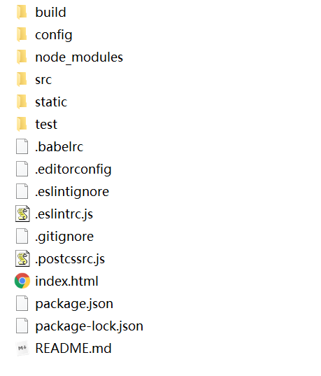
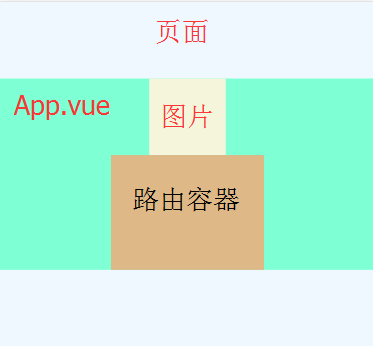
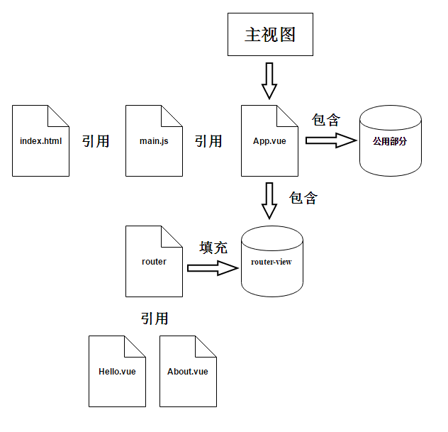

# vue安装及使用

## nodejs安装

下载地址：[https://nodejs.org/zh-cn/download/](https://nodejs.org/zh-cn/download/)

> .msi和.zip格式区别：
>  1、.msi是Windows installer开发出来的程序安装文件，它可以让你安装，修改，卸载你所安装的程序。说白了.msi就是Windows installer的数据包，把所有和安装文件相关的内容封装在一个包里。
>  2、.zip是一个压缩包，解压之后即可，不需要安装


**使用.msi安装后验证版本**

```shell
# 查看node版本
C:\Users\ywf>node -v
v12.16.2
# 查看npm版本
C:\Users\ywf>npm -v
6.14.4
```

**修改全局包路径**

- 创建node_global和node_cache目录

- 修改配置

```shell
npm config set prefix "D:\develop\soft\nodejs\node_global"
npm config set cache "D:\develop\soft\nodejs\node_cache"
```

**修改NPM镜像**

```shell
npm config set registry=https://registry.npm.taobao.org
```

**安装yarn**

```shell
npm install -g yarn
```


## vue安装

**安装vue**

```shell
npm install vue -g
```

**安装vue-route**

```shell
npm install vue-route –g
```

**安装vue脚手架**

```shell
npm install vue-cli –g
```

**环境变量配置PATH和NODE_PATH**

- PATH新增：D:\develop\soft\nodejs\node_global
- 新建NODE_PATH：D:\develop\soft\nodejs\node_global\node_modules

**验证vue版本**

```shell
C:\Users\ywf>vue -V
2.9.6
```


## vue脚手架搭建

- **创建项目目录 demo**
- **创建脚手架**

```shell
vue init webpack myProject
```

- **进入myProject目录，安装并运行myProject**

```shell
# 安装
npm install
# 运行
npm run dev
```

**访问**[http://localhost:8080](http://localhost:8080)




## vue目录说明




| 目录/文件    | 说明                                                         |
| :----------- | :----------------------------------------------------------- |
| build        | 项目构建(webpack)相关代码                                    |
| config       | 配置目录，包括端口号等。我们初学可以使用默认的。             |
| node_modules | npm 加载的项目依赖模块                                       |
| src          | 这里是我们要开发的目录，基本上要做的事情都在这个目录里。里面包含了几个目录及文件：assets: 放置一些图片，如logo等。components: 目录里面放了一个组件文件，可以不用。App.vue: 项目入口文件，我们也可以直接将组件写这里，而不使用 components 目录。main.js: 项目的核心文件。 |
| static       | 静态资源目录，如图片、字体等。                               |
| test         | 初始测试目录，可删除                                         |
| .xxxx文件    | 这些是一些配置文件，包括语法配置，git配置等。                |
| index.html   | 首页入口文件，你可以添加一些 meta 信息或统计代码啥的。       |
| package.json | 项目配置文件。                                               |
| README.md    | 项目的说明文档，markdown 格式                                |


## vue使用说明

**main.js**

```js
// The Vue build version to load with the `import` command
// (runtime-only or standalone) has been set in webpack.base.conf with an alias.
import Vue from 'vue'
// 引入APP组件
import App from './App'
// 引入路由配置
import router from './router'

Vue.config.productionTip = false

/* eslint-disable no-new */
new Vue({
  el: '#app', // 最终效果：替换id为app的div
  router, // 使用路由
  components: { App }, // 使用APP组件
  template: '<App/>' // 告知页面APP组件使用该标签包裹
})
```


### 组件

#### 单页面组件

打开**App.vue**

```vue
<!-- 结构 -->
<template>
  <div id="app">
    
    <!-- 路由 -->
    <router-view/>
  </div>
</template>

<!-- 语法 -->
<script>
export default {
  name: 'App'
}
</script>

<!-- 样式 -->
<style>
#app {
  font-family: 'Avenir', Helvetica, Arial, sans-serif;
  -webkit-font-smoothing: antialiased;
  -moz-osx-font-smoothing: grayscale;
  text-align: center;
  color: #2c3e50;
  margin-top: 60px;
}
</style>
```

- vue单页面组件由 **template、script、style**组成


### 路由

> 路由让我们可以访问诸如`http://localhost:8080/` 或者 `http://localhost:8080/#/helloWorld这些页面的时候不带刷新，直接展示

```vue
<!-- 这句代码在页面中放入一个路由视图容器，当我们访问http://localhost:8080/#/helloWorld/的时候会将helloWorld的内容放进去 -->
<router-view></router-view>
```



- 路由信息配置在 **route/index.js**

```js
import Vue from 'vue'
import Router from 'vue-router'
import HelloWorld from '@/components/HelloWorld'

// 注册路由器
Vue.use(Router)

export default new Router({
  routes: [
    {
      path: '/',
      name: 'HelloWorld',
      component: HelloWorld
    },
    {
      path: '/helloWorld',
      name: 'HelloWorld',
      component: HelloWorld
    }
  ]
})
```


### 架构流程

