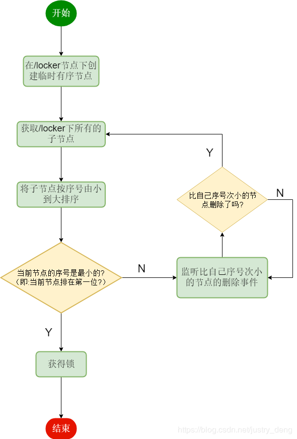

# zookeeper分布式锁

## 什么是zookeeper


### Zookeeper的节点类型

#### 持久节点

节点创建后就会一直存在，直到主动删除，不会因为创建改节点的客户端会话消失而消失。

#### 持久顺序节点

持久的，顺序节点，Zk会维护这个时序，记录子节点的创建的先后顺序。

#### 临时节点

临时节点的生命周期和客户端会话绑定，如果客户端会话失效（不是连接断开），那么这个节点被自动清除掉，临时节点下面不能创建子节点

#### 临时顺序节点

临时顺序节点，也是临时节点，不过是带有顺序的，客户端会话消失节点就消失，Zk的分布式锁主要是运用的这个特性。


## 什么是分布式锁

顾名思义，分布式锁肯定是用在分布式环境下。在分布式环境下，使用分布式锁的目的也是保证同一时刻只有一个线程来修改共享变量，修改共享缓存……。

> 前景：jdk提供的锁只能保证线程间的安全性，但分布式环境下，各节点之间的线程同步执行却得不到保障，分布式锁由此诞生。
>

**实现方式有以下几种**：

- **基于数据库实现分布式锁；**
- **基于缓存（Redis等）实现分布式锁；**
- **基于Zookeeper实现分布式锁；**


**三种方案的比较**
上面几种方式，哪种方式都无法做到完美。就像CAP一样，在复杂性、可靠性、性能等方面无法同时满足，所以，根据不同的应用场景选择最适合自己的才是王道。

**从理解的难易程度角度（从低到高）**
数据库 > 缓存 > Zookeeper

**从实现的复杂性角度（从低到高）**
Zookeeper >= 缓存 > 数据库

**从性能角度（从高到低）**
缓存 > Zookeeper >= 数据库

**从可靠性角度（从高到低）**
Zookeeper > 缓存 > 数据库


## zookeeper分布式锁实现思路




**zookeeper** 可以根据 **临时有序节点** + **watch** 实现。

我们可以在Zookeeper下创建一个指定的父节点作为分布式锁，每个zk客户端尝试连接zk服务获取分布式锁时，都将在此父节点下创建一个临时顺序节点，分两种情况：

如果创建的临时顺序节点是父节点下的首个子节点（最小），则获取锁成功，执行相应业务逻辑，然后释放锁。

如果创建的临时顺序节点并不是该父节点下最小的子节点，则去对比比自己小的节点注册watcher监听，只监听比自己小的上一个节点，进入阻塞等待。当前一个节点被删除时会触发Watch事件，进而唤醒当前阻塞线程。

如果前一个节点对应的客户端崩溃了，则节点对应的Watch事件也会触发，也会唤醒后一个节点对应的客户端线程，此时仍需要判断当前节点是第一个节点之后才能获取锁，否则继续进入阻塞并Watch前一个节点。


## 代码实现

### pom.xml引入依赖

```xml
<?xml version="1.0" encoding="UTF-8"?>
<project xmlns="http://maven.apache.org/POM/4.0.0" xmlns:xsi="http://www.w3.org/2001/XMLSchema-instance"
         xsi:schemaLocation="http://maven.apache.org/POM/4.0.0 https://maven.apache.org/xsd/maven-4.0.0.xsd">
    <modelVersion>4.0.0</modelVersion>
    <parent>
        <groupId>org.springframework.boot</groupId>
        <artifactId>spring-boot-starter-parent</artifactId>
        <version>2.2.2.RELEASE</version>
        <relativePath/> <!-- lookup parent from repository -->
    </parent>
    <groupId>com.ywf</groupId>
    <artifactId>zookeeper</artifactId>
    <version>0.0.1-SNAPSHOT</version>
    <name>zookeeper</name>
    <description>Demo project for Spring Boot</description>

    <properties>
        <java.version>1.8</java.version>
    </properties>

    <dependencies>
        <dependency>
            <groupId>org.springframework.boot</groupId>
            <artifactId>spring-boot-starter</artifactId>
        </dependency>

        <dependency>
            <groupId>org.springframework.boot</groupId>
            <artifactId>spring-boot-starter-test</artifactId>
            <scope>test</scope>
            <exclusions>
                <exclusion>
                    <groupId>org.junit.vintage</groupId>
                    <artifactId>junit-vintage-engine</artifactId>
                </exclusion>
            </exclusions>
        </dependency>
        <dependency>
            <groupId>org.apache.zookeeper</groupId>
            <artifactId>zookeeper</artifactId>
            <version>3.4.12</version>
        </dependency>
    </dependencies>

    <build>
        <plugins>
            <plugin>
                <groupId>org.springframework.boot</groupId>
                <artifactId>spring-boot-maven-plugin</artifactId>
            </plugin>
        </plugins>
    </build>

</project>
```

### application.properties

```properties
zk.connectString = node1:2181,node2:2181,node3:2181
```

### IDistributedLock.java

```java
package com.ywf.zookeeper;

/**
 * 分布式锁
 * @Author:ywf
 */
public interface IDistributedLock {

    /**
     * 尝试加锁
     */
    void lock();

    /**
     * 解锁
     */
    void unLock();
}
```

### ZkDistributedLock.java

```java
package com.ywf.zookeeper;

import org.apache.zookeeper.*;
import org.apache.zookeeper.data.Stat;
import org.slf4j.Logger;
import org.slf4j.LoggerFactory;
import org.springframework.beans.factory.annotation.Value;

import java.io.IOException;
import java.util.List;
import java.util.Objects;
import java.util.concurrent.CountDownLatch;
import java.util.stream.Collectors;

/**
 * zk分布式锁
 * 在zookeeper指定节点（locks）下创建临时顺序节点node_n
 * 获取locks下所有子节点children
 * 对子节点按节点自增序号从小到大排序
 * 判断本节点是不是第一个子节点，若是，则获取锁；若不是，则监听比该节点小的那个节点的删除事件
 * 若监听事件生效，则回到第二步重新进行判断，直到获取到锁
 *
 * @Author:ywf
 */
public class ZkDistributedLock implements IDistributedLock, Watcher {
    /**
     * 分布式锁根节点
     */
    private static final String ROOT_LOCK_PRE = "/ywf-locks-";

    private Logger logger = LoggerFactory.getLogger(ZkDistributedLock.class);
    private ZooKeeper zk = null;
    private String ROOT_LOCK;
    private String WAIT_NODE;
    private String LOCK_NODE;
    private String lockName;

    private CountDownLatch latch = null;
    private int sessionTimeout = 30000;

    @Value("${zk.connectString}")
    private String zkConnectString;


    public ZkDistributedLock(String lockName) {
        try {
            this.lockName = lockName;
            zk = new ZooKeeper("node1:2181,node2:2181,node3:2181", sessionTimeout, this);
            // 判断是否存在根节点，不存在创建
            checkOrCreateRootNode(lockName);
        } catch (IOException e) {
            e.printStackTrace();
        }
    }

    @Override
    public void process(WatchedEvent event) {
        logger.info("this.latch = " + (this.latch == null));
        if (this.latch != null) {
            logger.info("WAIT_NODE = " + WAIT_NODE + " 释放");
            this.latch.countDown();
        }
    }

    @Override
    public void lock() {
        if (tryLock()) {
            logger.info(LOCK_NODE + "得到锁");
        } else {
            try {
                waitLock();
            } catch (KeeperException e) {
                e.printStackTrace();
            } catch (InterruptedException e) {
                e.printStackTrace();
            }
        }
    }

    /**
     * 等待加锁
     */
    private void waitLock() throws KeeperException, InterruptedException {
        Stat stat = zk.exists(WAIT_NODE, true);
        if (null != stat) {
            logger.info(LOCK_NODE + "-->等待锁 " + WAIT_NODE + "释放。");
            this.latch = new CountDownLatch(1);
            this.latch.await();
            this.latch = null;
            logger.info(LOCK_NODE + "-->" + "等待后获得锁成功！");
        }
    }

    /**
     * 尝试加锁
     *
     * @return
     */
    public boolean tryLock() {

        try {
            // 创建临时有序节点
            LOCK_NODE = zk.create(ROOT_LOCK + "/" + lockName, new byte[0], ZooDefs.Ids.OPEN_ACL_UNSAFE, CreateMode.EPHEMERAL_SEQUENTIAL);

            List<String> childrenNodes = zk.getChildren(ROOT_LOCK, false);

            // 按名称排序
            List<String> sortedChildrenNodes = childrenNodes.stream().sorted().collect(Collectors.toList());

            // 判断当前节点是不是第一个节点
            if (Objects.equals(ROOT_LOCK + "/" + sortedChildrenNodes.get(0), LOCK_NODE)) {
                return true;
            }
            // 监听比自己小1的节点
            int prevLockIndex = -1;
            for (int i = 0; i < sortedChildrenNodes.size(); i++) {
                if (Objects.equals(ROOT_LOCK + "/" + sortedChildrenNodes.get(i), LOCK_NODE)) {
                    prevLockIndex = i - 1;
                }
            }

            WAIT_NODE = ROOT_LOCK + "/" + sortedChildrenNodes.get(prevLockIndex);
        } catch (KeeperException e) {
            e.printStackTrace();
        } catch (InterruptedException e) {
            e.printStackTrace();
        }
        return false;
    }

    /**
     * 判断是否存在根节点，不存在创建
     *
     * @param lockName
     */
    private void checkOrCreateRootNode(String lockName) {
        ROOT_LOCK = ROOT_LOCK_PRE + lockName;
        // 判断是否有跟节点，不存在则创建
        Stat existStatus = null;
        try {
            synchronized (ZkDistributedLock.class) {
                existStatus = zk.exists(ROOT_LOCK_PRE + lockName, false);
                if (null == existStatus) {
                    zk.create(ROOT_LOCK_PRE + lockName, new byte[0], ZooDefs.Ids.OPEN_ACL_UNSAFE, CreateMode.PERSISTENT);
                }
            }
        } catch (KeeperException e) {
            e.printStackTrace();
        } catch (InterruptedException e) {
            e.printStackTrace();
        }
    }

    @Override
    public void unLock() {
        try {
            logger.info(LOCK_NODE + "释放锁");
            zk.delete(LOCK_NODE, -1);
            LOCK_NODE = null;
            zk.close();
        } catch (InterruptedException e) {
            e.printStackTrace();
        } catch (KeeperException e) {
            e.printStackTrace();
        }
    }

}
```

### 测试

```java
package com.ywf.zookeeper;

import org.slf4j.Logger;
import org.slf4j.LoggerFactory;
import org.springframework.boot.autoconfigure.SpringBootApplication;

import java.util.concurrent.TimeUnit;

@SpringBootApplication
public class ZookeeperApplication {
    private static Logger logger = LoggerFactory.getLogger(ZookeeperApplication.class);

    public static void main(String[] args) throws Exception {
        for (int i = 1; i <= 10; i++) {
            new Thread(() -> {
                try {
                    IDistributedLock zkLock = new ZkDistributedLock("order");
                    zkLock.lock();
                    logger.info(Thread.currentThread().getName() +" do business ...");
                    TimeUnit.SECONDS.sleep(2);
                    zkLock.unLock();
                } catch (InterruptedException e) {
                    e.printStackTrace();
                }
            }, "Thread<" + i + ">").start();
        }
    }

}
```

