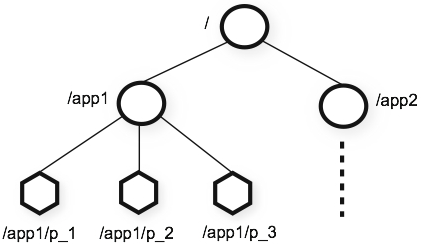
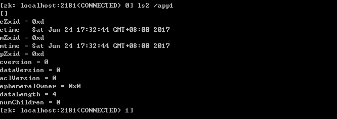

> Zookeeper：分布式协调服务，Zookeeper 本来的目的是用来协调各个服务访问共享资源的顺序性问题。

### Zookeeper 数据结构

Zookeeper 的视图结构跟标准的 Unix 文件系统很像，都有一个根节点 / 。在根节点下面就是一个个的子节点，我们称为 ZNode。ZNode 是 Zookeeper 中最小数据单位，在 ZNode 下面又可以再挂 ZNode，这样一层层下去就形成了一个层次化命名空间 ZNode 树，我们称为 ZNode Tree。对于 ZNode 节点，我们可以增删改查操作。

**Zookeeper 的数据模型图**：

###  Zookeeper 节点类型

 Zookeeper 节点类型可以分为三大类：**持久性节点（Persistent）、临时性节点（Ephemeral）、顺序性节点（Sequential）**。现实开发中在创建节点的时候通过组合可以生成以下四种节点类型：**持久节点、持久顺序节点、临时节点、临时顺序节点**。

- 持久节点就是节点被创建后会一直存在服务器，直到删除操作主动清除，这种节点也是最常见的类型。
- 持久顺序节点就是有顺序的持久节点，节点特性和持久节点是一样的，只是额外特性表现在顺序上。顺序特性实质是在创建节点的时候，会在节点名后面加上一个数字后缀，来表示其顺序。
- 临时节点就是会被自动清理掉的节点，它的生命周期和客户端会话绑在一起，客户端会话结束，节点会被删除掉。与持久性节点不同的是，临时节点不能创建子节点。
- 临时书序节点就是有顺序的临时节点，和持久顺序节点相同，在其创建的时候会在名字后面加上数字后缀。

### ZNode 的数据结构

**结构图**

整个 ZNode 节点内容包括两部分：节点数据内容和节点状态信息。图中 app1 是数据内容，其他的属于状态信息。那么这些状态信息都有什么含义呢？

-  cZxid 就是 Create ZXID，表示节点被创建时的事务 ID。
-  mZxid 就是 Modified ZXID，表示节点最后一次被修改时的事务 ID。
-  ctime 就是 Create Time，表示节点创建时间。
-  mtime 就是 Modified Time，表示节点最后一次被修改的时间。
-  pZxid 表示该节点的子节点列表最后一次被修改时的事务 ID。只有子节点列表变更才会更新 pZxid，子节点内容变更不会更新。
-  cversion 表示子节点的版本号。
-  dataVersion 表示内容版本号。
-  dataLength 表示数据长度。
-  numChildren 表示子节点数。
-  ephemeralOwner 表示创建该临时节点时的会话 sessionID，如果是持久性节点那么值为 0