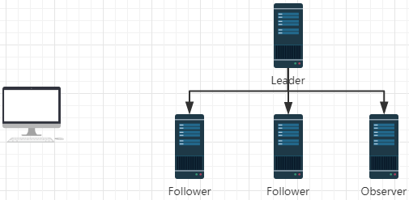
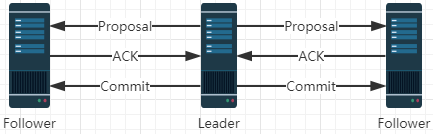
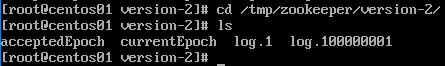
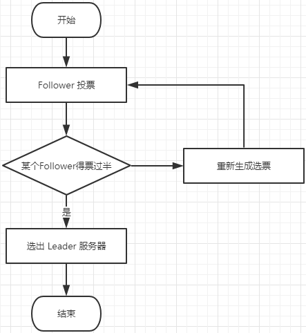

### Zookeeper 的设计猜想

如果我们在架构设计过程中，引入 Zookeeper 作为整个服务的协调者的话， Zookeeper 本身的性能和可用性将成为整个服务的瓶颈。

那么我们在设计 Zookeeper 这样一个中间件的时候，我们需要考虑哪些问题？

1. 防止单点故障（集群方案）
2. Leader 挂了怎么办？如何恢复数据（选举机制）
3. 如何保证数据一致性（分布式事务）

### Zookeeper 集群角色

#### Leader

Leader 服务器是整个 zookeeper 集群的核心，主要的工作任务有两项：

- 事物请求的唯一调度和处理者，保证集群事物处理的顺序性。 
- 集群内部各服务器的调度者。

#### Follower

Follower 角色的主要职责是：  

- 处理客户端非事务请求、转发事务请求给 leader 服务器。
- 参与事务请求 Proposal 的投票（Leader 发起的提案，要求 Follower 投票，需要半数以上 follower 节点通过，leader 才会 commit 数据。）
- 参与 Leader 选举的投票。

#### Observer

Observer 是 Zookeeper3.3 开始引入的一个全新的服务器角色，从字面来理解，该角色充当了观察者的角色。观察 Zookeeper 集群中的最新状态变化并将这些状态变化同步到 Observer 服务器上。Observer 的工作原理与 Follower 角色基本一致，而它和 Follower 角色唯一的不同在于 Observer 不参与任何形式的投票，包括事务请求 Proposal 的投票和 Leader 选举的投票。简单来说，Observer 服务器只提供非事物请求服务，通常在于不影响集群事务处理能力的前提下提升集群非事物处理的能力。

### 客户端请求 Zookeeper 的流程

客户端会随机连接 Zookeeper 集群中的某一个节点，对于不同的请求方式会有如下不同的处理流程。

- 如果客户端当前的请求是非事务请求（Read），可以从 Zookeeper 集群中的任意一个节点获取到数据
- 如果客户端请求的请求是事务请求（Create、Update、Delete），那么这个请求会转发给 Leader 节点处理，Leader 节点会基于改进版 2PC 的方式实现事务提交（参考 ZAB 协议）

### 集群为什么是奇数

https://segmentfault.com/a/1190000005643792

### 深入分析 ZAB 协议

Zookeeper 采用 ZAB（Zookeeper Atomic Broadcast）协议来保证分布式数据一致性。ZAB 并不是一种通用的分布式一致性算法，而是一种专为 Zookeeper 设计的崩溃可恢复的原子消息广播算法。

ZAB 协议包括两种基本模式：崩溃恢复模式和消息广播模式。崩溃恢复模式主要用来在集群启动过程或者 Leader 服务器崩溃退出后进行新的 Leader 服务器的选举以及数据同步；消息广播模式主要用来进行事务请求的处理。下面就从这两个方面来介绍。

### 事务请求的处理流程

ZAB 协议的核心是定义了对事务请求的处理方式，整个过程可以概括如下：

1. 所有的事务请求都交由集群的 Leader 服务器来处理，Leader 服务器会将一个事务请求转换成一个 Proposal（提议），并为其生成一个全局递增的唯一 ID，这个 ID 就是事务 ID，即 ZXID，Leader 服务器对 Proposal 是按其 ZXID 的先后顺序来进行排序和处理的。
2. 之后 Leader 服务器会将 Proposal 放入每个 Follower 对应的队列中（Leader 会为每个 Follower 分配一个单独的队列），并以 FIFO 的方式发送给 Follower 服务器。
3. Follower 服务器接收到事务 Proposal 后，首先以事务日志的方式写入本地磁盘，并且在成功后返回 Leader 服务器一个 ACK 响应。
4. Leader 服务器只要收到过半 Follower 的 ACK 响应,就会广播一个 Commit 消息给 Follower 以通知其进行Proposal 的提交，同时 Leader 自身也会完成 Proposal 的提交。

Observer 节点不参与事务请求，但是必须要和 Leader 节点保持数据同步。

整个过程如下图所示：

### 崩溃恢复模式

#### 数据恢复

对于数据恢复来说需要满足以下两点：

1. **已经处理的消息不能丢失**

当 Leader 节点收到合法数量的 Follower 节点的 ACK 后，就会向各个 Follower 节点广播消息（Commit 命令），同时自己也会 Commit 这条事务消息，如果 Follower 节点收到 Commit 命令之前，Leader 节点挂了，就会导致部分 Follower 节点收到 Commit 消息，部分 Follower 节点没有收到 Commit 消息。那么 ZAB 协议需要保证已经被处理的消息不能丢失

2. **被丢弃的消息不能再次恢复**

当 Leader 收到事务请求，并且还未发起事务投票之前，Leader 挂了，这部分消息数据需要被丢弃。

#### ZAB 设计思想

1. 保证新选举出来的 Leader ZXID 是最大的
2. 每次产生一个新的 Leader，新的 Leader 的 epoch 会加1。ZXID 是64位数据，低32位表示消息计数器（自增），高32位（epoch编号）。这样设计的好处在于新的 Leader 选举以后，消息会计数器会从0开始，而 epoch 会在之前的基础上加1，这样老的服务器重新恢复后，不会再成为 Leader，并且老的服务器重新恢复，成为 Follower 后，它的 ZXID 一定小于当前 Leader 的 ZXID，它会清除未提交的事务请求。

在 dataDir=/tmp/zookeeper 配置的目录下，有个 currentEpoch 文件，这里保存的就是当前 epoch 的编号。

#### Leader 选举流程

当集群中不存在 Leader 服务器时集群会进行 Leader 服务器的选举，这通常存在于两种情况：1. 集群刚启动时，2. 集群运行时，Leader 服务器因故退出。

集群中的服务器会向其他所有的 Follower 服务器发送消息，这个消息可以形象化的称之为选票，选票主要由两个信息组成，所推举的 Leader 服务器的 ID（即配置在 myid 文件中的数字），以及该服务器的事务 ID（ZXID），事务表示对服务器状态变更的操作，一个服务器的事务 ID 越大，则其数据越新。整个过程如下所述：

1. Follower 服务器投出选票（SID，ZXID），第一次每个 Follower 都会推选自己为 Leader 服务器，也就是说每个 Follower 第一次投出的选票是自己的服务器ID和事务ID。
2. 每个 Follower 都会接收到来自于其他 Follower 的选票，它会基于如下规则重新生成一张选票：比较收到的选票和自己的 ZXID 的大小，选取其中最大的；若 ZXID 一样则选取 SID 即服务器 ID 最大的。最终每个服务器都会重新生成一张选票，并将该选票投出去。

这样经过多轮投票后，如果某一台服务器得到了超过半数的选票，则其将当前选为 Leader。由以上分析可知，Zookeeper 集群对 Leader 服务器的选择具有偏向性，偏向于那些 ZXID 更大，即数据更新的机器。

整个过程如下图所示：

