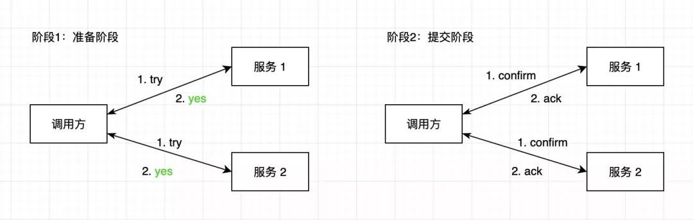
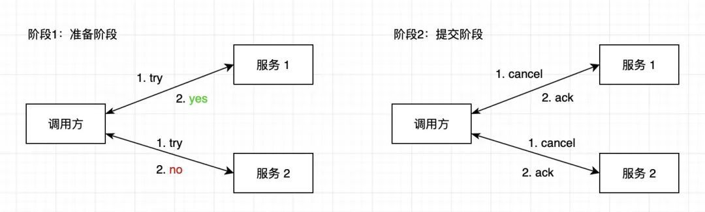

> TCC是支付宝提出的分布式事务解决方案，是 try、confirm、cancel 的缩写。
>
> 与2PC二阶段提交机制类似，区别在于层面不同，2PC是在数据库层面解决数据库之间的分布式事务，TCC是在应用层面解决分布式系统中的分布式事务。


### **工作流程**

**Try**: 尝试执行业务

```
完成所有业务检查（一致性）

预留必须业务资源（准隔离性）
```

**Confirm**: 确认执行业务

```
真正执行业务

不作任何业务检查

只使用Try阶段预留的业务资源

Confirm操作满足幂等性
```

**Cancel**: 取消执行业务

```
释放Try阶段预留的业务资源

Cancel操作满足幂等性
```


每个分布式事务的参与者都需要实现3个接口：**try、confirm、cancel**（confirm 对应2PC的事务提交，cancel 对应2PC的事务回滚）。例如一个转账业务，服务A负责扣钱、服务B负责加钱，A、B都要实现这3个接口。

TCC 分为2个阶段：

1. 准备阶段

调用方调用各个服务的 try 接口，各个服务执行资源检查和锁定，看自己是否有能力完成，如果允许，则锁定资源。

2. 提交阶段

如果各个服务的 try 接口都返回了 yes，则进入提交阶段，调用方调用各个服务的 confirm 接口，各个服务对 try 阶段锁定的资源进行处理。



如果 try 阶段有一方返回了 no，或者超时，调用方调用各个服务的 cancel 接口，释放锁定的资源。



对于异常情况，处理方法是不断重试，不管 confirm 失败了，还是 cancel 失败了，都不断重试。


### **流程示例**

示例一：

以转账为例，有2个服务，扣钱服务、加钱服务，都各自实现 try、confirm、cancel 接口。

现在账号 A 要给账号 B 转 30 元。

- 阶段1：准备阶段

调用者调用2个服务的 try 接口。

扣钱服务的try接口中对 A 的余额进行验证，如果可用余额不少于30元，则冻结30元，返回 yes，否则返回 no。

加钱服务的try接口对 B 账号进行验证，例如是否合法可用，是则返回 yes，否则返回 no。

这个阶段保证了扣钱可扣、加钱可加。

- 阶段2：提交阶段

try 接口如果都返回了 yes，调用者调用2个服务的 confirm 接口。

扣钱服务实际扣减A的30元，加钱服务实际给B加30元。

try 接口如果有返回 no 或者超时的，调用者调用2个服务的 cancel 接口。

扣钱服务解冻A的30元，加钱服务什么也不用做。


示例二：

### 举例


我们以一个简单的电商系统为例，小明在淘宝上花 100 元买了一本书，获赠 10 个积分，产品上有如下几个操作：

- 订单系统创建商品订单

- 支付系统接受小明的支付

- 库存系统扣减产品库存

- 会员系统给小明账户增加会员积分

这几个动作需要作为一个事务执行，要同时成功或者同时撤销。

如果采用 TCC 事务模式，那么各个系统需要改造为如下状态：

1）订单系统

try：创建一个订单，状态显示为“待支付”

confirm：更新订单的状态为“已完成”

cancel：更新订单的状态为“已取消”

2）支付系统

try：假设小明账户中有 1000 元，冻结小明账户中的 100 元，此时小明看到的余额依然是 1000 元。

confirm：将账户余额变为 900 元，并清除冻结记录。

concel：清除冻结记录。

3）库存系统

try：假设库存中还生 10 本书，冻结其中的一本书，现实库存依然有 10 本书。

confirm：将剩余库存更新为 9 本书，并清除冻结记录。

cancel：清除冻结记录。

4）会员系统

try：假设小明原因积分 3000 分，给小明账户预增加 10 积分，账户显示的积分依然是 3000 分。

confirm：将账户积分更新为 3010，并清除预增加记录。

cancel：清除预增加记录。


### **异常控制**

下面几个是典型的异常情况：

- **空回滚**

现象是 try 没被执行，就调用了 cancel。

例如在某些异常情况下，调用 try 时出现异常，try 接口实际没有被调用，自然没有返回 yes，那么会按照正常流程进入第2阶段，调用 cancel 接口，这就形成了空回滚。

解决方法：让 cancel 能够识别出这是一个空回滚，可以记录事务执行状态，cancel 中判断 try 是否执行了。

- **幂等**

提交阶段异常时可能会重复调用 confirm 和 cancel，所以要实现幂等，保证多次执行效果一致。

解决方法：记录事务执行状态，如果执行过了，就不再执行。

- **悬挂**

现象是先执行了 cancel，后执行的 try，造成资源没人释放。

例如调用 try 时网络拥堵超时，被认为失败，然后调用 cancel，这时事务相当于结束了，但后来网络好点之后 try 开始执行了，锁定了相关资源，因为事务已经结束，confirm、cancel 都不会再调用了，就造成资源悬挂，无法释放。

解决方法：还是记录事务执行状态，try 执行时判断 cancel 是否执行了。

### **小结**

TCC是应用层面的分布式事务解决方案，类似2PC，也是2阶段提交，分为准备阶段、提交阶段。

实现时需要注意空回滚、幂等、悬挂问题，可以通过记录事务状态来解决。

#### 优点

1. **可靠性高**
2. **实时性高**

#### 缺点

1. **开发复杂度高**
2. **因为事务状态管理，需要多次DB操作，性能有一定损耗**

TCC框架：

1. https://github.com/changmingxie/tcc-transaction
2. https://github.com/seata/seata