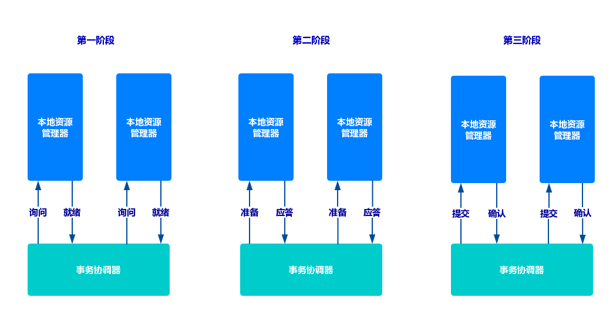

由于二阶段提交存在着诸如同步阻塞、单点问题、脑裂等缺陷。所以，研究者们在二阶段提交的基础上做了改进，提出了三阶段提交。

与两阶段提交不同的是，三阶段提交有两个改动点。

1. 引入超时机制 - 同时在协调者和参与者中都引入超时机制。
2. 在第一阶段和第二阶段中插入一个准备阶段，保证了在最后提交阶段之前各参与节点的状态是一致的。

### 定义

三阶段提交（Three-phase commit），也叫三阶段提交协议（Three-phase commit protocol），是二阶段提交（2PC）的改进版本。

所谓的三个阶段分别是：询问，然后再锁资源，最后真正提交。

- 第一阶段：CanCommit
- 第二阶段：PreCommit
- 第三阶段：Do Commit

### 提交的过程

#### 事务询问阶段/CanCommit

3PC的CanCommit阶段其实和2PC的准备阶段很像。协调者向参与者发送commit请求，参与者如果可以提交就返回Yes响应，否则返回No响应。

a. 事务询问

> 协调者向参与者发送CanCommit请求。询问是否可以执行事务提交操作。然后开始等待参与者的响应。

b. 响应反馈

> 参与者接到CanCommit请求之后，正常情况下，如果其自身认为可以顺利执行事务，则返回Yes响应，并进入预备状态；否则反馈No。

这个和 2PC 阶段不同的是，此时参与者没有锁定资源，没有写 redo，undo，执行回滚日志。回滚代价低

#### 事务准备阶段/PreCommit

协调者在得到所有参与者的响应之后，会根据结果执行2种操作：执行事务预提交，或者中断事务。

##### 执行事务预提交

a. 发送预提交请求

> 协调者向所有参与者节点发出 preCommit 的请求，并进入 prepared 状态。

b. 事务预提交

> 参与者受到 preCommit 请求后，会执行事务操作，对应 2PC 准备阶段中的 “执行事务”，也会 Undo 和 Redo 信息记录到事务日志中。

c. 各参与者响应反馈

> 如果参与者成功执行了事务，就反馈 ACK 响应，同时等待指令：提交（commit） 或终止（abort）。

##### 中断事务

a. 发送中断请求

> 协调者向所有参与者节点发出 abort 请求 。

b. 中断事务

> 参与者如果收到 abort 请求或者超时了，都会中断事务。

#### 执行事务阶段/Do Commit

该阶段进行真正的事务提交，也可以分为以下两种情况。

##### 执行提交

a. 发送提交请求

> 协调者接收到各参与者发送的ACK响应，那么他将从预提交状态进入到提交状态。并向所有参与者发送 doCommit 请求。

b. 事务提交

> 参与者接收到 doCommit 请求之后，执行正式的事务提交。并在完成事务提交之后释放所有事务资源。

c. 响应反馈

> 事务提交完之后，向协调者发送 ACK 响应。

d. 完成事务

> 协调者接收到所有参与者的 ACK 响应之后，完成事务。

##### 中断事务

协调者没有接收到参与者发送的 ACK 响应（可能是接受者发送的不是ACK响应，也可能响应超时），那么就会执行中断事务。

a. 发送中断请求

> 协调者向所有参与者发送 abort 请求。

b. 事务回滚

> 参与者接收到 abort 请求之后，利用其在阶段二记录的 undo 信息来执行事务的回滚操作，并在完成回滚之后释放所有的事务资源。

c. 反馈结果

> 参与者完成事务回滚之后，向协调者发送 ACK 消息。

d. 中断事务

> 协调者接收到参与者反馈的 ACK 消息之后，完成事务的中断。

在此阶段参与者如果在一定时间内没有收到docommit消息，触发超时机制，会自己提交事务。此番处理的逻辑是，能够进入此阶段，说明在事务询问阶段所有节点都是好的。即使在提交的时候部分失败，有理由相信，此时大部分节点都是好的。是可以提交的.

### 优点

相对于二阶段提交，三阶段提交主要解决的单点故障问题，并减少了阻塞的时间。

因为一旦参与者无法及时收到来自协调者的信息之后，他会默认执行 commit。而不会一直持有事务资源并处于阻塞状态。

### 缺点

三阶段提交也会导致数据一致性问题。由于网络原因，协调者发送的 abort 响应没有及时被参与者接收到，那么参与者在等待超时之后执行了 commit 操作。

这样就和其他接到 abort 命令并执行回滚的参与者之间存在数据不一致的情况。