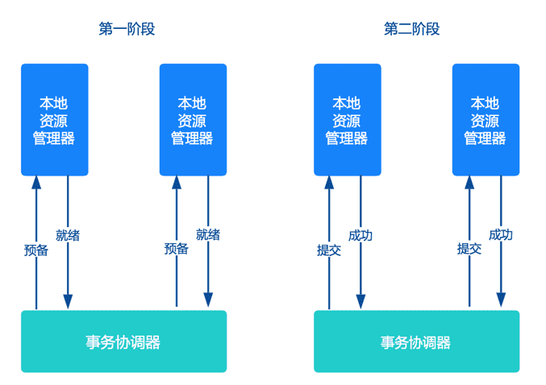

### 概述

> 在分布式系统中，每个节点虽然可以知晓自己的操作时成功或者失败，却无法知道其他节点的操作的成功或失败。当一个事务跨越多个节点时，为了保持事务的 ACID 特性，需要引入一个作为协调者的组件来统一掌控所有节点(称作参与者)的操作结果并最终指示这些节点是否要把操作结果进行真正的提交(比如将更新后的数据写入磁盘等等)。

二阶段协议顾名思义分为两个阶段提交一个事务。并通过协调者和各个参与者的配合，实现分布式一致性。

两个阶段事务提交协议，由协调者和参与者共同完成。参与者将操作成败通知协调者，再由协调者根据所有参与者的反馈情报决定各参与者是否要提交操作还是中止操作。

| 角色   | XA概念     | 作用                                       |
| ------ | ---------- | ------------------------------------------ |
| 协调者 | 事务管理器 | 协调各个参与者，对分布式事务进行提交或回滚 |
| 参与者 | 资源管理器 | 分布式集群中的节点                         |

### 协议阶段

二阶段提交的算法思路可以概括为：每个参与者将操作成败通知协调者，再由协调者根据所有参与者的反馈情报，决定各参与者是否要提交操作还是中止操作。

所谓的两个阶段分别是：

- 第一阶段：准备阶段（投票阶段）
- 第二阶段：提交阶段（执行阶段）

### 提交请求阶段

#### 事务询问

协调者向所有的参与者询问，是否准备好了执行事务，并开始等待各参与者的响应。

#### 执行事务

各参与者节点执行事务操作。如果本地事务成功，将Undo和Redo信息记入事务日志中，但不提交；否则，直接返回失败，退出执行。

#### 各参与者向协调者反馈事务询问的响应

如果参与者成功执行了事务操作，那么就反馈给协调者 Yes响应，表示事务可以执行提交；如果参与者没有成功执行事务，就返回No给协调者，表示事务不可以执行提交。

### 提交阶段

a. 发送提交请求

> 协调者向所有参与者发出commit请求。

b. 事务提交

> 参与者收到commit请求后，会正式执行事务提交操作，并在完成提交之后，释放整个事务执行期间占用的事务资源。

c. 反馈事务提交结果

> 参与者在完成事务提交之后，向协调者发送Ack信息。

d. 事务提交确认

> 协调者接收到所有参与者反馈的Ack信息后，完成事务。

### 中断事务过程如下：

a. 发送回滚请求

> 协调者向所有参与者发出Rollback请求。

b. 事务回滚

> 参与者接收到Rollback请求后，会利用其在提交阶段种记录的Undo信息，来执行事务回滚操作。在完成回滚之后，释放在整个事务执行期间占用的资源。

c. 反馈事务回滚结果

> 参与者在完成事务回滚之后，向协调者发送Ack信息。

d. 事务中断确认

> 协调者接收到所有参与者反馈的Ack信息后，完成事务中断。

### 缺点

#### 同步阻塞

在二阶段提交的过程中，所有的节点都在等待其他节点的响应，无法进行其他操作。这种同步阻塞极大的限制了分布式系统的性能。`update table set status=1 where current_day=20181103`，那么参与者`table`表的`current_day=20181103`的记录都会被锁住，其他的要修改`current_day=20181103`行的事务，都会被阻塞

#### 单点问题

协调者在整个二阶段提交过程中很重要，如果协调者在提交阶段出现问题，那么整个流程将无法运转。更重要的是，其他参与者将会处于一直锁定事务资源的状态中，而无法继续完成事务操作。

#### 数据不一致

假设当协调者向所有的参与者发送commit请求之后，发生了局部网络异常，或者是协调者在尚未发送完所有 commit请求之前自身发生了崩溃，导致最终只有部分参与者收到了commit请求。这将导致严重的数据不一致问题。

#### 容错性不好

如果在二阶段提交的提交询问阶段中，参与者出现故障，导致协调者始终无法获取到所有参与者的确认信息，这时协调者只能依靠其自身的超时机制，判断是否需要中断事务。显然，这种策略过于保守。换句话说，二阶段提交协议没有设计较为完善的容错机制，任意一个节点是失败都会导致整个事务的失败。