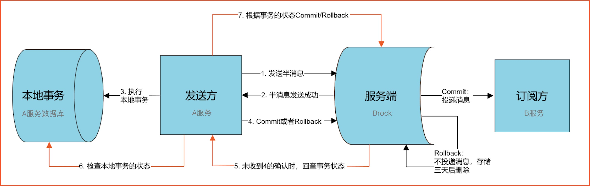

> PS：此方案是不支持事务发起服务进行回滚的，但是大部分互联网应用都不会要求事务发起方进行回滚，如果一定要事务发起方进行回滚应该采用2PC、3PC、TCC等强一致性方案来实现分布式事务,比如LCN。


### 基础概念

```
最终一致性
```

**RocketMQ是一种最终一致性的分布式事务**，就是说它保证的是消息最终一致性，而不是像2PC、3PC、TCC那样强一致分布式事务，至于为什么说它是最终一致性事务下面会详细说明。

```
Half Message(半消息)
```

**是指暂不能被Consumer消费的消息**。Producer 已经把消息成功发送到了 Broker 端，但此消息被标记为`暂不能投递`状态，处于该种状态下的消息称为半消息。需要 Producer

对消息的`二次确认`后，Consumer才能去消费它。

```
消息回查
```

由于网络闪段，生产者应用重启等原因。导致 Producer 端一直没有对 **Half Message(半消息)** 进行 **二次确认**。这是Brock服务器会定时扫描`长期处于半消息的消息`，会

主动询问 Producer端 该消息的最终状态(**Commit或者Rollback**),该消息即为 **消息回查**。


### 分布式事务交互流程

理解这张阿里官方的图，就能理解RocketMQ分布式事务的原理了。



我们来说明下上面这张图

```
1、A服务先发送个Half Message给Brock端，消息中携带 B服务 即将要+100元的信息。

2、当A服务知道Half Message发送成功后，那么开始第3步执行本地事务。

3、执行本地事务(会有三种情况1、执行成功。2、执行失败。3、网络等原因导致没有响应)

4.1)、如果本地事务成功，那么Product像Brock服务器发送Commit,这样B服务就可以消费该message。

4.2)、如果本地事务失败，那么Product像Brock服务器发送Rollback,那么就会直接删除上面这条半消息。

4.3)、如果因为网络等原因迟迟没有返回失败还是成功，那么会执行RocketMQ的回调接口,来进行事务的回查。
```

从上面流程可以得知 `只有A服务本地事务执行成功 ，B服务才能消费该message`。

然后我们再来思考几个问题？

```
为什么要先发送Half Message(半消息)
```

主要有两点

```
1）可以先确认 Brock服务器是否正常 ，如果半消息都发送失败了 那说明Brock挂了。

2）可以通过半消息来回查事务，如果半消息发送成功后一直没有被二次确认，那么就会回查事务状态。
什么情况会回查
```

也会有两种情况

```
1）执行本地事务的时候，由于突然网络等原因一直没有返回执行事务的结果(commit或者rollback)导致最终返回UNKNOW，那么就会回查。

2) 本地事务执行成功后，返回Commit进行消息二次确认的时候的服务挂了，在重启服务那么这个时候在brock端
   它还是个Half Message(半消息)，这也会回查。
```

**特别注意**: 如果回查，那么**一定要先查看当前事务的执行情况，再看是否需要重新执行本地事务。**

想象下如果出现第二种情况而引起的回查，如果不先查看当前事务的执行情况，而是直接执行事务，那么就相当于成功执行了两个本地事务。

```
为什么说MQ是最终一致性事务
```

通过上面这幅图，我们可以看出，在上面举例事务不一致的两种情况中，永远不会发生

```
A账户减100 （失败），B账户加100 （成功）
```

**因为**：如果A服务本地事务都失败了，那B服务永远不会执行任何操作，因为消息压根就不会传到B服务。

那么 **A账户减100 （成功），B账户加100 （失败）** 会不会可能存在的。

**答案是会的**

因为A服务只负责当我消息执行成功了，保证消息能够送达到B,至于B服务接到消息后最终执行结果A并不管。

**那B服务失败怎么办？**

如果B最终执行失败，几乎可以断定就是代码有问题所以才引起的异常，因为消费端RocketMQ有重试机制，如果不是代码问题一般重试几次就能成功。

如果是代码的原因引起多次重试失败后，也没有关系，将该异常记录下来，由`人工处理`，人工兜底处理后，就可以让事务达到最终的一致性。


### 代码实现

#### **订单-库存-分布式事务**

这里通过一个实例来讲一下RocketMQ实现分布式事务具体编码。

场景： 下单场景，订单服务生成订单，当**该**订单支付成功之后，修改订单状态已支付，并且要通知**库存服务**进行库存的扣减。


**数据库设计：**

```sql
CREATE TABLE `yzy_order` (
  `id` int(11) NOT NULL,
  `order_id` varchar(100) NOT NULL DEFAULT '' COMMENT '订单id',
  `buy_num` int(11) DEFAULT NULL COMMENT '购买数量',
  `good_id` int(11) DEFAULT NULL COMMENT '商品ID',
  `user_id` int(11) DEFAULT NULL COMMENT '用户ID',
  `pay_status` int(11) DEFAULT NULL COMMENT '支付状态，0：没有支付，1：已经支付',
  PRIMARY KEY (`id`)
) ENGINE=InnoDB DEFAULT CHARSET=utf8mb4 COLLATE=utf8mb4_0900_ai_ci


CREATE TABLE `yzy_repo` (
  `id` int(11) NOT NULL AUTO_INCREMENT,
  `good_name` varchar(100) NOT NULL DEFAULT '' COMMENT '商品名称',
  `num` int(11) NOT NULL DEFAULT '0' COMMENT '库存数量',
  PRIMARY KEY (`id`)
) ENGINE=InnoDB AUTO_INCREMENT=2 DEFAULT CHARSET=utf8mb4 COLLATE=utf8mb4_0900_ai_ci COMMENT='测试，库存表表'
```


#### 订单服务service的主要方法

```java
package com.transaction.order;

import com.alibaba.dubbo.config.annotation.Reference;
import com.transaction.repository.IRepositoryService;
import org.springframework.beans.factory.annotation.Autowired;
import org.springframework.context.annotation.Bean;
import org.springframework.stereotype.Service;
import org.springframework.web.client.RestTemplate;

import java.util.List;

@Service
public class OrderService {
    @Autowired
    OrderDao orderDao;

    public final int PAY_DONE = 1;

    /**
     *  检查订单是否存在并且状态是支付完成
    **/
    public boolean checkOrderPaySuccess(String orderId){
        List<YzyOrder> allOrders = orderDao.findAll();
        return  allOrders.stream()
                .anyMatch(order -> order.getOrderId().equals(orderId) && order.getPayStatus() == PAY_DONE);
    }

 /**
     *  更新订单是为支付完成
    **/
    public void updatePayStatusByOrderId(String orderId){
        orderDao.updatePayStatusByOrderId(orderId, PAY_DONE);
    }

 /**
     *  生成订单，状态默认是未支付
    **/

    public void save(String orderId, int num, int goodId,int userId) {

        YzyOrder yzyOrder = new YzyOrder();
        yzyOrder.setOrderId(orderId);
        yzyOrder.setBuyNum(num);
        yzyOrder.setGoodId(goodId);
        yzyOrder.setUserId(userId);

        orderDao.save(yzyOrder);
    }
}
```

 

#### 业务流程

##### 1.在订单表创建一个状态是未支付的订单

 在终端或者浏览器 执行  curl '127.0.0.1:8081/order/save?num=2&good_id=1&user_id=1001' 

```java
 /**
     * 生成订单接口
     * @param num
     * @param goodId
     * @param userId
     * @return
     */
    @GetMapping("save")
    public String makeOrder(
            @RequestParam("num") int num,
            @RequestParam("good_id") int goodId,
            @RequestParam("user_id") int userId) {

        orderService.save(UUID.randomUUID().toString(), num, goodId,userId);
        return "success";
    }
```


##### 2.用户支付完成,通过MQ通知库存服务扣减库存

OrderController:pay 发送订单支付成功的**MQ事务消息**，这里注意体会，并不是直接调用OrderService::updatePayStatusByOrderId 然后发送普通的MQ消息。而是先发送事务消息到MQ，然后MQ回调订单服务的TransactionListener::executeLocalTransaction,在这里完成订单状态的更新，保证发送事务消息和更新订单状态的一致性.

```java
  @GetMapping("pay")
    public String pay(@RequestParam("order_id") String orderId)
            throws UnsupportedEncodingException, MQClientException, JsonProcessingException {
        transactionProducer.sendOrderPaySucessEvent(orderId);
        return "success";
    }
```

 

##### 3.订单服务端的事务消息监听器

```java
@Component
public class TransactionProducer implements InitializingBean {

    private TransactionMQProducer producer;

    @Autowired
    private OrderService orderService;

    @Autowired
    private OrderDao orderDao;

    @Override
    public void afterPropertiesSet() throws Exception {
        producer = new TransactionMQProducer("order-pay-group");
        producer.setNamesrvAddr("mq01.stag.kk.srv:9876;mq02.stag.kk.srv:9876");
        ThreadFactory threadFactory = new ThreadFactoryBuilder().setNameFormat("transaction-thread-name-%s").build();
        ThreadPoolExecutor executor = new ThreadPoolExecutor(2, 5, 60,
                TimeUnit.SECONDS, new ArrayBlockingQueue<>(30), threadFactory);
        producer.setExecutorService(executor);
        //设置发送消息的回调
        producer.setTransactionListener(new TransactionListener() {
            /**
             * 根据消息发送的结果 判断是否执行本地事务
             *
             * 回调该方法的时候说明 消息已经成功发送到了MQ，可以把订单状态更新为 "支付成功"
             */
            @Override
            public LocalTransactionState executeLocalTransaction(Message msg, Object arg) {
                // 根据本地事务执行成与否判断 事务消息是否需要commit与 rollback
                ObjectMapper objectMapper = new ObjectMapper();
                LocalTransactionState state = LocalTransactionState.UNKNOW;
                try {
                    OrderRecord record = objectMapper.readValue(msg.getBody(), OrderRecord.class);

                    //MQ已经收到了TransactionProducer send方法发送的事务消息，下面执行本地的事务
                    //本地记录订单信息
                    orderService.updatePayStatusByOrderId(record.getOrderId());

                    state = LocalTransactionState.COMMIT_MESSAGE;
                } catch (UnsupportedEncodingException e) {
                    e.printStackTrace();
                    state = LocalTransactionState.ROLLBACK_MESSAGE;
                } catch (IOException e) {
                    e.printStackTrace();
                    state = LocalTransactionState.ROLLBACK_MESSAGE;
                }
                return state;
            }
            /**
             * RocketMQ 回调 根据本地事务是否执行成功 告诉broker 此消息是否投递成功
             * @return
             */
            @Override
            public LocalTransactionState checkLocalTransaction(MessageExt msg) {
                ObjectMapper objectMapper = new ObjectMapper();
                LocalTransactionState state = LocalTransactionState.UNKNOW;
                OrderRecord record = null;
                try {
                    record = objectMapper.readValue(msg.getBody(), OrderRecord.class);
                } catch (IOException e) {
                    e.printStackTrace();
                }
                try {
                    //根据是否有transaction_id对应转账记录 来判断事务是否执行成功
                    boolean isLocalSuccess = orderService.checkOrderPaySuccess(record.getOrderId());

                    if (isLocalSuccess) {
                        state = LocalTransactionState.COMMIT_MESSAGE;
                    } else {
                        state = LocalTransactionState.ROLLBACK_MESSAGE;
                    }
                } catch (Exception e) {
                    e.printStackTrace();
                }
                return state;
            }
        });
        producer.start();
    }

    public void sendOrderPaySucessEvent(String orderId) throws JsonProcessingException, UnsupportedEncodingException, MQClientException {
        ObjectMapper objectMapper = new ObjectMapper();
        YzyOrder order = orderDao.findAll().stream()
                .filter(item->item.getOrderId().equals(orderId))
                .collect(Collectors.toList()).get(0);
        if(order == null){
            System.out.println("not found order " + orderId);
        }
        // 构造发送的事务 消息
        OrderRecord record = new OrderRecord();
        record.setUserId(order.getUserId());
        record.setOrderId(orderId);
        record.setBuyNum(order.getBuyNum());
        record.setPayStatus(order.getPayStatus());
        record.setGoodId(order.getGoodId());

        Message message = new Message("Order-Success", "", record.getOrderId(),
                objectMapper.writeValueAsString(record).getBytes(RemotingHelper.DEFAULT_CHARSET));

        TransactionSendResult result = producer.sendMessageInTransaction(message, null);
        System.out.println("发送事务消息 ,orderId = " + record.getOrderId() + " " + result.toString());
    }
}
```

 

##### 4.库存服务扣减库存

需要注意的问题：

1. 扣减库存要防止在并发的情况下被扣成负数

2. 先select后update的方式更新库存要加分布式锁或者数据库乐观锁，update语句需要是幂等的

```sql
UPDATE t_yue SET money=$new_money WHERE id=$good_id AND money=$old_money;
```

3. 注意通过msgId或者orderId来进行消费幂等处理

```java
 @Override
    public int reduce(Integer buyNum, Integer goodId) {

        //并发的情况下,为了防止库存被扣成负数,有三种解决方案
        //1. select for update （必须放到事务中）
        //2. 这段逻辑加上分布式锁
        //3. 数据库加上一个version字段，乐观锁

        while (true){
            Optional<YzyRepo> repoOption = repositoryDao.findById(goodId);
            if (!repoOption.isPresent()) {
                return 0;
            }

            YzyRepo repo = repoOption.get();

            //避免数据库库存扣减小于零
            if (repo.getNum() - buyNum < 0) {
                return -1;
            }
            repo.setNum(repo.getNum() - buyNum);

            int affect = repositoryDao.updateGoodNum(repo.getNum() - buyNum, repo.getNum(), goodId);
            if(affect > 0){
                return affect;
            }
        }
    }
```

 