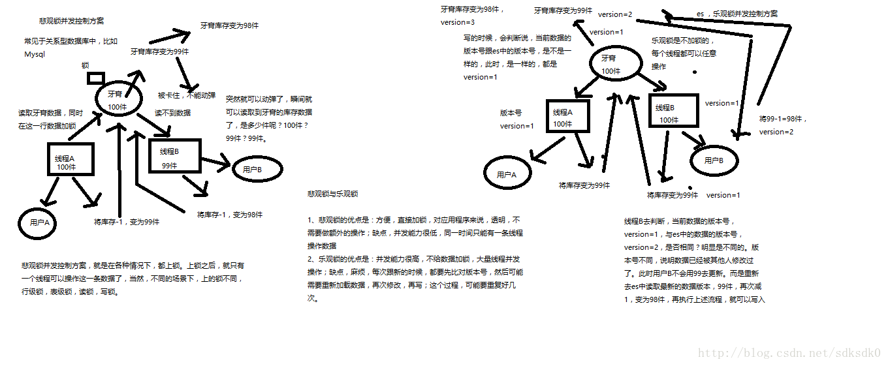

<!-- TOC -->

- [ES基础篇](#es基础篇)
    - [ES的功能](#es的功能)
        - [分布式的搜索引擎和数据分析引擎](#分布式的搜索引擎和数据分析引擎)
        - [全文检索，结构化检索，数据分析](#全文检索结构化检索数据分析)
        - [对海量数据进行近实时的处理](#对海量数据进行近实时的处理)
    - [ES的核心概念](#es的核心概念)
        - [集群(cluster)](#集群cluster)
        - [节点(node)](#节点node)
        - [索引(index)](#索引index)
        - [类型(type)](#类型type)
        - [映射(mapping)](#映射mapping)
        - [文档(document)](#文档document)
        - [字段(field)](#字段field)
        - [分片(shard)和副本(replica)](#分片shard和副本replica)
        - [分段(segment)](#分段segment)
        - [segment查询](#segment查询)
        - [segment生成](#segment生成)
    - [ES的核心机制](#es的核心机制)
        - [主备机制](#主备机制)
        - [容错机制](#容错机制)
    - [ES的并发控制](#es的并发控制)
        - [并发解决方案](#并发解决方案)

<!-- /TOC -->

# ES基础篇

## ES的功能

### 分布式的搜索引擎和数据分析引擎

**搜索**：百度，网站的站内搜索，IT系统的检索
**数据分析**：电商网站，最近7天牙膏这种商品销量排名前10的商家有哪些；新闻网站，最近1个月访问量排名前3的新闻版块是哪些
**分布式，搜索，数据分析**

### 全文检索，结构化检索，数据分析

**全文检索**：我想搜索商品名称包含牙膏的商品，select * from products where product_name like "%牙膏%"
**结构化检索**：我想搜索商品分类为日化用品的商品都有哪些，select * from products where category_id='日化用品'
**部分匹配、自动完成、搜索纠错、搜索推荐**
数据分析：我们分析每一个商品分类下有多少个商品，select category_id,count(*) from products group by category_id

### 对海量数据进行近实时的处理

**分布式**：ES自动可以将海量数据分散到多台服务器上去存储和检索
海联数据的处理：分布式以后，就可以采用大量的服务器去存储和检索数据，自然而然就可以实现海量数据的处理了
**近实时**：检索个数据要花费1小时（这就不要近实时，离线批处理，batch-processing）；在秒级别对数据进行搜索和分析

跟分布式/海量数据相反的：lucene，单机应用，只能在单台服务器上使用，最多只能处理单台服务器可以处理的数据量


## ES的核心概念

### 集群(cluster)

```
集群由一个或多个节点组成。一个集群有一个默认名称"Elasticsearch"。

注意：不同集群，集群名称应唯一。
```

### 节点(node)

```
节点是集群的一部分。ES 6.x中，有多种类型的节点：

- Master节点：存元数据。

- Data节点：存数据。

- Ingest节点：可在数据真正进入index前,通过配置pipline拦截器对数据ETL。

- Coordinate节点：协调节点。如接收搜索请求，并将请求转发到数据节点，每个数据节点在本地执行请求并将结果返回给协调节点。

协调节点将每个数据节点的结果汇总并返回给客户端。每个节点默认都是一个协调节点。当将node.master，node.data和node.ingest设置为false时，该节点仅用作协调节点。

  注意：Coordinate Tribe 是一种特殊类型的协调节点，可连接到多个集群并在所有连接的集群中执行搜索和其他操作。
```

### 索引(index)

```
一个index可以理解成一个关系型数据库。
```

### 类型(type)

```
一种type就像一类表。如用户表、充值表等。

注意：

    - ES 5.x中一个index可以有多种type。

    - ES 6.x中一个index只能有一种type。

    - ES 7.x以后，将移除type这个概念。
```

### 映射(mapping)

```
mapping定义了每个字段的类型、字段所使用的分词器等。相当于关系型数据库中的表结构。
```

### 文档(document)

```
一个document相当于关系型数据库中的一行row。
```

### 字段(field)

```
文档中的一个字段field就相当于关系型数据库中的一列column。
```

### 分片(shard)和副本(replica)

```
副本是分片的副本。分片有主分片(primary Shard)和副本分片(replica Shard)之分。

一个Index数据在物理上被分布在多个主分片中，每个主分片只存放部分数据。

每个主分片可以有多个副本，叫副本分片，是主分片的复制。

注意：

    1. 一个document只存在于某个primary shard以及其对应的replica shard上，不会在多个primary shard上。

    2. 默认情况下，一个index有5个主分片,每个主分片都有一个副本。这样，整个index就有10个分片，要保证整个集群健康，就需要至少两个节点。因为主分片和副本分片不能在同一台机器上。

    3. 主分片的数量在创建索引后不能再被修改，副本分片的数量可以改变。

    4. 每个分片shard都是一个完整的lucene实例，有完整创建索引和处理请求的能力。

    5. 分片有助于es水平扩展。副本一般用来容错，相当于主分片的HA。除此之外，分片和副本还有助于提高并行搜索的性能，因为可以在所有副本上并行执行搜索。
```

### 分段(segment)

```
一个shard包含多个segment，每个segment都是倒排索引。
```

### segment查询

```
查询时，每个shard会把所有segment结果汇总作为shard的结果返回。
```

### segment生成

```
1.写入ES时，一方面会把数据写入到内存Buffer缓冲，为防止Buffer中数据丢失，另一方面会同时把数据写入到translog日志文件。

2.每隔1秒钟，数据从Buffer被写入到segment file，直接写入os cache。

3.os cache segment file被打开供search使用，然后内存Buffer被清空。

4.随着时间推移，os cache中segment file越来越多，translog日志文件也越来越大，当translog日志文件大到一定程度的时候就会触发flush操作。

5.flush操作将os cache中segment file持久化到磁盘并删除translog日志文件。

6.当segment增多到一定程度，会触发ES合并segment,将许多小的segment合并成大segment并删除小segment，提高查询性能。
```


## ES的核心机制

### 主备机制

```
（1）index包含多个shard
（2）每个shard都是一个最小工作单元，承载部分数据，lucene实例，完整的建立索引和处理请求的能力
（3）增减节点时，shard会自动在nodes中负载均衡
（4）primary shard和replica shard，每个document肯定只存在于某一个primary shard以及其对应的replica shard中，不可能存在于多个primary shard
（5）replica shard是primary shard的副本，负责容错，以及承担读请求负载
（6）primary shard的数量在创建索引的时候就固定了，replica shard的数量可以随时修改
（7）primary shard的默认数量是5，replica默认是1，默认有10个shard，5个primary shard，5个replica shard
（8）primary shard不能和自己的replica shard放在同一个节点上（否则节点宕机，primary shard和副本都丢失，起不到容错的作用），但是可以和其他primary shard的replica shard放在同一个节点上
```

### 容错机制

```
（1）9 shard，3 node
（2）master node宕机，自动master选举，red
（3）replica容错：新master将replica提升为primary shard，yellow
（4）重启宕机node，master copy replica到该node，使用原有的shard并同步宕机后的修改，green
```


 **容错步骤:** 

```
a、原来node1是一个master，假如因为某种原因node1宕机了，node中是R0，R1和R2全部丢失。
b、进行master选举，自动选举另外一个node成为新的master，承担起master的责任来，例如现在全部选举了node2为master。
c、新的master，将丢失的primary shard的某个replica shard提升为primary  shard。此时集群的状态就会变为yellow，原因是虽然目前所有的primary  shard全部变成active，但是replice shard少了，也就并不是所有的replica  shard都是active。
d、重启故障的node1，新的master(node2)会将缺失的副本都copy一份到这个node1上面去，而且这个node1会使用之前已经有的shard数据，只是同步一下宕机之后发生的修改，此时，集群是status再次变回green。
```


## ES的并发控制

**背景：** 
在电商平台中，用户抢购鞋子，原库存为100，线程A和线程B同时进来了，总有一个线程是先到的，假设现在线程A先到，这个时候线程A把100改为99，线程B也改为99，然而实际上两个用户抢购之后，库存应该是98，会导致数据不准确，所以这样就出现并发控制的问题。 

### 并发解决方案

 **悲观锁**： 



**悲观锁方案**

常见于关系型数据库中。在各种情况下都上锁，就只有一个线程可以操作这条数据，不同的场景下，有行级锁、表级锁、读锁和写锁。

工作流程： 
读取鞋子数据的时候，就在这行加锁，线程A先不改数据， 
线程b去读的时候会发现都不到数据，被卡住不能动。 
线程A把库存改为99。 
线程b可以读取库存数据了，是99件。 
然后线程B再把库存改为98。

**乐观锁方案**

乐观锁是不加锁的，每个线程都可以操作，通过一个version号来识别，看是不是一样的，例如线程A操作后是version=1，库存改为99，同一时间有一个用户B也读到了这数据，下单也把库存变为99件，version=2，线程B去判断，version=1与es中的版本version=2，说明数据已经被其他人修改过了，然后就重新去es中读取最新版本数据，也就是99，然后再减一，就变为98件了。 
总之：99—version1 98–version2.

**悲观锁的优点**：方便，对应用程序来说透明，缺点：并发能力低。 
**乐观锁的优点**：并发能力高，都需要重新比对版本号，然后可能需要重新加载数据，再写，这个过程，可能需要重复好几次

每次执行修改和删除，这个version的版本号会自动加1 
在删除一个document之后，并没有物理删除掉的，因为它的版本号信息还是保留着的，先删除一条document，再重新创建这条document，其实会在delete version基础之上，再把version号加1.

es的后台都是多线程异步的，多个修改请求，是没有顺序的，例如后修改的先到。 
es内部的多线程异步并发是基于自己的verison版本号进行乐观锁控制的，在后修改的先到时，filed=test3，version =2,修改后到时，先修改filed=test2,veriosn=1,此时会比较veriosn，是否相等，如果不相等的话，就直接丢弃这条数据了。